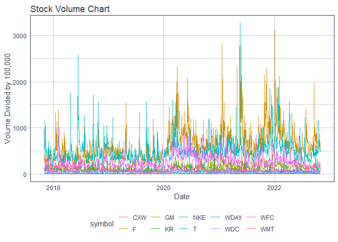

```r
library(tidyquant)
```

```
## Warning: package 'tidyquant' was built under R version 4.1.3
```

```
## Loading required package: lubridate
```

```
## 
## Attaching package: 'lubridate'
```

```
## The following objects are masked from 'package:base':
## 
##     date, intersect, setdiff, union
```

```
## Loading required package: PerformanceAnalytics
```

```
## Warning: package 'PerformanceAnalytics' was built under R version 4.1.3
```

```
## Loading required package: xts
```

```
## Warning: package 'xts' was built under R version 4.1.3
```

```
## Loading required package: zoo
```

```
## Warning: package 'zoo' was built under R version 4.1.3
```

```
## 
## Attaching package: 'zoo'
```

```
## The following objects are masked from 'package:base':
## 
##     as.Date, as.Date.numeric
```

```
## 
## Attaching package: 'PerformanceAnalytics'
```

```
## The following object is masked from 'package:graphics':
## 
##     legend
```

```
## Loading required package: quantmod
```

```
## Warning: package 'quantmod' was built under R version 4.1.3
```

```
## Loading required package: TTR
```

```
## Warning: package 'TTR' was built under R version 4.1.3
```

```
## Registered S3 method overwritten by 'quantmod':
##   method            from
##   as.zoo.data.frame zoo
```

```r
library(dygraphs)
```

```
## Warning: package 'dygraphs' was built under R version 4.1.3
```

```r
library(tidyverse)
```

```
## -- Attaching packages --------------------------------------- tidyverse 1.3.1 --
```

```
## v ggplot2 3.3.5     v purrr   0.3.4
## v tibble  3.1.8     v dplyr   1.0.7
## v tidyr   1.1.4     v stringr 1.4.0
## v readr   2.1.1     v forcats 0.5.1
```

```
## Warning: package 'tibble' was built under R version 4.1.3
```

```
## -- Conflicts ------------------------------------------ tidyverse_conflicts() --
## x lubridate::as.difftime() masks base::as.difftime()
## x lubridate::date()        masks base::date()
## x dplyr::filter()          masks stats::filter()
## x dplyr::first()           masks xts::first()
## x lubridate::intersect()   masks base::intersect()
## x dplyr::lag()             masks stats::lag()
## x dplyr::last()            masks xts::last()
## x lubridate::setdiff()     masks base::setdiff()
## x lubridate::union()       masks base::union()
```

```r
library(timetk)
```

```
## Warning: package 'timetk' was built under R version 4.1.3
```

```r
library(lubridate)
```


## stock function stuff

```r
start <- today() - years(5)
end <- today()

stock_calc <- function(tickers_today) {
  stocks <- tq_get(tickers_today, get = "stock.prices", from = start, to = end)
  combinedplot <- stocks %>%
  select(symbol, date, adjusted) %>%
  pivot_wider(names_from = symbol, values_from = adjusted) %>%
  tk_xts(date_var = date)
dygraph(combinedplot)
}

##this is what will change, just put in new stocks
tickers <- c("CXW", "F", "GM", "KR", "WDC", "NKE","T", "WDAY", "WFC", "WMT")


stock_calc(tickers)
```

```
## Warning: Non-numeric columns being dropped: date
```

```{=html}
<div id="htmlwidget-9fe5a60e8c847c6da35b" style="width:672px;height:480px;" class="dygraphs html-widget"></div>
<script type="application/json" data-for="htmlwidget-9fe5a60e8c847c6da35b">{"x":{"attrs":{"labels":["day","CXW","F","GM","KR","WDC","NKE","T","WDAY","WFC","WMT"],"legend":"auto","retainDateWindow":false,"axes":{"x":{"pixelsPerLabel":60}}},"scale":"daily","annotations":[],"shadings":[],"events":[],"format":"date","data":[["2017-11-02T00:00:00.000Z","2017-11-03T00:00:00.000Z","2017-11-06T00:00:00.000Z","2017-11-07T00:00:00.000Z","2017-11-08T00:00:00.000Z","2017-11-09T00:00:00.000Z","2017-11-10T00:00:00.000Z","2017-11-13T00:00:00.000Z","2017-11-14T00:00:00.000Z","2017-11-15T00:00:00.000Z","2017-11-16T00:00:00.000Z","2017-11-17T00:00:00.000Z","2017-11-20T00:00:00.000Z","2017-11-21T00:00:00.000Z","2017-11-22T00:00:00.000Z","2017-11-24T00:00:00.000Z","2017-11-27T00:00:00.000Z","2017-11-28T00:00:00.000Z","2017-11-29T00:00:00.000Z","2017-11-30T00:00:00.000Z","2017-12-01T00:00:00.000Z","2017-12-04T00:00:00.000Z","2017-12-05T00:00:00.000Z","2017-12-06T00:00:00.000Z","2017-12-07T00:00:00.000Z","2017-12-08T00:00:00.000Z","2017-12-11T00:00:00.000Z","2017-12-12T00:00:00.000Z","2017-12-13T00:00:00.000Z","2017-12-14T00:00:00.000Z","2017-12-15T00:00:00.000Z","2017-12-18T00:00:00.000Z","2017-12-19T00:00:00.000Z","2017-12-20T00:00:00.000Z","2017-12-21T00:00:00.000Z","2017-12-22T00:00:00.000Z","2017-12-26T00:00:00.000Z","2017-12-27T00:00:00.000Z","2017-12-28T00:00:00.000Z","2017-12-29T00:00:00.000Z","2018-01-02T00:00:00.000Z","2018-01-03T00:00:00.000Z","2018-01-04T00:00:00.000Z","2018-01-05T00:00:00.000Z","2018-01-08T00:00:00.000Z","2018-01-09T00:00:00.000Z","2018-01-10T00:00:00.000Z","2018-01-11T00:00:00.000Z","2018-01-12T00:00:00.000Z","2018-01-16T00:00:00.000Z","2018-01-17T00:00:00.000Z","2018-01-18T00:00:00.000Z","2018-01-19T00:00:00.000Z","2018-01-22T00:00:00.000Z","2018-01-23T00:00:00.000Z","2018-01-24T00:00:00.000Z","2018-01-25T00:00:00.000Z","2018-01-26T00:00:00.000Z","2018-01-29T00:00:00.000Z","2018-01-30T00:00:00.000Z","2018-01-31T00:00:00.000Z","2018-02-01T00:00:00.000Z","2018-02-02T00:00:00.000Z","2018-02-05T00:00:00.000Z","2018-02-06T00:00:00.000Z","2018-02-07T00:00:00.000Z","2018-02-08T00:00:00.000Z","2018-02-09T00:00:00.000Z","2018-02-12T00:00:00.000Z","2018-02-13T00:00:00.000Z","2018-02-14T00:00:00.000Z","2018-02-15T00:00:00.000Z","2018-02-16T00:00:00.000Z","2018-02-20T00:00:00.000Z","2018-02-21T00:00:00.000Z","2018-02-22T00:00:00.000Z","2018-02-23T00:00:00.000Z","2018-02-26T00:00:00.000Z","2018-02-27T00:00:00.000Z","2018-02-28T00:00:00.000Z","2018-03-01T00:00:00.000Z","2018-03-02T00:00:00.000Z","2018-03-05T00:00:00.000Z","2018-03-06T00:00:00.000Z","2018-03-07T00:00:00.000Z","2018-03-08T00:00:00.000Z","2018-03-09T00:00:00.000Z","2018-03-12T00:00:00.000Z","2018-03-13T00:00:00.000Z","2018-03-14T00:00:00.000Z","2018-03-15T00:00:00.000Z","2018-03-16T00:00:00.000Z","2018-03-19T00:00:00.000Z","2018-03-20T00:00:00.000Z","2018-03-21T00:00:00.000Z","2018-03-22T00:00:00.000Z","2018-03-23T00:00:00.000Z","2018-03-26T00:00:00.000Z","2018-03-27T00:00:00.000Z","2018-03-28T00:00:00.000Z","2018-03-29T00:00:00.000Z","2018-04-02T00:00:00.000Z","2018-04-03T00:00:00.000Z","2018-04-04T00:00:00.000Z","2018-04-05T00:00:00.000Z","2018-04-06T00:00:00.000Z","2018-04-09T00:00:00.000Z","2018-04-10T00:00:00.000Z","2018-04-11T00:00:00.000Z","2018-04-12T00:00:00.000Z","2018-04-13T00:00:00.000Z","2018-04-16T00:00:00.000Z","2018-04-17T00:00:00.000Z","2018-04-18T00:00:00.000Z","2018-04-19T00:00:00.000Z","2018-04-20T00:00:00.000Z","2018-04-23T00:00:00.000Z","2018-04-24T00:00:00.000Z","2018-04-25T00:00:00.000Z","2018-04-26T00:00:00.000Z","2018-04-27T00:00:00.000Z","2018-04-30T00:00:00.000Z","2018-05-01T00:00:00.000Z","2018-05-02T00:00:00.000Z","2018-05-03T00:00:00.000Z","2018-05-04T00:00:00.000Z","2018-05-07T00:00:00.000Z","2018-05-08T00:00:00.000Z","2018-05-09T00:00:00.000Z","2018-05-10T00:00:00.000Z","2018-05-11T00:00:00.000Z","2018-05-14T00:00:00.000Z","2018-05-15T00:00:00.000Z","2018-05-16T00:00:00.000Z","2018-05-17T00:00:00.000Z","2018-05-18T00:00:00.000Z","2018-05-21T00:00:00.000Z","2018-05-22T00:00:00.000Z","2018-05-23T00:00:00.000Z","2018-05-24T00:00:00.000Z","2018-05-25T00:00:00.000Z","2018-05-29T00:00:00.000Z","2018-05-30T00:00:00.000Z","2018-05-31T00:00:00.000Z","2018-06-01T00:00:00.000Z","2018-06-04T00:00:00.000Z","2018-06-05T00:00:00.000Z","2018-06-06T00:00:00.000Z","2018-06-07T00:00:00.000Z","2018-06-08T00:00:00.000Z","2018-06-11T00:00:00.000Z","2018-06-12T00:00:00.000Z","2018-06-13T00:00:00.000Z","2018-06-14T00:00:00.000Z","2018-06-15T00:00:00.000Z","2018-06-18T00:00:00.000Z","2018-06-19T00:00:00.000Z","2018-06-20T00:00:00.000Z","2018-06-21T00:00:00.000Z","2018-06-22T00:00:00.000Z","2018-06-25T00:00:00.000Z","2018-06-26T00:00:00.000Z","2018-06-27T00:00:00.000Z","2018-06-28T00:00:00.000Z","2018-06-29T00:00:00.000Z","2018-07-02T00:00:00.000Z","2018-07-03T00:00:00.000Z","2018-07-05T00:00:00.000Z","2018-07-06T00:00:00.000Z","2018-07-09T00:00:00.000Z","2018-07-10T00:00:00.000Z","2018-07-11T00:00:00.000Z","2018-07-12T00:00:00.000Z","2018-07-13T00:00:00.000Z","2018-07-16T00:00:00.000Z","2018-07-17T00:00:00.000Z","2018-07-18T00:00:00.000Z","2018-07-19T00:00:00.000Z","2018-07-20T00:00:00.000Z","2018-07-23T00:00:00.000Z","2018-07-24T00:00:00.000Z","2018-07-25T00:00:00.000Z","2018-07-26T00:00:00.000Z","2018-07-27T00:00:00.000Z","2018-07-30T00:00:00.000Z","2018-07-31T00:00:00.000Z","2018-08-01T00:00:00.000Z","2018-08-02T00:00:00.000Z","2018-08-03T00:00:00.000Z","2018-08-06T00:00:00.000Z","2018-08-07T00:00:00.000Z","2018-08-08T00:00:00.000Z","2018-08-09T00:00:00.000Z","2018-08-10T00:00:00.000Z","2018-08-13T00:00:00.000Z","2018-08-14T00:00:00.000Z","2018-08-15T00:00:00.000Z","2018-08-16T00:00:00.000Z","2018-08-17T00:00:00.000Z","2018-08-20T00:00:00.000Z","2018-08-21T00:00:00.000Z","2018-08-22T00:00:00.000Z","2018-08-23T00:00:00.000Z","2018-08-24T00:00:00.000Z","2018-08-27T00:00:00.000Z","2018-08-28T00:00:00.000Z","2018-08-29T00:00:00.000Z","2018-08-30T00:00:00.000Z","2018-08-31T00:00:00.000Z","2018-09-04T00:00:00.000Z","2018-09-05T00:00:00.000Z","2018-09-06T00:00:00.000Z","2018-09-07T00:00:00.000Z","2018-09-10T00:00:00.000Z","2018-09-11T00:00:00.000Z","2018-09-12T00:00:00.000Z","2018-09-13T00:00:00.000Z","2018-09-14T00:00:00.000Z","2018-09-17T00:00:00.000Z","2018-09-18T00:00:00.000Z","2018-09-19T00:00:00.000Z","2018-09-20T00:00:00.000Z","2018-09-21T00:00:00.000Z","2018-09-24T00:00:00.000Z","2018-09-25T00:00:00.000Z","2018-09-26T00:00:00.000Z","2018-09-27T00:00:00.000Z","2018-09-28T00:00:00.000Z","2018-10-01T00:00:00.000Z","2018-10-02T00:00:00.000Z","2018-10-03T00:00:00.000Z","2018-10-04T00:00:00.000Z","2018-10-05T00:00:00.000Z","2018-10-08T00:00:00.000Z","2018-10-09T00:00:00.000Z","2018-10-10T00:00:00.000Z","2018-10-11T00:00:00.000Z","2018-10-12T00:00:00.000Z","2018-10-15T00:00:00.000Z","2018-10-16T00:00:00.000Z","2018-10-17T00:00:00.000Z","2018-10-18T00:00:00.000Z","2018-10-19T00:00:00.000Z","2018-10-22T00:00:00.000Z","2018-10-23T00:00:00.000Z","2018-10-24T00:00:00.000Z","2018-10-25T00:00:00.000Z","2018-10-26T00:00:00.000Z","2018-10-29T00:00:00.000Z","2018-10-30T00:00:00.000Z","2018-10-31T00:00:00.000Z","2018-11-01T00:00:00.000Z","2018-11-02T00:00:00.000Z","2018-11-05T00:00:00.000Z","2018-11-06T00:00:00.000Z","2018-11-07T00:00:00.000Z","2018-11-08T00:00:00.000Z","2018-11-09T00:00:00.000Z","2018-11-12T00:00:00.000Z","2018-11-13T00:00:00.000Z","2018-11-14T00:00:00.000Z","2018-11-15T00:00:00.000Z","2018-11-16T00:00:00.000Z","2018-11-19T00:00:00.000Z","2018-11-20T00:00:00.000Z","2018-11-21T00:00:00.000Z","2018-11-23T00:00:00.000Z","2018-11-26T00:00:00.000Z","2018-11-27T00:00:00.000Z","2018-11-28T00:00:00.000Z","2018-11-29T00:00:00.000Z","2018-11-30T00:00:00.000Z","2018-12-03T00:00:00.000Z","2018-12-04T00:00:00.000Z","2018-12-06T00:00:00.000Z","2018-12-07T00:00:00.000Z","2018-12-10T00:00:00.000Z","2018-12-11T00:00:00.000Z","2018-12-12T00:00:00.000Z","2018-12-13T00:00:00.000Z","2018-12-14T00:00:00.000Z","2018-12-17T00:00:00.000Z","2018-12-18T00:00:00.000Z","2018-12-19T00:00:00.000Z","2018-12-20T00:00:00.000Z","2018-12-21T00:00:00.000Z","2018-12-24T00:00:00.000Z","2018-12-26T00:00:00.000Z","2018-12-27T00:00:00.000Z","2018-12-28T00:00:00.000Z","2018-12-31T00:00:00.000Z","2019-01-02T00:00:00.000Z","2019-01-03T00:00:00.000Z","2019-01-04T00:00:00.000Z","2019-01-07T00:00:00.000Z","2019-01-08T00:00:00.000Z","2019-01-09T00:00:00.000Z","2019-01-10T00:00:00.000Z","2019-01-11T00:00:00.000Z","2019-01-14T00:00:00.000Z","2019-01-15T00:00:00.000Z","2019-01-16T00:00:00.000Z","2019-01-17T00:00:00.000Z","2019-01-18T00:00:00.000Z","2019-01-22T00:00:00.000Z","2019-01-23T00:00:00.000Z","2019-01-24T00:00:00.000Z","2019-01-25T00:00:00.000Z","2019-01-28T00:00:00.000Z","2019-01-29T00:00:00.000Z","2019-01-30T00:00:00.000Z","2019-01-31T00:00:00.000Z","2019-02-01T00:00:00.000Z","2019-02-04T00:00:00.000Z","2019-02-05T00:00:00.000Z","2019-02-06T00:00:00.000Z","2019-02-07T00:00:00.000Z","2019-02-08T00:00:00.000Z","2019-02-11T00:00:00.000Z","2019-02-12T00:00:00.000Z","2019-02-13T00:00:00.000Z","2019-02-14T00:00:00.000Z","2019-02-15T00:00:00.000Z","2019-02-19T00:00:00.000Z","2019-02-20T00:00:00.000Z","2019-02-21T00:00:00.000Z","2019-02-22T00:00:00.000Z","2019-02-25T00:00:00.000Z","2019-02-26T00:00:00.000Z","2019-02-27T00:00:00.000Z","2019-02-28T00:00:00.000Z","2019-03-01T00:00:00.000Z","2019-03-04T00:00:00.000Z","2019-03-05T00:00:00.000Z","2019-03-06T00:00:00.000Z","2019-03-07T00:00:00.000Z","2019-03-08T00:00:00.000Z","2019-03-11T00:00:00.000Z","2019-03-12T00:00:00.000Z","2019-03-13T00:00:00.000Z","2019-03-14T00:00:00.000Z","2019-03-15T00:00:00.000Z","2019-03-18T00:00:00.000Z","2019-03-19T00:00:00.000Z","2019-03-20T00:00:00.000Z","2019-03-21T00:00:00.000Z","2019-03-22T00:00:00.000Z","2019-03-25T00:00:00.000Z","2019-03-26T00:00:00.000Z","2019-03-27T00:00:00.000Z","2019-03-28T00:00:00.000Z","2019-03-29T00:00:00.000Z","2019-04-01T00:00:00.000Z","2019-04-02T00:00:00.000Z","2019-04-03T00:00:00.000Z","2019-04-04T00:00:00.000Z","2019-04-05T00:00:00.000Z","2019-04-08T00:00:00.000Z","2019-04-09T00:00:00.000Z","2019-04-10T00:00:00.000Z","2019-04-11T00:00:00.000Z","2019-04-12T00:00:00.000Z","2019-04-15T00:00:00.000Z","2019-04-16T00:00:00.000Z","2019-04-17T00:00:00.000Z","2019-04-18T00:00:00.000Z","2019-04-22T00:00:00.000Z","2019-04-23T00:00:00.000Z","2019-04-24T00:00:00.000Z","2019-04-25T00:00:00.000Z","2019-04-26T00:00:00.000Z","2019-04-29T00:00:00.000Z","2019-04-30T00:00:00.000Z","2019-05-01T00:00:00.000Z","2019-05-02T00:00:00.000Z","2019-05-03T00:00:00.000Z","2019-05-06T00:00:00.000Z","2019-05-07T00:00:00.000Z","2019-05-08T00:00:00.000Z","2019-05-09T00:00:00.000Z","2019-05-10T00:00:00.000Z","2019-05-13T00:00:00.000Z","2019-05-14T00:00:00.000Z","2019-05-15T00:00:00.000Z","2019-05-16T00:00:00.000Z","2019-05-17T00:00:00.000Z","2019-05-20T00:00:00.000Z","2019-05-21T00:00:00.000Z","2019-05-22T00:00:00.000Z","2019-05-23T00:00:00.000Z","2019-05-24T00:00:00.000Z","2019-05-28T00:00:00.000Z","2019-05-29T00:00:00.000Z","2019-05-30T00:00:00.000Z","2019-05-31T00:00:00.000Z","2019-06-03T00:00:00.000Z","2019-06-04T00:00:00.000Z","2019-06-05T00:00:00.000Z","2019-06-06T00:00:00.000Z","2019-06-07T00:00:00.000Z","2019-06-10T00:00:00.000Z","2019-06-11T00:00:00.000Z","2019-06-12T00:00:00.000Z","2019-06-13T00:00:00.000Z","2019-06-14T00:00:00.000Z","2019-06-17T00:00:00.000Z","2019-06-18T00:00:00.000Z","2019-06-19T00:00:00.000Z","2019-06-20T00:00:00.000Z","2019-06-21T00:00:00.000Z","2019-06-24T00:00:00.000Z","2019-06-25T00:00:00.000Z","2019-06-26T00:00:00.000Z","2019-06-27T00:00:00.000Z","2019-06-28T00:00:00.000Z","2019-07-01T00:00:00.000Z","2019-07-02T00:00:00.000Z","2019-07-03T00:00:00.000Z","2019-07-05T00:00:00.000Z","2019-07-08T00:00:00.000Z","2019-07-09T00:00:00.000Z","2019-07-10T00:00:00.000Z","2019-07-11T00:00:00.000Z","2019-07-12T00:00:00.000Z","2019-07-15T00:00:00.000Z","2019-07-16T00:00:00.000Z","2019-07-17T00:00:00.000Z","2019-07-18T00:00:00.000Z","2019-07-19T00:00:00.000Z","2019-07-22T00:00:00.000Z","2019-07-23T00:00:00.000Z","2019-07-24T00:00:00.000Z","2019-07-25T00:00:00.000Z","2019-07-26T00:00:00.000Z","2019-07-29T00:00:00.000Z","2019-07-30T00:00:00.000Z","2019-07-31T00:00:00.000Z","2019-08-01T00:00:00.000Z","2019-08-02T00:00:00.000Z","2019-08-05T00:00:00.000Z","2019-08-06T00:00:00.000Z","2019-08-07T00:00:00.000Z","2019-08-08T00:00:00.000Z","2019-08-09T00:00:00.000Z","2019-08-12T00:00:00.000Z","2019-08-13T00:00:00.000Z","2019-08-14T00:00:00.000Z","2019-08-15T00:00:00.000Z","2019-08-16T00:00:00.000Z","2019-08-19T00:00:00.000Z","2019-08-20T00:00:00.000Z","2019-08-21T00:00:00.000Z","2019-08-22T00:00:00.000Z","2019-08-23T00:00:00.000Z","2019-08-26T00:00:00.000Z","2019-08-27T00:00:00.000Z","2019-08-28T00:00:00.000Z","2019-08-29T00:00:00.000Z","2019-08-30T00:00:00.000Z","2019-09-03T00:00:00.000Z","2019-09-04T00:00:00.000Z","2019-09-05T00:00:00.000Z","2019-09-06T00:00:00.000Z","2019-09-09T00:00:00.000Z","2019-09-10T00:00:00.000Z","2019-09-11T00:00:00.000Z","2019-09-12T00:00:00.000Z","2019-09-13T00:00:00.000Z","2019-09-16T00:00:00.000Z","2019-09-17T00:00:00.000Z","2019-09-18T00:00:00.000Z","2019-09-19T00:00:00.000Z","2019-09-20T00:00:00.000Z","2019-09-23T00:00:00.000Z","2019-09-24T00:00:00.000Z","2019-09-25T00:00:00.000Z","2019-09-26T00:00:00.000Z","2019-09-27T00:00:00.000Z","2019-09-30T00:00:00.000Z","2019-10-01T00:00:00.000Z","2019-10-02T00:00:00.000Z","2019-10-03T00:00:00.000Z","2019-10-04T00:00:00.000Z","2019-10-07T00:00:00.000Z","2019-10-08T00:00:00.000Z","2019-10-09T00:00:00.000Z","2019-10-10T00:00:00.000Z","2019-10-11T00:00:00.000Z","2019-10-14T00:00:00.000Z","2019-10-15T00:00:00.000Z","2019-10-16T00:00:00.000Z","2019-10-17T00:00:00.000Z","2019-10-18T00:00:00.000Z","2019-10-21T00:00:00.000Z","2019-10-22T00:00:00.000Z","2019-10-23T00:00:00.000Z","2019-10-24T00:00:00.000Z","2019-10-25T00:00:00.000Z","2019-10-28T00:00:00.000Z","2019-10-29T00:00:00.000Z","2019-10-30T00:00:00.000Z","2019-10-31T00:00:00.000Z","2019-11-01T00:00:00.000Z","2019-11-04T00:00:00.000Z","2019-11-05T00:00:00.000Z","2019-11-06T00:00:00.000Z","2019-11-07T00:00:00.000Z","2019-11-08T00:00:00.000Z","2019-11-11T00:00:00.000Z","2019-11-12T00:00:00.000Z","2019-11-13T00:00:00.000Z","2019-11-14T00:00:00.000Z","2019-11-15T00:00:00.000Z","2019-11-18T00:00:00.000Z","2019-11-19T00:00:00.000Z","2019-11-20T00:00:00.000Z","2019-11-21T00:00:00.000Z","2019-11-22T00:00:00.000Z","2019-11-25T00:00:00.000Z","2019-11-26T00:00:00.000Z","2019-11-27T00:00:00.000Z","2019-11-29T00:00:00.000Z","2019-12-02T00:00:00.000Z","2019-12-03T00:00:00.000Z","2019-12-04T00:00:00.000Z","2019-12-05T00:00:00.000Z","2019-12-06T00:00:00.000Z","2019-12-09T00:00:00.000Z","2019-12-10T00:00:00.000Z","2019-12-11T00:00:00.000Z","2019-12-12T00:00:00.000Z","2019-12-13T00:00:00.000Z","2019-12-16T00:00:00.000Z","2019-12-17T00:00:00.000Z","2019-12-18T00:00:00.000Z","2019-12-19T00:00:00.000Z","2019-12-20T00:00:00.000Z","2019-12-23T00:00:00.000Z","2019-12-24T00:00:00.000Z","2019-12-26T00:00:00.000Z","2019-12-27T00:00:00.000Z","2019-12-30T00:00:00.000Z","2019-12-31T00:00:00.000Z","2020-01-02T00:00:00.000Z","2020-01-03T00:00:00.000Z","2020-01-06T00:00:00.000Z","2020-01-07T00:00:00.000Z","2020-01-08T00:00:00.000Z","2020-01-09T00:00:00.000Z","2020-01-10T00:00:00.000Z","2020-01-13T00:00:00.000Z","2020-01-14T00:00:00.000Z","2020-01-15T00:00:00.000Z","2020-01-16T00:00:00.000Z","2020-01-17T00:00:00.000Z","2020-01-21T00:00:00.000Z","2020-01-22T00:00:00.000Z","2020-01-23T00:00:00.000Z","2020-01-24T00:00:00.000Z","2020-01-27T00:00:00.000Z","2020-01-28T00:00:00.000Z","2020-01-29T00:00:00.000Z","2020-01-30T00:00:00.000Z","2020-01-31T00:00:00.000Z","2020-02-03T00:00:00.000Z","2020-02-04T00:00:00.000Z","2020-02-05T00:00:00.000Z","2020-02-06T00:00:00.000Z","2020-02-07T00:00:00.000Z","2020-02-10T00:00:00.000Z","2020-02-11T00:00:00.000Z","2020-02-12T00:00:00.000Z","2020-02-13T00:00:00.000Z","2020-02-14T00:00:00.000Z","2020-02-18T00:00:00.000Z","2020-02-19T00:00:00.000Z","2020-02-20T00:00:00.000Z","2020-02-21T00:00:00.000Z","2020-02-24T00:00:00.000Z","2020-02-25T00:00:00.000Z","2020-02-26T00:00:00.000Z","2020-02-27T00:00:00.000Z","2020-02-28T00:00:00.000Z","2020-03-02T00:00:00.000Z","2020-03-03T00:00:00.000Z","2020-03-04T00:00:00.000Z","2020-03-05T00:00:00.000Z","2020-03-06T00:00:00.000Z","2020-03-09T00:00:00.000Z","2020-03-10T00:00:00.000Z","2020-03-11T00:00:00.000Z","2020-03-12T00:00:00.000Z","2020-03-13T00:00:00.000Z","2020-03-16T00:00:00.000Z","2020-03-17T00:00:00.000Z","2020-03-18T00:00:00.000Z","2020-03-19T00:00:00.000Z","2020-03-20T00:00:00.000Z","2020-03-23T00:00:00.000Z","2020-03-24T00:00:00.000Z","2020-03-25T00:00:00.000Z","2020-03-26T00:00:00.000Z","2020-03-27T00:00:00.000Z","2020-03-30T00:00:00.000Z","2020-03-31T00:00:00.000Z","2020-04-01T00:00:00.000Z","2020-04-02T00:00:00.000Z","2020-04-03T00:00:00.000Z","2020-04-06T00:00:00.000Z","2020-04-07T00:00:00.000Z","2020-04-08T00:00:00.000Z","2020-04-09T00:00:00.000Z","2020-04-13T00:00:00.000Z","2020-04-14T00:00:00.000Z","2020-04-15T00:00:00.000Z","2020-04-16T00:00:00.000Z","2020-04-17T00:00:00.000Z","2020-04-20T00:00:00.000Z","2020-04-21T00:00:00.000Z","2020-04-22T00:00:00.000Z","2020-04-23T00:00:00.000Z","2020-04-24T00:00:00.000Z","2020-04-27T00:00:00.000Z","2020-04-28T00:00:00.000Z","2020-04-29T00:00:00.000Z","2020-04-30T00:00:00.000Z","2020-05-01T00:00:00.000Z","2020-05-04T00:00:00.000Z","2020-05-05T00:00:00.000Z","2020-05-06T00:00:00.000Z","2020-05-07T00:00:00.000Z","2020-05-08T00:00:00.000Z","2020-05-11T00:00:00.000Z","2020-05-12T00:00:00.000Z","2020-05-13T00:00:00.000Z","2020-05-14T00:00:00.000Z","2020-05-15T00:00:00.000Z","2020-05-18T00:00:00.000Z","2020-05-19T00:00:00.000Z","2020-05-20T00:00:00.000Z","2020-05-21T00:00:00.000Z","2020-05-22T00:00:00.000Z","2020-05-26T00:00:00.000Z","2020-05-27T00:00:00.000Z","2020-05-28T00:00:00.000Z","2020-05-29T00:00:00.000Z","2020-06-01T00:00:00.000Z","2020-06-02T00:00:00.000Z","2020-06-03T00:00:00.000Z","2020-06-04T00:00:00.000Z","2020-06-05T00:00:00.000Z","2020-06-08T00:00:00.000Z","2020-06-09T00:00:00.000Z","2020-06-10T00:00:00.000Z","2020-06-11T00:00:00.000Z","2020-06-12T00:00:00.000Z","2020-06-15T00:00:00.000Z","2020-06-16T00:00:00.000Z","2020-06-17T00:00:00.000Z","2020-06-18T00:00:00.000Z","2020-06-19T00:00:00.000Z","2020-06-22T00:00:00.000Z","2020-06-23T00:00:00.000Z","2020-06-24T00:00:00.000Z","2020-06-25T00:00:00.000Z","2020-06-26T00:00:00.000Z","2020-06-29T00:00:00.000Z","2020-06-30T00:00:00.000Z","2020-07-01T00:00:00.000Z","2020-07-02T00:00:00.000Z","2020-07-06T00:00:00.000Z","2020-07-07T00:00:00.000Z","2020-07-08T00:00:00.000Z","2020-07-09T00:00:00.000Z","2020-07-10T00:00:00.000Z","2020-07-13T00:00:00.000Z","2020-07-14T00:00:00.000Z","2020-07-15T00:00:00.000Z","2020-07-16T00:00:00.000Z","2020-07-17T00:00:00.000Z","2020-07-20T00:00:00.000Z","2020-07-21T00:00:00.000Z","2020-07-22T00:00:00.000Z","2020-07-23T00:00:00.000Z","2020-07-24T00:00:00.000Z","2020-07-27T00:00:00.000Z","2020-07-28T00:00:00.000Z","2020-07-29T00:00:00.000Z","2020-07-30T00:00:00.000Z","2020-07-31T00:00:00.000Z","2020-08-03T00:00:00.000Z","2020-08-04T00:00:00.000Z","2020-08-05T00:00:00.000Z","2020-08-06T00:00:00.000Z","2020-08-07T00:00:00.000Z","2020-08-10T00:00:00.000Z","2020-08-11T00:00:00.000Z","2020-08-12T00:00:00.000Z","2020-08-13T00:00:00.000Z","2020-08-14T00:00:00.000Z","2020-08-17T00:00:00.000Z","2020-08-18T00:00:00.000Z","2020-08-19T00:00:00.000Z","2020-08-20T00:00:00.000Z","2020-08-21T00:00:00.000Z","2020-08-24T00:00:00.000Z","2020-08-25T00:00:00.000Z","2020-08-26T00:00:00.000Z","2020-08-27T00:00:00.000Z","2020-08-28T00:00:00.000Z","2020-08-31T00:00:00.000Z","2020-09-01T00:00:00.000Z","2020-09-02T00:00:00.000Z","2020-09-03T00:00:00.000Z","2020-09-04T00:00:00.000Z","2020-09-08T00:00:00.000Z","2020-09-09T00:00:00.000Z","2020-09-10T00:00:00.000Z","2020-09-11T00:00:00.000Z","2020-09-14T00:00:00.000Z","2020-09-15T00:00:00.000Z","2020-09-16T00:00:00.000Z","2020-09-17T00:00:00.000Z","2020-09-18T00:00:00.000Z","2020-09-21T00:00:00.000Z","2020-09-22T00:00:00.000Z","2020-09-23T00:00:00.000Z","2020-09-24T00:00:00.000Z","2020-09-25T00:00:00.000Z","2020-09-28T00:00:00.000Z","2020-09-29T00:00:00.000Z","2020-09-30T00:00:00.000Z","2020-10-01T00:00:00.000Z","2020-10-02T00:00:00.000Z","2020-10-05T00:00:00.000Z","2020-10-06T00:00:00.000Z","2020-10-07T00:00:00.000Z","2020-10-08T00:00:00.000Z","2020-10-09T00:00:00.000Z","2020-10-12T00:00:00.000Z","2020-10-13T00:00:00.000Z","2020-10-14T00:00:00.000Z","2020-10-15T00:00:00.000Z","2020-10-16T00:00:00.000Z","2020-10-19T00:00:00.000Z","2020-10-20T00:00:00.000Z","2020-10-21T00:00:00.000Z","2020-10-22T00:00:00.000Z","2020-10-23T00:00:00.000Z","2020-10-26T00:00:00.000Z","2020-10-27T00:00:00.000Z","2020-10-28T00:00:00.000Z","2020-10-29T00:00:00.000Z","2020-10-30T00:00:00.000Z","2020-11-02T00:00:00.000Z","2020-11-03T00:00:00.000Z","2020-11-04T00:00:00.000Z","2020-11-05T00:00:00.000Z","2020-11-06T00:00:00.000Z","2020-11-09T00:00:00.000Z","2020-11-10T00:00:00.000Z","2020-11-11T00:00:00.000Z","2020-11-12T00:00:00.000Z","2020-11-13T00:00:00.000Z","2020-11-16T00:00:00.000Z","2020-11-17T00:00:00.000Z","2020-11-18T00:00:00.000Z","2020-11-19T00:00:00.000Z","2020-11-20T00:00:00.000Z","2020-11-23T00:00:00.000Z","2020-11-24T00:00:00.000Z","2020-11-25T00:00:00.000Z","2020-11-27T00:00:00.000Z","2020-11-30T00:00:00.000Z","2020-12-01T00:00:00.000Z","2020-12-02T00:00:00.000Z","2020-12-03T00:00:00.000Z","2020-12-04T00:00:00.000Z","2020-12-07T00:00:00.000Z","2020-12-08T00:00:00.000Z","2020-12-09T00:00:00.000Z","2020-12-10T00:00:00.000Z","2020-12-11T00:00:00.000Z","2020-12-14T00:00:00.000Z","2020-12-15T00:00:00.000Z","2020-12-16T00:00:00.000Z","2020-12-17T00:00:00.000Z","2020-12-18T00:00:00.000Z","2020-12-21T00:00:00.000Z","2020-12-22T00:00:00.000Z","2020-12-23T00:00:00.000Z","2020-12-24T00:00:00.000Z","2020-12-28T00:00:00.000Z","2020-12-29T00:00:00.000Z","2020-12-30T00:00:00.000Z","2020-12-31T00:00:00.000Z","2021-01-04T00:00:00.000Z","2021-01-05T00:00:00.000Z","2021-01-06T00:00:00.000Z","2021-01-07T00:00:00.000Z","2021-01-08T00:00:00.000Z","2021-01-11T00:00:00.000Z","2021-01-12T00:00:00.000Z","2021-01-13T00:00:00.000Z","2021-01-14T00:00:00.000Z","2021-01-15T00:00:00.000Z","2021-01-19T00:00:00.000Z","2021-01-20T00:00:00.000Z","2021-01-21T00:00:00.000Z","2021-01-22T00:00:00.000Z","2021-01-25T00:00:00.000Z","2021-01-26T00:00:00.000Z","2021-01-27T00:00:00.000Z","2021-01-28T00:00:00.000Z","2021-01-29T00:00:00.000Z","2021-02-01T00:00:00.000Z","2021-02-02T00:00:00.000Z","2021-02-03T00:00:00.000Z","2021-02-04T00:00:00.000Z","2021-02-05T00:00:00.000Z","2021-02-08T00:00:00.000Z","2021-02-09T00:00:00.000Z","2021-02-10T00:00:00.000Z","2021-02-11T00:00:00.000Z","2021-02-12T00:00:00.000Z","2021-02-16T00:00:00.000Z","2021-02-17T00:00:00.000Z","2021-02-18T00:00:00.000Z","2021-02-19T00:00:00.000Z","2021-02-22T00:00:00.000Z","2021-02-23T00:00:00.000Z","2021-02-24T00:00:00.000Z","2021-02-25T00:00:00.000Z","2021-02-26T00:00:00.000Z","2021-03-01T00:00:00.000Z","2021-03-02T00:00:00.000Z","2021-03-03T00:00:00.000Z","2021-03-04T00:00:00.000Z","2021-03-05T00:00:00.000Z","2021-03-08T00:00:00.000Z","2021-03-09T00:00:00.000Z","2021-03-10T00:00:00.000Z","2021-03-11T00:00:00.000Z","2021-03-12T00:00:00.000Z","2021-03-15T00:00:00.000Z","2021-03-16T00:00:00.000Z","2021-03-17T00:00:00.000Z","2021-03-18T00:00:00.000Z","2021-03-19T00:00:00.000Z","2021-03-22T00:00:00.000Z","2021-03-23T00:00:00.000Z","2021-03-24T00:00:00.000Z","2021-03-25T00:00:00.000Z","2021-03-26T00:00:00.000Z","2021-03-29T00:00:00.000Z","2021-03-30T00:00:00.000Z","2021-03-31T00:00:00.000Z","2021-04-01T00:00:00.000Z","2021-04-05T00:00:00.000Z","2021-04-06T00:00:00.000Z","2021-04-07T00:00:00.000Z","2021-04-08T00:00:00.000Z","2021-04-09T00:00:00.000Z","2021-04-12T00:00:00.000Z","2021-04-13T00:00:00.000Z","2021-04-14T00:00:00.000Z","2021-04-15T00:00:00.000Z","2021-04-16T00:00:00.000Z","2021-04-19T00:00:00.000Z","2021-04-20T00:00:00.000Z","2021-04-21T00:00:00.000Z","2021-04-22T00:00:00.000Z","2021-04-23T00:00:00.000Z","2021-04-26T00:00:00.000Z","2021-04-27T00:00:00.000Z","2021-04-28T00:00:00.000Z","2021-04-29T00:00:00.000Z","2021-04-30T00:00:00.000Z","2021-05-03T00:00:00.000Z","2021-05-04T00:00:00.000Z","2021-05-05T00:00:00.000Z","2021-05-06T00:00:00.000Z","2021-05-07T00:00:00.000Z","2021-05-10T00:00:00.000Z","2021-05-11T00:00:00.000Z","2021-05-12T00:00:00.000Z","2021-05-13T00:00:00.000Z","2021-05-14T00:00:00.000Z","2021-05-17T00:00:00.000Z","2021-05-18T00:00:00.000Z","2021-05-19T00:00:00.000Z","2021-05-20T00:00:00.000Z","2021-05-21T00:00:00.000Z","2021-05-24T00:00:00.000Z","2021-05-25T00:00:00.000Z","2021-05-26T00:00:00.000Z","2021-05-27T00:00:00.000Z","2021-05-28T00:00:00.000Z","2021-06-01T00:00:00.000Z","2021-06-02T00:00:00.000Z","2021-06-03T00:00:00.000Z","2021-06-04T00:00:00.000Z","2021-06-07T00:00:00.000Z","2021-06-08T00:00:00.000Z","2021-06-09T00:00:00.000Z","2021-06-10T00:00:00.000Z","2021-06-11T00:00:00.000Z","2021-06-14T00:00:00.000Z","2021-06-15T00:00:00.000Z","2021-06-16T00:00:00.000Z","2021-06-17T00:00:00.000Z","2021-06-18T00:00:00.000Z","2021-06-21T00:00:00.000Z","2021-06-22T00:00:00.000Z","2021-06-23T00:00:00.000Z","2021-06-24T00:00:00.000Z","2021-06-25T00:00:00.000Z","2021-06-28T00:00:00.000Z","2021-06-29T00:00:00.000Z","2021-06-30T00:00:00.000Z","2021-07-01T00:00:00.000Z","2021-07-02T00:00:00.000Z","2021-07-06T00:00:00.000Z","2021-07-07T00:00:00.000Z","2021-07-08T00:00:00.000Z","2021-07-09T00:00:00.000Z","2021-07-12T00:00:00.000Z","2021-07-13T00:00:00.000Z","2021-07-14T00:00:00.000Z","2021-07-15T00:00:00.000Z","2021-07-16T00:00:00.000Z","2021-07-19T00:00:00.000Z","2021-07-20T00:00:00.000Z","2021-07-21T00:00:00.000Z","2021-07-22T00:00:00.000Z","2021-07-23T00:00:00.000Z","2021-07-26T00:00:00.000Z","2021-07-27T00:00:00.000Z","2021-07-28T00:00:00.000Z","2021-07-29T00:00:00.000Z","2021-07-30T00:00:00.000Z","2021-08-02T00:00:00.000Z","2021-08-03T00:00:00.000Z","2021-08-04T00:00:00.000Z","2021-08-05T00:00:00.000Z","2021-08-06T00:00:00.000Z","2021-08-09T00:00:00.000Z","2021-08-10T00:00:00.000Z","2021-08-11T00:00:00.000Z","2021-08-12T00:00:00.000Z","2021-08-13T00:00:00.000Z","2021-08-16T00:00:00.000Z","2021-08-17T00:00:00.000Z","2021-08-18T00:00:00.000Z","2021-08-19T00:00:00.000Z","2021-08-20T00:00:00.000Z","2021-08-23T00:00:00.000Z","2021-08-24T00:00:00.000Z","2021-08-25T00:00:00.000Z","2021-08-26T00:00:00.000Z","2021-08-27T00:00:00.000Z","2021-08-30T00:00:00.000Z","2021-08-31T00:00:00.000Z","2021-09-01T00:00:00.000Z","2021-09-02T00:00:00.000Z","2021-09-03T00:00:00.000Z","2021-09-07T00:00:00.000Z","2021-09-08T00:00:00.000Z","2021-09-09T00:00:00.000Z","2021-09-10T00:00:00.000Z","2021-09-13T00:00:00.000Z","2021-09-14T00:00:00.000Z","2021-09-15T00:00:00.000Z","2021-09-16T00:00:00.000Z","2021-09-17T00:00:00.000Z","2021-09-20T00:00:00.000Z","2021-09-21T00:00:00.000Z","2021-09-22T00:00:00.000Z","2021-09-23T00:00:00.000Z","2021-09-24T00:00:00.000Z","2021-09-27T00:00:00.000Z","2021-09-28T00:00:00.000Z","2021-09-29T00:00:00.000Z","2021-09-30T00:00:00.000Z","2021-10-01T00:00:00.000Z","2021-10-04T00:00:00.000Z","2021-10-05T00:00:00.000Z","2021-10-06T00:00:00.000Z","2021-10-07T00:00:00.000Z","2021-10-08T00:00:00.000Z","2021-10-11T00:00:00.000Z","2021-10-12T00:00:00.000Z","2021-10-13T00:00:00.000Z","2021-10-14T00:00:00.000Z","2021-10-15T00:00:00.000Z","2021-10-18T00:00:00.000Z","2021-10-19T00:00:00.000Z","2021-10-20T00:00:00.000Z","2021-10-21T00:00:00.000Z","2021-10-22T00:00:00.000Z","2021-10-25T00:00:00.000Z","2021-10-26T00:00:00.000Z","2021-10-27T00:00:00.000Z","2021-10-28T00:00:00.000Z","2021-10-29T00:00:00.000Z","2021-11-01T00:00:00.000Z","2021-11-02T00:00:00.000Z","2021-11-03T00:00:00.000Z","2021-11-04T00:00:00.000Z","2021-11-05T00:00:00.000Z","2021-11-08T00:00:00.000Z","2021-11-09T00:00:00.000Z","2021-11-10T00:00:00.000Z","2021-11-11T00:00:00.000Z","2021-11-12T00:00:00.000Z","2021-11-15T00:00:00.000Z","2021-11-16T00:00:00.000Z","2021-11-17T00:00:00.000Z","2021-11-18T00:00:00.000Z","2021-11-19T00:00:00.000Z","2021-11-22T00:00:00.000Z","2021-11-23T00:00:00.000Z","2021-11-24T00:00:00.000Z","2021-11-26T00:00:00.000Z","2021-11-29T00:00:00.000Z","2021-11-30T00:00:00.000Z","2021-12-01T00:00:00.000Z","2021-12-02T00:00:00.000Z","2021-12-03T00:00:00.000Z","2021-12-06T00:00:00.000Z","2021-12-07T00:00:00.000Z","2021-12-08T00:00:00.000Z","2021-12-09T00:00:00.000Z","2021-12-10T00:00:00.000Z","2021-12-13T00:00:00.000Z","2021-12-14T00:00:00.000Z","2021-12-15T00:00:00.000Z","2021-12-16T00:00:00.000Z","2021-12-17T00:00:00.000Z","2021-12-20T00:00:00.000Z","2021-12-21T00:00:00.000Z","2021-12-22T00:00:00.000Z","2021-12-23T00:00:00.000Z","2021-12-27T00:00:00.000Z","2021-12-28T00:00:00.000Z","2021-12-29T00:00:00.000Z","2021-12-30T00:00:00.000Z","2021-12-31T00:00:00.000Z","2022-01-03T00:00:00.000Z","2022-01-04T00:00:00.000Z","2022-01-05T00:00:00.000Z","2022-01-06T00:00:00.000Z","2022-01-07T00:00:00.000Z","2022-01-10T00:00:00.000Z","2022-01-11T00:00:00.000Z","2022-01-12T00:00:00.000Z","2022-01-13T00:00:00.000Z","2022-01-14T00:00:00.000Z","2022-01-18T00:00:00.000Z","2022-01-19T00:00:00.000Z","2022-01-20T00:00:00.000Z","2022-01-21T00:00:00.000Z","2022-01-24T00:00:00.000Z","2022-01-25T00:00:00.000Z","2022-01-26T00:00:00.000Z","2022-01-27T00:00:00.000Z","2022-01-28T00:00:00.000Z","2022-01-31T00:00:00.000Z","2022-02-01T00:00:00.000Z","2022-02-02T00:00:00.000Z","2022-02-03T00:00:00.000Z","2022-02-04T00:00:00.000Z","2022-02-07T00:00:00.000Z","2022-02-08T00:00:00.000Z","2022-02-09T00:00:00.000Z","2022-02-10T00:00:00.000Z","2022-02-11T00:00:00.000Z","2022-02-14T00:00:00.000Z","2022-02-15T00:00:00.000Z","2022-02-16T00:00:00.000Z","2022-02-17T00:00:00.000Z","2022-02-18T00:00:00.000Z","2022-02-22T00:00:00.000Z","2022-02-23T00:00:00.000Z","2022-02-24T00:00:00.000Z","2022-02-25T00:00:00.000Z","2022-02-28T00:00:00.000Z","2022-03-01T00:00:00.000Z","2022-03-02T00:00:00.000Z","2022-03-03T00:00:00.000Z","2022-03-04T00:00:00.000Z","2022-03-07T00:00:00.000Z","2022-03-08T00:00:00.000Z","2022-03-09T00:00:00.000Z","2022-03-10T00:00:00.000Z","2022-03-11T00:00:00.000Z","2022-03-14T00:00:00.000Z","2022-03-15T00:00:00.000Z","2022-03-16T00:00:00.000Z","2022-03-17T00:00:00.000Z","2022-03-18T00:00:00.000Z","2022-03-21T00:00:00.000Z","2022-03-22T00:00:00.000Z","2022-03-23T00:00:00.000Z","2022-03-24T00:00:00.000Z","2022-03-25T00:00:00.000Z","2022-03-28T00:00:00.000Z","2022-03-29T00:00:00.000Z","2022-03-30T00:00:00.000Z","2022-03-31T00:00:00.000Z","2022-04-01T00:00:00.000Z","2022-04-04T00:00:00.000Z","2022-04-05T00:00:00.000Z","2022-04-06T00:00:00.000Z","2022-04-07T00:00:00.000Z","2022-04-08T00:00:00.000Z","2022-04-11T00:00:00.000Z","2022-04-12T00:00:00.000Z","2022-04-13T00:00:00.000Z","2022-04-14T00:00:00.000Z","2022-04-18T00:00:00.000Z","2022-04-19T00:00:00.000Z","2022-04-20T00:00:00.000Z","2022-04-21T00:00:00.000Z","2022-04-22T00:00:00.000Z","2022-04-25T00:00:00.000Z","2022-04-26T00:00:00.000Z","2022-04-27T00:00:00.000Z","2022-04-28T00:00:00.000Z","2022-04-29T00:00:00.000Z","2022-05-02T00:00:00.000Z","2022-05-03T00:00:00.000Z","2022-05-04T00:00:00.000Z","2022-05-05T00:00:00.000Z","2022-05-06T00:00:00.000Z","2022-05-09T00:00:00.000Z","2022-05-10T00:00:00.000Z","2022-05-11T00:00:00.000Z","2022-05-12T00:00:00.000Z","2022-05-13T00:00:00.000Z","2022-05-16T00:00:00.000Z","2022-05-17T00:00:00.000Z","2022-05-18T00:00:00.000Z","2022-05-19T00:00:00.000Z","2022-05-20T00:00:00.000Z","2022-05-23T00:00:00.000Z","2022-05-24T00:00:00.000Z","2022-05-25T00:00:00.000Z","2022-05-26T00:00:00.000Z","2022-05-27T00:00:00.000Z","2022-05-31T00:00:00.000Z","2022-06-01T00:00:00.000Z","2022-06-02T00:00:00.000Z","2022-06-03T00:00:00.000Z","2022-06-06T00:00:00.000Z","2022-06-07T00:00:00.000Z","2022-06-08T00:00:00.000Z","2022-06-09T00:00:00.000Z","2022-06-10T00:00:00.000Z","2022-06-13T00:00:00.000Z","2022-06-14T00:00:00.000Z","2022-06-15T00:00:00.000Z","2022-06-16T00:00:00.000Z","2022-06-17T00:00:00.000Z","2022-06-21T00:00:00.000Z","2022-06-22T00:00:00.000Z","2022-06-23T00:00:00.000Z","2022-06-24T00:00:00.000Z","2022-06-27T00:00:00.000Z","2022-06-28T00:00:00.000Z","2022-06-29T00:00:00.000Z","2022-06-30T00:00:00.000Z","2022-07-01T00:00:00.000Z","2022-07-05T00:00:00.000Z","2022-07-06T00:00:00.000Z","2022-07-07T00:00:00.000Z","2022-07-08T00:00:00.000Z","2022-07-11T00:00:00.000Z","2022-07-12T00:00:00.000Z","2022-07-13T00:00:00.000Z","2022-07-14T00:00:00.000Z","2022-07-15T00:00:00.000Z","2022-07-18T00:00:00.000Z","2022-07-19T00:00:00.000Z","2022-07-20T00:00:00.000Z","2022-07-21T00:00:00.000Z","2022-07-22T00:00:00.000Z","2022-07-25T00:00:00.000Z","2022-07-26T00:00:00.000Z","2022-07-27T00:00:00.000Z","2022-07-28T00:00:00.000Z","2022-07-29T00:00:00.000Z","2022-08-01T00:00:00.000Z","2022-08-02T00:00:00.000Z","2022-08-03T00:00:00.000Z","2022-08-04T00:00:00.000Z","2022-08-05T00:00:00.000Z","2022-08-08T00:00:00.000Z","2022-08-09T00:00:00.000Z","2022-08-10T00:00:00.000Z","2022-08-11T00:00:00.000Z","2022-08-12T00:00:00.000Z","2022-08-15T00:00:00.000Z","2022-08-16T00:00:00.000Z","2022-08-17T00:00:00.000Z","2022-08-18T00:00:00.000Z","2022-08-19T00:00:00.000Z","2022-08-22T00:00:00.000Z","2022-08-23T00:00:00.000Z","2022-08-24T00:00:00.000Z","2022-08-25T00:00:00.000Z","2022-08-26T00:00:00.000Z","2022-08-29T00:00:00.000Z","2022-08-30T00:00:00.000Z","2022-08-31T00:00:00.000Z","2022-09-01T00:00:00.000Z","2022-09-02T00:00:00.000Z","2022-09-06T00:00:00.000Z","2022-09-07T00:00:00.000Z","2022-09-08T00:00:00.000Z","2022-09-09T00:00:00.000Z","2022-09-12T00:00:00.000Z","2022-09-13T00:00:00.000Z","2022-09-14T00:00:00.000Z","2022-09-15T00:00:00.000Z","2022-09-16T00:00:00.000Z","2022-09-19T00:00:00.000Z","2022-09-20T00:00:00.000Z","2022-09-21T00:00:00.000Z","2022-09-22T00:00:00.000Z","2022-09-23T00:00:00.000Z","2022-09-26T00:00:00.000Z","2022-09-27T00:00:00.000Z","2022-09-28T00:00:00.000Z","2022-09-29T00:00:00.000Z","2022-09-30T00:00:00.000Z","2022-10-03T00:00:00.000Z","2022-10-04T00:00:00.000Z","2022-10-05T00:00:00.000Z","2022-10-06T00:00:00.000Z","2022-10-07T00:00:00.000Z","2022-10-10T00:00:00.000Z","2022-10-11T00:00:00.000Z","2022-10-12T00:00:00.000Z","2022-10-13T00:00:00.000Z","2022-10-14T00:00:00.000Z","2022-10-17T00:00:00.000Z","2022-10-18T00:00:00.000Z","2022-10-19T00:00:00.000Z","2022-10-20T00:00:00.000Z","2022-10-21T00:00:00.000Z","2022-10-24T00:00:00.000Z","2022-10-25T00:00:00.000Z","2022-10-26T00:00:00.000Z","2022-10-27T00:00:00.000Z","2022-10-28T00:00:00.000Z","2022-10-31T00:00:00.000Z","2022-11-01T00:00:00.000Z"],[19.498703,19.42742,19.68878,19.791737,20.599562,20.449081,19.490782,19.300703,18.152325,18.350325,18.5404,18.382002,18.382002,18.25528,18.374079,18.215681,18.302803,18.564156,18.49288,18.619595,18.382002,18.33448,17.803854,17.732571,17.867207,17.859291,17.487057,17.281141,17.24946,17.241541,17.487057,17.843449,17.582092,17.384098,17.534575,17.708813,17.740492,17.708813,17.708813,18.160812,18.20117,18.451387,18.233459,18.34646,19.008318,18.112387,17.515099,18.249603,18.01553,18.1931,17.934814,17.741098,18.031673,18.104315,17.950956,18.217312,18.386816,19.395752,18.612816,18.40296,18.733889,18.459459,18.007458,17.256809,16.724092,16.441593,16.078377,16.255947,16.320517,17.159954,17.482813,17.329454,17.20031,17.168024,17.458597,17.490883,17.846029,17.644241,16.780592,16.780592,17.20838,17.20031,17.184172,17.523169,17.563524,17.119596,17.36981,17.700743,17.555456,17.272951,17.216452,17.345594,16.772522,16.76445,16.92588,16.514233,15.731301,15.553731,15.66673,16.191376,16.100645,15.671733,16.348093,16.925472,17.024454,17.098686,17.181168,17.007957,16.867735,16.570797,16.45532,16.735764,16.88423,16.859486,16.777,16.711018,16.628534,16.562548,16.752258,16.900728,17.073944,16.628534,16.859486,16.900728,17.379129,17.717306,17.832785,17.214161,16.966713,17.148174,17.214161,17.065693,16.917225,17.304892,16.950218,17.032701,17.37088,17.255405,17.395624,17.329639,17.395624,17.667818,17.882275,17.750301,17.874025,17.849279,17.775043,17.601831,17.65132,17.684317,17.700809,17.667818,17.230658,17.478109,17.692562,17.37088,17.511101,18.129721,18.583378,19.317472,19.647408,19.127764,18.962797,19.556675,20.069111,19.800291,19.993505,20.228725,19.993505,19.968304,20.14472,20.598354,20.68236,20.867174,20.774763,20.379934,20.413538,20.673958,20.640356,20.715961,20.631956,20.816769,21.08559,21.262001,21.488821,21.539223,21.530821,21.64003,21.337606,21.656832,21.673634,21.497219,21.186396,21.312405,21.077188,20.791567,20.472343,20.909174,21.228399,21.262001,21.446819,21.312405,20.976379,20.984779,21.320808,21.598028,21.564425,21.808043,21.749239,21.362812,21.572826,21.63163,20.993183,20.741161,20.61515,20.858768,21.11919,21.194794,21.438416,21.413214,21.295607,21.665234,21.077188,20.640356,20.489141,20.203522,20.295929,20.809101,20.620937,20.6637,20.552513,20.141977,20.005133,20.484093,20.655148,20.364349,20.013685,19.132742,19.175505,19.628809,19.774206,19.671572,19.979475,20.013685,20.347246,20.390011,20.697912,20.304482,20.18474,20.193295,19.209717,19.278139,19.397881,19.979475,18.636679,18.80773,18.970238,18.687992,19.423536,19.278139,18.867599,18.602463,18.320219,18.303112,18.17482,18.149162,18.439959,18.747858,18.277456,18.747858,18.824839,18.773521,19.064318,18.337328,18.961685,18.918921,18.722204,18.576805,18.362982,18.397198,17.969553,17.037289,17.18269,16.053711,16.438589,15.745807,15.138557,15.51488,15.087238,15.50633,15.620215,15.225986,15.339879,15.690303,15.918077,16.426197,16.653975,16.899269,17.074484,16.557604,16.794142,17.16209,17.056963,17.074484,16.724056,16.732819,16.811665,16.794142,16.855467,17.19713,17.144567,17.407387,17.083244,17.494993,17.573839,17.459953,17.643925,17.766575,17.775335,17.530035,17.600122,17.521276,17.819139,17.933023,18.6952,18.958021,19.308447,19.24712,18.922979,18.800329,18.555031,18.213367,18.458664,18.292212,17.451189,17.179613,17.065722,17.311022,17.074484,16.846706,16.820427,16.7591,16.7591,16.706535,16.618931,17.074484,16.811665,16.802904,17.109526,16.978113,17.293499,17.427906,17.669834,17.616072,17.786318,17.974485,18.216415,18.198494,17.875925,18.225378,18.162653,18.234337,18.458345,18.126812,18.395624,18.51211,18.234337,18.368742,18.422504,18.225378,18.422504,18.31498,18.646513,18.933245,18.583792,19.085571,19.166214,18.55691,18.288097,19.345423,19.60527,19.435026,19.354382,19.551512,19.829281,19.784479,19.856163,20.062248,20.01745,19.981606,20.00849,19.721758,19.452946,19.488787,19.623194,19.2827,19.390224,19.372303,19.820322,20.411705,20.716358,21.083733,21.262938,21.504869,21.325663,21.46007,21.567591,21.415266,21.325663,20.044331,19.883043,19.372303,18.521069,18.673395,19.002924,18.490324,18.490324,18.4354,18.545242,18.4354,17.977718,17.70311,16.650444,16.641291,16.412449,15.991382,16.119534,15.561162,15.222476,14.883794,15.414704,15.021098,14.462727,14.810565,14.838025,15.167556,15.5337,15.158401,15.195017,15.378087,15.963923,16.229376,16.494831,16.192762,16.156147,16.265991,15.725927,15.753386,16.174456,16.064611,15.890693,15.854078,15.817463,15.268246,15.76254,15.240785,15.579469,15.634392,15.515394,15.771696,15.908998,15.918152,15.835769,16.11038,16.384987,16.751133,16.531445,16.302603,16.384987,16.073763,16.018845,15.863232,15.890693,15.606929,15.826618,16.558908,16.320913,16.220221,16.220222,15.253392,14.906084,15.093819,15.412967,15.262779,14.849764,14.652643,14.173923,14.586936,14.708963,14.46491,14.371043,14.596323,14.389815,14.568164,14.971791,15.20646,14.915471,14.859151,14.643257,14.52123,14.52123,14.324109,14.746511,15.150138,14.896698,14.624483,14.953018,15.159526,14.962404,14.924858,14.66203,14.774671,14.502456,14.511843,14.417975,14.371043,14.164535,14.145761,14.164535,14.361655,14.455523,14.220855,14.00496,14.033121,14.173923,13.94864,14.126988,14.427362,14.324109,14.164535,14.399202,14.943631,15.056273,15.694568,15.994943,16.03249,16.370411,16.257771,16.276543,16.576918,16.445505,16.285931,16.314089,16.210836,15.526958,15.49806,15.430635,15.392107,14.987559,15.026088,15.295786,15.642542,15.825552,15.989298,15.604014,15.594381,15.54622,15.729231,15.632909,15.623277,15.950768,15.81592,15.81592,15.363211,15.459531,15.77739,16.201204,16.220469,15.979666,16.162676,16.326422,16.750233,16.278261,16.230101,16.326422,16.143412,16.576855,16.759867,16.220469,15.26689,15.536588,15.180201,14.265151,15.488428,15.13204,15.931506,15.738863,15.565485,14.255519,14.159197,12.743278,10.431572,11.65485,10.171505,11.38515,8.803746,9.603211,9.535786,8.408829,9.757324,9.892175,10.739799,10.999866,11.52,11.17,10.08,9.78,8.98,9.6,9.48,10.34,11.26,12.02,12.48,11.96,11.39,11.64,11.42,11.1,11.1,10.93,11.16,11.84,12.5,13.21,13.12,12.16,11.72,11.81,11.54,11,12.33,11.65,11,10.33,10.05,10.24,11.62,11.06,11.43,11.58,11.48,12.23,13.07,12.56,12.03,12.55,12.2,12.97,12.93,13.79,13.96,14.16,13.22,11.96,12.38,12.5,12.52,10.43,10.19,9.84,10.1,9.73,9.35,9.45,9.02,9.53,9.36,9.4,9.53,9.26,9.17,9.25,8.8,9.25,9.12,9.11,9.42,9.24,9.14,8.83,9.16,9.16,9.17,8.91,8.84,8.91,9.04,8.79,8.91,8.92,9.21,9.14,8.74,8.74,8.98,9.16,9.9,9.68,9.87,10.05,9.59,9.37,9.31,9.25,9.66,9.54,9.21,9.43,9.35,9.31,9.41,9.48,9.53,9.49,9.5,9.4,9.06,9.03,9.13,9.15,9.13,8.93,8.57,8.22,8.21,8,8,8.04,8.25,8.16,8,8.18,8.31,8.03,7.98,7.91,7.99,7.92,7.89,7.72,7.82,7.94,7.76,7.64,7.66,6.85,6.73,6.62,6.41,6,5.92,6.32,6.41,7.19,7.51,6.46,6.18,6,6.22,6.38,6.58,6.23,6.6,6.72,6.81,6.71,6.82,6.8,7.09,7.79,7.84,7.68,7.09,7.46,7.64,7.71,7.86,7.59,7.85,7.71,7.55,7.53,7.86,7.76,7.55,7.55,7.4,7.2,6.45,6.73,6.98,7.03,6.83,6.78,6.55,6.7,6.73,6.93,6.85,6.69,6.52,6.86,6.87,7.1,7.34,7.28,6.71,6.77,6.77,6.65,6.26,7.29,6.94,7.11,7.23,7.29,6.92,7.24,7.19,7.63,7.96,7.85,7.62,7.73,7.62,7.6,6.95,7.19,7.59,7.51,7.73,8.23,7.18,7.59,7.42,7.67,7.79,7.74,8.15,8.31,8.54,8.33,8.52,9.09,9.09,9.31,9.25,9.22,9.01,8.48,8.51,8.63,8.92,9.11,9.06,9.05,8.84,8.97,9.08,7.51,7.26,7.53,7.59,7.61,7.94,8.14,8.61,8.42,8.32,8.73,8.47,8.18,8.15,8.18,8,7.96,7.77,8.42,8.34,8.29,7.91,8.14,8.07,7.92,7.72,7.8,7.83,8.13,8.22,8.11,8.06,7.97,7.86,7.55,7.45,7.63,7.83,8.59,8.63,9.07,9.03,9.3,9.43,11.12,10.79,11.41,11.38,11.29,11.97,11.98,11.7,11.63,11.4,11.24,11.65,11.15,11,10.69,10.47,10.59,10.49,10.48,10.6,10.42,10.42,10.62,10.13,10.19,9.97,9.69,9.55,10.01,10.24,9.83,9.73,10.16,10.17,10.13,10.2,10.28,10.16,10.04,10.27,10.29,10.51,10.69,10.55,10.8,10.84,10.72,10.55,10.43,10.01,9.37,9.39,9.45,9.6,9.54,9.38,9.64,9.62,9.72,9.74,9.77,9.5,9.42,9.18,9.07,8.9,8.98,8.74,8.79,8.81,8.56,8.73,8.62,8.57,8.62,8.52,8.72,8.69,8.95,8.9,8.88,8.82,8.94,8.87,8.97,9.4,9.51,9.48,9.49,9.49,9.41,9.23,9.15,9.23,9.16,9,9,8.47,8.36,8.56,8.61,8.82,8.92,9.3,9.11,9.57,9.64,9.79,10.6,10.87,11.39,11.45,11.63,11.58,11.32,11.59,11.84,11.88,11.88,11.3,11.07,10.77,10.41,10.33,10.25,10.43,10.37,10.03,9.8,9.64,9.32,9.69,9.81,9.53,9.85,9.77,10.24,10.29,10.29,10.26,10.28,10.19,9.99,9.97,10.13,10.17,10.05,9.98,10.37,10.24,10.69,10.72,10.8,10.95,10.71,10.51,10.11,9.99,10.17,10.57,10.59,10.2,9.97,10.11,10.29,10.28,9.94,9.73,9.87,9.6,10.06,9.69,9.72,9.74,9.78,9.84,9.84,9.87,9.24,9.06,9,9.16,9.11,8.74,8.71,8.81,8.73,8.59,8.4,8.93,8.91,8.85,8.85,9.43,9.4,9.38,9.47,9.75,9.7,9.75,9.78,10.1,9.98,10.2,10.13,11.17,11.49,11.65,11.35,11.41,11.21,11.17,11.09,11.47,11.7,13.45,13.14,13.79,13.81,13.41,13.04,12.93,12.49,12.76,13,12.43,12.92,13.22,13.73,11.99,12.15,11.62,10.79,10.36,10.41,10.67,11.33,11.82,11.57,12.1,12.16,12.42,12.91,13.26,13.03,13,12.87,12.61,12.68,12.43,12.81,13.06,12.82,12.38,12.25,11.65,11.51,11.54,10.75,10.86,11.1,11,11.09,11.67,11.63,11.4,11.28,11.11,11.14,11.14,10.76,10.77,11.05,11.21,11.11,10.92,10.73,10.99,10.98,11.29,11.56,11.07,11,10.98,11.12,11.21,11.02,10.77,10.63,10.9,10.38,9.82,9.58,9.62,9.5,9.6,9.87,10.07,10.3,10.11,10.08,9.98,9.79,9.75,9.79,9.63,9.78,9.77,10.06,9.66,9.53,9.6,9.54,9.36,9.59,9.38,9.67,9.87,9.56,9.66,9.58,9.74,9.7,9.44,9.53,9.48,9.19,8.93,8.89,9.11,8.82,8.84,9.39,9.8,9.74,9.64,9.43,9.54,9.62,9.17,9.57,9.4,9.52,9.5,9.63,9.53,9.55,9.67,9.88,10.06,10.32,10.36,10.47,10.21],[10.402409,10.352158,10.327029,10.184646,10.100891,10.084139,10.059014,10.184646,10.067391,10.050638,10.084139,10.059014,10.159519,10.151143,10.109266,10.134393,10.142769,10.226523,10.519668,10.486164,10.536419,10.578296,10.410786,10.368908,10.494541,10.561544,10.536419,10.553171,10.578296,10.435912,10.536419,10.603424,10.62855,10.653674,10.578296,10.536419,10.553171,10.469413,10.536419,10.461037,10.603424,10.687179,10.87144,11.055701,11.013824,10.955193,10.913318,11.022199,11.080827,10.971947,10.201397,10.109266,10.050638,10.067391,10.017136,10.092514,9.69049,9.757494,9.542949,9.491459,9.414224,9.371313,9.191095,8.787752,9.234004,9.234004,8.950806,9.036623,9.182514,9.088114,9.216842,9.234004,9.105277,9.122442,9.096696,9.122442,9.182514,9.345568,9.105277,9.105277,8.830662,8.92506,9.079534,9.122442,9.122442,9.105277,9.208259,9.276913,9.251168,9.45713,9.50004,9.568694,9.44855,9.431385,9.525786,9.225422,9.062368,9.294078,9.294078,9.319822,9.508622,9.319822,9.568694,9.723166,9.740333,9.59444,9.654512,9.826148,9.808986,9.706004,9.680258,9.766076,9.766076,9.723166,9.531834,9.410075,9.60141,9.531834,9.662289,9.94059,9.992771,9.775348,9.792743,9.749258,9.740561,9.879711,9.862318,9.80144,9.618804,9.749258,9.731865,9.723166,9.757957,9.914497,9.966681,9.853621,10.010165,10.018864,9.949286,10.105831,10.010165,9.949286,10.044951,10.044951,10.184105,10.210195,10.288466,10.410224,10.462406,10.523286,10.462406,10.531981,10.453709,10.340649,10.331951,10.427618,10.340649,10.323256,10.184105,10.13192,10.001469,10.018864,9.931891,9.810136,9.627501,9.653591,9.557924,9.610107,9.618804,9.740561,9.784045,9.627501,9.610107,9.549227,9.436168,9.444864,9.453562,9.410075,9.313067,9.233693,9.321884,9.277788,8.72218,8.757458,8.880926,8.854468,8.730999,8.748638,8.854468,8.845648,8.889745,8.863287,8.739818,8.589893,8.342956,8.378232,8.334135,8.387053,8.422328,8.572253,8.695721,8.545795,8.49288,8.536978,8.810371,8.82801,8.792735,8.554616,8.360593,8.351775,8.369412,8.316497,8.17539,8.272402,8.210667,8.237125,8.263582,8.334135,8.422328,8.448784,8.62517,8.651628,8.686904,8.457604,8.28122,8.17539,8.140113,8.157752,8.219487,8.113654,8.051922,8.06956,8.043102,8.166573,7.893176,7.778525,7.769708,7.619781,7.769708,7.76089,7.725613,7.505132,7.496313,7.550178,7.711776,7.343694,8.070881,8.061902,8.331231,8.492829,8.573627,8.340211,8.421008,8.555672,8.56465,8.618516,8.492829,8.421008,8.519762,8.56465,8.56465,8.358164,8.124746,8.304299,8.133724,8.178611,8.196568,8.438963,8.331231,8.44794,8.412029,8.44794,8.618516,8.241456,8.097814,7.918259,7.648933,7.666887,7.756664,7.630978,7.648933,7.630978,7.604046,7.469379,7.415515,7.226985,6.849924,7.047432,7.047432,7.011522,6.867879,7.09232,6.984588,7.253917,7.442448,7.514267,7.828485,7.783597,7.918259,8.070881,7.936216,7.442448,7.50529,7.702798,7.630978,7.487336,7.720753,7.954172,7.774621,7.864396,7.955734,8.037942,7.964869,7.946602,7.992272,7.964869,7.590375,7.663447,7.608643,7.727385,7.681714,7.69085,7.800457,8.065344,8.165818,7.955734,7.955734,8.001407,8.111015,8.019673,8.010541,8.028808,8.047075,8.010541,7.836993,7.745653,7.69085,7.864396,7.827859,7.791322,7.681714,7.699983,7.827859,7.946602,7.773055,7.937467,7.800457,7.773055,8.001407,7.873529,8.010541,8.019673,8.202354,8.229756,8.339366,8.43984,8.448973,8.494644,8.412437,8.522045,8.576848,8.631653,8.522045,8.549447,8.677324,8.722994,8.677324,8.816532,8.881495,8.723725,9.661062,9.577537,9.698184,9.558977,9.596099,9.661062,9.623941,9.633221,9.596099,9.46617,9.633221,9.354803,9.503293,9.614659,9.651782,9.549696,9.540417,9.503293,9.252719,9.141352,9.12279,9.076385,9.011423,9.039265,8.835093,8.918617,9.206315,9.076385,9.048546,9.057827,9.11351,9.206315,9.141352,9.336245,9.261999,9.326962,9.373366,9.317684,9.317684,9.271279,9.234157,9.132071,9.197034,9.46617,9.494013,9.419767,9.391926,9.46617,9.46617,9.46617,9.410486,9.382646,9.456889,9.735307,9.670344,9.753868,9.586818,9.521853,9.46617,9.437915,9.5792,9.729905,9.004636,9.014055,9.042313,8.995216,8.976379,8.769159,8.740903,8.693807,8.929282,8.976379,9.004636,8.901026,8.750321,8.722064,8.477169,8.345302,8.43949,8.505425,8.43949,8.514845,8.514845,8.26053,8.307624,8.25111,8.477169,8.590197,8.637292,8.57136,8.665549,8.797418,8.797418,8.985798,8.872769,8.872769,8.863351,8.901026,8.759741,8.740903,8.712646,8.57136,8.637292,8.627875,8.580778,8.665549,8.609035,8.552521,8.627875,8.382977,8.109824,8.204014,8.232272,8.175757,8.043891,8.062729,8.119243,8.269948,8.307624,8.5431,8.5431,8.580778,8.750321,8.645011,8.683305,8.817337,8.233344,8.348228,8.242917,8.271639,8.175902,8.223771,8.510981,8.61629,8.635438,8.539702,8.510981,8.654584,8.692881,8.654584,8.434391,8.415243,8.568421,8.568421,8.520554,8.357801,8.338655,8.510981,8.61629,8.625864,8.712029,8.673733,8.625864,8.510981,8.568421,8.549275,8.635438,8.625864,8.683305,8.7216,8.922647,8.836483,8.989662,8.989662,9.133268,9.008811,9.075826,9.03753,9.066252,9.047104,8.960941,8.855631,8.903501,9.018384,8.817337,8.769469,8.855631,8.855631,8.865205,8.855631,8.846058,8.893928,8.798189,8.779043,8.769469,8.817337,8.769469,8.750321,8.61629,8.510981,8.587569,8.626514,8.607041,8.587568,8.743352,8.938082,8.09101,8.03259,7.89628,7.847598,7.886544,8.022853,8.03259,7.886544,7.847598,7.789178,7.818388,7.682077,7.370511,7.03947,7.019997,6.786322,6.776585,7.010261,6.786322,6.893423,6.562383,6.318971,5.744519,6.095033,5.744519,5.209013,5.481634,4.877973,4.877973,4.381413,4.352203,4.215893,3.904326,4.819554,5.247959,5.111649,5.053229,4.897446,4.702716,4.284049,4.245102,4.128264,4.410622,4.585879,4.897446,5.228486,5.02402,5.150594,4.897446,4.809818,4.985074,4.848763,4.644298,4.644298,4.761135,4.741662,5.033757,5.238223,5.121385,4.955865,4.790345,4.731926,4.839027,4.741662,4.741662,5.101912,4.985074,4.848763,4.595615,4.761135,4.770872,5.170067,5.160331,5.345323,5.481634,5.501108,5.686101,5.871093,5.695837,5.559526,5.71531,5.744519,6.026877,6.396863,7.146572,7.331564,7.049206,6.630538,5.968458,6.289762,6.328708,6.37739,6.163187,6.163187,6.065823,6.114505,5.987931,5.793202,5.871093,5.754255,5.851621,5.919775,5.822411,5.890566,6.026877,5.958721,5.929513,5.686101,5.939249,5.900302,6.192397,6.562383,6.679221,6.620802,6.484491,6.503963,6.659748,6.796058,6.698694,6.747375,6.825268,6.737639,6.562383,6.435809,6.513701,6.679221,6.776585,6.747375,6.679221,6.90316,7.03947,6.922632,6.84474,6.854477,6.796058,6.70843,6.688957,6.659748,6.484491,6.796058,6.757113,6.640275,6.727903,6.757113,6.640275,6.650011,6.766849,6.640275,6.718166,6.84474,6.786322,6.727903,6.815531,6.932368,6.854477,6.835004,7.088153,7.03947,6.688957,6.601329,6.465018,6.484491,6.338444,6.513701,6.426072,6.484491,6.57212,6.70843,6.835004,6.796058,7.03947,7.156308,7.058943,7.467875,7.555504,7.370511,7.419192,7.467875,7.389983,7.53603,7.643131,7.993644,7.944962,7.818388,7.711286,7.497084,7.691814,7.526293,7.506821,7.672341,7.438665,7.779441,7.584713,7.983908,8.159163,8.110482,7.993644,8.314948,8.568097,8.519414,8.587568,8.587568,8.509677,8.626514,9.200966,8.840718,8.850454,8.840718,8.996501,8.957555,8.967292,9.093865,8.977028,9.006237,9.200966,8.879663,8.7823,8.675199,8.908873,8.801771,8.840718,8.714143,8.694671,8.55836,8.753089,8.626514,8.655725,8.587568,8.626514,8.55836,8.295476,8.422049,8.607041,8.821244,8.762825,9.054921,9.52227,9.52227,9.901994,9.570952,9.755946,10.573809,11.226153,11.216418,10.992478,10.895113,10.505654,10.4375,10.252506,10.5446,10.573809,10.904849,11.070369,11.206681,11.255363,11.615613,11.450093,11.148261,11.148261,11.235889,11.17747,11.128788,11.274836,11.391673,11.313781,11.946652,11.450093,11.391673,11.664294,12.219274,11.849287,11.615613,11.946652,12.316638,12.238746,12.569786,12.472423,13.017665,12.852144,12.160854,12.355584,12.160854,12.491894,12.511367,11.888233,11.820079,11.995335,11.975863,11.829815,12.131645,11.927178,11.849287,12.365321,12.579524,12.394529,12.180328,12.180328,12.053754,11.878497,11.917442,11.917442,11.907705,11.790868,11.148261,11.420882,11.625348,11.897969,11.946652,12.160854,12.102436,10.963268,11.235889,11.323519,11.109316,11.304044,11.430619,11.508511,11.40141,11.274836,11.031425,11.245626,11.527984,11.829815,11.820079,11.790868,12.160854,12.978719,12.715834,12.472423,13.533697,14.487872,14.147095,14.419717,14.517081,15.568621,15.549148,15.46152,15.218108,15.07206,14.71181,14.877331,14.478136,14.60471,14.624183,14.380771,14.13736,14.390508,14.517081,15.013641,14.857858,14.789701,14.565763,14.614447,14.468397,14.517081,14.536554,14.117887,13.855,13.689481,14.098413,14.224986,14.039993,13.874474,13.640799,13.251339,12.930037,13.543434,13.816054,13.543434,13.455806,13.660271,13.426596,13.49475,14.010785,13.582379,13.543434,13.650536,12.968982,13.348705,13.436333,13.38765,13.455806,13.562908,13.533697,13.231867,13.105291,12.647677,12.657415,12.336112,12.238746,12.394529,12.735307,12.822935,12.56005,12.959247,12.706098,12.686625,12.764516,12.667151,12.550315,12.608732,12.686625,12.42374,12.345848,12.647677,12.521104,12.871617,13.046873,13.192922,12.482158,12.433476,12.881352,13.348705,13.41686,13.786846,13.932893,13.923157,13.786846,13.786846,13.971839,13.913421,13.7479,14.49761,14.721548,14.692338,15.227844,15.10127,15.04285,15.286263,15.149952,15.013641,15.617303,16.113863,15.850979,15.578357,15.519938,15.10127,16.415693,16.629896,17.476969,17.535387,18.139048,18.908232,18.781658,19.618992,19.589785,18.849813,19.034803,18.986122,19.336637,19.268482,19.434,19.140434,18.974081,20.040699,19.766708,19.815634,19.326359,19.248075,18.778374,19.160006,19.443785,18.729445,18.807726,19.531855,19.385071,19.150221,20.989895,19.991774,19.619923,19.756922,19.913488,19.34593,19.003439,19.189363,19.707993,19.815634,20.353836,20.314695,20.118986,20.030914,20.32448,21.303032,23.788546,23.152489,23.935328,23.915758,23.338415,23.82769,23.945114,24.483318,24.649672,23.857044,21.968445,21.185604,20.207052,19.952631,19.551426,19.482927,19.130648,19.219173,19.966692,20.320784,20.291275,19.563425,17.665113,17.596262,17.429052,18.04871,17.783144,17.261845,17.173323,17.783144,17.714293,17.25201,17.743801,17.006115,16.6717,16.868412,17.537249,17.271681,16.425802,17.802816,17.311026,16.573339,15.707788,15.766803,16.101221,16.061876,15.77664,15.481564,15.796309,16.307774,16.307774,16.583174,16.209414,16.809399,16.40613,16.553667,16.199577,16.396296,17.458561,16.986444,16.632353,16.376621,16.386457,15.56025,15.137312,14.714372,14.802894,15.029117,15.107802,15.255341,15.225833,15.412713,15.884832,15.786473,15.442221,14.881579,15.039999,14.564739,14.703358,14.475628,14.020171,14.129085,14.416222,14.832073,14.386517,14.069677,13.237972,13.21817,12.703304,12.317155,13.366689,12.921132,13.396392,12.653798,12.723107,12.376563,12.703304,12.297354,12.58449,12.99044,13.495404,13.544911,13.416195,13.752837,13.366689,13.327084,13.604318,13.396392,13.148861,12.624095,11.693377,12.079526,12.148835,11.138906,11.119104,11.346833,11.366635,11.445847,11.891402,11.921105,11.693377,11.406241,11.020092,11.208216,11.0894,10.950784,11.534957,11.505253,11.178512,11.445847,11.396339,11.277525,11.762686,11.841896,12.465674,12.604292,12.871626,12.693403,12.713206,12.416168,13.05975,13.861751,14.544937,15.188519,15.010296,15.535062,15.218222,15.148913,15.624173,15.039999,15.5,15.83,16.18,16.32,16.43,16.030001,16.15,15.88,15.08,15.32,15.52,15.93,15.41,15.57,15.45,15.24,15.19,15.16,15.03,15.43,15.47,15.42,15.54,14.74,14.66,14.89,14.72,14.93,13.09,13.05,12.77,12.31,11.99,11.91,12.18,11.47,11.2,11.47,12.36,12.51,12.36,12.2,11.36,11.56,11.54,11.77,11.67,11.83,12.03,12.13,11.77,12.19,12.48,12.83,12.82,13,13.26,13.37,13.4],[38.363476,38.129322,37.949215,37.552979,37.922199,37.922199,38.417507,39.237,38.72369,38.59761,39.264015,39.516174,40.416725,40.49778,39.885403,40.038494,39.777336,40.452744,39.453133,38.804737,38.53458,38.768719,38.543579,37.958221,38.18541,38.18541,37.867348,37.740124,37.62199,37.085827,37.213058,38.303543,38.612514,38.639782,38.312634,38.18541,37.985489,37.540199,37.603813,37.249401,37.985489,38.912399,40.111938,39.993805,40.184647,40.030151,39.075981,40.157379,40.048328,40.157379,40.011982,39.857498,39.212284,39.339508,39.421303,40.130119,39.221375,39.521259,39.094158,38.803349,38.539814,38.557991,37.258488,35.931725,38.040009,38.521637,37.031303,37.676514,38.167236,37.62199,37.994576,38.030922,37.340279,37.04948,36.858646,37.176701,37.176701,37.749214,36.50423,35.759064,34.341427,34.014278,34.295986,34.468643,34.295986,34.736614,34.736614,34.727444,34.892673,34.598923,34.745796,34.828419,33.974689,33.864525,34.497944,33.36882,32.285591,33.038345,32.010204,32.560989,33.359646,32.827202,33.910435,34.911034,34.883503,34.589741,34.727444,35.865738,35.801483,35.645428,35.553627,35.957539,36.003441,35.737221,34.672363,34.525482,34.598923,34.819233,34.98447,35.112988,34.562202,33.726833,33.433079,33.231125,33.185219,33.699295,33.359646,33.35046,33.295383,34.112392,33.864525,33.625847,33.910435,34.911034,35.158894,34.690716,34.96611,35.14053,34.745796,35.241505,35.158894,34.314346,34.727444,39.198029,39.657024,40.189465,39.849804,40.32716,40.753113,40.975353,41.530952,40.910534,41.160557,40.345676,40.660519,40.697563,39.132622,38.845562,38.076984,38.197369,37.604725,37.975124,37.382488,37.521393,36.484272,36.57687,36.08609,36.549095,36.262032,36.808372,37.123207,36.391674,36.363892,36.447239,36.632431,37.06765,36.919487,36.400932,36.484272,36.363892,36.55835,34.863777,34.030373,34.752659,34.882298,35.10453,34.391518,33.91,34.937859,34.817478,34.798958,34.873035,34.734135,33.882225,33.484039,33.52108,33.280319,33.60442,33.687759,34.048897,34.178539,33.456261,33.030304,33.289585,34.900818,34.558197,34.372997,33.669243,33.382183,32.965488,32.678429,32.182304,31.742344,31.704906,31.611305,31.882759,32.060619,32.416325,32.781391,32.856281,33.446011,33.773636,33.062218,32.528656,31.405363,31.573856,31.517685,31.517685,32.013813,31.171341,31.826597,32.060619,31.938927,32.060619,30.562893,30.516087,30.244627,29.757868,30.066772,30.272707,29.888916,29.09325,29.205582,29.336634,30.066772,28.606495,29.954441,30.562893,31.012213,31.396002,34.251034,34.138706,33.72683,33.932766,34.129341,34.522495,34.232311,33.417923,33.408558,33.633221,32.97797,33.277512,33.464725,33.399204,32.846916,33.277512,33.633221,35.243275,34.344635,34.58802,34.41016,35.524097,35.992138,34.185509,33.769302,32.813923,32.558521,32.813923,33.750385,33.211208,33.201752,32.785549,33.012573,33.040947,32.416637,31.1964,30.619394,31.707203,32.123402,32.085571,31.640991,31.820709,30.505884,31.527473,32.50177,32.927437,33.277428,32.851761,35.169258,35.623302,35.519249,35.632759,36.190857,36.521927,36.086807,35.632759,36.096264,36.550297,36.380035,36.3895,36.975967,36.909752,36.682732,36.824623,37.174606,37.751621,36.559769,36.607059,36.540844,36.919216,36.890839,36.786785,36.975967,37.39217,37.789459,37.477299,37.827293,37.969181,37.940804,37.836754,37.344875,37.39217,37.127316,37.155689,36.578686,36.339855,36.292091,36.893929,36.893929,37.065887,36.330299,36.368511,36.282539,36.559574,35.34634,35.680695,34.811363,35.10751,35.222145,34.973766,35.403652,35.441864,36.072369,36.120132,36.67421,37.056335,37.199627,37.314266,37.123207,37.495777,37.572201,37.935219,37.801476,37.887451,38.202702,38.498844,37.734604,38.049854,37.944775,37.362034,37.906555,38.221809,37.209183,37.018127,36.540466,37.065887,36.387623,36.807953,36.502254,35.90041,36.196556,34.926006,35.384552,35.699799,35.709358,35.34634,35.31768,35.470524,33.96114,33.55991,33.550358,33.292427,33.235107,33.263775,31.849911,32.193829,34.133099,34.238178,33.977482,34.267147,34.76923,34.952686,34.440945,34.778881,34.43129,34.894749,35.435455,35.512699,35.686497,35.647877,35.686497,36.381691,36.816181,36.999634,37.2024,37.414818,37.018948,36.845146,37.173435,36.912731,36.767906,36.787212,37.105843,37.858967,38.003803,38.071388,37.810692,37.772068,38.119663,38.486572,39.307285,39.471428,39.345909,39.365219,39.278316,39.03693,38.950031,38.766582,38.409328,37.665859,37.733452,38.032764,38.7183,38.24519,37.521027,37.665859,35.908566,35.213379,35.725117,36.072712,35.686497,35.840977,35.976158,34.817509,35.000961,34.653362,35.184414,35.638222,35.812016,35.638222,36.92239,37.770847,37.819607,38.599796,38.599796,38.482769,38.102425,37.897625,36.288486,37.341743,37.234463,36.844372,36.444527,36.317745,35.859386,36.190964,36.678585,36.493286,36.5518,35.215729,33.821144,34.113712,34.045448,33.889408,33.040958,33.294518,33.80164,34.689106,34.620838,35.362015,35.742359,35.293743,35.274239,35.040192,35.410778,35.703346,34.932911,35.830132,35.732605,37.263721,36.971153,36.239727,37.029667,37.439262,37.283226,37.468521,37.536789,37.71233,37.761093,37.634312,36.268982,35.888638,35.976414,35.7131,35.479042,34.406284,33.81139,34.455048,34.923161,35.020683,35.244987,35.108456,34.991428,34.650097,34.913406,34.804981,35.031693,34.873978,34.607841,34.735985,35.583679,35.140118,35.593536,35.79068,36.776379,36.727089,36.717236,36.244099,36.05682,35.958244,36.037106,35.918816,36.07653,36.845375,35.800533,35.327396,34.64727,34.154423,34.57827,34.154423,34.479698,34.64727,34.64727,35.04155,35.090832,34.489559,34.410702,34.381134,33.819283,32.932156,33.158863,33.119434,32.853298,32.912437,33.23772,33.878422,34.528984,33.838997,33.14901,33.760139,34.50927,34.982407,34.785267,34.262844,33.91785,34.420555,34.785267,34.154423,32.616734,31.295898,31.542322,30.270771,30.063774,30.970617,30.08349,31.079044,30.031435,28.624647,24.633759,27.058224,25.940775,22.987518,24.653711,20.952164,20.273712,16.76173,17.669657,18.098679,17.55991,21.061914,21.441048,22.50861,21.331297,21.271435,20.732666,19.216127,18.148565,17.998907,19.505466,21.25148,23.077311,24.005194,22.957586,22.927652,21.610661,20.82246,22.428793,22.32902,21.191616,21.25148,21.47098,21.900002,22.398861,22.129477,23.725832,22.239225,20.852392,20.702734,21.211573,21.840136,22.388884,23.87549,22.748062,22.50861,21.411116,22.25918,22.578449,24.753485,24.633759,25.421959,25.74123,25.92082,27.337585,27.726698,26.619226,25.821047,26.878633,27.347563,29.00378,29.093576,30.540274,30.610113,29.791983,28.684509,26.439636,27.896309,27.706743,27.716721,27.098131,27.028292,26.52943,26.309933,26.190205,25.222416,25.172527,24.404282,25.242369,25.242369,24.903143,25.182505,25.671389,25.072756,24.88319,23.366652,24.33444,24.803371,25.581594,26.818769,26.788839,26.38975,25.950752,26.090433,26.240089,26.699043,26.190205,25.641459,26.270023,25.831024,25.142597,24.833302,25.581594,25.74123,26.270023,26.559362,26.659134,27.916264,28.455034,27.96615,27.487244,27.796537,29.941641,29.772028,29.153439,28.764328,28.494942,30.240955,29.62237,29.412848,29.62237,29.951618,29.562504,29.722141,30.889475,29.412848,29.931664,32.306244,31.877222,30.101276,30.390614,31.108974,31.508064,31.717587,31.84729,31.428246,29.931664,29.372938,29.273167,29.04369,28.933941,29.372938,28.674532,29.522596,30.310797,30.390614,30.889475,30.330751,31.547974,32.136627,32.086742,32.136627,31.797403,31.597858,32.515762,33.373806,33.274029,35.518906,35.688519,37.324783,36.746105,35.738403,34.810524,34.012344,34.810524,34.451344,34.471298,35.269474,35.159729,37.055397,37.384647,38.87125,40.986423,40.467609,39.230431,41.096172,42.034031,41.884373,42.622688,42.722458,42.941959,44.668018,46.354168,45.356445,44.957359,43.740135,44.578224,44.478451,43.989567,44.298862,44.209068,43.700226,44.328793,42.772346,41.824509,41.525192,41.565102,41.325645,41.934258,40.91658,41.116127,40.806835,42.353302,41.485287,41.565102,41.475307,41.744694,41.545147,40.417721,41.565102,42.882095,43.221321,42.961914,44.907471,47.711071,48.618996,51.412617,49.856174,54.71508,55.732758,54.954533,55.273804,53.268383,51.921459,49.227608,50.923737,50.564556,51.392662,52.599911,54.126423,54.006699,54.28606,56.750435,55.932301,54.75499,53.378132,53.477901,53.338223,52.76952,52.041183,52.450249,51.861595,50.993576,52.779499,50.484737,51.213078,52.420319,53.986744,52.550022,51.711937,53.627563,54.854759,54.525513,56.700546,56.201687,59.125008,57.808018,56.989883,59.913212,59.134987,59.683735,57.967651,56.032074,55.682873,56.471069,56.391254,55.812572,58.376717,57.329109,57.668335,60.900959,61.798904,60.691437,59.953121,60.022961,59.524101,58.356766,58.346786,58.476494,58.576263,57.748154,55.64296,57.359043,56.530933,57.398952,58.0774,58.835674,58.416626,56.441139,57.089661,57.019817,55.21394,57.448841,58.586243,58.855629,57.279224,55.60305,53.637539,54.475624,55.872437,55.912346,55.762688,55.403507,55.383553,56.590797,56.471069,56.630703,57.947701,59.63385,59.1749,59.514126,59.514126,63.315441,63.225647,63.085968,63.774395,62.627014,61.200272,61.349934,60.651527,60.671482,61.619316,59.943146,58.626148,59.164921,59.105057,59.983051,59.903236,60.16264,58.506424,58.695992,59.035213,58.975353,58.825695,57.329109,56.461094,55.932301,58.626148,58.835674,58.596218,57.867882,56.820274,55.333668,54.056583,56.022099,56.920044,55.513256,54.81485,55.64296,54.874714,55.363602,57.149521,56.710526,56.900089,57.748154,52.599911,54.31599,54.924599,53.827106,54.136398,54.146378,54.495579,53.52779,52.829384,50.355034,50.72419,48.968201,48.688839,48.070251,49.457085,49.586788,48.509247,49.686558,49.057995,48.898357,48.998131,48.838497,48.708794,48.60902,48.858452,48.3097,49.37727,50.704235,50.62442,51.701958,51.402641,51.213078,49.257538,49.257538,50.664326,51.801727,52.111023,53.118725,52.72961,52.809429,52.589931,53.008976,53.857037,54.216217,53.807152,56.311432,58.436581,57.957676,58.825695,57.638405,57.558586,57.867882,56.76041,56.720501,57.538631,58.276947,57.638405,57.628426,57.239315,54.136398,54.116447,54.306015,55.363602,55.463371,55.872437,58.506424,58.386696,59.464233,58.486469,59.134987,61.67918,63.255581,62.826561,62.467381,64.462822,62.188019,61.659225,63.914074,62.906376,62.048336,60.032936,59.723644,57.738174,57.927746,60.881001,59.573986,59.70369,61.389839,60.641548,59.484188,63.066013,58.995308,58.266972,58.476494,58.256992,55.034351,53.916904,54.665195,55.952255,56.780365,57.299179,56.979908,57.099636,57.997585,58.496449,61.030659,65.590248,62.597084,62.726788,62.128155,60.930889,61.32,60.89098,61.629295,60.960819,58.656082,56.111893,54.525513,53.15863,52.520092,51.781776,52.230751,51.332802,50.125561,52.609886,53.946835,53.378132,52.989021,51.173168,50.594486,49.347332,50.604465,50.22533,48.718773,48.289749,49.556854,50.315125,48.708794,48.489292,46.663464,46.274353,46.244419,47.32196,46.613579,44.418587,46.214485,44.797722,42.303417,39.739273,40.108429,42.183689,41.754669,41.415443,40.736996,42.034031,43.750111,43.560547,44.717903,43.510662,44.458496,43.680271,44.248974,43.550571,44.11927,46.154621,45.116993,43.640366,42.862141,43.081638,41.325645,39.410023,38.631802,39.260365,40.238132,39.948792,40.128384,40.038589,40.537449,41.984146,41.624966,40.617264,39.749249,39.729294,37.95335,38.571938,38.661732,37.823643,38.362415,39.849018,41.076218,39.858997,39.489841,38.172844,38.611847,37.185104,35.479,38.122959,37.015488,38.01321,35.748383,36.03772,35.319363,35.917995,35.129795,35.898041,37.334759,38.48214,38.591892,38.182823,38.781456,37.52433,37.743828,38.282597,37.604145,36.566517,34.930248,32.206467,33.124374,34.102142,31.348429,31.807379,32.565647,32.755219,32.914852,34.740685,34.551117,33.912575,33.373806,31.687654,32.116673,32.296265,31.198771,32.585602,32.236401,30.799683,31.458178,31.647743,31.518042,32.795124,32.545692,34.32164,34.680817,35.049976,34.591022,34.441368,33.264053,34.601002,35.658588,36.177402,36.686241,36.047699,37.225014,36.147472,35.977859,37.474442,36.536583,37.863556,38.372391,39.390068,39.310253,38.901184,38.312531,38.631802,39.60957,38.462185,38.472164,39.160591,40.297993,39.140636,39.419998,39.130001,38.209999,38.560001,38.470001,38.709999,40.110001,40.5,41.290001,42.049999,40.529999,40.619999,40.66,39.970001,41.389999,39.060001,37.68,37.380001,35.48,35.040001,34.709999,35.25,33.259998,32.09,32.869999,35.799999,34.84,34.630001,33.619999,32.290001,32.09,32.200001,32.759998,32.889999,33.57,34.25,33.630001,33.439999,35,35.720001,37.009998,37.860001,38.16,38.849998,39.25,39.349998],[19.108793,19.397505,19.244125,19.226086,19.713278,19.803499,19.92078,19.974918,19.979454,19.607449,20.215363,21.240644,21.050102,20.669027,20.995663,20.850489,21.031956,21.376741,22.12075,23.46361,23.291216,24.38909,23.790247,23.962639,24.071526,24.207621,24.116892,23.890057,24.216696,23.499901,23.998936,24.497965,24.452602,24.788315,24.997004,25.632135,25.223833,25.14217,25.087732,24.906267,25.6775,25.269203,24.479822,24.788315,25.378082,25.196613,25.396223,25.477886,25.532326,25.632135,26.013212,26.367073,26.965916,26.884253,26.59391,26.748152,27.45587,28.018419,28.435789,27.973047,27.546604,27.410501,26.621124,25.831745,26.376143,26.221899,25.015152,25.096807,24.679432,25.514177,25.883291,26.238729,26.147593,25.053932,24.981022,24.807858,24.990131,25.382032,24.85343,24.716722,25.02659,24.92634,25.509621,25.527849,23.90559,20.943588,21.946112,21.86409,21.882317,21.362831,21.535994,21.590673,21.107639,21.335485,21.371943,21.317261,21.21701,21.754725,21.390165,21.52688,21.81852,21.21701,21.499538,21.946112,21.700037,21.663586,21.45397,21.381056,21.399282,21.508648,21.627129,22.028135,22.082823,22.401806,22.037252,21.982569,22.593197,23.130911,23.358757,23.358757,23.258511,22.95775,22.565857,22.374464,21.754725,22.000797,21.854975,21.955235,22.201303,22.201303,22.392689,22.653767,22.672087,22.846132,23.175907,22.800333,22.690405,22.626287,22.507195,22.498035,22.543842,22.443073,22.882776,22.287352,22.369791,22.672087,22.818647,22.607964,22.882776,23.230873,23.395763,23.533169,23.826302,23.963701,23.707212,23.826302,23.80798,23.982027,26.31794,27.197342,26.867563,26.565273,26.574434,26.043127,26.061447,25.85076,26.290459,26.198856,26.675196,26.33626,26.354578,25.621746,25.60343,25.695032,25.640066,26.033966,25.777472,25.759153,25.777472,25.914877,25.612585,25.905722,26.235495,26.290459,27.224821,26.565273,26.281294,27.243141,27.417192,27.39887,27.481316,28.040102,27.316425,27.609558,27.38055,28.024799,27.665857,28.098429,28.853123,28.899137,28.86232,29.212059,29.73666,28.715065,28.705864,28.632235,28.236483,28.56781,28.991171,29.359314,29.414532,29.966749,29.791876,29.221258,28.889927,29.202852,26.303736,25.585861,26.543026,26.95719,26.579844,26.855947,27.564625,27.251703,26.929579,27.049223,26.690287,26.791523,26.460197,26.763912,27.040016,26.48781,26.754711,27.012411,25.696302,25.521433,24.610285,24.775949,25.309752,25.033644,25.116482,25.180904,25.364973,25.751524,26.165682,25.723915,25.76993,25.383383,25.981613,27.693474,27.389751,26.994001,27.767099,28.172056,28.374533,28.825506,28.853123,28.889927,28.871523,28.880724,28.002474,27.762108,27.956251,28.252083,27.355343,27.299871,27.44779,27.336847,27.771355,27.965498,28.06719,27.420052,27.512499,26.477083,27.327606,26.967056,26.615755,27.031771,27.503256,27.512499,27.318357,26.735939,26.393881,26.098047,25.589584,25.33073,24.591148,25.635809,25.312241,25.497137,25.423178,25.238281,25.284508,25.571096,25.811459,26.310673,25.931643,26.329168,26.282942,26.16276,26.458593,26.532553,26.745186,27.207418,27.105732,27.031771,26.541796,25.996353,26.088804,25.959373,26.12578,26.190496,25.950134,25.996353,26.16276,26.153517,26.051823,25.728258,25.4694,26.421612,26.772915,26.902971,27.404617,27.451061,26.70789,26.549961,26.494225,26.800785,26.865812,27.683306,27.246689,26.029741,26.6057,26.865812,26.41991,23.790924,22.731895,22.917692,22.741188,22.973429,22.99201,22.629709,22.806213,22.601843,22.285992,22.59255,22.611132,22.434628,22.731895,22.546103,22.704027,22.852659,22.741188,22.072327,22.109488,21.998013,22.202385,22.165224,22.239542,23.205673,23.91169,23.846663,23.660866,23.753763,23.725901,23.948849,23.688734,23.428623,23.753763,23.939562,23.224249,23.753763,23.948849,23.763054,23.948849,23.91169,23.883818,23.939562,23.484362,23.55868,23.995295,23.58655,23.58655,23.549183,23.035418,22.624403,22.484285,22.699135,22.4189,21.979862,22.157345,22.063932,21.512798,21.27927,21.307293,21.447414,22.073273,21.8304,22.138662,22.35351,22.783203,23.035418,23.007393,22.998053,22.661768,22.755182,22.36285,22.082615,21.606209,20.774845,20.625385,20.410542,20.018209,19.980843,20.279762,20.17701,20.027548,20.130302,20.317127,20.363836,20.279762,20.223715,20.326468,20.447903,20.625385,20.51329,20.214373,20.233055,20.261082,19.48576,19.448395,19.840729,19.747311,20.064913,20.018209,20.018209,19.765991,20.10228,20.774845,20.475933,20.812214,22.325483,21.811718,21.783697,21.550163,21.531485,20.797777,20.91065,21.315136,21.625549,21.550297,21.954779,22.265192,21.907745,22.500357,21.747833,22.114685,22.265192,22.274597,22.585011,23.196434,23.356346,23.234062,23.694981,24.287592,24.052425,24.071238,24.673258,24.438093,24.127676,23.7232,24.287592,24.155897,24.193523,24.278183,24.240557,24.249964,24.212334,24.249964,24.071238,23.563284,23.130589,23.318722,23.365747,23.008308,23.074148,22.4251,22.810768,22.669672,22.867205,23.055338,22.980083,22.519167,22.679073,23.375156,23.497442,23.450409,23.779638,23.82667,23.168215,23.271687,23.177618,23.506849,23.506849,26.178293,25.397556,25.265865,25.416368,25.030699,25.397556,25.453993,25.463461,25.312057,25.558081,25.425608,25.160658,25.264746,25.59593,25.548618,25.586473,25.766254,25.870342,26.248838,25.917658,26.154215,25.359369,26.01228,26.343468,26.371849,26.513792,26.684114,26.580027,26.788198,27.157236,26.807127,27.214012,27.441111,27.337023,27.535732,27.337023,27.214012,27.497883,27.431644,27.119385,27.157236,27.251858,27.053148,26.892288,26.911215,26.835514,26.892288,27.289709,26.769276,26.570562,26.636801,26.882824,26.844976,26.911215,26.67465,26.807127,26.807127,25.974432,26.069054,25.416147,25.529697,25.917658,26.570562,26.542175,26.457014,26.627337,26.911215,27.147772,27.242928,26.862307,28.270599,28.108845,28.337214,28.841534,28.803473,28.232542,27.357115,26.98601,26.767149,28.242058,27.918531,29.460043,31.848442,30.487722,29.735994,31.020588,29.107971,27.70919,29.222155,29.593262,31.401205,32.267124,32.524048,30.230801,29.574228,28.689289,26.586361,27.595001,27.718706,28.213511,28.660742,29.022333,30.069036,30.725607,31.049137,30.316439,29.517136,29.555199,29.812119,30.535299,30.478205,30.402079,30.383049,30.383049,30.61142,30.74464,31.287029,31.363146,31.667643,30.792217,29.992916,30.078552,30.411594,30.953981,31.220419,31.191866,31.096708,31.724741,32.095844,31.924566,32.447914,31.338911,31.080786,30.841774,30.363752,30.880013,30.70793,30.946936,29.990902,31.816931,30.650568,31.18594,31.061663,31.549236,31.243305,31.654402,31.052101,31.558798,31.472754,31.138147,31.262426,30.841774,30.669689,31.099905,31.367598,30.411554,30.822653,30.660128,30.688808,31.377155,31.338911,31.243305,32.629566,32.361874,32.094189,32.02726,32.24715,32.199348,30.994738,31.319792,31.969898,31.816931,32.734734,32.285393,32.24715,32.361874,32.648685,33.260551,33.614281,33.585602,33.184063,33.231869,33.681202,33.566479,32.897251,33.260551,33.556919,33.834175,33.547359,33.489998,33.690769,33.489998,32.753849,33.088459,33.242229,34.011055,34.597294,34.827934,34.808716,34.520401,34.510796,34.654953,34.674171,34.952877,34.751057,33.924561,34.289753,34.020668,35.173908,34.702999,34.087944,33.271053,33.809238,33.386387,33.030796,31.560417,31.445093,30.772367,31.243273,31.915993,32.156258,32.425346,31.983269,32.127426,32.22353,32.386902,32.454182,32.588726,32.694435,32.742489,33.18457,32.627171,32.704048,32.953915,33.107685,33.28067,33.444038,32.521454,32.655994,32.742489,32.559898,32.031322,32.031322,31.368206,31.483532,31.867943,31.079897,30.906912,31.003016,30.954964,30.810808,31.46431,30.83964,31.445093,31.877554,29.801722,30.676262,30.83964,30.955608,31.061924,31.216555,30.829973,30.965279,31.661127,31.351856,31.922068,31.593473,31.235888,31.342194,31.893072,31.902737,31.20689,29.844187,29.554249,29.911839,30.250097,30.163118,30.163118,30.288757,30.250097,30.143791,29.931168,29.960161,29.834524,29.76687,29.853851,30.33708,30.472385,30.33708,30.404734,30.491713,30.69467,31.052259,30.829973,31.129576,30.752657,30.569027,30.69467,30.462719,30.916956,32.028385,32.569599,32.492283,31.960728,32.096027,32.434292,33.410412,35.826557,37.450207,34.193241,33.342758,32.569599,31.989719,32.820869,32.327984,32.038044,32.163685,32.463287,32.482613,32.453465,32.987881,32.706097,33.395973,32.880997,33.055893,32.638081,32.093948,31.821884,31.491522,31.29719,31.957916,31.637272,32.307713,33.123913,33.463993,33.755489,33.483421,34.241322,33.949821,34.455086,34.853466,34.804886,34.28019,33.706909,34.39679,35.164394,35.601643,34.698002,35.455894,36.174927,36.874519,37.000839,34.970066,34.931202,35.689091,35.844559,36.097195,36.174927,36.709335,36.893951,36.515007,36.184643,36.136055,36.058327,36.369263,36.689903,36.835651,36.369263,36.291523,35.504478,35.727962,35.611359,36.009747,35.504478,36.320679,34.872894,35.436462,36.621891,36.660751,37.758736,37.331196,35.591934,35.943459,36.324268,36.5098,36.324268,35.543106,35.504051,35.728634,35.738392,35.601692,35.533337,35.435692,36.109447,36.402386,37.056618,37.583908,37.701077,38.052605,37.974487,37.378845,37.876839,37.798721,37.496021,36.9785,36.666031,38.25766,37.837784,38.648243,38.892361,38.267426,38.228367,38.286953,38.433426,37.935425,37.408138,37.232384,37.466728,36.529327,36.753914,36.988266,37.36908,37.408138,37.173786,37.417904,37.925663,38.433426,40.103168,39.614937,39.165771,38.794712,38.950943,38.853298,39.087646,39.087646,39.761406,39.741875,40.044579,41.616676,40.933159,40.884338,40.767159,41.284679,41.772915,41.987736,41.840542,42.007362,42.635361,44.588047,45.39267,45.068863,46.059925,45.863678,44.892235,44.941299,44.323109,44.637112,45.333797,45.166985,44.882423,46.422989,45.77536,45.127739,45.422112,45.265114,41.869984,42.076046,41.006481,40.329418,40.103725,40.172417,39.652355,39.691608,39.348164,39.426666,39.230415,39.436478,39.750484,40.564919,39.671978,38.406166,38.886982,39.132294,38.808479,38.759415,38.72998,38.837921,39.083229,38.72998,38.386539,37.866478,38.47485,38.337479,38.58279,38.563168,39.475731,39.573856,39.210789,38.739792,38.945854,39.269669,39.691608,39.93692,42.144733,42.605915,41.526543,40.918167,41.143856,41.673733,41.477482,41.842358,42.069172,41.112606,40.087009,40.826626,40.323681,42.266403,42.463631,41.950832,42.542526,41.763462,40.954823,39.653103,44.031612,42.828506,44.485241,44.445793,42.217098,43.075047,43.9823,44.998039,44.94873,45.579868,45.274162,44.169674,44.8797,43.262409,42.917259,42.611553,43.13422,43.804798,44.090778,44.51482,44.63316,44.564129,45.53056,46.161697,46.4674,47.453552,48.419979,47.049229,46.487122,48.794716,48.439701,47.917042,47.907185,46.615326,46.270168,47.05909,44.455654,43.76535,44.771225,42.867954,42.98629,43.518814,43.489223,44.485241,44.149948,44.051334,44.869839,44.524685,44.544407,45.629177,45.262634,45.975903,44.153111,44.806938,45.16357,44.618717,44.113483,44.024326,46.025433,46.362251,47.897751,48.908215,54.584618,58.388699,57.279179,55.188911,54.822376,56.556007,55.367226,54.901627,55.664421,54.475647,55.139381,55.297882,55.159195,56.040867,55.921993,56.219185,56.466846,56.466846,55.862553,55.842739,56.833385,56.942356,56.902729,57.110767,58.180664,59.319912,61.093166,60.082706,58.200481,57.794312,57.774498,57.279179,57.249458,57.160297,57.635811,56.466846,56.159744,55.198822,55.060131,54.970974,53.45528,53.217525,54.277519,55.248352,53.346306,53.346306,54.327049,54.673775,53.821823,53.921268,53.09584,52.906891,50.947742,47.636089,47.735538,48.391903,49.94331,51.226196,50.878128,51.85273,52.668209,52.678158,51.067081,52.588654,52.250526,51.862675,51.743332,50.937798,50.152149,50.808514,50.052704,50.11237,50.59967,49.545509,45.945457,48.133335,47.079174,47.467026,48.18306,48.431683,48.16317,47.844933,47.069233,47.874767,46.96978,47.138847,48.471462,47.755428,47.636089,47.337742,47.685814,47.238293,47.486916,47.268127,47.039394,46.939945,46.025013,45.985237,45.458153,45.766449,45.686886,45.786339,46.184132,46.482483,46.522259,46.711216,46.442703,46.98967,46.830551,46.611763,46.532207,46.93,47.209999,47.52,49.080002,48.549999,49.619999,49.5,50.119999,49.599998,49.66,49.32,48.380001,48.299999,47.509998,47.939999,48.610001,48.43,48.52,49.82,48.360001,51.939999,50.540001,49.369999,48.939999,47.880001,47.279999,47.450001,46.919998,45.27,45.5,44.860001,45,44.290001,45.450001,44.68,43.75,43.75,44.700001,44.599998,43.720001,43,44.259998,45.68,46.040001,46.57,43.16,42.110001,43.16,42.939999,42.169998,43.630001,43.990002,44.77,45.439999,45.68,46.77,47.290001,47.169998],[80.770668,79.321182,80.086929,78.48246,79.421448,79.886383,81.062378,80.624802,83.487328,82.375145,83.150032,83.232086,82.849182,84.189301,84.699814,84.581291,78.901825,79.211784,73.842262,71.891373,72.347176,70.296013,71.617867,70.979736,71.426437,74.270714,74.024582,74.54422,76.239845,75.337349,74.407463,76.230736,76.795952,75.455856,73.687279,73.550537,72.930634,73.805779,73.970909,72.95269,74.649696,75.833015,75.374367,75.851364,74.704742,73.952553,74.218567,75.447762,76.245804,76.942963,78.117104,79.254532,78.520699,79.107773,80.116806,79.777405,80.713051,82.189888,80.217697,79.878311,81.621178,80.401169,78.199654,74.713913,77.282349,76.787003,73.466377,73.925034,75.530319,76.108223,76.438446,77.548363,77.887764,79.309578,78.584908,78.45649,81.767952,81.841331,79.979202,79.841621,80.052589,80.951546,82.510941,86.042549,87.390961,89.17971,91.317017,94.353256,94.399139,94.665146,93.775375,97.646355,94.628448,95.096275,94.334923,92.491158,84.7033,86.473679,84.556526,83.744888,85.100685,82.997841,84.123039,85.322037,83.49588,80.950325,81.67894,83.671104,82.665802,83.468216,82.942482,83.486656,84.270615,84.574966,82.555145,82.601242,80.240166,79.714439,79.244064,81.079453,74.595673,72.668068,73.590347,70.805031,70.998703,71.275383,72.419037,71.69043,72.354477,72.898643,72.677292,74.817032,76.532509,80.258598,79.797455,78.164986,79.806664,81.042564,81.623611,80.664406,79.640663,79.769783,79.806664,77.021339,79.197968,78.25721,79.225616,78.137306,76.182037,76.200478,76.550964,75.739326,76.421837,76.13591,74.337425,74.033058,74.254425,73.986954,74.604904,73.488914,72.059357,72.409828,71.293846,71.414513,71.860107,72.444923,71.358826,71.906517,72.342819,73.967354,74.338676,72.584183,73.196861,73.818832,72.806969,73.326813,73.131882,71.906517,71.145309,70.903946,69.725006,70.207726,71.563042,66.030357,65.009216,65.120613,64.266579,63.607475,63.087624,63.403244,62.892685,62.24287,61.370251,60.144897,59.615761,60.330555,59.365112,60.395538,59.996357,59.430092,60.23772,59.430092,58.808125,59.235153,59.847836,60.033493,58.845268,58.743149,58.70602,55.921104,55.707588,53.646759,53.553925,52.959812,51.038219,52.514221,53.006222,52.876263,53.08049,53.934525,54.203739,55.744728,56.366692,55.624046,55.401253,54.714306,54.564507,54.807934,54.321087,54.040211,54.639408,53.000977,52.570301,52.102184,50.950592,50.697807,50.679085,50.941235,51.025494,52.486038,52.205166,52.270706,52.93544,51.830666,52.111546,49.003197,50.566727,41.37278,38.901089,38.732563,40.324181,44.078541,44.696461,45.276928,45.782509,45.436096,44.527935,42.814606,40.68932,41.840904,42.177952,43.750847,43.629139,42.234135,42.767792,43.910011,44.321964,44.864983,45.576534,45.080322,42.617989,42.496277,43.413799,40.296097,40.820393,39.350491,39.004074,38.947895,38.358063,37.412453,36.307682,35.81147,36.251511,34.247936,34.350922,33.61129,32.824841,34.575626,35.012207,34.869843,35.088139,36.312473,33.835327,35.268467,36.521275,36.170109,37.764591,37.783573,37.992371,36.122654,35.761997,35.904362,34.61359,37.204628,35.648102,35.705044,38.096775,40.963051,41.760292,40.384102,41.598949,42.699902,44.607586,45.414314,44.996712,45.556679,43.525612,44.332344,43.592049,44.854351,45.262463,45.537701,45.224499,45.556679,45.993267,44.78791,46.970844,48.745647,48.375504,46.069199,47.739609,49.03038,49.932022,48.157211,45.670578,44.598095,45.063152,47.132183,46.648148,46.496288,45.158062,45.651585,45.831924,45.442791,44.768929,49.144268,45.926834,45.452282,44.683517,43.070049,43.904961,46.121803,47.321392,48.34824,49.912502,49.327106,49.941296,49.509441,48.089127,48.645733,48.78009,49.739765,49.768555,52.100559,52.254105,53.156189,52.023781,52.254105,51.764668,50.814594,48.866463,48.434608,49.058395,48.751301,47.753242,48.751301,47.56131,45.30608,44.81665,44.547943,44.010529,41.256268,42.830132,43.655453,43.27158,42.830132,40.258213,41.69772,40.488533,39.816761,39.327328,37.983788,38.060566,37.868626,35.718967,35.584614,37.561535,36.37154,36.457916,35.450256,36.448318,36.86097,34.778492,35.834129,34.864864,34.807278,36.573074,37.273632,38.04137,38.42524,39.375313,39.442486,42.321503,43.243645,46.155678,48.194099,46.912807,46.534237,47.097237,48.407646,49.970436,52.455368,52.668919,53.678417,53.037773,49.980145,49.980145,51.329384,50.9217,53.688133,54.338482,55.678017,55.299454,54.843235,54.154053,54.930592,52.309769,53.882263,52.795105,51.203194,52.008858,51.280849,53.581356,52.668919,52.581554,53.969624,52.833935,52.474785,53.571644,55.571239,54.54232,54.697632,55.250919,53.028069,53.037773,51.115833,51.872959,53.464874,55.590656,55.78479,57.590252,60.133423,60.414921,60.909962,60.444042,62.414513,62.80278,62.705708,61.142929,62.03595,61.696217,60.812901,58.900661,59.201576,57.83292,59.259811,59.98782,58.716232,57.891159,56.871948,55.153851,56.583622,57.357262,56.789272,54.370415,55.359501,56.152733,57.141819,58.052559,59.560677,58.228836,58.385521,56.926376,57.386642,57.641262,56.456314,58.287594,59.962185,61.431129,61.489887,60.872929,50.580547,52.715412,53.82201,53.01899,52.607685,52.137627,50.942886,50.913509,51.452122,49.963593,49.336845,49.297672,48.484856,46.536064,47.49577,46.849438,47.4566,48.729679,47.70142,49.366222,49.28788,47.49577,46.722126,46.457718,46.408752,48.063763,47.064884,48.220451,50.012558,52.617481,53.175674,55.330124,56.054802,56.04501,57.55312,59.844669,61.401752,60.941479,61.499676,60.843552,61.088375,62.155804,64.771545,63.774597,62.550629,66.785164,67.752487,67.73275,67.061546,68.236153,68.315117,65.807961,67.782104,67.377403,67.900551,67.782104,70.012878,68.621109,65.798096,67.525467,65.896797,66.094215,64.653091,66.37059,67.545204,67.229347,67.811714,66.163307,67.140503,68.02887,69.440376,68.680336,68.354607,67.426758,68.660591,68.167061,66.11396,62.738174,58.760281,58.849117,54.456654,54.841614,59.263687,56.193901,58.375324,56.963814,54.022346,46.787125,49.30415,44.556343,38.604313,41.27927,32.839821,33.609737,28.812576,30.934776,30.648525,33.925598,39.946728,41.091728,43.717335,41.703712,42.947418,41.081856,38.169998,38.400002,38.209999,43.310001,42.860001,45.34,45.049999,43.759998,44.77,42.650002,41.080002,42.32,39.549999,37.830002,39.93,39.389999,40.689999,43.09,44.700001,47.73,46.080002,40.48,39.669998,40.34,40.630001,41.849998,44.200001,42.389999,40.98,39.25,40.34,39.209999,42.380001,41.740002,42.98,42.689999,42.419998,45.07,46.009998,43.619999,44.369999,43.080002,44,45.439999,45.98,48.459999,48.529999,47.830002,46.849998,42.349998,42.950001,42.93,44.470001,43.709999,42.82,44.389999,45.110001,43.509998,42.25,42.57,40.869999,41.990002,44.150002,42.450001,42.439999,42.950001,41.720001,42.799999,42.32,42.310001,41.849998,42.049999,44.07,43.799999,43.41,43.580002,44.169998,43.959999,46.16,42.849998,43.73,42.849998,42.419998,42.759998,43.099998,43.900002,44.759998,44.470001,37.299999,36.990002,37.360001,36.98,36.77,35.740002,35.740002,35.599998,34.709999,34.450001,34.099998,33.709999,34.540001,34.310001,34.299999,35.240002,37.84,38.419998,37.34,38.860001,37.709999,38.16,36.450001,36.549999,36.25,37.369999,38.939999,37.779999,38.779999,38.279999,37.209999,36.09,36.470001,38.919998,37.529999,38.470001,38.619999,39.32,36.549999,36.330002,35.959999,36.57,36.259998,37.549999,38.700001,38.119999,38.32,37.849998,37.73,38,37.939999,40.919998,41.41,42.060001,42.939999,41.720001,40.490002,40.32,38.810001,38.110001,37.73,37.029999,37.48,37.509998,39.150002,39.810001,41.48,41.27,40.599998,39.310001,41.470001,43.580002,42.720001,42.490002,42.610001,42.419998,44.48,45.84,45.259998,45.849998,44.880001,47.27,47.720001,48.48,51.75,51.139999,52.419998,51.099998,51.610001,51.09,51.139999,53.580002,53.02,53.459999,53.189999,52.209999,49.720001,49.93,49.919998,50.060001,48.290001,49.529999,55.389999,52.23,53.060001,53.41,54.740002,51.82,51.560001,49.900002,49.470001,50.369999,51.209999,51.990002,51.82,53.509998,50.709999,51.279999,52.060001,53.189999,52.650002,56.43,57.59,57.91,57.700001,59.259998,59.740002,62.119999,61.689999,60.389999,63.959999,65.57,66.660004,67.300003,68.709999,68.879997,67.860001,67.150002,70.529999,67.790001,68.529999,72.209999,69.540001,69.669998,63.490002,68.07,68.860001,69.330002,66.580002,68.690002,68.470001,68.599998,69.769997,71.300003,69.169998,70.580002,70.330002,65.459999,63.66,64.050003,67.279999,65.349998,65.459999,66.75,71.370003,72.040001,72.82,72.220001,72.940002,72.93,71.43,69.800003,68.690002,68.730003,68.889999,68.309998,67.980003,69.459999,66.260002,68.07,71.410004,72.449997,70.599998,71.129997,70.629997,70.120003,67.279999,68.580002,69.610001,71.650002,68.620003,68.150002,64.379997,66.370003,71.870003,76.419998,73.209999,71.260002,72.949997,72.339996,73.910004,73.050003,74.760002,75.860001,75.230003,75.550003,76.599998,76.779999,77.169998,76.129997,75.699997,74.860001,73.559998,74.779999,74.709999,74.919998,73.269997,70.769997,69.470001,69.199997,68.459999,69.239998,69.790001,70.75,69.989998,70.650002,71.169998,70.860001,70.209999,69.150002,69.330002,67.82,70.169998,70.889999,70.080002,70.010002,66.910004,64.199997,62.990002,64.639999,64.449997,63.049999,63.75,64.269997,62.360001,63.52,64.459999,64.93,64.690002,66.139999,64.940002,67.07,68.760002,67.610001,65.5,66.720001,62.380001,63.150002,61.849998,61.139999,61.009998,59.57,60.040001,62.279999,60.759998,65.5,62.57,63.240002,62.07,63.200001,61.040001,61.639999,61.41,60.400002,58.080002,58.740002,57.970001,58.509998,57.540001,58.259998,58.279999,57.919998,56.619999,55.470001,56.580002,57.490002,57.939999,59.060001,58.32,56.700001,56.439999,57.09,56.950001,56.959999,56.43,57.389999,56.59,56.169998,54.200001,54.209999,56.549999,55.41,55.400002,55.650002,56.41,56.799999,57.049999,56.830002,56.32,55.48,57.279999,52.290001,54.18,55.029999,55.77,55.040001,56.18,55.779999,56.25,55.259998,58.82,60.560001,58.93,58.48,56.490002,55.700001,56.02,56.93,60.529999,59.869999,57.759998,58.990002,57.84,57.720001,56.950001,57.52,57.060001,59.169998,59,57.330002,57.869999,55.73,55.630001,56.349998,56.709999,56.849998,55.900002,59.02,59.790001,61.200001,62.09,62.84,66.129997,65.370003,65.209999,65.93,67.620003,67.059998,64.739998,65.830002,65.540001,66.019997,66.540001,66.510002,66.639999,64.120003,61.939999,59.919998,57.810001,57.02,55.09,54.580002,53.84,49.900002,51.740002,52.57,53.439999,52.290001,51.810001,51.849998,52.369999,54.48,54.09,53.73,52.860001,55.869999,56.389999,56.450001,55.529999,53.419998,51.98,51.830002,52.950001,50.939999,49.490002,51.84,52.02,50.27,46.610001,45.77,47.77,46.59,45.299999,44.470001,45.939999,48.25,48.860001,49.299999,48.950001,49.73,48.68,50.5,50.810001,50.700001,51.889999,50.619999,49.650002,48.389999,49.34,48.119999,47.860001,47.759998,47.200001,47.02,47.5,47.860001,46.34,47.279999,48.950001,49.5,50.240002,49.459999,51.009998,49.580002,50.049999,52.610001,53.07,53.919998,61.720001,62.860001,61.189999,59.450001,56.529999,57.360001,55.75,55.549999,58.450001,57.889999,61.189999,59.099998,58.009998,56.810001,57.34,56.599998,59.099998,60.68,62.25,60.689999,60.279999,61.93,60.080002,59.720001,60.32,57.82,56.580002,54.029999,50.360001,49.240002,49.950001,46.349998,46.349998,46.5,45.52,45.919998,47.07,47.580002,46.740002,45.400002,44.830002,43.419998,43.790001,43.77,44.860001,45.240002,44.82,46.029999,46.310001,46.009998,47.41,46.900002,48.560001,49.59,50.43,47.220001,46.84,46.950001,48.43,48.720001,49.099998,49.119999,48.470001,49.389999,49.91,47.09,47.580002,46.310001,47.68,49.060001,50.669998,49.610001,49.240002,48.200001,48.720001,47.669998,46.060001,45.849998,46.209999,47.91,45.490002,44.759998,43.360001,42.259998,41.990002,41.650002,40.970001,41.450001,42.41,43.799999,43.27,39.32,38.330002,37.77,37.220001,36.619999,35.540001,34.779999,33.82,33.84,32.400002,32.720001,33.150002,32.18,32.549999,34.049999,36.459999,37.169998,37.060001,35.740002,34.66,34.82,34.279999,35.099998,33.720001,33.889999,33.610001,33.360001,33.470001,34.860001,34.919998,35.290001,35.279999,34.34,35.5,34.369999,35.700001],[52.448441,53.009838,53.323845,52.476986,53.057407,53.409473,53.371414,53.200138,53.266754,53.885246,54.456165,56.321175,56.378262,56.511475,56.206982,56.444866,56.739853,56.692265,57.43446,57.491558,57.166958,57.376991,57.682487,57.014202,57.854328,58.522617,59.10498,59.353203,61.386692,61.606266,61.854488,61.873585,61.329414,60.708855,61.835396,60.422451,60.766144,60.097851,60.097851,59.715981,60.613396,60.60384,60.565655,61.081196,61.625355,61.186211,61.310318,61.377151,61.739933,60.546566,60.918888,61.205303,64.164856,63.382,64.098015,64.91906,64.642197,64.957237,64.518074,64.279419,65.129112,64.584915,64.174385,61.472622,62.265011,62.656422,59.658707,62.522774,62.990578,62.885563,64.880852,65.195915,65.20546,64.432159,64.012108,64.08847,65.0718,66.494286,64.947693,63.992992,63.31517,63.094921,62.290569,62.4725,61.447891,62.348026,63.487537,63.985477,63.36306,63.391777,63.573727,63.114075,62.922569,63.96632,63.535416,61.687283,61.888367,63.104504,63.36306,62.664024,63.621601,61.400017,63.870564,65.517593,66.637978,64.684509,64.330208,64.157845,63.995071,64.89518,64.397224,64.215309,64.646217,63.391777,62.941723,63.286438,64.042923,64.129105,63.841839,65.1633,66.609238,65.488869,65.211174,65.36438,64.062088,65.211174,66.398575,65.555908,65.067543,65.038818,65.527176,65.919777,66.551804,68.313736,67.93071,68.294571,68.352036,68.285011,68.313736,69.118118,69.18515,67.911545,69.165985,68.754219,69.868134,70.895599,71.106857,71.779022,71.788635,71.92308,71.625381,71.337318,71.164474,71.730995,72.825699,72.604851,71.30851,71.750229,71.001213,70.51149,69.474411,69.676064,68.514153,68.85025,76.513084,75.235931,73.248222,73.507492,73.440269,74.208473,74.486954,74.285294,74.294884,74.304497,74.659805,74.390907,73.545876,73.891579,73.901184,73.545876,72.528023,74.093239,75.043892,73.833977,72.940918,73.853172,74.458138,75.52404,75.610443,76.349846,77.329292,77.300484,78.030266,77.521347,76.964417,76.954796,76.407463,76.86837,76.580299,78.913712,79.653114,79.355431,79.614708,79.172989,79.365044,79.297813,79.499474,78.164703,79.127335,76.624542,76.932564,77.394623,77.298378,79.031075,79.541267,79.897446,80.349876,80.369125,80.147736,82.07296,81.273987,82.178856,82.352119,81.119957,81.620544,80.571251,81.379875,81.553154,81.302872,79.676033,79.416122,77.182846,77.125092,77.23098,77.413887,72.138718,71.724808,73.072472,72.186852,74.583755,73.62117,72.77404,71.435997,72.10022,70.608147,69.424133,70.3675,69.376015,69.491516,71.724808,72.234985,73.919563,73.717422,74.63192,73.707787,75.055473,74.872566,73.505638,72.292747,72.389,72.389,71.551537,71.946198,69.809181,68.461494,69.66478,68.817673,69.992081,69.395264,71.869194,71.561142,72.526627,75.249275,73.1735,72.932121,70.808067,70.006744,71.030144,71.754257,70.412224,70.026039,67.486847,68.69368,66.588943,65.198662,69.871559,65.74897,70.489471,71.126686,70.808067,71.58046,71.503212,70.238449,72.072861,73.105911,74.081032,73.945877,73.781746,73.414864,73.463135,75.191338,74.998245,76.398178,77.672607,77.962257,77.720894,77.662964,77.827087,77.547112,77.450569,78.473953,79.053238,78.696022,79.159454,79.999428,79.854591,79.545631,79.51667,80.791107,81.785561,82.451729,81.756584,82.432419,81.650391,81.911064,81.051788,81.833824,82.229675,82.837929,83.195137,82.77034,84.36747,82.896179,82.702599,82.402527,82.528336,82.083084,83.070404,82.692886,83.176872,84.086769,84.018997,85.006325,84.880501,83.912544,85.190231,79.556709,79.69223,80.708572,80.427856,81.347435,81.511978,82.499306,81.66687,81.763657,82.547699,82.663857,82.015335,81.579742,82.160522,82.27668,83.476944,84.048042,84.986977,85.887184,86.342117,84.561066,84.628822,85.558067,84.754646,85.480629,85.432251,85.016006,83.147842,82.53804,82.954254,80.892494,79.895485,80.118134,80.321396,81.260315,79.885818,80.989296,81.318398,81.579742,81.860451,80.195572,80.960266,80.534348,79.992279,79.527657,78.598412,76.343079,76.720589,74.876343,75.672272,79.224869,80.292587,80.03051,80.962349,80.156708,80.816757,80.205231,81.156479,80.991463,79.7005,81.826233,81.098236,82.73864,83.233673,82.020355,80.195541,80.127586,81.205017,81.486488,82.903656,82.466866,83.670471,84.272263,85.883575,85.456474,84.874084,85.69915,86.504784,86.854225,86.000038,84.932312,84.874084,84.010208,83.447235,84.1558,84.1558,84.718788,84.971146,85.048813,84.641129,83.505455,80.680847,78.758949,76.652626,78.914268,78.894844,80.564377,79.574318,79.253998,80.874992,78.652184,77.176796,77.924194,78.749245,78.166847,80.312004,80.865265,78.079483,79.836395,79.622849,81.030289,82.874527,82.232246,82.397675,84.032593,86.047028,86.309814,86.290321,84.499702,84.42186,85.317177,84.97657,84.927917,85.239334,85.716156,85.346367,84.353745,85.336639,84.840317,88.372902,89.696411,89.832642,91.399429,89.803444,89.03466,89.745056,90.572258,90.669556,89.287674,90.037003,90.504135,91.360527,92.333672,92.246101,92.333672,92.995422,93.520935,93.637718,93.03434,89.842384,89.044403,88.47995,88.411835,86.883965,87.769547,87.146729,86.786644,87.448402,87.467857,87.078598,87.973907,87.399734,87.633308,87.098068,88.840012,88.820557,90.543068,91.652473,91.097763,90.55278,89.686684,90.835007,90.406815,90.825287,91.613541,91.218369,91.286674,90.213402,91.44278,93.462494,94.643089,94.282074,94.652847,94.818726,95.345604,95.394386,96.409096,97.228699,98.126343,98.692261,97.531181,97.609215,97.706795,98.262955,99.102058,98.350761,98.848366,99.716736,99.44355,99.355721,99.306938,99.082542,99.014244,98.448349,99.677727,100.419243,100.292389,100.858315,101.99012,102.03891,101.951096,100.5168,99.55088,97.804382,97.970238,97.414078,95.804169,93.960098,96.857925,98.916664,98.097069,97.833633,97.023811,97.589714,97.589714,100.497299,100.858315,101.024178,99.521599,99.970421,100.038727,97.814117,93.579582,90.642708,89.764595,86.398407,87.450188,90.678947,88.966743,91.764969,88.62429,86.452217,82.293983,86.393517,82.186356,72.597946,73.948151,65.347946,68.332077,66.570946,68.821289,65.993683,61.444088,70.768333,77.3041,82.479881,81.432991,83.536568,80.95356,77.519356,78.409698,77.157341,82.802757,82.342896,83.458305,84.916115,82.636429,85.581436,83.203911,84.436707,87.968758,86.002151,83.360443,86.853363,85.464035,86.462013,87.440414,86.882729,86.16848,85.297699,83.693108,83.898567,85.317268,86.530502,86.647888,88.506874,88.966743,86.354385,84.162735,84.681313,85.111801,89.074364,89.53421,90.943108,92.224838,91.725845,94.533882,97.713707,96.334152,96.692162,97.633774,98.810799,102.116264,99.340446,100.743073,102.292809,100.664597,100.164383,93.347466,94.583328,95.966324,97.143349,97.310089,96.564659,93.945786,97.604362,99.968208,98.163445,99.45816,91.87619,94.034073,96.17231,95.53476,96.545036,98.035912,95.211082,96.947189,95.132599,96.113457,94.612762,94.907013,96.652924,95.397438,94.436203,93.818268,96.476379,97.015846,96.417526,96.545036,95.348404,94.426384,95.112999,94.965874,95.740746,96.446938,95.466087,99.006958,98.526344,99.909355,103.391365,103.106934,103.205009,104.480118,104.39183,103.636574,104.921494,106.314293,105.941589,107.648254,109.688423,109.374557,109.394157,108.717392,110.383598,109.990395,112.890305,114.817032,110.93409,110.491745,110.806305,112.94928,112.841164,115.996658,117.254921,117.245087,116.576637,114.384499,112.713371,111.445267,114.885849,124.951988,122.632057,122.120888,122.209358,124.204895,123.408653,124.489975,124.489975,125.738419,125.482826,127.851913,127.507866,128.756271,127.2621,127.0065,125.492661,126.809906,125.826889,125.266556,126.308578,127.232613,127.812599,127.783112,126.190605,125.817047,120.007393,120.774139,118.041344,120.312126,122.474785,125.178085,127.498024,126.711609,126.760742,125.541801,125.492661,124.489975,126.102127,127.901054,129.965393,129.395248,129.670532,130.722336,131.852814,132.413116,133.238876,131.970779,132.413116,133.140564,133.278183,134.634766,135.132187,136.668808,137.033264,136.708176,135.516357,135.348907,134.23584,137.29921,136.264923,138.392548,135.220856,141.859741,140.313293,139.633636,139.476044,140.293579,139.446487,139.456345,139.347992,137.99855,139.111588,140.214813,142.775787,144.1548,144.844299,142.874298,140.89444,139.180557,138.609238,137.181,140.658035,139.485886,137.259811,135.486801,133.073547,129.054733,132.699234,131.586182,133.674408,137.49617,136.550613,138.520615,142.933395,141.258896,139.663177,140.323151,141.386932,139.988235,139.584396,141.830185,142.913696,139.889755,134.619995,134.088074,133.61528,133.506927,133.028229,135.860931,135.239136,132.514999,130.323853,131.616821,132.811096,134.183044,135.801712,139.35495,138.624542,143.056198,142.769974,142.937775,141.309204,135.703033,136.4729,135.33783,131.429306,126.968063,131.261505,131.75502,131.222015,131.162827,130.80748,133.363815,135.377319,134.765366,131.942551,133.689529,134.86409,131.804352,130.541,131.932678,132.564362,130.84697,125.457939,128.211685,127.50103,128.49791,129.889572,130.39296,129.011169,131.528,130.896332,131.301025,129.840225,130.491653,131.75502,136.01886,134.627197,135.33783,131.656326,131.873459,134.1633,134.637085,133.798126,131.231918,131.537888,130.935806,132.317612,132.574234,135.110825,134.78511,134.958191,133.029648,132.693375,132.693375,132.268127,132.4758,131.882416,130.389023,129.538483,130.487946,129.914337,128.856094,128.964874,127.501167,126.996788,128.648407,131.022003,131.635162,132.129669,152.651306,150.683182,154.233704,152.78978,156.261124,157.981979,158.3479,158.397369,158.862183,159.228119,160.039093,159.811615,159.762161,159.910507,158.090775,156.132538,157.981979,159.30722,161.878616,164.529144,163.273087,162.758835,163.639038,165.152191,165.666458,166.892822,169.345535,170.018021,171.936691,170.898254,169.879578,170.374084,169.385086,168.762024,169.800461,170.463104,168.781799,166.952148,163.767578,165.943359,167.852127,168.109268,167.97081,165.082947,166.009201,166.454956,163.195816,163.017487,162.135834,161.759399,161.115494,159.203598,161.808929,162.056595,158.02475,157.271866,156.429825,156.122757,154.953812,152.804138,153.566925,155.964233,158.084183,148.18782,146.652344,143.938049,144.651291,143.868683,145.681534,145.760788,148.059036,147.405228,150.426636,151.050735,148.871353,151.912598,154.834946,155.667038,156.5289,157.935577,156.340683,156.964767,160.659805,161.947617,162.680695,162.254715,160.828217,162.918442,165.721909,164.770905,166.256836,170.883072,173.795517,175.8461,170.239166,172.190704,166.6828,165.404922,167.50502,167.267288,170.219345,170.130203,169.743866,173.240753,172.606766,170.536362,170.41748,166.445068,168.277725,167.653625,165.137436,168.406509,168.947372,167.627457,169.989395,168.957291,166.823624,167.776321,165.573181,164.144104,162.655502,161.484467,160.134796,155.78804,165.364777,164.183823,164.412079,166.307571,165.156387,167.498444,166.218262,165.404465,163.419662,165.126587,161.018036,159.817215,155.778137,149.297714,149.158783,151.054276,148.454163,147.054855,145.834213,144.008179,141.64624,141.864563,144.891403,144.375351,142.896683,143.541733,144.802109,146.945709,147.094574,147.580841,144.20665,144.286041,144.037949,142.440186,145.149445,143.720383,139.115616,140.514893,144.474609,145.377701,141.715729,141.864563,137.140717,135.791046,136.128464,137.746094,135.513184,131.216049,134.649765,132.952759,130.481003,123.776924,120.564133,126.273544,125.358444,121.97657,116.943535,118.763779,124.522926,126.731102,130.540695,129.496277,132.380829,132.291306,131.376205,132.987579,134.09166,138.398605,137.801788,133.842987,132.808548,133.624161,131.595047,127.676041,128.690598,127.467148,124.314049,124.373726,126.810669,132.748871,130.928619,136.319733,135.146011,134.73822,128.382263,127.25827,119.877808,120.593971,126.373024,124.035538,125.408188,122.205345,125.388283,117.997879,113.879936,110.617416,108.906578,107.344948,107.325058,112.407829,112.000015,115.282433,108.787224,105.872841,107.424522,108.051163,106.718307,107.623451,112.338196,115.371941,118.216705,118.047615,122.752419,120.603584,119.885651,121.321518,122.049431,118.260315,114.401405,110.123688,110.402885,113.115097,106.813194,107.032562,108.368729,104.619492,107.690674,112.586617,110.183517,102.485626,102.954277,101.90728,100.890205,104.021217,103.931473,107.820297,107.620872,104.808952,103.462822,104.808952,102.92437,104.400124,103.642303,108.877266,110.791771,111.300308,108.807472,108.96701,104.898689,107.551079,111.908562,114.590851,113.972633,111.449875,113.95269,114.152115,113.543861,113.673492,109.794632,112.815956,113.773201,115.737564,115.986847,117.721863,116.704781,115.677734,112.835899,110.023972,110.362999,111.090912,112.895729,107.969872,107.571014,107.551079,106.145111,106.184998,105.739998,105.150002,108.480003,108.730003,110.970001,112.379997,105.720001,107,105.5,104.120003,107.209999,102.419998,99.790001,98.550003,97.019997,96.059998,96.290001,98.699997,95.330002,83.120003,85.400002,88.639999,91.099998,90.169998,87.160004,86.690002,87.989998,88.510002,89.559998,87.550003,89.970001,89.68,88.57,86.830002,88.5,88.010002,91.720001,92.389999,90.540001,93.830002,92.68,93.769997],[16.586403,16.651407,16.431387,16.536398,16.721409,17.001436,17.111444,17.086441,16.861425,16.906427,17.261457,17.256456,17.321457,17.166449,17.436468,17.406469,17.341465,17.711496,18.241535,18.191536,18.251543,18.636572,18.276545,18.056526,18.086527,18.36655,18.451555,19.051607,19.021605,18.871593,19.121614,19.231625,19.026608,19.276627,19.441639,19.471643,19.531647,19.446644,19.591656,19.441639,19.271629,18.826591,19.001604,19.071613,19.126616,19.07675,18.63405,18.562811,18.776524,18.684933,18.75108,18.903738,18.934273,19.270109,18.924095,18.837589,19.056393,19.244665,18.959711,19.051306,19.056393,19.926527,19.371878,18.639139,18.740906,18.79179,18.099756,18.344004,18.506834,18.623867,18.527187,18.827408,18.898649,18.710375,18.476305,18.557724,18.684933,19.06148,18.761259,18.471214,18.318562,18.496656,18.674755,18.761259,18.781618,18.883385,18.85285,19.010595,19.02586,18.842678,18.847765,18.827408,18.613697,18.49157,18.318562,17.997986,17.657059,17.651968,17.758831,18.094666,18.140463,17.860598,17.997986,18.2575,18.389803,18.130285,18.235022,18.566851,18.276501,18.229837,18.219465,18.478708,18.333536,18.255762,18.053551,17.975782,18.089848,18.146879,18.250576,17.161762,17.130657,16.95437,16.87141,16.622543,16.560326,16.664021,16.612171,16.435888,16.280342,16.529213,16.741795,16.689949,16.638102,16.746979,16.55514,16.617357,16.897335,16.814377,16.762529,16.995848,16.855856,16.762529,16.886969,16.757347,16.835117,16.80401,16.944002,17.306936,17.52989,17.540257,17.721722,17.809866,16.705496,16.861042,17.187685,16.689949,16.79364,16.591433,16.384037,16.430698,16.441072,16.394411,16.409966,16.689949,16.648466,16.700315,16.959555,16.902519,16.944002,17.013855,17.19908,16.865677,17.05619,16.75984,16.881557,16.807463,16.781008,16.548159,16.458197,16.40527,16.765129,16.008371,16.061291,16.447607,16.934475,16.918598,16.881557,16.855091,17.077362,16.992687,17.146152,17.124987,17.193781,17.072065,17.04561,17.061483,17.183201,17.511303,17.479555,17.521891,17.675356,17.294333,17.193781,17.273167,17.373716,17.28904,17.05619,16.913307,16.902723,16.860384,16.945059,17.02973,16.997982,17.140865,17.28904,17.68594,17.823542,17.7812,17.791782,17.844706,17.659481,17.696522,17.876455,17.945251,17.865873,17.648895,17.68594,17.770615,17.722988,17.950541,17.950541,18.056381,17.987583,18.05109,18.079151,17.728367,17.134724,17.404562,17.463924,17.480112,17.577259,17.539478,17.739161,17.631224,17.82011,16.384569,16.179497,15.699185,15.996004,16.443935,16.557268,16.454729,16.470924,16.530287,16.70838,16.783934,16.751551,16.562662,16.611237,16.36838,16.465523,16.255047,16.346798,16.379175,15.877275,16.06616,15.844894,16.163303,16.427748,16.589651,16.497902,16.859488,17.113134,16.584253,16.476318,16.265841,16.141718,16.028381,16.276638,16.141718,16.309021,16.114733,16.055368,16.093145,15.461725,15.278237,14.765544,15.154114,15.191888,15.359187,15.402364,15.942039,15.963623,16.373777,16.670601,16.881075,16.602657,16.768135,17.027374,16.889479,16.878448,16.856388,16.900513,17.077019,16.867418,17.038406,16.878448,16.911545,16.917061,16.933605,16.200001,16.580591,16.547499,16.332382,16.34341,16.3048,16.244127,16.299286,16.387541,16.442698,16.459246,16.431667,16.806744,16.894995,17.016346,17.005308,17.181816,17.170788,17.220428,17.132181,17.165274,16.999796,16.536469,16.519917,16.442698,16.50337,16.525431,16.668846,16.894995,16.701939,16.701939,16.917061,16.988768,16.922573,16.828804,17.132181,17.137693,16.972218,17.314201,17.319714,17.104597,17.297649,17.623087,17.446577,17.578959,17.639635,17.843719,17.865784,17.885639,17.958866,18.139132,18.139132,18.037735,18.167295,17.998297,18.043367,18.071533,18.082798,17.344841,17.091343,17.282875,17.39554,17.440605,17.344841,17.249073,17.29414,17.232178,17.198374,17.06881,17.113873,17.249073,17.164574,17.513836,17.603968,17.812399,17.913803,18.133497,18.257429,18.184198,18.10533,18.178566,17.987032,17.975767,17.947601,17.226538,17.513836,17.73354,17.846199,18.082798,18.302496,17.987032,18.088434,18.127865,18.189833,18.223631,18.195463,18.274328,18.257429,18.330666,18.279964,18.353195,18.336296,18.325027,18.578529,18.87709,18.832026,19.062984,19.141855,19.322117,19.293951,19.273979,19.4004,19.228006,19.337189,19.37167,19.296963,19.113073,19.015383,18.842983,18.463713,18.440725,19.101578,19.429134,19.624514,19.7337,19.64176,19.567055,19.607277,19.636009,19.245241,19.515331,19.572802,19.848633,19.848633,19.814156,20.032526,19.59004,19.7337,20.095736,20.331347,20.101484,20.20492,20.33709,20.009535,20.072748,19.95207,20.089989,20.199173,20.262386,20.331347,20.526724,20.62442,20.831297,21.141609,21.595587,22.26219,22.055315,21.785225,21.440432,21.354233,21.124369,21.348486,21.785225,21.60708,21.480658,21.480658,21.480658,21.509388,21.744997,21.497894,21.308264,21.371469,21.555363,21.64156,21.538124,21.681635,21.898163,21.991791,21.927422,22.179056,22.114683,22.126387,22.512617,22.372171,22.337063,22.085426,21.547043,21.59971,22.524323,22.27269,22.354618,22.524323,22.793516,22.7584,22.92226,22.969076,23.068562,23.045149,23.039299,22.92226,22.916405,22.793516,23.115376,23.191448,22.237579,21.757711,22.003494,22.09128,21.804529,21.886454,22.038607,21.874752,21.839642,21.974237,22.296097,22.348763,22.354618,22.260983,22.27269,22.337063,22.442398,22.389727,22.582846,22.530176,22.670624,22.781813,22.910555,22.863739,22.799368,22.916405,22.963226,22.846184,22.869589,22.740847,22.857889,22.881294,22.969076,23.039299,23.109869,22.972876,22.692936,22.686983,22.555941,22.651241,22.859711,22.943096,23.252817,23.008614,22.931185,22.78228,22.978832,22.067541,22.293873,22.407038,22.013933,22.412996,22.52021,22.895447,22.9014,22.835886,22.734632,22.657198,22.818014,22.78228,22.788235,22.895447,22.996702,22.960964,22.663157,22.246223,22.097322,21.281326,20.97756,22.144968,21.620829,22.740587,22.144968,22.055628,20.661892,21.352802,20.560633,18.660624,20.530851,18.946518,20.096054,19.565956,18.55341,16.94525,15.944616,16.730829,16.91547,18.225822,17.773151,18.005447,17.362183,16.707003,17.129894,16.355591,17.534908,17.916101,18.219959,18.731995,18.402832,18.975822,18.341869,18.384542,19.036779,18.88439,18.207766,17.963942,17.982227,18.110237,18.616179,18.683233,19.158693,18.573509,18.226057,18.043184,18.128527,17.549437,17.610394,18.159004,17.909084,17.610394,17.122742,17.421429,17.256844,17.951748,17.653061,18.03709,18.146812,18.213863,18.786858,19.414713,18.933155,18.811241,18.853909,18.890484,19.207458,19.384232,19.975513,20.255913,19.884079,19.59149,18.390638,18.591795,18.591795,18.762474,18.445498,18.500359,18.475979,18.354061,18.439402,17.933464,18.116331,17.72621,18.232151,18.427214,18.226057,18.335777,18.585701,18.482075,18.567413,18.423023,18.790985,18.56023,18.684961,18.716145,18.953138,18.865822,18.61636,18.865822,18.809692,18.647543,18.441734,18.267109,18.516569,18.435497,18.441734,18.447969,18.472914,18.716145,18.61636,18.610121,18.722383,18.834641,18.834641,18.822168,18.653778,18.716145,18.61636,18.578938,18.541521,18.504101,18.516569,18.728617,18.647543,18.703671,18.647543,18.734852,18.591412,18.379368,18.52281,18.454206,18.348185,18.404314,18.316999,18.030111,18.086245,18.173559,18.161083,18.235924,18.129902,18.042591,17.855488,17.780651,17.381506,17.487528,17.487528,17.699572,17.649683,17.780651,17.768175,17.886671,17.880436,17.905386,17.961512,18.280008,18.094719,17.973318,17.730526,17.5644,17.538841,17.462172,17.174644,17.097975,17.072416,18.069162,17.775249,17.494118,17.200205,16.931852,17.097975,17.264097,17.468561,17.545229,17.276876,17.577179,17.532454,18.08194,18.433353,18.356682,18.171392,18.471687,18.510027,18.548363,18.2864,18.069162,18.094719,18.2864,18.676151,18.522806,18.548363,18.369461,18.446133,18.5867,18.676151,18.874222,18.938114,19.685673,20.100981,19.609001,19.813459,19.519548,19.538719,19.353424,18.925337,18.784771,18.535585,18.145832,18.369461,18.331125,18.241674,18.235283,18.203337,18.375851,18.810324,18.69532,19.059511,19.110628,18.978834,18.880737,18.802256,18.710699,19.155413,19.076933,18.933058,18.939594,18.854576,18.919979,19.037693,19.456251,19.057316,18.834957,18.72378,18.736856,18.664921,18.645302,18.893816,18.919979,18.815338,18.717239,18.671459,18.76302,18.834957,18.946136,19.338533,19.116175,18.965755,19.175034,19.083475,19.214273,18.72378,18.239824,18.370625,18.455641,18.782642,18.913439,19.371231,19.613207,19.384312,19.613207,19.318913,19.495489,19.573969,19.613207,19.717846,19.626287,19.462788,19.613207,19.619747,19.613207,19.672066,19.822487,19.985983,20.09716,19.796324,19.927124,20.08408,20.26066,20.227961,20.066412,20.093164,20.039658,19.818926,19.885815,19.899193,20.032969,20.059721,19.992836,20.139988,20.976088,21.002846,20.675093,20.581451,20.708536,20.962711,21.009533,21.069731,21.417549,21.42424,21.678413,21.511194,21.825567,21.578079,21.384106,21.54464,21.564703,20.982779,19.765415,19.370777,19.825615,20.073099,19.899193,19.745348,19.765415,19.872437,19.685152,19.611572,19.805548,19.551374,19.578129,19.45104,19.384153,19.404221,19.517931,19.611572,19.457731,19.584816,19.437662,19.223621,19.163422,19.35071,19.250378,19.163422,19.257067,19.323952,19.250378,19.170115,19.250378,19.471107,19.551374,19.410908,19.35071,19.308556,19.493557,19.514112,19.370226,19.363373,19.479853,19.418188,19.041334,19.123556,19.116703,19.192076,19.288002,19.308556,19.322258,19.192076,19.383926,19.219482,19.260593,19.315407,19.082443,19.14411,19.157816,19.082443,19.246887,19.294855,19.198927,19.315407,19.322258,19.315407,19.068739,18.863186,18.890594,18.856335,18.808369,18.794668,18.513739,18.589113,18.657631,18.787815,18.630222,18.938555,18.883739,18.787815,18.911148,18.787815,18.623373,18.856335,18.726149,18.890594,18.911148,18.863186,18.643925,18.472628,18.506889,18.630222,18.589113,18.774111,18.664482,18.774111,18.506889,18.609665,18.671333,18.739851,18.712444,19.041742,18.816809,18.296661,17.874916,17.783539,18.008469,18.064701,17.804625,17.987383,18.212311,18.106878,17.917089,18.022526,17.832741,17.61484,17.959267,17.755423,17.832741,17.734337,17.69919,17.432083,17.64296,17.488316,17.368822,17.537521,17.516434,17.530495,17.432083,17.333679,17.333679,17.143892,16.961138,17.361795,17.403969,17.200127,17.024397,16.79244,16.047359,15.625613,16.202,16.490189,16.363668,16.223083,16.286346,16.12468,16.054388,15.773226,15.667788,15.583441,16.665916,16.71512,17.003313,17.200127,17.418026,17.481289,17.418026,17.446144,17.31962,17.418026,17.291502,17.874916,18.022526,18.423185,18.352894,18.979885,19.102617,19.015984,19.095398,19.348078,19.622417,19.716269,19.694611,19.506905,19.210907,19.015984,19.117054,17.507122,17.413271,18.200186,18.409552,17.629852,17.716486,17.730925,17.384392,17.2761,17.283319,17.687607,17.507122,17.42049,17.362736,17.572098,17.283319,17.15337,17.232784,17.146151,16.972885,16.770741,17.261662,17.102835,16.98732,17.196686,17.261662,17.232784,17.016199,16.604692,16.792398,16.741863,16.741863,16.52528,16.669668,16.741863,16.741863,16.763519,16.720203,16.756302,16.756302,16.842936,17.211126,17.232784,17.319418,17.427708,17.059517,17.312199,17.456587,17.247223,17.348295,17.13171,17.427708,18.76339,18.69648,18.83029,18.946646,18.869074,18.898165,18.839987,19.596298,18.927254,18.917557,18.713932,18.490917,18.83029,18.287294,18.5394,18.743023,19.344196,19.344196,19.421766,18.956341,18.772112,18.839987,19.121178,19.237535,19.664173,19.945368,19.615692,19.596298,19.780531,20.110207,20.517452,20.6532,20.672594,20.643505,20.643505,20.57563,20.546541,20.265347,20.304134,20.498058,20.410791,20.245955,20.061724,19.159964,18.859379,18.849682,18.384256,18.791502,19.353889,19.702961,19.984154,20.352613,20.148993,19.984154,20.313829,20.323524,20.662895,20.527147,20.449577,20.507755,20.437012,20.299456,20.240503,20.093121,19.975214,20.211025,20.171724,20.437012,20.122597,18.589821,18.078896,18.206627,17.98064,18.069069,18.255754,18.452265,18.403135,18.039595,18.049419,17.951164,18.029768,17.685875,17.78413,17.695702,17.725178,17.951164,18.069069,18.245928,18.098547,18.108372,18.108372,17.813606,17.744827,17.695702,17.774305,17.577795,17.469715,17.509016,17.233904,17.194601,16.890013,16.496992,16.575596,16.477341,16.732803,17.076694,16.536293,16.477341,16.467516,16.447865,16.467516,16.271006,15.966415,15.95659,15.730604,15.396538,15.45549,15.553745,15.258981,15.072296,15.622523,15.809208,15.652,15.32,14.94,14.9,14.81,14.63,15.12,14.99,15.31,15.6,15.54,16.74,17.1,17.51,17.690001,18.139999,18.030001,18.48,18.23,18.35],[110.599998,109.760002,108.419998,108.529999,110.879997,106.150002,107.309998,106.169998,107.470001,106.610001,109.339996,111.68,113.800003,115.290001,115.150002,116.139999,114.940002,114.760002,106.540001,103,100.519997,96.580002,99.199997,102.349998,104.199997,104.849998,104.809998,102.489998,101.470001,103.349998,103.470001,103.650002,102.93,102,102.889999,102.32,102.93,103.059998,102.199997,101.739998,103.400002,105.169998,109.25,109.32,109.940002,109.699997,114.139999,114.239998,112.900002,110.089996,112.260002,113.279999,114.110001,115.300003,117.209999,115.870003,115.32,118.809998,116.519997,120.260002,119.889999,119.029999,117.489998,114.75,116.07,117.769997,110.970001,112.959999,115.629997,116.629997,120.709999,124.309998,124.010002,126.019997,125.669998,124.360001,127.330002,127.800003,128.210007,126.669998,123.949997,131.279999,132.919998,135.949997,137.580002,136.940002,137.619995,139.070007,137.339996,138.789993,136.419998,135.330002,131.600006,133.080002,133.429993,131.220001,127.639999,131.740005,126.440002,123.769997,127.110001,125.239998,125.010002,126.040001,126,122.580002,123.290001,126.5,126.629997,128.229996,124.709999,126.830002,132.570007,132.600006,131.970001,130.529999,129.830002,125.559998,122.580002,125.93,124.239998,124.839996,125.620003,126.370003,128.699997,130.050003,133.130005,134.789993,136.5,138.009995,135.740005,133.960007,133.429993,133.970001,132.919998,134.479996,131.699997,130.350006,129.520004,130.5,130.789993,130.410004,131.779999,130.960007,126.290001,128.149994,128.710007,128.309998,123.370003,123.900002,123.239998,126.589996,126.440002,128.199997,128.089996,131.130005,129.559998,128.179993,125.760002,124.010002,120.720001,121.82,117.720001,119.910004,121.120003,124.260002,123.739998,126.389999,128.75,129.100006,129.139999,131.619995,137.309998,134.759995,132.880005,133.199997,133.190002,132.979996,132.330002,133.919998,130.910004,133.669998,134.410004,130.550003,123.900002,124.019997,126.379997,130.779999,129.160004,131.550003,132.75,135.009995,136.529999,137.169998,137.089996,137.399994,139.199997,140.050003,142.649994,143.289993,145.009995,146.139999,145.679993,151,151.679993,152.259995,153.779999,153.809998,154.539993,156.690002,142.210007,144.520004,144.929993,143.660004,146.149994,148.210007,150.539993,151.070007,144.729996,143.679993,140.660004,141.660004,138.630005,141.5,143.789993,144.509995,145.970001,145.979996,145.869995,142.899994,145.660004,139.759995,139.970001,132.419998,131.669998,124.300003,124.75,128.309998,127,134.190002,137.25,130.429993,127.699997,129.720001,128.779999,122.110001,125.839996,120.650002,122.75,128.020004,133.020004,137.889999,132.839996,130.320007,134.979996,144.240005,145.990005,139.929993,133.100006,135.059998,132.389999,136.179993,134.229996,124.07,126.809998,133.100006,135.259995,140.229996,138.75,145.830002,145.300003,164,167.800003,165.020004,168.130005,160.429993,159.679993,162.940002,165.520004,164.649994,162.029999,153.759995,155.710007,155.690002,152.059998,144.929993,142.410004,153.809998,158.490005,159.559998,159.679993,159.740005,154.020004,163.350006,163.5,166.949997,166.179993,167.960007,167.460007,163.330002,164.470001,165.339996,166.580002,172.080002,170.770004,171.660004,171.199997,175.580002,172.5,166.690002,172.619995,181.529999,186.059998,186.779999,189.289993,188.479996,186.610001,189.410004,190.300003,189.520004,187.75,188.539993,190.789993,192.740005,188.649994,189.470001,194.699997,196.229996,195.119995,197.449997,197.929993,189.139999,179.220001,181.960007,182.429993,181.75,181.610001,185.5,187.339996,186.160004,187.039993,186.690002,187.509995,191.529999,192.710007,197.580002,191.080002,190.699997,192.639999,189.679993,190.199997,192.850006,192.75,193.779999,193.5,185.470001,186.289993,187.110001,190.800003,195.100006,195.869995,195.75,192.910004,195.789993,191.020004,187.830002,189.369995,195.199997,195.369995,198.820007,204.410004,204.509995,205.630005,201.179993,198.649994,203.119995,202.979996,198.539993,196.919998,200.350006,203.529999,194.080002,201.279999,204.990005,212,210.380005,202.809998,206.830002,210.410004,205.320007,210.720001,212.869995,203.229996,207.910004,204.119995,191.880005,195.789993,199.600006,204.110001,211.470001,213.690002,205.770004,209.449997,208.460007,208,209.029999,213.240005,215.759995,220.110001,216.330002,209.070007,204.520004,204.580002,206.259995,205.580002,213.470001,213.960007,216.800003,216.009995,215.270004,218.740005,219.229996,224.300003,222.169998,218,213.5,218.009995,217.880005,214.240005,214.339996,211.970001,214.589996,215.009995,215.889999,212.5,205.970001,199.979996,203.860001,195.830002,187.839996,187.330002,187.149994,192.789993,191.520004,189.740005,192.149994,185.770004,185.990005,192.389999,187.639999,186.149994,190.919998,193.369995,192.130005,193.860001,188.350006,185.309998,187.649994,177.279999,174.979996,173.669998,175.899994,172.300003,171.039993,173.889999,172.559998,170.380005,167.589996,173,175.070007,175.509995,172.740005,174.970001,174.449997,167.509995,169.979996,174.440002,168.649994,169.960007,168.740005,165.809998,172.089996,173.880005,177.839996,169.490005,173.289993,174.320007,180.440002,180.240005,180.960007,160.460007,157.830002,154.539993,154.089996,153.020004,152.289993,158.589996,160.75,159.399994,158.110001,164.100006,162.160004,165.330002,165.190002,161.380005,161.550003,160.440002,162.419998,163.970001,163.710007,166.380005,164.800003,165.979996,164,166.889999,172.559998,171.509995,172.839996,176.449997,177.990005,179.679993,179.119995,171.929993,173.5,165.389999,160.970001,166.220001,163.630005,163.220001,165,159.740005,159.460007,160.449997,159.610001,161.479996,161.570007,167.160004,165.610001,166.190002,165.360001,165.850006,163.839996,164.449997,167.460007,168.440002,169.490005,172.949997,178.710007,179.479996,180.110001,181.919998,179.979996,179.179993,182.779999,181.059998,182.309998,182.410004,184.380005,186.070007,183.960007,186.679993,183.610001,188.149994,184.630005,188.570007,194.699997,188.470001,187.5,192.080002,194.860001,193.070007,194.399994,194.669998,196.990005,199.380005,197.580002,190.559998,183.860001,177.110001,175.470001,175.360001,171.199997,173.25,172.889999,166.559998,170.889999,165.309998,158.679993,142.970001,150.309998,142.029999,131.289993,137.759995,120.190002,124.019997,113.870003,126.739998,125,127.150002,132.389999,135.729996,145.279999,136.210007,137.300003,130.220001,126.279999,122.370003,116.080002,130.309998,131.800003,142.110001,145.410004,141.179993,149.449997,146.070007,142.580002,149.300003,150.899994,140.149994,145.820007,143.600006,144.960007,148.100006,145.070007,154.770004,153.899994,146.660004,148.470001,152.179993,152.279999,160.660004,165.550003,166.580002,159.729996,153.759995,155.229996,154.300003,150.559998,157.419998,159.539993,163.830002,168.149994,168.339996,170.380005,182.559998,183.429993,177.960007,178.830002,181.710007,175.300003,178.669998,181.229996,179.759995,183.050003,173.5,173.550003,178,181.139999,182.559998,187.809998,183.559998,184.940002,185.339996,180.070007,186.259995,187.479996,186.179993,187.360001,191.470001,188.449997,190.789993,191.600006,198.300003,197.559998,195.880005,184.770004,185.679993,183.229996,181.710007,182.830002,193.990005,188.5,188.570007,185.369995,182.779999,183.759995,180.380005,183.910004,180.580002,180.919998,181.589996,181.490005,183.990005,183.690002,177.470001,181.050003,177.550003,178.25,183.759995,181.580002,185.240005,191.559998,191.199997,194.320007,192.649994,191.600006,194.029999,213.619995,216.630005,243.880005,239.710007,241.75,233.479996,223,215.800003,208.580002,210.75,207.309998,206.199997,208.410004,207.630005,205.619995,203.190002,200.449997,203.550003,211.800003,207.389999,208.690002,215.779999,220.339996,220.779999,215.130005,220.520004,218.979996,222.039993,217.009995,227.210007,224.039993,225.729996,228.190002,232.899994,230.539993,226.669998,229.449997,227.639999,224.429993,224.309998,220.850006,224.139999,210.330002,214.169998,209.699997,217.630005,210.119995,205.479996,209.179993,215.240005,225.229996,225,223.399994,213.899994,218.619995,219.809998,222,224.970001,226.779999,223.610001,230.800003,209.399994,207.100006,213.139999,214.880005,223.860001,224.789993,225.699997,225.429993,224.169998,222.179993,227.279999,228.169998,219.479996,218.289993,219.240005,220.369995,220.25,230.589996,239.809998,241.389999,242.320007,257.709991,248.759995,248.759995,241.919998,237.720001,236.929993,239.610001,228.080002,225.360001,220,226.210007,227.649994,228.830002,225.619995,229.070007,227.330002,222.559998,221.039993,226.789993,229.389999,235.529999,234.990005,235.600006,223.449997,228.559998,227.529999,236.690002,257.76001,258.630005,264.190002,263.950012,272.790009,275.369995,274.089996,275.98999,281.359985,274.869995,271.049988,272.790009,276.339996,269.950012,261.730011,262.779999,251.190002,245.179993,252.800003,247.960007,236.699997,230.350006,237.020004,231.070007,245.919998,242.710007,257.269989,252.729996,254.880005,257.119995,260.720001,249.139999,251.229996,257.269989,257.390015,246.070007,246.149994,249.660004,243.119995,243.229996,248.429993,254.970001,255,254.899994,251.929993,257.040009,257.609985,259.51001,265.929993,259.850006,260.290009,256.350006,254.509995,249.919998,251.619995,252.949997,254.800003,259.23999,261.329987,260.890015,254.669998,247,243.75,237.160004,235.940002,234.929993,236.710007,232.289993,236.899994,224.5,222.580002,228.770004,229.449997,225.089996,226,233.429993,231.419998,234,236.570007,237.070007,229.350006,228.720001,226.410004,226.830002,221.240005,223.309998,225.649994,224.720001,225.460007,229.070007,230.089996,232.279999,231.809998,230.199997,235.039993,236.490005,236.929993,238.970001,238.690002,241.710007,243,242.910004,246.389999,238.740005,235.509995,238.300003,238.550003,238.649994,237.089996,239.940002,236.389999,232.990005,232.029999,228.699997,227.529999,226.149994,230.830002,237.360001,237.919998,240.399994,238.610001,230.660004,234.389999,235.25,234.399994,233.649994,235.360001,232.229996,236,235.720001,234.190002,230.699997,231.369995,235.330002,236.679993,232.580002,231.360001,231.580002,231.899994,235.949997,242.619995,245.809998,246.110001,246.759995,269.279999,271.369995,273.160004,273.369995,271.320007,277.73999,274.369995,272.200012,270,267.529999,267.75,269.779999,269.850006,271.070007,268.51001,267.190002,270.179993,270.709991,270.070007,268.429993,263.779999,252.369995,249.509995,249.889999,254.550003,249.679993,252.050003,256.329987,257.859985,255.899994,253.669998,257.190002,266.600006,271.109985,270.98999,272.670013,277.269989,277.26001,281.01001,280.790009,282.149994,282.76001,283.130005,286.73999,289.980011,288.070007,291.279999,288.959991,290.480011,289.920013,292.730011,293.480011,291.01001,295.23999,296.450012,295.600006,299.839996,300.899994,299.089996,286.600006,274.75,274.279999,277.880005,277.549988,281.589996,274.230011,260.859985,266.660004,266.98999,269.089996,280.23999,282.299988,279.350006,279.679993,280.920013,273.350006,279.220001,272.230011,273.880005,269.700012,278.859985,277.880005,278.049988,279.350006,275.799988,275.75,276.5,273.179993,263.720001,253.059998,248.259995,250.630005,250.240005,252.309998,255.720001,257.959991,249.410004,254.309998,245.860001,249.460007,251.770004,245.690002,247.630005,236.110001,225.039993,226.179993,238.179993,253.009995,252.740005,242.850006,233.020004,236.789993,236.449997,238.509995,243.449997,239.639999,232.770004,232.979996,235.460007,228.309998,216.710007,214.470001,218.089996,213.009995,222.360001,225.229996,229.050003,240.330002,248.389999,245.369995,240.210007,224.410004,219.899994,233.529999,228.449997,224.910004,220.910004,221.419998,227.470001,235.300003,243.600006,242.839996,244.149994,236.779999,241.229996,238.089996,244.229996,246.259995,241.559998,239.460007,237.929993,243,239.720001,230.139999,233.25,228.770004,227.210007,225.970001,228.660004,224.669998,219.5,224.619995,220.139999,212.449997,206.130005,209.130005,201.899994,206.720001,215.460007,206.699997,208.410004,201.300003,207.759995,195.820007,189.460007,176.210007,183.669998,173.139999,171.919998,182.289993,176.059998,173.339996,162.949997,164.520004,165.990005,165.789993,158.770004,164.509995,168.149994,158.789993,156.300003,156.559998,169.440002,162.130005,158.860001,159.25,160.039993,153.830002,149.279999,142.229996,139.380005,142.809998,136.860001,139.380005,138.600006,136.589996,142.190002,152.050003,148.050003,144.25,146.309998,139.580002,142.350006,146.369995,145.940002,147.600006,148.009995,145.539993,137.779999,140.050003,137.919998,140.710007,138.740005,141.839996,147.300003,149.779999,148,145.440002,140.910004,150.100006,152.809998,155.100006,155.580002,155.059998,160.360001,162.539993,161.710007,166.800003,166.429993,171.330002,166.080002,176.229996,179.550003,177.789993,175.889999,173.130005,168.179993,160.850006,157.660004,160.380005,162.360001,166.460007,160.889999,164.270004,164.559998,161.089996,158.539993,159.899994,165.770004,167.580002,169.960007,169.75,160.110001,160.130005,154.330002,152.289993,155,152.649994,150.979996,150.490005,151.240005,146.970001,149.179993,156.850006,156.259995,152.220001,154.25,159,159.449997,159.5,152.880005,147.830002,142.699997,143.929993,142.710007,139.589996,148.940002,152.610001,146.5,145.419998,149.479996,147.949997,156.179993,154.729996,155.240005,157.649994,155.820007,151.600006],[49.204414,49.091164,48.943066,47.958633,47.270401,47.043888,46.878368,46.799953,47.078739,46.826084,47.566597,47.174557,47.087448,47.496906,47.096165,47.122292,47.000324,48.411652,49.378654,49.195713,48.960487,49.997196,51.007763,51.025196,51.713428,51.669872,51.286541,52.558475,51.748272,51.591461,52.157722,53.072472,52.584614,52.392944,53.673592,53.621315,53.255428,53.09861,53.403526,52.854675,53.220581,53.630028,54.300846,54.666744,54.048199,54.239857,54.989071,54.89325,54.4925,54.448948,55.651173,55.71217,55.947384,56.391682,56.182594,57.045063,57.193157,57.437107,57.341267,56.870834,57.306423,57.411583,56.149597,50.970203,50.198986,50.426842,48.551395,49.191154,49.515415,50.829983,52.188374,52.600269,52.538925,52.538925,52.346123,51.539852,51.85535,52.556458,51.890408,51.189308,50.225281,50.312912,50.470673,50.014942,49.60305,49.708218,51.031551,50.847511,50.444382,49.629345,49.804619,48.989594,48.62151,48.113205,48.016808,46.036186,44.677803,45.825855,44.782967,45.115986,45.93103,45.002068,45.641819,46.369205,46.675949,45.773277,45.790794,46.115059,45.510368,46.185177,44.59893,44.520054,44.318485,44.16074,45.168579,46.062485,46.106304,46.018665,46.544487,45.957317,45.887211,45.536655,46.062485,45.738213,45.508648,46.276829,46.497581,46.965561,47.468853,48.254704,48.078117,48.104599,48.343002,48.599068,47.875034,47.415882,48.157574,48.79332,49.605663,48.272358,48.475452,46.753647,47.883854,47.671936,48.29002,48.413647,48.122261,49.075871,49.120022,49.164169,49.014061,48.899281,48.705025,48.334175,48.546093,48.634384,48.634384,48.104599,48.007465,47.627792,47.645451,47.177475,47.045025,47.354073,48.952259,49.729271,49.058216,48.775658,49.349602,50.126614,49.994167,49.508537,49.473213,48.881615,50.320873,49.941193,49.95002,49.738106,49.808746,51.212677,51.521721,51.415764,51.486408,51.768955,51.645336,50.58577,50.903637,51.468742,51.945545,51.998531,51.936722,52.263424,51.978798,51.63192,51.240566,51.649712,51.578556,52.174477,52.352367,52.503571,52.441311,52.628094,52.138901,52.201157,52.56583,52.539158,52.441311,51.99659,52.014378,52.299,52.432419,51.525188,51.053791,51.107147,51.035999,49.755203,48.919136,48.678986,48.305416,48.474407,49.114811,49.408321,48.91024,48.260941,48.234257,47.282562,46.980152,46.748905,46.473171,46.366447,46.828949,47.593868,47.309246,47.736187,47.61166,46.633274,45.752731,46.348648,47.353718,47.789551,48.438835,47.229195,47.042416,45.93951,45.859467,44.640926,46.126293,45.58374,46.455383,46.864525,47.344826,47.638336,47.682819,47.727287,47.629444,47.656132,47.665092,47.557503,46.938824,47.288517,46.759499,47.360245,47.467834,47.808559,47.109188,47.010551,46.47258,47.41404,47.692001,48.732086,48.454144,48.669323,48.633472,46.427738,45.809067,45.064854,43.755764,42.823265,42.805344,42.16872,41.72937,41.792137,41.711445,40.949295,41.281059,40.456154,39.093269,40.877579,40.823772,41.047932,41.316929,42.088036,41.756279,42.993629,42.715675,42.626011,42.859131,42.814301,42.921898,43.415054,42.74258,43.881302,44.141327,44.840698,44.706203,44.939331,44.813797,44.948288,44.670334,44.697231,44.91243,44.251961,44.251961,44.387672,44.577663,44.532429,43.500999,43.111954,43.111954,44.37862,44.351475,43.899101,44.532429,44.677197,45.066235,44.84005,44.351475,44.930523,44.867195,45.147671,45.138622,45.265278,45.337666,45.138622,45.075283,44.94862,45.057194,45.021004,44.921478,45.165768,45.554813,45.835285,46.803387,46.513859,45.600048,45.111485,43.709095,43.500999,44.34243,44.125286,44.414818,43.718143,44.16148,43.618614,44.206715,44.48719,44.134331,44.224812,43.55529,43.238625,43.193378,42.062424,42.315762,43.111954,43.021477,43.048618,42.759087,42.840523,42.95813,42.985283,43.392426,43.672901,43.799564,43.636711,43.700047,44.016716,43.817669,42.677658,42.523853,42.697426,43.071968,42.322887,42.469044,41.875263,41.930073,41.747368,41.51899,42.322887,42.112774,41.619484,42.176727,41.646889,41.546394,41.153591,40.53241,40.669434,41.729103,41.893532,41.948341,41.683426,42.268074,42.258934,41.025707,41.372837,41.646889,41.354565,42.112774,41.701698,41.893532,42.834454,42.268074,42.149319,41.838718,42.28635,43.227261,43.565258,43.145035,43.537853,43.63834,43.419098,43.69315,43.071968,43.062824,43.263798,42.670013,41.381969,41.299744,41.856991,42.048828,42.459908,43.117634,44.259521,43.93066,45.036003,44.104229,44.35088,44.222977,42.98975,43.336872,42.149319,42.870979,41.847862,42.864037,42.771652,41.967957,42.457558,40.619213,40.074181,41.007206,41.80167,41.275108,41.570717,42.143478,41.034924,41.552246,41.339775,42.004902,42.67004,43.021076,42.577663,42.956413,43.991062,43.556885,44.720852,44.628479,45.127331,44.94257,45.191986,45.247421,45.044186,45.201229,45.182762,44.924091,45.228939,44.94257,45.506077,45.145805,46.845577,46.596153,45.321327,44.776287,44.785519,45.459892,45.090378,44.175819,44.480671,44.94257,45.459892,45.51532,46.291306,45.810936,45.829407,46.161976,46.614632,46.762444,47.048813,47.205864,47.640038,47.713955,48.194324,48.064995,47.695473,48.20356,48.702415,49.238209,49.7001,50.362282,50.455544,50.408905,50.567463,49.700108,49.886642,50.175751,50.362282,50.390255,49.93327,49.951916,50.623417,50.558128,50.185081,50.679375,50.791286,50.007877,49.037941,49.653481,49.64415,50.707352,50.28767,50.073166,49.588192,50.698025,50.166428,50.567463,50.679375,50.054504,50.017208,49.737415,50.185081,50.194401,50.502171,50.28767,49.98922,50.175751,50.12912,49.821354,49.522903,49.112553,49.261772,49.177834,48.963326,48.599594,45.978889,45.064915,45.93227,45.866978,45.643147,45.28875,44.971653,44.36544,43.927097,44.178913,44.085644,44.682533,43.777882,43.945751,44.076317,45.055588,45.225246,45.093292,45.027317,45.234676,45.046165,45.357208,45.451477,44.292095,44.386345,44.621998,44.961327,43.72654,42.529457,41.605728,40.031609,38.504616,39.83366,38.202995,39.023045,36.666576,34.960495,30.615181,33.065903,30.473791,25.638327,29.116463,24.978516,27.928804,26.505505,26.665747,24.978516,23.800282,27.259573,27.306702,29.125891,28.541491,28.20216,27.052204,25.044497,25.657173,24.724016,26.986221,27.118183,28.541491,31.293837,29.625465,28.447229,26.807133,25.346127,26.750574,26.090769,25.298992,25.26129,25.006792,25.374403,26.778854,27.21244,28.277567,27.382109,26.005936,25.779713,24.808851,24.139614,24.264643,24.456987,23.83186,23.120173,21.66795,23.139404,22.466188,24.437754,23.033617,23.581804,23.524101,23.245201,25.255232,26.880566,26.178497,25.457195,26.053473,26.35161,27.726894,29.063711,30.458233,32.045094,31.381502,28.573223,25.764954,26.899799,27.130617,27.428757,26.3997,26.495871,26.543959,26.303526,26.188112,25.120586,26.322762,24.370432,24.716658,24.620483,24.129999,24.370432,24.514692,23.524101,23.610659,23.120173,24.495459,24.437754,23.322136,24.380049,24.48584,23.995352,23.629892,25.197531,25.255232,25.341784,25.255232,24.514692,24.553162,24.793596,23.706831,23.331757,23.360607,23.293287,23.466396,23.408455,24.20998,23.852674,24.451406,24.325867,24.161701,24.432093,23.630568,23.215319,23.244287,22.935266,22.829039,23.649883,23.765759,23.215319,23.746449,23.843018,23.321543,23.224972,23.727137,23.678848,23.939587,23.147718,23.022181,23.128405,23.437428,23.958902,24.026501,24.82803,24.248613,24.267925,23.215319,22.838696,22.046824,22.520018,22.829039,23.002865,22.462076,22.703501,22.751783,23.16703,23.611254,23.350517,23.958902,24.432093,24.432093,24.799059,23.891306,22.452417,22.162714,22.075798,21.766773,22.027512,21.921289,22.452417,22.481386,21.921289,21.071474,20.45343,20.414799,20.714167,21.148727,21.332212,21.129412,21.662987,21.255531,23.496531,23.467426,23.467426,23.098776,23.351011,24.156216,24.292038,24.31144,25.378582,24.718893,25.514399,27.755398,27.735994,27.609875,26.533033,27.221827,28.007631,28.288969,28.667318,28.463593,28.075542,28.182251,28.60911,28.211357,27.784502,28.84194,28.764334,28.58971,28.143452,28.667318,28.094942,29.443422,28.948658,29.035969,28.890451,28.861345,29.278502,28.812838,29.618046,31.713524,32.431419,32.198586,32.247101,32.926182,32.790367,33.71199,31.082943,31.655317,31.490391,31.044136,30.947121,31.27697,30.442656,29.268801,29.889683,28.987461,29.094175,29.831472,30.753096,31.784691,31.68737,32.504856,32.36861,32.310219,31.843081,32.631371,33.857605,35.60936,35.96944,36.816132,36.261402,36.144619,37.263802,36.553368,35.200611,36.095963,36.144619,36.679882,36.164085,36.426846,37.63361,37.108089,38.519226,37.837986,38.898773,38.636017,38.295391,38.772259,39.716263,38.56789,37.925575,37.215141,37.098358,38.246731,38.694401,37.409779,38.33432,38.022896,38.56789,38.421909,38.78199,38.91824,38.957165,39.414566,39.677338,38.723598,40.864639,41.107937,42.665054,42.703983,41.399895,42.081142,41.555607,42.684521,42.957012,43.881557,43.871822,45.000736,43.842625,44.261101,44.514137,44.708775,45.479282,45.391502,45.450016,44.59174,44.51371,45.254959,45.801132,46.717937,45.703606,45.030628,44.60149,44.747787,45.098904,44.952606,45.254959,45.606071,45.567059,46.093727,45.654835,45.313473,45.801132,45.947433,45.459774,44.786797,43.977287,44.552719,44.035805,44.338154,44.445435,41.734039,40.719704,42.211952,42.465538,42.875168,44.06506,45.235451,44.660011,43.684689,44.172348,44.289387,43.957779,42.416775,42.328987,41.275642,42.826401,43.070236,42.163185,43.840736,43.8895,43.187275,41.987621,43.733456,44.669762,43.918762,43.489628,43.899254,44.026047,44.386917,45.352486,44.806301,44.660011,45.674347,45.011131,46.029869,47.773506,47.655956,48.615932,49.624886,50.104874,49.340809,48.400429,47.714729,46.989853,46.284561,46.451088,46.637203,47.371883,48.282883,48.047787,48.792255,47.42086,44.766228,42.562202,43.659321,43.267494,43.404636,42.924644,43.453609,43.424225,44.825005,45.109081,45.687027,45.334377,45.5205,44.873985,44.913166,46.118038,46.823318,46.940868,46.58823,44.981731,46.069057,45.461727,46.059261,46.059261,46.980057,46.891891,46.784138,47.019241,46.313946,45.696823,45.109081,44.384201,47.391476,48.420017,49.311428,49.135101,49.301632,49.624886,49.585705,49.595497,49.027351,50.310585,50.114666,50.653431,50.251808,50.937504,49.777153,49.600151,50.022991,49.059307,49.521488,49.747654,50.111496,50.2295,49.531315,49.010139,49.069145,48.007126,49.50182,50.54417,50.455669,47.623619,48.341465,46.98444,46.423935,48.095627,46.954945,47.997295,49.413319,48.587303,48.86264,49.364147,47.751457,48.075958,48.12513,49.462482,47.151615,46.069927,47.013947,47.230278,47.554787,47.957958,47.613781,47.643288,47.29911,47.18111,49.885323,51.871689,51.41935,52.737038,53.858055,54.428398,55.126579,55.460918,55.067574,57.093273,55.746082,54.644733,54.084229,52.776367,52.432198,52.697704,53.238544,52.864872,53.287712,52.904209,54.674236,54.998741,54.49498,55.640789,56.628551,58.031178,58.337387,58.327511,57.596561,57.142189,57.665707,57.428642,55.462994,54.949356,54.603634,53.289909,52.065079,53.447952,52.717003,49.67469,51.581078,50.613068,48.193043,45.249504,45.891552,48.558517,48.410351,47.876957,49.24995,49.496891,50.968662,50.850128,50.790859,50.51429,52.736759,50.494534,50.701965,51.91692,51.17609,50.968662,49.496891,47.867077,48.114021,47.867077,47.531239,47.30405,47.155891,48.133774,48.726437,47.827568,47.946102,45.782894,46.592861,47.244789,48.05476,47.195396,45.773018,45.26926,44.034554,44.034554,44.617332,43.09618,43.135685,43.61969,45.417423,44.454052,44.245487,43.659519,42.785538,42.279022,41.52422,42.348541,41.921482,43.411228,41.822166,41.712917,41.385174,43.520477,42.994102,43.818428,45.288311,45.576328,45.45715,44.851318,45.020157,44.513641,44.811592,45.159203,44.324944,42.378338,39.806046,38.723495,37.174156,37.909096,37.392654,38.216976,38.723495,38.336155,37.640945,40.481392,39.964951,39.905357,39.438572,38.90226,39.647133,39.825905,39.230007,39.845768,39.905357,39.518024,39.329323,38.802944,38.475204,40.848866,40.908455,42.60677,42.427998,42.984169,42.87492,43.202663,42.60677,43.411228,43.023895,43.570137,43.242393,42.586903,43.59,42.77,43.759998,43.189999,43.400002,44.330002,45.25,45.939999,45.75,46.060001,46.139999,46.139999,45.349998,44.41,44.369999,44.639999,45.389999,43.970001,43.919998,44.139999,43.709999,43.700001,43.380001,42.880001,43.84,45.23,45.330002,45.529999,43.220001,43.279999,44.139999,43.939999,44.32,43.41,42.27,41.52,40.41,40.009998,40.029999,40.810001,40.5,40.220001,41.580002,43.540001,43.310001,42.240002,41.790001,41.450001,40.23,40.509998,42.380001,43.169998,43.959999,44.669998,43.619999,43.650002,44.830002,45.200001,45.369999,45.700001,45.650002,46.349998,45.990002,46.950001],[80.91951,81.721405,80.828369,81.056206,82.249939,82.286392,82.851379,82.915161,83.006287,81.858109,90.779297,88.820091,88.829216,87.954384,87.854164,88.045525,88.045525,88.182198,88.902115,88.601395,88.710747,88.400917,89.148155,88.646942,88.656105,88.445427,88.793526,88.582809,89.553856,88.97673,88.958405,89.682091,90.506554,90.460754,89.828659,89.96608,90.836319,90.92794,91.056206,90.460754,90.314171,91.102005,91.184433,91.724915,93.080688,91.963097,91.30352,91.624146,92.402786,92.2379,94.079178,95.544876,95.810516,96.598343,97.010574,96.90979,97.651787,99.291557,100.354187,98.686974,97.651787,96.662453,95.709763,91.688255,92.430275,94.216599,91.624146,91.028709,91.193596,92.503578,93.163109,94.564697,95.984573,86.210236,83.837631,84.982697,85.092644,85.303337,83.837631,82.454407,81.60247,81.318466,82.426941,81.584152,80.374931,81.020004,81.757217,81.158218,81.370193,80.789619,80.642166,82.171913,80.586899,81.047661,81.259598,80.301224,78.716217,80.632973,79.296768,80.881775,81.98761,78.836029,79.987915,80.374931,80.918633,79.886566,79.50872,79.665382,79.167755,78.72541,79.269112,80.024757,81.001572,80.697479,80.992363,80.15377,79.342834,79.73909,80.32885,81.03846,80.439461,81.517624,80.550041,79.564011,79.462639,80.660606,78.762291,79.011086,76.541428,76.680534,77.320374,78.256989,78.377533,79.870514,78.349701,77.561478,78.368263,77.311104,76.977264,76.82888,76.467232,76.411598,78.006607,76.541435,76.95871,79.212112,78.470276,78.414635,78.776253,78.229172,78.173515,77.988045,77.978783,77.700592,77.617104,76.967987,77.533669,77.533669,78.090057,78.655731,80.185822,79.731415,80.575272,79.62014,79.425415,77.895325,78.303337,78.423897,78.368263,79.685074,80.87204,80.241455,80.232193,81.326401,81.270782,81.78083,81.669518,81.344971,81.660263,81.261505,81.567535,81.511879,81.817902,81.725174,82.420662,82.745224,81.827171,82.309395,83.088341,83.153236,83.245987,83.505638,83.02063,84.111893,83.608238,84.736824,84.149193,92.00264,91.265785,89.540268,89.614899,89.232475,88.775459,88.560921,88.17852,89.60556,89.204498,89.633537,89.409683,88.943352,90.118546,89.959991,89.381721,90.379723,90.137215,89.512299,88.719498,88.225159,88.439659,89.008629,88.831413,89.307098,89.447021,88.532936,88.700851,88.225159,87.796112,87.590912,88.047935,88.747467,87.74015,87.870728,87.031296,88.318436,90.547592,89.316422,87.600243,88.430336,87.506973,89.363052,90.062607,89.698837,90.612915,90.603561,91.219154,90.9953,92.506302,92.282463,93.084572,95.528305,93.532272,93.812088,94.520943,95.985321,96.377045,97.300446,97.822754,98.456985,96.880714,96.01329,94.698174,92.842087,91.11657,90.267784,87.824089,87.833412,88.700851,88.747467,88.644859,90.902031,90.743469,91.079254,92.105232,89.363052,88.875412,87.393669,88.097015,88.012619,87.318649,87.177979,86.137032,85.124199,85.41494,84.9179,81.85128,81.710609,80.482094,84.786598,85.893196,86.399605,87.356163,87.534325,87.084229,87.628143,88.659706,89.278656,88.987938,89.053581,88.941032,89.044212,90.263359,90.357124,90.72287,91.651299,91.426216,92.570335,92.242111,90.910431,91.022972,90.694748,88.903549,89.869476,88.022003,88.875412,89.653778,89.691299,90.713501,89.635025,90.216469,90.938568,91.848244,92.392159,93.770737,95.843269,93.667557,93.208038,93.358109,92.954842,92.55159,92.007668,92.832924,91.83886,91.763832,92.223343,92.148338,91.388702,91.520004,92.35466,92.251511,92.870438,92.606445,92.794998,93.964142,94.14328,93.002434,93.398438,92.663002,92.559296,92.700737,91.654175,91.57872,91.955872,92.229309,91.399597,91.63533,92.502724,93.181572,93.558716,93.049583,93.90757,95.038986,95.755554,96.575829,97.047241,97.264114,97.282974,96.519264,97.17926,97.612953,97.603523,95.727264,95.755554,96.962387,95.566978,95.368996,96.245819,96.604111,95.510399,94.567574,94.349556,96.595985,94.68129,95.060455,94.671822,96.027252,95.600708,96.226303,95.84716,96.899292,96.548569,97.316338,97.079391,96.795036,96.861389,96.150482,96.643379,97.212082,98.97509,99.629105,100.529564,101.913429,102.311554,103.145645,102.984528,103.382622,103.467926,103.932373,103.903931,104.567436,105.335197,105.439461,104.946587,104.415787,104.35891,104.728554,104.851807,105.780678,106.463158,106.140884,106.842285,106.993942,107.088737,107.979721,108.624268,108.984451,108.775917,108.624268,108.737991,107.960762,106.937073,106.24514,106.159843,106.36837,107.12664,106.415756,106.216705,104.624306,103.67646,103.695404,100.302071,101.676491,102.557999,103.36763,102.186493,100.224297,102.310333,101.157776,107.339653,107.625381,108.406471,106.730042,106.701439,106.59668,105.567955,106.672867,107.082458,107.36821,108.663643,108.835098,109.197052,110.406754,109.959076,109.282784,110.806831,110.540115,110.511536,111.368805,111.854591,110.082893,110.978271,111.59742,111.549797,111.425957,112.035583,112.778542,112.845222,112.683289,112.826157,113.045235,112.254639,110.606804,110.787766,112.549934,111.664093,111.997467,113.283371,113.931091,114.531181,113.511971,113.854881,113.750099,114.150169,113.483398,114.054916,113.902519,113.683434,113.445297,113.388145,113.559593,111.587875,112.492767,111.692657,112.035583,111.987946,113.216698,113.826324,114.52166,113.76915,113.388145,113.464348,115.236046,114.9217,113.226219,114.540703,114.197784,113.473877,114.169228,113.692963,113.273849,113.531036,113.121437,113.435776,113.616753,113.035713,113.054779,113.533173,114.604767,114.202927,113.992416,113.858475,114.58564,115.092743,115.331932,116.03997,114.681328,114.8918,115.092743,113.887177,114.346443,114.356003,114.422989,114.241196,113.705391,113.801071,112.79644,112.566803,111.523888,111.14119,112.289345,111.351677,110.873268,111.160309,110.299194,110.89241,109.993019,110.595795,111.083778,110.806297,109.428513,110.854149,111.562172,110.882835,111.543037,109.543335,109.332848,110.289635,111.763092,111.284698,111.418648,110.2705,110.414024,110.844589,112.365875,112.79644,114.461243,112.595497,112.605072,113.456619,111.294273,109.447655,108.864006,105.630043,103.027565,110.873268,108.031609,111.724815,110.911552,112.164955,112.097969,114.614342,109.485931,99.554398,109.170174,102.147324,114.107246,117.283798,114.794731,109.528305,109.826218,110.546982,105.136406,105.540031,105.309402,110.700752,109.19194,109.691681,114.025917,114.823578,121.156746,117.235733,117.091576,117.053154,120.41674,123.972534,123.741898,127.172775,126.970963,124.789436,124.174362,126.461594,123.520866,124.395393,123.299828,123.011513,118.783005,116.812889,118.129501,118.879089,119.868965,118.494698,117.654922,118.668427,119.373062,119.479256,119.411674,119.131752,121.564201,123.224434,120.608597,121.091209,120.647202,120.010147,119.556473,118.224419,119.392387,119.749512,119.652985,119.633698,119.180031,117.867271,117.33638,117.027504,117.13369,116.950279,115.917465,113.649109,113.977295,115.492752,114.894279,113.890419,115.685799,117.452209,116.863411,116.120163,115.550667,114.208954,114.923241,115.618225,115.531357,115.068039,114.759148,122.539101,120.116318,123.31131,126.139488,125.019814,127.423294,127.413628,127.606705,127.162689,126.902046,127.732178,128.05072,127.066154,126.680046,126.651108,127.181984,126.149155,125.598961,124.903969,124.807442,127.066154,125.299721,124.855713,125.45417,127.297844,125.676178,127.307442,127.792076,128.518997,131.426666,130.564041,128.334839,126.551476,127.57885,127.288086,126.609619,126.677467,132.424942,135.982025,134.576645,143.047623,143.134857,140.091522,138.434143,134.18895,135.58461,132.599411,132.492828,133.093735,133.132507,132.066345,132.483124,131.12619,132.851395,134.053253,131.804672,132.492828,133.045273,133.025879,132.919266,135.604034,138.676483,136.175842,137.435852,136.30188,136.553848,137.009399,138.385681,139.810471,141.729507,139.509964,140.081818,140.256271,138.550461,139.471207,139.955826,139.132004,139.42276,137.78476,138.4729,135.730026,135.613708,134.479706,136.078918,138.385681,137.590942,139.054459,141.283676,139.122284,141.080124,143.425613,143.667953,145.906845,147.748398,144.772858,144.501495,147.438232,145.616104,146.284836,146.701614,147.157135,146.934235,148.087601,147.942215,145.887451,144.705032,144.327042,143.551636,144.850388,143.706711,143.035492,142.996628,141.68335,141.61528,141.469345,142.121094,141.975204,141.994644,140.272827,139.31955,139.591949,141.265091,140.370148,140.253403,140.224213,142.539398,141.780655,142.665878,142.656113,142.636688,143.278702,144.912949,143.434341,142.967422,140.700867,139.484924,141.547195,140.905182,142.344849,142.218384,143.492706,139.922684,139.835114,136.66391,135.477112,136.936279,137.354568,138.648346,140.428482,141.080246,141.85849,140.204773,140.097763,140.535507,141.6931,143.191132,133.91098,134.572449,133.940155,131.780594,129.582169,128.356476,126.381744,127.792259,126.566597,124.115211,124.056839,125.603531,124.397324,125.379791,128.5802,128.531555,130.467361,129.796158,129.757263,128.67749,126.99733,128.687271,129.302658,130.836288,130.025513,130.904648,131.998703,133.503021,132.594559,132.68248,132.477341,136.199051,136.853546,136.560501,136.472565,136.540955,136.560501,136.140457,136.091599,136.912125,137.351715,136.472565,137.527542,137.92804,136.433502,136.658173,134.714279,135.173386,134.694733,136.394424,136.667938,138.826721,137.459167,137.341949,138.322617,137.489059,138.097061,136.851624,133.311401,135.56694,136.822174,136.204361,139.165985,139.175797,139.666107,139.009079,139.01886,139.587662,139.420944,138.950241,139.283661,138.920807,138.616806,138.861984,139.107147,138.175507,137.12619,136.390701,137.175217,138.028397,137.842087,137.292908,134.498016,135.056992,132.556305,133.762512,134.380341,133.331024,134.26265,135.851334,135.429672,134.645126,138.293198,136.626068,137.400787,137.234055,137.008514,136.890839,137.587097,137.341949,137.86171,138.812943,138.920807,138.822739,138.49913,139.12674,138.440292,138.538361,139.675919,139.872055,139.881866,139.31308,139.489609,139.79361,139.470001,141.039063,140.077988,142.676758,142.421799,142.765015,145.805069,147.109344,146.715637,147.178253,148.379059,148.329849,146.75502,147.74913,149.068039,148.083771,146.558136,146.617203,145.032562,144.215591,145.377045,145.770752,145.45578,146.223511,146.902649,144.953812,145.140823,144.117157,143.59549,142.778549,142.030502,142.276566,142.749039,142.453735,140.495056,140.770645,140.445816,140.524551,140.918274,140.012741,138.290283,138.231232,137.187881,134.894547,133.595276,134.471283,135.455566,137.050079,137.463501,137.335526,137.187881,136.193771,137.670166,138.339493,139.451706,142.414383,143.703766,144.501022,146.006958,147.699905,146.410522,145.209702,146.115234,147.069977,147.434143,147.365265,147.818024,148.900742,147.867233,146.922333,147.434143,146.105392,146.164444,145.436081,144.599457,140.918274,139.707611,140.908447,140.150558,142.502945,143.516754,144.23526,142.621048,140.386765,138.418228,134.983124,133.339386,135.34729,136.813843,136.370941,134.99295,136.870605,139.370834,141.880951,143.234848,144.055069,141.653671,137.117661,137.562363,137.977417,138.155319,137.848969,139.104019,141.10025,141.031097,141.485672,142.987793,142.948242,140.329422,142.226837,141.831543,143.185425,142.908737,142.50354,141.752487,143.758606,143.353439,140.843323,142.246597,139.558609,138.540726,138.550613,135.536484,134.152954,134.241898,135.902145,138.165207,139.252258,139.192963,139.331314,137.690842,136.33696,136.366608,136.070145,134.47908,133.7379,132.37413,132.789185,131.959061,137.246124,136.366608,134.844727,133.461182,132.947311,134.775558,133.569901,134.390137,134.558136,137.651306,141.139786,140.003311,137.107788,137.819321,140.952026,140.39859,142.355316,144.064957,143.640015,143.858261,144.284866,143.084473,142.657883,140.822571,141.695587,142.310654,144.840408,146.060638,148.679672,147.737213,149.810608,149.840363,150.266968,153.759018,155.296677,156.15979,153.06456,152.012985,155.971298,155.832413,154.641937,156.397873,158.362152,158.60025,155.614151,155.693527,154.066559,153.014969,154.969315,151.774887,150.772903,151.298706,153.391937,152.077667,148.911453,150.65387,148.533096,146.979858,146.840469,147.408005,147.567322,130.780426,121.899101,118.553673,118.683105,122.068359,123.591728,122.83503,125.453621,127.922859,128.07222,124.905998,126.957077,124.776566,124.328522,122.83503,121.769669,120.495209,121.172264,118.892197,118.941978,118.86232,120.096954,117.777054,121.640228,120.166649,123.083939,123.18351,123.581772,121.839363,121.391312,121.052788,122.098228,123.711205,124.587387,124.776566,124.856224,124.905998,124.527649,124.826355,127.265724,128.510315,128.211609,128.998184,130.073502,131.97522,131.636703,131.447525,121.451057,126.041054,129.187363,131.477386,131.965256,132.104645,129.934113,125.025482,126.031105,127.056641,128.311172,128.580002,129.820007,132.220001,132.600006,139.369995,139.520004,139.070007,137.020004,134.570007,134,134.970001,135.869995,131.600006,132.880005,132.479996,132.550003,134.479996,133,132.339996,135.740005,136.429993,136.839996,138.070007,135.220001,134.919998,133.470001,133.190002,134.330002,133.550003,134.770004,133.389999,130.059998,131.309998,130.949997,133.110001,132.25,129.699997,132.529999,134.25,132.919998,131.679993,128.559998,129.320007,132.669998,131.169998,132.279999,130.429993,131.369995,134.139999,133.759995,134.089996,136.800003,139.410004,140.070007,141.139999,140.729996,142.509995,142.330002,141.690002]]},"evals":[],"jsHooks":[]}</script>
```


## volume chart

```r
volume <- function(tickers_today) {
  tq_get(tickers_today, get = "stock.prices", from = start, to = end) %>%
    ggplot(aes(x = date, y = volume/100000, color = symbol)) +
    geom_line() +
    labs(
      x = "Date",
      y = "Volume Divided by 100,000",
      title = "Stock Volume Chart"
    ) +
    theme_tq()
}

volume(tickers)
```

<!-- -->

I chose the first graph visualization simply because I used it in the task as well and found it very effective
in showing the best or best performing stock over time. It clearly demonstrates that WDAY WMT and NKE have the 
most expensive shares of stock.

The second graph I chose a line graph because we are looking at stock volume over time. I wanted a more readable
scale so I chose to divide it by 100000 and just label the axis so that is clear. 
