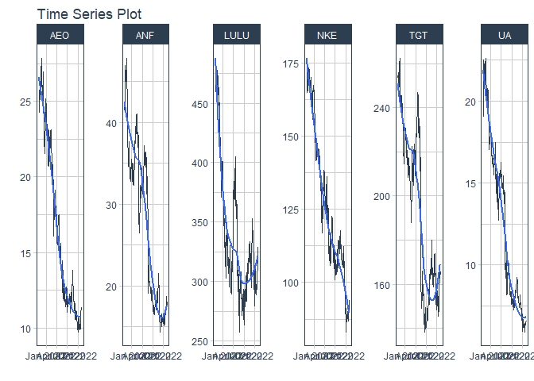
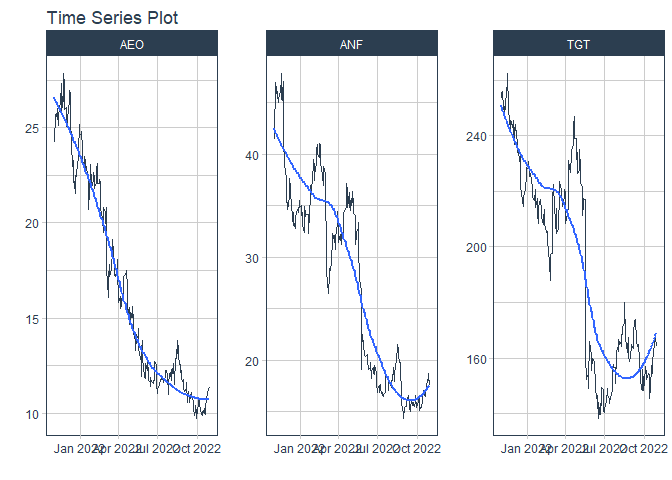
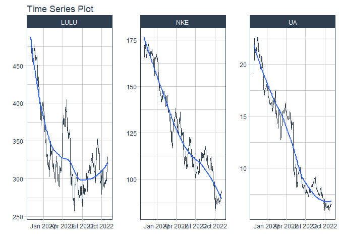
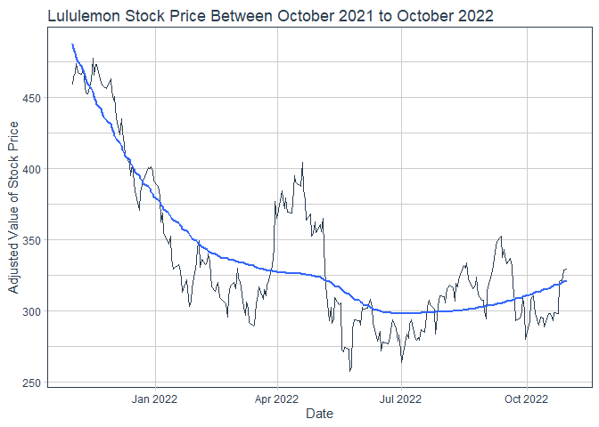
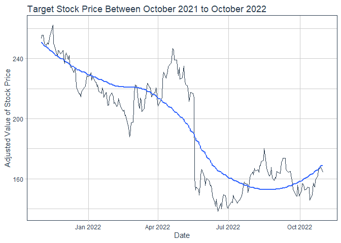

```r
library(tidyverse)
```

```
## -- Attaching packages --------------------------------------- tidyverse 1.3.1 --
```

```
## v ggplot2 3.3.5     v purrr   0.3.4
## v tibble  3.1.8     v dplyr   1.0.7
## v tidyr   1.1.4     v stringr 1.4.0
## v readr   2.1.1     v forcats 0.5.1
```

```
## Warning: package 'tibble' was built under R version 4.1.3
```

```
## -- Conflicts ------------------------------------------ tidyverse_conflicts() --
## x dplyr::filter() masks stats::filter()
## x dplyr::lag()    masks stats::lag()
```

```r
library(lubridate)
```

```
## 
## Attaching package: 'lubridate'
```

```
## The following objects are masked from 'package:base':
## 
##     date, intersect, setdiff, union
```

```r
library(tidyquant)
```

```
## Warning: package 'tidyquant' was built under R version 4.1.3
```

```
## Loading required package: PerformanceAnalytics
```

```
## Warning: package 'PerformanceAnalytics' was built under R version 4.1.3
```

```
## Loading required package: xts
```

```
## Warning: package 'xts' was built under R version 4.1.3
```

```
## Loading required package: zoo
```

```
## Warning: package 'zoo' was built under R version 4.1.3
```

```
## 
## Attaching package: 'zoo'
```

```
## The following objects are masked from 'package:base':
## 
##     as.Date, as.Date.numeric
```

```
## 
## Attaching package: 'xts'
```

```
## The following objects are masked from 'package:dplyr':
## 
##     first, last
```

```
## 
## Attaching package: 'PerformanceAnalytics'
```

```
## The following object is masked from 'package:graphics':
## 
##     legend
```

```
## Loading required package: quantmod
```

```
## Warning: package 'quantmod' was built under R version 4.1.3
```

```
## Loading required package: TTR
```

```
## Warning: package 'TTR' was built under R version 4.1.3
```

```
## Registered S3 method overwritten by 'quantmod':
##   method            from
##   as.zoo.data.frame zoo
```

## picking stocks


```r
## my stocks
stock1 <- "TGT"

stock2 <- "ANF"

stock3 <- "AEO"

## my friends stocks
stock4 <- "NKE"

stock5 <- "LULU"

stock6 <- "UA"
```


## pulling price performance for my stocks
TARGET

```r
start <- today() - years(1)
end <- today()
target_prices <- tq_get(stock1, get = "stock.prices", from = start, to = end)
target_prices
```

```
## # A tibble: 252 x 8
##    symbol date        open  high   low close  volume adjusted
##    <chr>  <date>     <dbl> <dbl> <dbl> <dbl>   <dbl>    <dbl>
##  1 TGT    2021-11-01  262.  262.  257.  258. 1718100     253.
##  2 TGT    2021-11-02  259.  261.  259.  260. 2228000     256.
##  3 TGT    2021-11-03  259.  261.  257.  260. 2397300     256.
##  4 TGT    2021-11-04  261.  263.  259.  260. 3031000     256.
##  5 TGT    2021-11-05  261   261.  253.  254. 4060300     250.
##  6 TGT    2021-11-08  253.  256.  252.  253. 2523100     249.
##  7 TGT    2021-11-09  253.  255.  253.  255. 2346800     251.
##  8 TGT    2021-11-10  254.  256   253.  254. 2093100     249.
##  9 TGT    2021-11-11  254.  257.  254.  256. 2199400     251.
## 10 TGT    2021-11-12  257.  262.  257.  260. 2497600     255.
## # ... with 242 more rows
```

```r
target_monthly <- target_prices %>%
  tq_transmute(adjusted, mutate_fun = monthlyReturn)
```

ABERCROMBIE AND FITCH

```r
anf_prices <- tq_get(stock2, get = "stock.prices", from = start, to = end)
anf_prices
```

```
## # A tibble: 252 x 8
##    symbol date        open  high   low close  volume adjusted
##    <chr>  <date>     <dbl> <dbl> <dbl> <dbl>   <dbl>    <dbl>
##  1 ANF    2021-11-01  40.1  41.7  39.9  41.4 1446700     41.4
##  2 ANF    2021-11-02  41.6  42.5  41.2  42.4 1530000     42.4
##  3 ANF    2021-11-03  42.4  46.3  42.2  46.3 2739900     46.3
##  4 ANF    2021-11-04  46.1  47.1  45.9  47.0 1597800     47.0
##  5 ANF    2021-11-05  47.9  49.0  45.8  46.2 1772700     46.2
##  6 ANF    2021-11-08  46.1  46.3  45.2  45.4  878900     45.4
##  7 ANF    2021-11-09  45.3  46.5  44.9  46.1  890800     46.1
##  8 ANF    2021-11-10  45.7  46.8  44.9  45.0  959000     45.0
##  9 ANF    2021-11-11  45.5  46.1  45.3  45.3  662600     45.3
## 10 ANF    2021-11-12  45.6  45.9  45.1  45.7  682800     45.7
## # ... with 242 more rows
```

```r
anf_monthly <- anf_prices %>%
  tq_transmute(adjusted, mutate_fun = monthlyReturn)
anf_monthly
```

```
## # A tibble: 12 x 2
##    date       monthly.returns
##    <date>               <dbl>
##  1 2021-11-30         -0.131 
##  2 2021-12-31         -0.0325
##  3 2022-01-31          0.120 
##  4 2022-02-28         -0.0236
##  5 2022-03-31         -0.160 
##  6 2022-04-29          0.0810
##  7 2022-05-31         -0.409 
##  8 2022-06-30         -0.172 
##  9 2022-07-29          0.0526
## 10 2022-08-31         -0.192 
## 11 2022-09-30          0.0806
## 12 2022-10-31          0.131
```
AMERICAN EAGLE

```r
aeo_prices <- tq_get(stock3, get = "stock.prices", from = start, to = end)
aeo_prices
```

```
## # A tibble: 252 x 8
##    symbol date        open  high   low close  volume adjusted
##    <chr>  <date>     <dbl> <dbl> <dbl> <dbl>   <dbl>    <dbl>
##  1 AEO    2021-11-01  23.9  25.4  23.9  25.3 6268300     24.5
##  2 AEO    2021-11-02  25.8  26.1  24.8  25.1 4211400     24.3
##  3 AEO    2021-11-03  25.0  26.9  25.0  26.5 5622200     25.7
##  4 AEO    2021-11-04  26.7  26.8  25.9  26.5 3909700     25.7
##  5 AEO    2021-11-05  27.3  28.2  26.3  26.6 3756700     25.7
##  6 AEO    2021-11-08  26.5  26.8  26.1  26.3 2751500     25.4
##  7 AEO    2021-11-09  26.2  27.1  26.2  26.8 2802800     26.0
##  8 AEO    2021-11-10  26.7  26.9  26.0  26.0 2607000     25.2
##  9 AEO    2021-11-11  26.2  26.6  25.9  26.4 2150500     25.6
## 10 AEO    2021-11-12  26.7  26.9  26.4  26.9 2643600     26.0
## # ... with 242 more rows
```

```r
aeo_monthly <- aeo_prices %>%
  tq_transmute(adjusted, mutate_fun = monthlyReturn)
aeo_monthly
```

```
## # A tibble: 12 x 2
##    date       monthly.returns
##    <date>               <dbl>
##  1 2021-11-30          0.0225
##  2 2021-12-31         -0.0156
##  3 2022-01-31         -0.0983
##  4 2022-02-28         -0.0767
##  5 2022-03-31         -0.195 
##  6 2022-04-29         -0.101 
##  7 2022-05-31         -0.199 
##  8 2022-06-30         -0.0768
##  9 2022-07-29          0.0939
## 10 2022-08-31         -0.0648
## 11 2022-09-30         -0.136 
## 12 2022-10-31          0.168
```
## price performance for friend
NIKE

```r
nike_prices <- tq_get(stock4, get = "stock.prices", from = start, to = end)
nike_prices
```

```
## # A tibble: 252 x 8
##    symbol date        open  high   low close  volume adjusted
##    <chr>  <date>     <dbl> <dbl> <dbl> <dbl>   <dbl>    <dbl>
##  1 NKE    2021-11-01  168.  169.  166.  166. 3610800     165.
##  2 NKE    2021-11-02  167.  168.  166.  168. 5038000     166.
##  3 NKE    2021-11-03  169   173.  169.  172. 7176700     171.
##  4 NKE    2021-11-04  172.  176.  172   175. 5460100     174.
##  5 NKE    2021-11-05  176.  179.  176.  178. 5892200     176.
##  6 NKE    2021-11-08  176.  177.  170.  172. 8301100     170.
##  7 NKE    2021-11-09  171.  174.  171.  174. 4343000     172.
##  8 NKE    2021-11-10  171.  172.  168.  168. 8185200     167.
##  9 NKE    2021-11-11  170.  170.  167.  167. 4994900     165.
## 10 NKE    2021-11-12  168.  170.  167.  169. 5126300     168.
## # ... with 242 more rows
```

```r
nike_monthly <- nike_prices %>%
  tq_transmute(adjusted, mutate_fun = monthlyReturn)
nike_monthly
```

```
## # A tibble: 12 x 2
##    date       monthly.returns
##    <date>               <dbl>
##  1 2021-11-30          0.0175
##  2 2021-12-31         -0.0134
##  3 2022-01-31         -0.112 
##  4 2022-02-28         -0.0778
##  5 2022-03-31         -0.0123
##  6 2022-04-29         -0.0733
##  7 2022-05-31         -0.0469
##  8 2022-06-30         -0.138 
##  9 2022-07-29          0.124 
## 10 2022-08-31         -0.0737
## 11 2022-09-30         -0.217 
## 12 2022-10-31          0.115
```
LULULEMON

```r
lulu_prices <- tq_get(stock5, get = "stock.prices", from = start, to = end)
lulu_prices
```

```
## # A tibble: 252 x 8
##    symbol date        open  high   low close volume adjusted
##    <chr>  <date>     <dbl> <dbl> <dbl> <dbl>  <dbl>    <dbl>
##  1 LULU   2021-11-01  468   469.  456.  459. 788700     459.
##  2 LULU   2021-11-02  462.  470.  461.  465. 676700     465.
##  3 LULU   2021-11-03  466.  469.  462.  467. 561800     467.
##  4 LULU   2021-11-04  470.  479.  469.  474. 676700     474.
##  5 LULU   2021-11-05  474.  477.  466.  468. 817600     468.
##  6 LULU   2021-11-08  472.  472.  457.  466. 736300     466.
##  7 LULU   2021-11-09  467.  472.  465.  470. 613600     470.
##  8 LULU   2021-11-10  465.  468.  454.  457. 647500     457.
##  9 LULU   2021-11-11  462.  463.  453.  453  507000     453 
## 10 LULU   2021-11-12  457.  457.  451.  453. 721600     453.
## # ... with 242 more rows
```

```r
lulu_monthly <- lulu_prices %>%
  tq_transmute(adjusted, mutate_fun = monthlyReturn)
lulu_monthly
```

```
## # A tibble: 12 x 2
##    date       monthly.returns
##    <date>               <dbl>
##  1 2021-11-30        -0.00974
##  2 2021-12-31        -0.139  
##  3 2022-01-31        -0.147  
##  4 2022-02-28        -0.0414 
##  5 2022-03-31         0.142  
##  6 2022-04-29        -0.0290 
##  7 2022-05-31        -0.175  
##  8 2022-06-30        -0.0686 
##  9 2022-07-29         0.139  
## 10 2022-08-31        -0.0340 
## 11 2022-09-30        -0.0680 
## 12 2022-10-31         0.177
```
UNDER ARMOUR

```r
ua_prices <- tq_get(stock6, get = "stock.prices", from = start, to = end)
ua_prices
```

```
## # A tibble: 252 x 8
##    symbol date        open  high   low close   volume adjusted
##    <chr>  <date>     <dbl> <dbl> <dbl> <dbl>    <dbl>    <dbl>
##  1 UA     2021-11-01  19.0  19.3  18.9  19.0  2668608     19.0
##  2 UA     2021-11-02  22.0  22.5  21.6  21.7 11697342     21.7
##  3 UA     2021-11-03  22.1  23.0  22.0  22.5  6569675     22.5
##  4 UA     2021-11-04  22.5  23.0  21.9  22.1  3077441     22.1
##  5 UA     2021-11-05  22.4  22.5  21.1  21.3  4037886     21.3
##  6 UA     2021-11-08  21.2  21.4  21.0  21.1  2005041     21.1
##  7 UA     2021-11-09  21.1  21.4  20.9  21.1  1550806     21.1
##  8 UA     2021-11-10  21.0  21.6  20.8  21.1  1735214     21.1
##  9 UA     2021-11-11  21.1  21.5  21.0  21.1  1145421     21.1
## 10 UA     2021-11-12  21.3  21.7  21.2  21.3  1268713     21.3
## # ... with 242 more rows
```

```r
ua_monthly <- ua_prices %>%
  tq_transmute(adjusted, mutate_fun = monthlyReturn)
ua_monthly
```

```
## # A tibble: 12 x 2
##    date       monthly.returns
##    <date>               <dbl>
##  1 2021-11-30         0.0547 
##  2 2021-12-31        -0.101  
##  3 2022-01-31        -0.114  
##  4 2022-02-28        -0.0225 
##  5 2022-03-31        -0.00448
##  6 2022-04-29        -0.0880 
##  7 2022-05-31        -0.316  
##  8 2022-06-30        -0.219  
##  9 2022-07-29         0.0897 
## 10 2022-08-31        -0.0811 
## 11 2022-09-30        -0.215  
## 12 2022-10-31         0.101
```
## viz

```r
library(timetk)
```

```
## Warning: package 'timetk' was built under R version 4.1.3
```

```r
my_stocks <- tq_get(c(stock1, stock2, stock3), get = "stock.prices", from = start, to = end)
my_stocks
```

```
## # A tibble: 756 x 8
##    symbol date        open  high   low close  volume adjusted
##    <chr>  <date>     <dbl> <dbl> <dbl> <dbl>   <dbl>    <dbl>
##  1 TGT    2021-11-01  262.  262.  257.  258. 1718100     253.
##  2 TGT    2021-11-02  259.  261.  259.  260. 2228000     256.
##  3 TGT    2021-11-03  259.  261.  257.  260. 2397300     256.
##  4 TGT    2021-11-04  261.  263.  259.  260. 3031000     256.
##  5 TGT    2021-11-05  261   261.  253.  254. 4060300     250.
##  6 TGT    2021-11-08  253.  256.  252.  253. 2523100     249.
##  7 TGT    2021-11-09  253.  255.  253.  255. 2346800     251.
##  8 TGT    2021-11-10  254.  256   253.  254. 2093100     249.
##  9 TGT    2021-11-11  254.  257.  254.  256. 2199400     251.
## 10 TGT    2021-11-12  257.  262.  257.  260. 2497600     255.
## # ... with 746 more rows
```

```r
friend_stocks <- tq_get(c(stock4, stock5, stock6), get = "stock.prices", from = start, to = end)
friend_stocks
```

```
## # A tibble: 756 x 8
##    symbol date        open  high   low close  volume adjusted
##    <chr>  <date>     <dbl> <dbl> <dbl> <dbl>   <dbl>    <dbl>
##  1 NKE    2021-11-01  168.  169.  166.  166. 3610800     165.
##  2 NKE    2021-11-02  167.  168.  166.  168. 5038000     166.
##  3 NKE    2021-11-03  169   173.  169.  172. 7176700     171.
##  4 NKE    2021-11-04  172.  176.  172   175. 5460100     174.
##  5 NKE    2021-11-05  176.  179.  176.  178. 5892200     176.
##  6 NKE    2021-11-08  176.  177.  170.  172. 8301100     170.
##  7 NKE    2021-11-09  171.  174.  171.  174. 4343000     172.
##  8 NKE    2021-11-10  171.  172.  168.  168. 8185200     167.
##  9 NKE    2021-11-11  170.  170.  167.  167. 4994900     165.
## 10 NKE    2021-11-12  168.  170.  167.  169. 5126300     168.
## # ... with 746 more rows
```

```r
combined <- tq_get(c(stock1,stock2,stock3,stock4,stock5,stock6), get = "stock.prices", from = start, to = end)


combined %>%
  group_by(symbol) %>%
  plot_time_series(date, adjusted, 
                   .facet_ncol = 6,
                   .interactive = FALSE)
```

<!-- -->

```r
my_stocks %>%
  group_by(symbol) %>%
  plot_time_series(date, adjusted, 
                   .facet_ncol = 3,
                   .interactive = FALSE)
```

<!-- -->

```r
friend_stocks %>%
  group_by(symbol) %>%
  plot_time_series(date, adjusted, 
                   .facet_ncol = 3,
                   .interactive = FALSE)
```

<!-- -->

```r
library(DT)
library(dygraphs)
```

```
## Warning: package 'dygraphs' was built under R version 4.1.3
```

```r
library(timetk)

combinedplot <- combined %>%
  select(symbol, date, adjusted) %>%
  pivot_wider(names_from = symbol, values_from = adjusted) %>%
  tk_xts(date_var = date)
```

```
## Warning: Non-numeric columns being dropped: date
```

```r
dygraph(combinedplot)
```

```{=html}
<div id="htmlwidget-b41d992af610c01734ac" style="width:672px;height:480px;" class="dygraphs html-widget"></div>
<script type="application/json" data-for="htmlwidget-b41d992af610c01734ac">{"x":{"attrs":{"labels":["day","TGT","ANF","AEO","NKE","LULU","UA"],"legend":"auto","retainDateWindow":false,"axes":{"x":{"pixelsPerLabel":60}}},"scale":"daily","annotations":[],"shadings":[],"events":[],"format":"date","data":[["2021-11-01T00:00:00.000Z","2021-11-02T00:00:00.000Z","2021-11-03T00:00:00.000Z","2021-11-04T00:00:00.000Z","2021-11-05T00:00:00.000Z","2021-11-08T00:00:00.000Z","2021-11-09T00:00:00.000Z","2021-11-10T00:00:00.000Z","2021-11-11T00:00:00.000Z","2021-11-12T00:00:00.000Z","2021-11-15T00:00:00.000Z","2021-11-16T00:00:00.000Z","2021-11-17T00:00:00.000Z","2021-11-18T00:00:00.000Z","2021-11-19T00:00:00.000Z","2021-11-22T00:00:00.000Z","2021-11-23T00:00:00.000Z","2021-11-24T00:00:00.000Z","2021-11-26T00:00:00.000Z","2021-11-29T00:00:00.000Z","2021-11-30T00:00:00.000Z","2021-12-01T00:00:00.000Z","2021-12-02T00:00:00.000Z","2021-12-03T00:00:00.000Z","2021-12-06T00:00:00.000Z","2021-12-07T00:00:00.000Z","2021-12-08T00:00:00.000Z","2021-12-09T00:00:00.000Z","2021-12-10T00:00:00.000Z","2021-12-13T00:00:00.000Z","2021-12-14T00:00:00.000Z","2021-12-15T00:00:00.000Z","2021-12-16T00:00:00.000Z","2021-12-17T00:00:00.000Z","2021-12-20T00:00:00.000Z","2021-12-21T00:00:00.000Z","2021-12-22T00:00:00.000Z","2021-12-23T00:00:00.000Z","2021-12-27T00:00:00.000Z","2021-12-28T00:00:00.000Z","2021-12-29T00:00:00.000Z","2021-12-30T00:00:00.000Z","2021-12-31T00:00:00.000Z","2022-01-03T00:00:00.000Z","2022-01-04T00:00:00.000Z","2022-01-05T00:00:00.000Z","2022-01-06T00:00:00.000Z","2022-01-07T00:00:00.000Z","2022-01-10T00:00:00.000Z","2022-01-11T00:00:00.000Z","2022-01-12T00:00:00.000Z","2022-01-13T00:00:00.000Z","2022-01-14T00:00:00.000Z","2022-01-18T00:00:00.000Z","2022-01-19T00:00:00.000Z","2022-01-20T00:00:00.000Z","2022-01-21T00:00:00.000Z","2022-01-24T00:00:00.000Z","2022-01-25T00:00:00.000Z","2022-01-26T00:00:00.000Z","2022-01-27T00:00:00.000Z","2022-01-28T00:00:00.000Z","2022-01-31T00:00:00.000Z","2022-02-01T00:00:00.000Z","2022-02-02T00:00:00.000Z","2022-02-03T00:00:00.000Z","2022-02-04T00:00:00.000Z","2022-02-07T00:00:00.000Z","2022-02-08T00:00:00.000Z","2022-02-09T00:00:00.000Z","2022-02-10T00:00:00.000Z","2022-02-11T00:00:00.000Z","2022-02-14T00:00:00.000Z","2022-02-15T00:00:00.000Z","2022-02-16T00:00:00.000Z","2022-02-17T00:00:00.000Z","2022-02-18T00:00:00.000Z","2022-02-22T00:00:00.000Z","2022-02-23T00:00:00.000Z","2022-02-24T00:00:00.000Z","2022-02-25T00:00:00.000Z","2022-02-28T00:00:00.000Z","2022-03-01T00:00:00.000Z","2022-03-02T00:00:00.000Z","2022-03-03T00:00:00.000Z","2022-03-04T00:00:00.000Z","2022-03-07T00:00:00.000Z","2022-03-08T00:00:00.000Z","2022-03-09T00:00:00.000Z","2022-03-10T00:00:00.000Z","2022-03-11T00:00:00.000Z","2022-03-14T00:00:00.000Z","2022-03-15T00:00:00.000Z","2022-03-16T00:00:00.000Z","2022-03-17T00:00:00.000Z","2022-03-18T00:00:00.000Z","2022-03-21T00:00:00.000Z","2022-03-22T00:00:00.000Z","2022-03-23T00:00:00.000Z","2022-03-24T00:00:00.000Z","2022-03-25T00:00:00.000Z","2022-03-28T00:00:00.000Z","2022-03-29T00:00:00.000Z","2022-03-30T00:00:00.000Z","2022-03-31T00:00:00.000Z","2022-04-01T00:00:00.000Z","2022-04-04T00:00:00.000Z","2022-04-05T00:00:00.000Z","2022-04-06T00:00:00.000Z","2022-04-07T00:00:00.000Z","2022-04-08T00:00:00.000Z","2022-04-11T00:00:00.000Z","2022-04-12T00:00:00.000Z","2022-04-13T00:00:00.000Z","2022-04-14T00:00:00.000Z","2022-04-18T00:00:00.000Z","2022-04-19T00:00:00.000Z","2022-04-20T00:00:00.000Z","2022-04-21T00:00:00.000Z","2022-04-22T00:00:00.000Z","2022-04-25T00:00:00.000Z","2022-04-26T00:00:00.000Z","2022-04-27T00:00:00.000Z","2022-04-28T00:00:00.000Z","2022-04-29T00:00:00.000Z","2022-05-02T00:00:00.000Z","2022-05-03T00:00:00.000Z","2022-05-04T00:00:00.000Z","2022-05-05T00:00:00.000Z","2022-05-06T00:00:00.000Z","2022-05-09T00:00:00.000Z","2022-05-10T00:00:00.000Z","2022-05-11T00:00:00.000Z","2022-05-12T00:00:00.000Z","2022-05-13T00:00:00.000Z","2022-05-16T00:00:00.000Z","2022-05-17T00:00:00.000Z","2022-05-18T00:00:00.000Z","2022-05-19T00:00:00.000Z","2022-05-20T00:00:00.000Z","2022-05-23T00:00:00.000Z","2022-05-24T00:00:00.000Z","2022-05-25T00:00:00.000Z","2022-05-26T00:00:00.000Z","2022-05-27T00:00:00.000Z","2022-05-31T00:00:00.000Z","2022-06-01T00:00:00.000Z","2022-06-02T00:00:00.000Z","2022-06-03T00:00:00.000Z","2022-06-06T00:00:00.000Z","2022-06-07T00:00:00.000Z","2022-06-08T00:00:00.000Z","2022-06-09T00:00:00.000Z","2022-06-10T00:00:00.000Z","2022-06-13T00:00:00.000Z","2022-06-14T00:00:00.000Z","2022-06-15T00:00:00.000Z","2022-06-16T00:00:00.000Z","2022-06-17T00:00:00.000Z","2022-06-21T00:00:00.000Z","2022-06-22T00:00:00.000Z","2022-06-23T00:00:00.000Z","2022-06-24T00:00:00.000Z","2022-06-27T00:00:00.000Z","2022-06-28T00:00:00.000Z","2022-06-29T00:00:00.000Z","2022-06-30T00:00:00.000Z","2022-07-01T00:00:00.000Z","2022-07-05T00:00:00.000Z","2022-07-06T00:00:00.000Z","2022-07-07T00:00:00.000Z","2022-07-08T00:00:00.000Z","2022-07-11T00:00:00.000Z","2022-07-12T00:00:00.000Z","2022-07-13T00:00:00.000Z","2022-07-14T00:00:00.000Z","2022-07-15T00:00:00.000Z","2022-07-18T00:00:00.000Z","2022-07-19T00:00:00.000Z","2022-07-20T00:00:00.000Z","2022-07-21T00:00:00.000Z","2022-07-22T00:00:00.000Z","2022-07-25T00:00:00.000Z","2022-07-26T00:00:00.000Z","2022-07-27T00:00:00.000Z","2022-07-28T00:00:00.000Z","2022-07-29T00:00:00.000Z","2022-08-01T00:00:00.000Z","2022-08-02T00:00:00.000Z","2022-08-03T00:00:00.000Z","2022-08-04T00:00:00.000Z","2022-08-05T00:00:00.000Z","2022-08-08T00:00:00.000Z","2022-08-09T00:00:00.000Z","2022-08-10T00:00:00.000Z","2022-08-11T00:00:00.000Z","2022-08-12T00:00:00.000Z","2022-08-15T00:00:00.000Z","2022-08-16T00:00:00.000Z","2022-08-17T00:00:00.000Z","2022-08-18T00:00:00.000Z","2022-08-19T00:00:00.000Z","2022-08-22T00:00:00.000Z","2022-08-23T00:00:00.000Z","2022-08-24T00:00:00.000Z","2022-08-25T00:00:00.000Z","2022-08-26T00:00:00.000Z","2022-08-29T00:00:00.000Z","2022-08-30T00:00:00.000Z","2022-08-31T00:00:00.000Z","2022-09-01T00:00:00.000Z","2022-09-02T00:00:00.000Z","2022-09-06T00:00:00.000Z","2022-09-07T00:00:00.000Z","2022-09-08T00:00:00.000Z","2022-09-09T00:00:00.000Z","2022-09-12T00:00:00.000Z","2022-09-13T00:00:00.000Z","2022-09-14T00:00:00.000Z","2022-09-15T00:00:00.000Z","2022-09-16T00:00:00.000Z","2022-09-19T00:00:00.000Z","2022-09-20T00:00:00.000Z","2022-09-21T00:00:00.000Z","2022-09-22T00:00:00.000Z","2022-09-23T00:00:00.000Z","2022-09-26T00:00:00.000Z","2022-09-27T00:00:00.000Z","2022-09-28T00:00:00.000Z","2022-09-29T00:00:00.000Z","2022-09-30T00:00:00.000Z","2022-10-03T00:00:00.000Z","2022-10-04T00:00:00.000Z","2022-10-05T00:00:00.000Z","2022-10-06T00:00:00.000Z","2022-10-07T00:00:00.000Z","2022-10-10T00:00:00.000Z","2022-10-11T00:00:00.000Z","2022-10-12T00:00:00.000Z","2022-10-13T00:00:00.000Z","2022-10-14T00:00:00.000Z","2022-10-17T00:00:00.000Z","2022-10-18T00:00:00.000Z","2022-10-19T00:00:00.000Z","2022-10-20T00:00:00.000Z","2022-10-21T00:00:00.000Z","2022-10-24T00:00:00.000Z","2022-10-25T00:00:00.000Z","2022-10-26T00:00:00.000Z","2022-10-27T00:00:00.000Z","2022-10-28T00:00:00.000Z","2022-10-31T00:00:00.000Z"],[253.294525,255.592529,255.739792,255.769257,249.70993,248.786819,250.583984,249.493896,251.418747,255.356827,259.589508,262.506409,250.09993,248.375443,247.04512,241.004501,245.547272,245.133408,242.975342,245.527588,240.285141,236.885422,241.920929,243.96077,239.427811,242.049042,236.106949,234.09668,234.707642,230.756104,231.849915,233.199951,221.502991,220.054413,215.994507,216.861679,214.565643,217.787949,220.832916,221.631119,224.597214,228.529068,228.065918,228.568466,230.756104,225.523529,227.977219,227.415527,224.104523,224.23262,221.197525,222.537704,218.172272,216.802536,220.576706,218.48761,214.082794,217.364243,211.550247,208.62355,209.0867,214.496658,217.216415,216.033905,214.437531,210.111526,210.919571,208.209671,209.845459,213.481674,210.722488,208.475739,205.529327,205.044373,205.667862,201.897156,202.283142,194.326019,187.942474,189.575485,197.166428,197.710754,217.168091,222.581696,221.532639,221.789963,208.864578,206.657562,213.773453,212.566025,204.836533,206.608078,213.130157,213.367676,218.355728,223.719864,220.701294,220.473679,214.486023,214.802734,216.356552,217.257172,220.632004,219.672012,210.03241,208.36972,212.199844,212.575912,213.714081,225.837799,230.934708,226.946243,228.955322,231.409775,234.754913,236.922348,243.513702,246.75,245.611832,239.188736,239.168961,234.062134,228.589142,233.953278,226.293045,227.411407,230.14296,234.982544,228.381302,222.888519,221.888931,216.851395,211.289337,215.030365,217.465012,216.98996,213.939072,160.603378,152.474319,154.392303,152.941391,149.015991,155.445694,162.183472,166.098923,160.871689,155.545074,159.90773,160.036911,158.675461,155.008438,155.723953,153.587357,148.737747,143.90802,141.811157,146.521637,141.999969,138.432343,143.798691,139.932922,145.895554,149.483063,148.678116,143.619827,141.016129,140.350311,141.493149,144.802414,143.90802,149.02594,147.068207,145.47818,143.659576,144.534088,145.378784,145.756424,148.429672,152.404755,155.525208,157.671753,156.757477,156.509033,150.86441,153.637039,158.427017,162.36235,164.518829,162.461716,166.874069,165.522537,165.09523,165.929993,164.091507,168.613174,168.54361,171.405655,172.309998,180.190002,175.339996,173.050003,167.039993,161.960007,161.970001,163.130005,167.5,160.619995,158.690002,160.779999,160.339996,164.839996,164.600006,163.580002,170.789993,171.899994,173.649994,173.850006,166.240005,165.380005,165.009995,164.089996,164.759995,160.029999,159.029999,152.960007,152.610001,148.710007,148.470001,155.869995,151.789993,148.389999,151.789993,156.960007,156.410004,155.75,152.339996,153.100006,154.5,154.160004,154.119995,145.690002,149.25,157.229996,155.389999,154.399994,159.190002,161.820007,165.800003,166.770004,166.899994,167.520004,164.25],[41.439999,42.380001,46.27,46.950001,46.23,45.439999,46.09,44.990002,45.299999,45.68,46.16,46.610001,45.330002,47.849998,45.189999,47.040001,41.119999,39.25,38.049999,37.919998,36,34.650002,35.310001,34.93,36.099998,37.619999,36.889999,35.93,35.48,33.48,34.080002,34.369999,33.119999,33.549999,32.810001,33.970001,34.200001,34.360001,34.709999,34.330002,35.34,35.459999,34.830002,34.98,34.82,33.189999,34.310001,33.189999,32.349998,34.900002,34.240002,33.919998,34.139999,34.169998,34.139999,32.27,32.360001,35.91,36.950001,36.049999,36.360001,36.490002,39,39.459999,38.880001,37.470001,38.029999,39.049999,40.52,40.830002,40.970001,39.939999,39.66,40.990002,40.919998,39.34,39.189999,37.900002,36.98,38.43,38.82,38.080002,35.849998,31.16,31.6,28.59,26.5,26.889999,27.860001,28.93,28.440001,29.41,30,31.32,32.200001,32.27,31.629999,32.07,30.75,31.16,31.93,33.259998,34.400002,32.98,31.99,31.42,32.220001,31.940001,31.209999,31.620001,32.639999,32.240002,32.709999,34.259998,34.490002,34.790001,37,37.189999,36.509998,34.790001,36.240002,34.869999,34.950001,35.529999,34.580002,36.099998,35.310001,36.349998,35.189999,34.23,34.060001,33,31.219999,32.09,32.52,32.779999,33.360001,29.870001,29.059999,27.969999,26.73,19.09,22.23,21.85,22.549999,20.440001,20.440001,20.41,20.360001,20.530001,20.18,19.83,19.360001,19.07,19.25,19.25,19.77,18.209999,18.959999,19.32,18.799999,18.610001,19.469999,18.870001,18.299999,17.74,16.92,17.18,17.59,16.9,17.67,17.209999,16.59,16.92,16.879999,16.51,16.709999,16.860001,17.889999,18.51,18.67,18.57,18.309999,17.049999,17.49,17.9,17.809999,17.35,17.52,18.02,18.059999,18.02,19.280001,17.969999,18.82,19.32,19.700001,19.790001,21.58,20.860001,21.23,20.57,19.799999,19.75,18.65,17.440001,15.87,15.27,15,14.39,15.44,15.43,15.52,16.139999,16.120001,16.200001,16.6,15.52,15.34,15.05,15.48,16.049999,15.93,15.59,15.61,15.88,15.53,16.030001,16.57,15.43,15.55,15.67,16.15,16.049999,16.379999,15.17,15.44,15.44,15.5,16.02,16.43,17.059999,17.059999,16.65,16.52,16.940001,17.33,18.190001,18.15,18.08,18.709999,17.58],[24.520658,24.268867,25.682777,25.653723,25.740883,25.440668,26.002357,25.150139,25.595617,26.041094,26.312256,26.835209,25.876461,27.319424,26.079832,26.5931,27.881115,27.300056,25.963621,26.079832,25.072664,25.014559,25.430986,25.48909,26.418783,26.970789,26.825523,26.289404,25.431612,22.965458,23.218895,23.267635,22.146654,22.468327,21.561796,22.478075,22.45858,22.663279,23.452837,23.735519,25.158676,25.119686,24.681042,24.632305,24.837004,23.90123,23.755018,23.345615,22.916719,23.511326,22.780252,23.345615,23.150661,22.585299,22.341606,20.801477,20.694256,22.595047,23.053185,22.058924,22.234383,21.834728,22.25388,22.663279,22.370852,21.805489,21.893215,22.097916,22.916719,23.08243,23.121418,22.088169,22.097916,22.263626,22.156401,21.015926,20.752743,20.255611,19.51479,20.392078,20.820974,20.54804,19.972927,20.791731,18.85195,17.623745,16.093365,17.126616,17.750463,17.839071,17.189301,17.533875,17.779999,18.459303,18.784185,19.128759,17.868605,18.065504,17.238527,17.287752,17.179459,17.248373,18.085194,16.972713,16.539534,15.801162,16.116201,15.722404,15.476279,15.614108,15.958681,16.25403,16.372169,17.199146,17.228682,17.386202,17.504341,17.415737,16.736435,15.210464,15.535349,14.905272,14.639457,15.27938,14.875736,15.387674,15.052945,15.614108,14.856047,14.206279,13.81248,13.969999,13.290697,13.999535,14.12752,13.89124,14.432713,13.271008,13.221783,13.113488,12.729535,11.922248,13.349768,13.802636,12.887054,11.922248,11.912403,11.794263,12.591705,12.237287,12.384961,12.68031,12.256976,11.735194,11.685968,11.400465,11.882868,11.676124,11.656434,11.577675,11.725348,11.705659,12.71969,12.54248,12.060078,11.548139,11.006667,11.25279,11.459536,11.429999,11.75,11.73,11.86,11.8,11.93,11.59,11.78,11.7,11.99,12.23,12.12,12.23,12.03,10.99,11.63,11.99,12.04,12.11,11.71,12.31,12.16,12.06,12.63,11.49,11.96,12.46,12.85,12.89,13.8,13.15,13.56,13.08,12.53,12.54,12.12,12.25,11.8,11.64,11.77,11.26,11.2,11.15,11.28,11.59,10.58,10.69,11.12,10.56,10.79,10.77,10.95,11.07,10.77,10.82,10.62,10.24,9.86,10.1,10.39,10.04,9.73,10.13,10.49,10.68,10.79,10.5,10.15,10.05,9.91,10.1,9.87,10.06,10.24,10.05,9.94,10.37,10.74,11.07,11.11,11.19,11.25,11.36],[164.770905,166.256866,170.883072,173.795517,175.8461,170.239166,172.190704,166.682816,165.404907,167.505035,167.267288,170.21936,170.130188,169.743851,173.240753,172.606766,170.536362,170.417465,166.445068,168.277725,167.653625,165.137436,168.406494,168.947357,167.627457,169.98938,168.957306,166.823624,167.776321,165.573196,164.144104,162.655487,161.484467,160.134796,155.78804,165.364777,164.183807,164.412048,166.307571,165.156357,167.498444,166.218262,165.40448,163.419662,165.126587,161.018036,159.8172,155.778122,149.297699,149.158768,151.054276,148.454147,147.054855,145.834198,144.008179,141.64624,141.864578,144.891403,144.375366,142.896698,143.541748,144.802109,146.945709,147.094574,147.580856,144.206665,144.286057,144.037949,142.44017,145.149445,143.720398,139.115601,140.514908,144.474609,145.377701,141.715714,141.864578,137.140717,135.791046,136.128464,137.746094,135.513184,131.216049,134.649765,132.952759,130.481003,123.776924,120.564133,126.273544,125.358452,121.976563,116.943527,118.763779,124.522926,126.731094,130.540695,129.496292,132.380829,132.291306,131.376205,132.987579,134.091675,138.39859,137.801788,133.843002,132.808548,133.624161,131.595047,127.676033,128.690613,127.467148,124.314049,124.373726,126.810661,132.748871,130.928619,136.319733,135.146011,134.73822,128.382263,127.258278,119.877808,120.593971,126.373024,124.035538,125.408188,122.205345,125.388283,117.997879,113.879944,110.617416,108.906586,107.344948,107.325058,112.407829,112.000008,115.282425,108.787224,105.872841,107.424522,108.051163,106.718307,107.623451,112.338203,115.371948,118.216705,118.047615,122.752411,120.603584,119.885651,121.321518,122.049431,118.260315,114.401405,110.123688,110.402885,113.115097,106.813194,107.032562,108.368729,104.619492,107.690674,112.586617,110.183517,102.485626,102.954277,101.90728,100.890205,104.021217,103.931473,107.820297,107.620872,104.808952,103.462822,104.808952,102.92437,104.400124,103.642303,108.877266,110.791771,111.300308,108.807472,108.96701,104.898689,107.551079,111.908562,114.590851,113.972633,111.449875,113.95269,114.152115,113.543861,113.673492,109.794632,112.815956,113.773201,115.737564,115.986847,117.721863,116.704781,115.677734,112.835899,110.023972,110.362999,111.090912,112.895729,107.969872,107.571014,107.551079,106.145111,106.184998,105.739998,105.150002,108.480003,108.730003,110.970001,112.379997,105.720001,107,105.5,104.120003,107.209999,102.419998,99.790001,98.550003,97.019997,96.059998,96.290001,98.699997,95.330002,83.120003,85.400002,88.639999,91.099998,90.169998,87.160004,86.690002,87.989998,88.510002,89.559998,87.550003,89.970001,89.68,88.57,86.830002,88.5,88.010002,91.720001,92.389999,90.540001,93.830002,92.68],[458.880005,464.640015,467.480011,473.940002,467.910004,466.140015,470.23999,457.359985,453,452.589996,461.959991,477.910004,465.839996,473.23999,473,460.929993,458.76001,457.859985,456.579987,463.26001,454.410004,448.429993,450.679993,435.720001,423.540009,434.950012,426,416.920013,409.579987,403.75,395.089996,402.480011,390.619995,384.660004,370.570007,383.309998,388.790009,391.559998,400.75,400.070007,401,398.690002,391.450012,387.559998,380.820007,362.480011,368.769989,355.209991,348.429993,346.75,352.720001,336.269989,328.980011,332.529999,330.950012,322.529999,313.019989,321.619995,308.829987,302.76001,306.519989,315.910004,333.76001,344.910004,349.190002,330.350006,336.369995,332.200012,334.399994,339.640015,334.350006,316.720001,313.640015,318.149994,320.040009,310.029999,308.660004,304.579987,295.23999,310.359985,317.579987,319.940002,315.179993,330.070007,322.839996,320.579987,302.380005,296.519989,305.820007,301.73999,291.549988,289.23999,289.920013,305.100006,307.600006,316.929993,308.220001,315.029999,310.420013,317.73999,321.140015,331.779999,343.970001,376.920013,365.230011,367.440002,384.179993,378.98999,371.829987,379.230011,369.459991,368.73999,376.160004,395.029999,390.779999,387.559998,404.660004,385.399994,377.25,363.660004,368.089996,352.529999,354.019989,362.429993,354.630005,360.839996,355.700012,364.670013,343.600006,317.049988,292.679993,302.109985,291.299988,294,309.290009,304.149994,305.480011,272.519989,271.220001,274.040009,272.839996,257.51001,260.660004,287.480011,293.649994,292.690002,289.959991,302.579987,300.799988,301.619995,306.190002,307.769989,302.299988,291.600006,278.579987,280.5,285.720001,271.339996,278.130005,276.450012,277.880005,286.329987,293.359985,287.480011,278.559998,282.980011,272.609985,263.380005,283.619995,280.380005,290.720001,293.390015,281.76001,279.390015,280.970001,278.98999,286.410004,284.640015,296.339996,302.790009,307.359985,304.5,301.320007,283.410004,295.570007,303.850006,310.51001,310.01001,305.700012,315.380005,316.399994,317.799988,316.23999,306.549988,319.26001,316.980011,321.690002,330.339996,331.700012,329.799988,333.420013,322.470001,315.220001,315.929993,317.839996,323.359985,311.309998,307.5,307.070007,299.959991,294.450012,314.170013,327.809998,336.869995,345.790009,348.649994,352.73999,337.320007,342.920013,338.600006,333.23999,337.079987,331.570007,318.119995,306.299988,293.200012,294.660004,299.190002,309.339996,300.220001,279.559998,292.100006,307.799988,310.049988,310.480011,298.220001,289.850006,295.679993,295.5,294.51001,288.779999,297.649994,297.76001,296.869995,293.130005,298.630005,297.679993,320.630005,321.329987,320.609985,328.480011,329.040009],[19.030001,21.68,22.5,22.110001,21.34,21.120001,21.129999,21.120001,21.139999,21.290001,21.870001,22.440001,22.219999,22.6,22.629999,21.5,21.200001,21.35,20.629999,20.940001,20.07,19.540001,19.959999,19.98,20.370001,20.76,20.66,20.32,20.059999,19.25,19.01,19.049999,18.190001,17.709999,17.059999,17.459999,17.360001,17.549999,17.719999,17.77,17.940001,17.99,18.040001,18.07,18.209999,17.48,17.66,16.98,16.68,16.66,16.700001,16.51,16.18,16.15,16.27,15.98,16.09,16.5,15.92,15.5,15.49,15.57,15.99,16.190001,16.559999,16.16,16.43,16.58,16.940001,17.459999,17.33,15.36,15.11,15.54,15.13,14.47,14.46,14.24,13.85,14.86,15.57,15.63,15.28,15.36,14.8,14.09,12.75,13.05,13.76,13.83,14,14.12,14.44,15.19,15.42,15.61,15.31,15.39,15.28,15.53,15.73,15.85,16.25,16.08,15.56,15.39,15.53,15.18,14.88,14.84,14.74,14.68,14.67,15,14.88,14.84,15.44,15.33,15.11,14.34,14.59,13.74,13.96,14.43,14.19,14.42,14.24,14.42,13.29,9.85,9.59,9.59,9.19,9.69,10.14,9.99,10.43,9.71,8.18,8.48,8.68,8.21,8.8,9.13,9.38,9.7,9.41,10.06,10.08,10.1,10.11,10.04,9.73,9.34,8.87,8.66,8.79,8.16,8.38,8.08,8.12,8.21,8.39,8.36,8.11,7.81,7.58,7.67,7.92,7.66,7.87,7.96,7.61,7.66,7.58,7.26,7.46,7.44,7.86,8.07,8.1,7.91,7.87,7.41,7.81,8.08,8.26,8.37,8.25,8.46,8.35,8.45,8.71,8.36,8.75,8.89,9.05,9.08,9.24,9.01,8.8,8.31,8.01,8,8.02,8.09,7.8,7.68,7.74,7.59,7.5,7.41,7.41,7.76,7.82,7.97,8.17,7.6,7.7,7.42,7.31,7.53,7.24,7.07,6.79,6.65,6.78,6.85,7,6.5,5.96,6.34,6.59,6.69,6.52,6.27,6.22,6.33,6.26,6.4,6.18,6.4,6.44,6.2,5.92,6.09,6.31,6.53,6.38,6.32,6.48,6.56]]},"evals":[],"jsHooks":[]}</script>
```


```r
library(timetk)

combined %>%
  filter(symbol == "LULU") %>%
  plot_time_series(date, adjusted, 
                   .interactive = FALSE,
                   .x_lab = "Date",
                   .y_lab = "Adjusted Value of Stock Price",
                   .title = "Lululemon Stock Price Between October 2021 to October 2022")
```

<!-- -->

```r
combined %>%
  filter(symbol == "TGT") %>%
  plot_time_series(date, adjusted,
                   .interactive = FALSE,
                   .x_lab = "Date",
                   .y_lab = "Adjusted Value of Stock Price",
                   .title = "Target Stock Price Between October 2021 to October 2022")
```

<!-- -->

I chose to first display all the chosen stocks in order to easily see the best performing one and 
in the process of doing so I realized that Target and Lululemon had similar fluctuations in stock prices which can
perhaps be attributed to similar forces acting in the retail market. I chose to display the top two stocks, 1 from
my chosen stocks and 1 from my friends chosen stocks. I wanted to compare with a trend line to show more clearly 
the starting share value of the stock to the ending share value of the stock.
