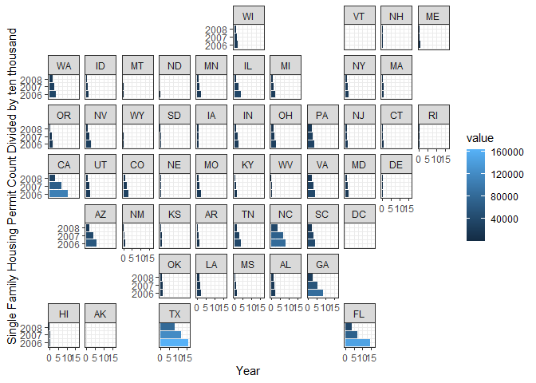
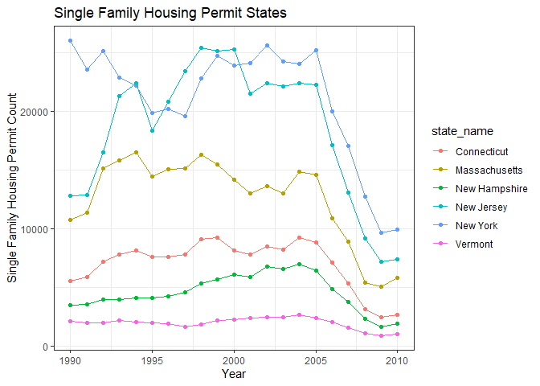

```r
library(tidyverse)
```

```
## -- Attaching packages --------------------------------------- tidyverse 1.3.1 --
```

```
## v ggplot2 3.3.5     v purrr   0.3.4
## v tibble  3.1.8     v dplyr   1.0.7
## v tidyr   1.1.4     v stringr 1.4.0
## v readr   2.1.1     v forcats 0.5.1
```

```
## Warning: package 'tibble' was built under R version 4.1.3
```

```
## -- Conflicts ------------------------------------------ tidyverse_conflicts() --
## x dplyr::filter() masks stats::filter()
## x dplyr::lag()    masks stats::lag()
```

```r
library(USAboundaries)
```

```
## Warning: package 'USAboundaries' was built under R version 4.1.3
```

```r
library(downloader)
```

```
## Warning: package 'downloader' was built under R version 4.1.3
```

```r
library(maps)
```

```
## Warning: package 'maps' was built under R version 4.1.3
```

```
## 
## Attaching package: 'maps'
```

```
## The following object is masked from 'package:purrr':
## 
##     map
```


```r
permits <- tempfile()
download.file("https://github.com/WJC-Data-Science/DTS350/raw/master/permits.csv", "permits")
permits <- read_csv("permits")
```

```
## New names:
## Rows: 327422 Columns: 8
## -- Column specification
## -------------------------------------------------------- Delimiter: "," chr
## (3): StateAbbr, countyname, variable dbl (5): ...1, state, county, year, value
## i Use `spec()` to retrieve the full column specification for this data. i
## Specify the column types or set `show_col_types = FALSE` to quiet this message.
## * `` -> `...1`
```

```r
head(permits)
```

```
## # A tibble: 6 x 8
##    ...1 state StateAbbr county countyname     variable     year value
##   <dbl> <dbl> <chr>      <dbl> <chr>          <chr>       <dbl> <dbl>
## 1     1     1 AL             1 Autauga County All Permits  2010   191
## 2     2     1 AL             1 Autauga County All Permits  2009   110
## 3     3     1 AL             1 Autauga County All Permits  2008   173
## 4     4     1 AL             1 Autauga County All Permits  2007   260
## 5     5     1 AL             1 Autauga County All Permits  2006   347
## 6     6     1 AL             1 Autauga County All Permits  2005   313
```

```r
s_codes <- state_codes %>%
  mutate(state = as.integer(state_code))
head(s_codes)
```

```
## # A tibble: 6 x 5
##   state_name state_abbr state_code jurisdiction_type state
##   <chr>      <chr>      <chr>      <chr>             <int>
## 1 Alabama    AL         01         state                 1
## 2 Alaska     AK         02         state                 2
## 3 Arizona    AZ         04         state                 4
## 4 Arkansas   AR         05         state                 5
## 5 California CA         06         state                 6
## 6 Colorado   CO         08         state                 8
```


```r
permits_data <- left_join(permits, s_codes, by = "state") %>%
  group_by(state_name, year) %>%
  summarize(across(value, sum))
```

```
## `summarise()` has grouped output by 'state_name'. You can override using the
## `.groups` argument.
```

```r
head(permits_data)
```

```
## # A tibble: 6 x 3
## # Groups:   state_name [1]
##   state_name  year value
##   <chr>      <dbl> <dbl>
## 1 Alabama     1980 38954
## 2 Alabama     1981 24592
## 3 Alabama     1982 21454
## 4 Alabama     1983 43537
## 5 Alabama     1984 37676
## 6 Alabama     1985 41725
```
## permits per state graph

```r
permits_by_state <- ggplot(data = permits_data, aes(x = year, y = value/1000, color = state_name)) +
  geom_point() +
  geom_line() +
  geom_vline(xintercept = 2008, linetype = "dotted") +
  labs(x = "Year",
       y = "Value Divided by 1000",
       title = "Permits per Year by State") +
  theme_bw()
    
permits_by_state  
```

<!-- -->


```r
top_states_recession_permits <- permits_data %>%
  filter(year == 2006 | year == 2007 | year == 2008 | year == 2009) %>%
  filter(value >= 150000)

head(top_states_recession_permits)
```

```
## # A tibble: 6 x 3
## # Groups:   state_name [3]
##   state_name  year  value
##   <chr>      <dbl>  <dbl>
## 1 California  2006 373792
## 2 California  2007 261953
## 3 California  2008 155611
## 4 Florida     2006 463478
## 5 Florida     2007 237623
## 6 Georgia     2006 226494
```

```r
ggplot(data = top_states_recession_permits, aes(x = year, y = value/1000, color = state_name)) +
  geom_point() +
  geom_line() +
  labs(x = "Year",
       y = "Housing Permit Count Divided by 1000",
       title = "Top 5 Housing Permit States Leading up to the Recession") +
  theme_bw()
```

<!-- -->
Looking at the top housing permits states a few years before the crash and a year after.

## sort of state geo plot

```r
library(geofacet)
```

```
## Warning: package 'geofacet' was built under R version 4.1.3
```

```r
recession_permits <- permits_data %>%
  filter(year == 2006 | year == 2007 | year == 2008)

library(ggplot2)

ggplot(recession_permits, aes(year, value/10000, fill = value)) +
  geom_col() +
  coord_flip() +
  facet_geo(~ state_name) +
  xlab("Housing Permit Count Divided by ten thousand") +
  ylab("Year") +
  theme_bw()
```

<!-- -->


```r
Missouri <- permits_data %>%
  filter(state_name == 'Missouri') %>%
  ggplot(aes(x = year, y = value)) +
  geom_point() +
  geom_line() +
  labs(x = 'Year', 
       y = 'Permit Amount',
       title = "Missouri Housing Permits") +
  theme_bw()

Missouri
```

<!-- -->

I chose line graphs mostly because we are looking at permit amounts over time. The closest I could get to a
map using the data was the geofacet. I chose to do geom_col on that just because it was extremely hard to read
as a line graph and you can still see the decrease in permits, especially in states like california, texas,
georgia, the carolinas, and florida. 
