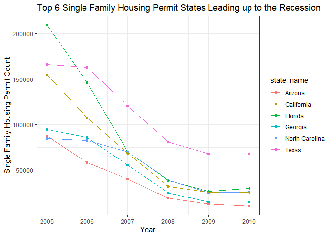

```r
library(tidyverse)
```

```
## -- Attaching packages --------------------------------------- tidyverse 1.3.1 --
```

```
## v ggplot2 3.3.5     v purrr   0.3.4
## v tibble  3.1.8     v dplyr   1.0.7
## v tidyr   1.1.4     v stringr 1.4.0
## v readr   2.1.1     v forcats 0.5.1
```

```
## Warning: package 'tibble' was built under R version 4.1.3
```

```
## -- Conflicts ------------------------------------------ tidyverse_conflicts() --
## x dplyr::filter() masks stats::filter()
## x dplyr::lag()    masks stats::lag()
```

```r
library(USAboundaries)
```

```
## Warning: package 'USAboundaries' was built under R version 4.1.3
```

```r
library(downloader)
```

```
## Warning: package 'downloader' was built under R version 4.1.3
```

```r
library(maps)
```

```
## Warning: package 'maps' was built under R version 4.1.3
```

```
## 
## Attaching package: 'maps'
```

```
## The following object is masked from 'package:purrr':
## 
##     map
```

```r
library(ggplot2)
```


```r
permits <- tempfile()
download.file("https://github.com/WJC-Data-Science/DTS350/raw/master/permits.csv", "permits")
permits <- read_csv("permits")
```

```
## New names:
## Rows: 327422 Columns: 8
## -- Column specification
## -------------------------------------------------------- Delimiter: "," chr
## (3): StateAbbr, countyname, variable dbl (5): ...1, state, county, year, value
## i Use `spec()` to retrieve the full column specification for this data. i
## Specify the column types or set `show_col_types = FALSE` to quiet this message.
## * `` -> `...1`
```

```r
head(permits)
```

```
## # A tibble: 6 x 8
##    ...1 state StateAbbr county countyname     variable     year value
##   <dbl> <dbl> <chr>      <dbl> <chr>          <chr>       <dbl> <dbl>
## 1     1     1 AL             1 Autauga County All Permits  2010   191
## 2     2     1 AL             1 Autauga County All Permits  2009   110
## 3     3     1 AL             1 Autauga County All Permits  2008   173
## 4     4     1 AL             1 Autauga County All Permits  2007   260
## 5     5     1 AL             1 Autauga County All Permits  2006   347
## 6     6     1 AL             1 Autauga County All Permits  2005   313
```

## FIPS setup stuff

```r
counties <- us_counties()

FIPS <- permits %>%
  mutate(state = as.character(state), stateFIPS = str_pad(state, 2,pad = "0")) %>%
  mutate(county = as.character(county), countyFIPS = str_pad(county, 3,pad = "0"))
FIPS
```

```
## # A tibble: 327,422 x 10
##     ...1 state StateAbbr county countyname   varia~1  year value state~2 count~3
##    <dbl> <chr> <chr>     <chr>  <chr>        <chr>   <dbl> <dbl> <chr>   <chr>  
##  1     1 1     AL        1      Autauga Cou~ All Pe~  2010   191 01      001    
##  2     2 1     AL        1      Autauga Cou~ All Pe~  2009   110 01      001    
##  3     3 1     AL        1      Autauga Cou~ All Pe~  2008   173 01      001    
##  4     4 1     AL        1      Autauga Cou~ All Pe~  2007   260 01      001    
##  5     5 1     AL        1      Autauga Cou~ All Pe~  2006   347 01      001    
##  6     6 1     AL        1      Autauga Cou~ All Pe~  2005   313 01      001    
##  7     7 1     AL        1      Autauga Cou~ All Pe~  2004   367 01      001    
##  8     8 1     AL        1      Autauga Cou~ All Pe~  2003   283 01      001    
##  9     9 1     AL        1      Autauga Cou~ All Pe~  2002   276 01      001    
## 10    10 1     AL        1      Autauga Cou~ All Pe~  2001   400 01      001    
## # ... with 327,412 more rows, and abbreviated variable names 1: variable,
## #   2: stateFIPS, 3: countyFIPS
```

```r
FIPS$geoid <- paste0(FIPS$stateFIPS, FIPS$countyFIPS)
head(FIPS)
```

```
## # A tibble: 6 x 11
##    ...1 state StateAbbr county count~1 varia~2  year value state~3 count~4 geoid
##   <dbl> <chr> <chr>     <chr>  <chr>   <chr>   <dbl> <dbl> <chr>   <chr>   <chr>
## 1     1 1     AL        1      Autaug~ All Pe~  2010   191 01      001     01001
## 2     2 1     AL        1      Autaug~ All Pe~  2009   110 01      001     01001
## 3     3 1     AL        1      Autaug~ All Pe~  2008   173 01      001     01001
## 4     4 1     AL        1      Autaug~ All Pe~  2007   260 01      001     01001
## 5     5 1     AL        1      Autaug~ All Pe~  2006   347 01      001     01001
## 6     6 1     AL        1      Autaug~ All Pe~  2005   313 01      001     01001
## # ... with abbreviated variable names 1: countyname, 2: variable, 3: stateFIPS,
## #   4: countyFIPS
```

```r
counties <- counties[, !duplicated(colnames(counties))]
head(counties)
```

```
##   statefp countyfp countyns       affgeoid geoid       name          namelsad
## 1      01      061 00161556 0500000US01061 01061     Geneva     Geneva County
## 2      08      125 00198178 0500000US08125 08125       Yuma       Yuma County
## 3      17      177 01785076 0500000US17177 17177 Stephenson Stephenson County
## 4      28      153 00695797 0500000US28153 28153      Wayne      Wayne County
## 5      34      041 00882237 0500000US34041 34041     Warren     Warren County
## 6      46      051 01265782 0500000US46051 46051      Grant      Grant County
##   stusps   state_name lsad      aland   awater state_abbr jurisdiction_type
## 1     AL      Alabama   06 1487908432 11567409         AL             state
## 2     CO     Colorado   06 6123763559 11134665         CO             state
## 3     IL     Illinois   06 1461392061  1350223         IL             state
## 4     MS  Mississippi   06 2099745602  7255476         MS             state
## 5     NJ   New Jersey   06  923435921 15822933         NJ             state
## 6     SD South Dakota   06 1764937243 15765681         SD             state
##                                                                                                                                                                                                                                                                                                                                                                                                                                                                                                                                                           geometry
## 1                                                                                                                                                                                                                                                             -86.19348, -86.12541, -85.79140, -85.71033, -85.48576, -85.48830, -85.49800, -85.57950, -85.74971, -85.89363, -86.03504, -86.18725, -86.19056, -86.19348, 31.19221, 31.18206, 31.19635, 31.19517, 31.19989, 30.99796, 30.99787, 30.99703, 30.99528, 30.99345, 30.99375, 30.99407, 31.01363, 31.19221
## 2                                                                                                                                                                                                                                                                                           -102.80377, -102.79358, -102.77996, -102.66480, -102.05130, -102.05131, -102.05131, -102.05174, -102.05125, -102.04999, -102.80293, -102.80377, 40.00255, 40.35128, 40.43845, 40.43847, 40.44001, 40.34922, 40.33838, 40.00308, 39.81899, 39.57406, 39.56784, 40.00255
## 3                                                                                                                                                                                                                                                                                                                                                                      -89.92647, -89.83759, -89.49322, -89.40142, -89.39781, -89.39619, -89.68849, -89.91977, -89.92647, 42.50579, 42.50491, 42.50151, 42.50044, 42.30717, 42.20192, 42.19911, 42.19688, 42.50579
## 4                                                                                                                                                                                                                                                                                                       -88.94335, -88.91046, -88.80917, -88.62504, -88.46866, -88.46867, -88.46363, -88.45948, -88.44945, -88.84171, -88.94347, -88.94335, 31.82456, 31.82665, 31.83290, 31.85669, 31.89386, 31.79072, 31.69794, 31.62165, 31.43584, 31.43370, 31.43346, 31.82456
## 5 -75.19261, -75.17748, -75.11136, -75.10850, -75.09096, -75.06544, -75.09772, -75.12325, -75.13309, -75.07053, -75.05236, -75.01527, -74.99239, -74.98304, -74.96267, -74.79139, -74.76942, -74.85051, -74.88982, -74.96805, -74.98339, -75.14591, -75.18820, -75.18924, -75.19106, -75.19261, 40.71587, 40.76422, 40.78998, 40.79109, 40.84919, 40.88568, 40.92668, 40.96531, 40.98018, 41.01862, 41.03263, 41.06121, 41.09303, 41.10602, 41.09053, 40.93135, 40.91093, 40.80396, 40.78773, 40.71132, 40.70537, 40.62866, 40.59261, 40.60906, 40.63797, 40.71587
## 6                                                                                                                                                                                                                                                                                                                            -97.22624, -97.00754, -96.99295, -96.47008, -96.45778, -96.45755, -96.45584, -96.88235, -96.88395, -97.22628, -97.22624, 45.29765, 45.29687, 45.32688, 45.32680, 45.30761, 45.26890, 44.97735, 44.97687, 45.15022, 45.15183, 45.29765
```

```r
fips_data <- merge(counties, FIPS, by = "geoid")
head(fips_data)
```

```
##   geoid statefp countyfp countyns       affgeoid    name       namelsad stusps
## 1 01001      01      001 00161526 0500000US01001 Autauga Autauga County     AL
## 2 01001      01      001 00161526 0500000US01001 Autauga Autauga County     AL
## 3 01001      01      001 00161526 0500000US01001 Autauga Autauga County     AL
## 4 01001      01      001 00161526 0500000US01001 Autauga Autauga County     AL
## 5 01001      01      001 00161526 0500000US01001 Autauga Autauga County     AL
## 6 01001      01      001 00161526 0500000US01001 Autauga Autauga County     AL
##   state_name lsad      aland   awater state_abbr jurisdiction_type
## 1    Alabama   06 1539634184 25674812         AL             state
## 2    Alabama   06 1539634184 25674812         AL             state
## 3    Alabama   06 1539634184 25674812         AL             state
## 4    Alabama   06 1539634184 25674812         AL             state
## 5    Alabama   06 1539634184 25674812         AL             state
## 6    Alabama   06 1539634184 25674812         AL             state
##                                                                                                                                                                                                                                                                          geometry
## 1 -86.91759, -86.71339, -86.71422, -86.41312, -86.41117, -86.45955, -86.49677, -86.71790, -86.78135, -86.81611, -86.81491, -86.90640, -86.91759, 32.66417, 32.66173, 32.70569, 32.70739, 32.40994, 32.40544, 32.34444, 32.40281, 32.39249, 32.30997, 32.34080, 32.53671, 32.66417
## 2 -86.91759, -86.71339, -86.71422, -86.41312, -86.41117, -86.45955, -86.49677, -86.71790, -86.78135, -86.81611, -86.81491, -86.90640, -86.91759, 32.66417, 32.66173, 32.70569, 32.70739, 32.40994, 32.40544, 32.34444, 32.40281, 32.39249, 32.30997, 32.34080, 32.53671, 32.66417
## 3 -86.91759, -86.71339, -86.71422, -86.41312, -86.41117, -86.45955, -86.49677, -86.71790, -86.78135, -86.81611, -86.81491, -86.90640, -86.91759, 32.66417, 32.66173, 32.70569, 32.70739, 32.40994, 32.40544, 32.34444, 32.40281, 32.39249, 32.30997, 32.34080, 32.53671, 32.66417
## 4 -86.91759, -86.71339, -86.71422, -86.41312, -86.41117, -86.45955, -86.49677, -86.71790, -86.78135, -86.81611, -86.81491, -86.90640, -86.91759, 32.66417, 32.66173, 32.70569, 32.70739, 32.40994, 32.40544, 32.34444, 32.40281, 32.39249, 32.30997, 32.34080, 32.53671, 32.66417
## 5 -86.91759, -86.71339, -86.71422, -86.41312, -86.41117, -86.45955, -86.49677, -86.71790, -86.78135, -86.81611, -86.81491, -86.90640, -86.91759, 32.66417, 32.66173, 32.70569, 32.70739, 32.40994, 32.40544, 32.34444, 32.40281, 32.39249, 32.30997, 32.34080, 32.53671, 32.66417
## 6 -86.91759, -86.71339, -86.71422, -86.41312, -86.41117, -86.45955, -86.49677, -86.71790, -86.78135, -86.81611, -86.81491, -86.90640, -86.91759, 32.66417, 32.66173, 32.70569, 32.70739, 32.40994, 32.40544, 32.34444, 32.40281, 32.39249, 32.30997, 32.34080, 32.53671, 32.66417
##   ...1 state StateAbbr county     countyname      variable year value stateFIPS
## 1   56     1        AL      1 Autauga County Single Family 1986   141        01
## 2   27     1        AL      1 Autauga County   All Permits 1984    77        01
## 3   29     1        AL      1 Autauga County   All Permits 1982    29        01
## 4   16     1        AL      1 Autauga County   All Permits 1995   259        01
## 5   55     1        AL      1 Autauga County Single Family 1987    19        01
## 6   38     1        AL      1 Autauga County Single Family 2004   367        01
##   countyFIPS
## 1        001
## 2        001
## 3        001
## 4        001
## 5        001
## 6        001
```


## permits per state graph

```r
totals <- fips_data %>%
  filter(variable == "Single Family") %>%
  group_by(state_name, StateAbbr, year) %>%
  summarize(across(value,sum))
```

```
## `summarise()` has grouped output by 'state_name', 'StateAbbr'. You can override
## using the `.groups` argument.
```

```r
tail(totals)
```

```
## # A tibble: 6 x 4
## # Groups:   state_name, StateAbbr [1]
##   state_name StateAbbr  year value
##   <chr>      <chr>     <dbl> <dbl>
## 1 Wyoming    WY         2005  3174
## 2 Wyoming    WY         2006  3133
## 3 Wyoming    WY         2007  3735
## 4 Wyoming    WY         2008  2178
## 5 Wyoming    WY         2009  1574
## 6 Wyoming    WY         2010  1546
```

```r
permits_by_state <- ggplot(data = totals, aes(x = year, y = value, color = StateAbbr)) +
  geom_point() +
  geom_line(data = totals, aes(x = year, y = value)) +
  geom_vline(xintercept = 2008, linetype = "dotted") +
  labs(x = "Year",
       y = "Single Family Permit Amounts",
       title = "Permits per Year by State") +
  theme_bw()
    
permits_by_state  
```

<!-- -->


```r
top_states_recession_permits <- totals %>%
  filter(year == 2005 | year == 2006 | year == 2007 | year == 2008 | year == 2009 | year == 2010) %>%
  filter(StateAbbr == "AZ" | StateAbbr == "CA" | StateAbbr == "FL" | StateAbbr == "GA" | StateAbbr == "TX" | StateAbbr == "NC")

head(top_states_recession_permits)
```

```
## # A tibble: 6 x 4
## # Groups:   state_name, StateAbbr [1]
##   state_name StateAbbr  year value
##   <chr>      <chr>     <dbl> <dbl>
## 1 Arizona    AZ         2005 87457
## 2 Arizona    AZ         2006 58151
## 3 Arizona    AZ         2007 40229
## 4 Arizona    AZ         2008 19149
## 5 Arizona    AZ         2009 12824
## 6 Arizona    AZ         2010 10752
```

```r
top6 <- ggplot(data = top_states_recession_permits, aes(x = year, y = value, color = state_name)) +
  geom_point() +
  geom_line() +
  labs(x = "Year",
       y = "Single Family Housing Permit Count",
       title = "Top 6 Single Family Housing Permit States Leading up to the Recession") +
  theme_bw()
top6 
```

<!-- -->
Looking at the top housing permits states a few years before the crash and a year after.

## sort of state geo plot

```r
library(geofacet)
```

```
## Warning: package 'geofacet' was built under R version 4.1.3
```

```r
recession_permits <- totals %>%
  filter(year == 2006 | year == 2007 | year == 2008)

library(ggplot2)

ggplot(recession_permits, aes(year, value/10000, fill = value)) +
  geom_col() +
  coord_flip() +
  facet_geo(~ StateAbbr) +
  xlab("Single Family Housing Permit Count Divided by ten thousand") +
  ylab("Year") +
  theme_bw()
```

<!-- -->

##East Coast Housing Themes

```r
east_coast <- totals %>%
  filter(year >= 1990) %>%
  filter(StateAbbr == "NY" | StateAbbr == "CT" | StateAbbr == "NJ" | StateAbbr == "MA" | StateAbbr == "NH" | StateAbbr == "VT")


east <- ggplot(data = east_coast, aes(x = year, y = value, color = state_name)) +
  geom_point() +
  geom_line() +
  labs(x = "Year",
       y = "Single Family Housing Permit Count",
       title = "Single Family Housing Permit States ") +
  theme_bw()
east
```

<!-- -->


```r
Missouri <- totals %>%
  filter(state_name == 'Missouri') %>%
  ggplot(aes(x = year, y = value)) +
  geom_point() +
  geom_line() +
  labs(x = 'Year', 
       y = 'Permit Amount',
       title = "Missouri Housing Permits") +
  theme_bw()

Missouri
```

<!-- -->
I chose line graphs mostly because we are looking at permit amounts over time. The closest I could get to a
map using the data was the geofacet. I chose to do geom_col on that just because it was extremely hard to read
as a line graph. 
