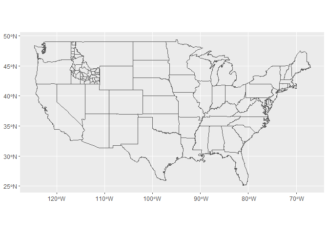
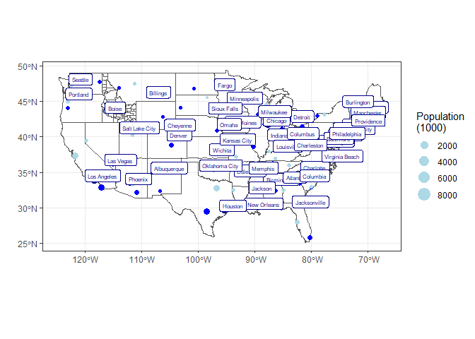

```r
library(tidyverse)
```

```
## -- Attaching packages --------------------------------------- tidyverse 1.3.1 --
```

```
## v ggplot2 3.3.5     v purrr   0.3.4
## v tibble  3.1.8     v dplyr   1.0.7
## v tidyr   1.1.4     v stringr 1.4.0
## v readr   2.1.1     v forcats 0.5.1
```

```
## Warning: package 'tibble' was built under R version 4.1.3
```

```
## -- Conflicts ------------------------------------------ tidyverse_conflicts() --
## x dplyr::filter() masks stats::filter()
## x dplyr::lag()    masks stats::lag()
```

```r
library(ggplot2)
library(maps)
```

```
## Warning: package 'maps' was built under R version 4.1.3
```

```
## 
## Attaching package: 'maps'
```

```
## The following object is masked from 'package:purrr':
## 
##     map
```

```r
library(ggrepel)
```

```
## Warning: package 'ggrepel' was built under R version 4.1.3
```

```r
library(sf)
```

```
## Warning: package 'sf' was built under R version 4.1.3
```

```
## Linking to GEOS 3.10.2, GDAL 3.4.1, PROJ 7.2.1; sf_use_s2() is TRUE
```

```r
library(USAboundaries)
```

```
## Warning: package 'USAboundaries' was built under R version 4.1.3
```

```r
library(USAboundariesData)
```


```r
states <- sf::st_as_sf(map("state", plot = FALSE, fill = TRUE))

Idaho_counties <- us_counties(states = "ID")

UScities <- us_cities()
```

```
## City populations for contemporary data come from the 2010 census.
```

```r
ggplot() +
  geom_sf(data = states, fill = NA) +
  geom_sf(data = Idaho_counties, fill = NA)
```

<!-- -->
## getting biggest cities

```r
largest_cities <- UScities %>%
  filter(state_name != "Alaska", state_name != "Hawaii") %>%
  group_by(state_name) %>%
  arrange(desc(population)) %>%
  slice(1:3)

head(largest_cities)
```

```
## Simple feature collection with 6 features and 12 fields
## Geometry type: POINT
## Dimension:     XY
## Bounding box:  xmin: -112.088 ymin: 30.66843 xmax: -86.26859 ymax: 33.57216
## Geodetic CRS:  WGS 84
## # A tibble: 6 x 13
## # Groups:   state_name [2]
##   city    state~1 state~2 county count~3 stplf~4 name_~5 city_~6 popul~7 place~8
##   <chr>   <chr>   <chr>   <chr>  <chr>   <chr>   <chr>   <chr>   <chr>   <chr>  
## 1 Birmin~ Alabama AL      JEFFE~ Jeffer~ 0107000 Birmin~ US Cen~ US Cen~ Incorp~
## 2 Montgo~ Alabama AL      MONTG~ Montgo~ 0151000 Montgo~ US Cen~ US Cen~ Incorp~
## 3 Mobile  Alabama AL      MOBILE Mobile  0150000 Mobile~ US Cen~ US Cen~ Incorp~
## 4 Phoenix Arizona AZ      MARIC~ Marico~ 0455000 Phoeni~ US Cen~ US Cen~ Incorp~
## 5 Tucson  Arizona AZ      PIMA   Pima    0477000 Tucson~ US Cen~ US Cen~ Incorp~
## 6 Mesa    Arizona AZ      MARIC~ Marico~ 0446000 Mesa c~ US Cen~ US Cen~ Incorp~
## # ... with 3 more variables: year <int>, population <int>,
## #   geometry <POINT [°]>, and abbreviated variable names 1: state_name,
## #   2: state_abbr, 3: county_name, 4: stplfips_2010, 5: name_2010,
## #   6: city_source, 7: population_source, 8: place_type
```
## biggest city in each state

```r
largest <- largest_cities %>%
   slice(1:1)

largest
```

```
## Simple feature collection with 49 features and 12 fields
## Geometry type: POINT
## Dimension:     XY
## Bounding box:  xmin: -122.65 ymin: 29.78047 xmax: -70.25536 ymax: 47.6205
## Geodetic CRS:  WGS 84
## # A tibble: 49 x 13
## # Groups:   state_name [49]
##    city   state~1 state~2 county count~3 stplf~4 name_~5 city_~6 popul~7 place~8
##    <chr>  <chr>   <chr>   <chr>  <chr>   <chr>   <chr>   <chr>   <chr>   <chr>  
##  1 Birmi~ Alabama AL      JEFFE~ Jeffer~ 0107000 Birmin~ US Cen~ US Cen~ Incorp~
##  2 Phoen~ Arizona AZ      MARIC~ Marico~ 0455000 Phoeni~ US Cen~ US Cen~ Incorp~
##  3 Littl~ Arkans~ AR      PULAS~ Pulaski 0541000 Little~ US Cen~ US Cen~ Incorp~
##  4 Los A~ Califo~ CA      LOS A~ Los An~ 0644000 Los An~ US Cen~ US Cen~ Incorp~
##  5 Denver Colora~ CO      ARAPA~ Arapah~ 0820000 Denver~ US Cen~ US Cen~ Incorp~
##  6 Bridg~ Connec~ CT      FAIRF~ Fairfi~ 0908000 Bridge~ US Cen~ US Cen~ Incorp~
##  7 Wilmi~ Delawa~ DE      NEW C~ New Ca~ 1077580 Wilmin~ US Cen~ US Cen~ Incorp~
##  8 Washi~ Distri~ DC      DIST ~ Dist C~ 1150000 Washin~ US Cen~ US Cen~ Incorp~
##  9 Jacks~ Florida FL      DUVAL  Duval   1235000 Jackso~ US Cen~ US Cen~ Incorp~
## 10 Atlan~ Georgia GA      multi~ Multip~ 1304000 Atlant~ US Cen~ US Cen~ Incorp~
## # ... with 39 more rows, 3 more variables: year <int>, population <int>,
## #   geometry <POINT [°]>, and abbreviated variable names 1: state_name,
## #   2: state_abbr, 3: county_name, 4: stplfips_2010, 5: name_2010,
## #   6: city_source, 7: population_source, 8: place_type
```
## middle city in each state

```r
middle <- largest_cities %>%
  slice(2:2)
```

## smaller city in each state

```r
smaller <- largest_cities %>%
  slice(3:3)
```


```r
ggplot() +
  geom_sf(data = states, fill = NA) +
  geom_sf(data = Idaho_counties, fill = NA) +
  geom_sf(data = largest, aes(size = population/1000), color = "darkblue") +
  geom_sf(data = middle, aes(size = population/1000), color = "blue") +
  geom_sf(data = smaller, aes(size = population/1000), color = "lightblue") +
  geom_sf_label(data = largest, aes(label = city), color = 'darkblue', size = 2, nudge_x = 1.5, nudge_y = .5) +
  scale_size_continuous("Population\n(1000)") +
  labs(x = " ",
       y = " ") +
  theme_bw()
```

```
## Warning in st_point_on_surface.sfc(sf::st_zm(x)): st_point_on_surface may not
## give correct results for longitude/latitude data
```

<!-- -->

