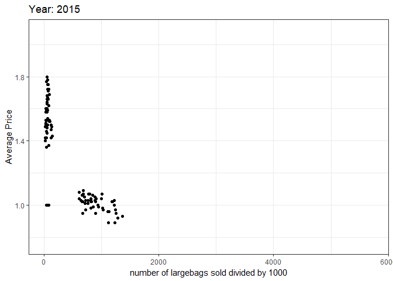
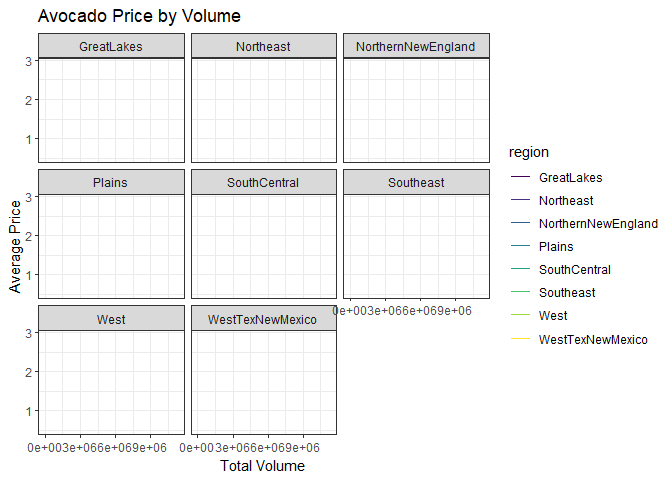
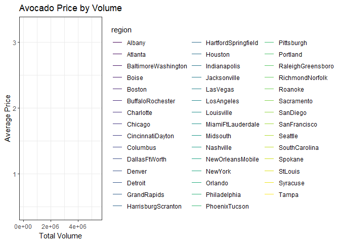
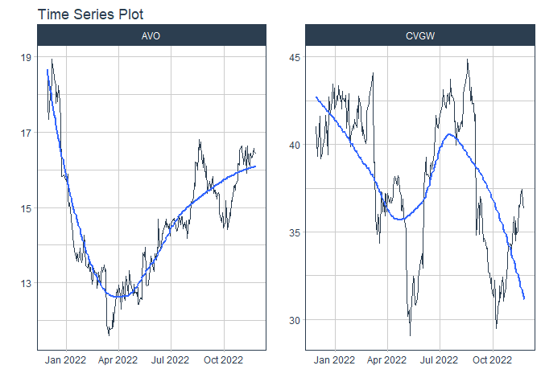

```r
library(tidyverse)
```

```
## -- Attaching packages --------------------------------------- tidyverse 1.3.1 --
```

```
## v ggplot2 3.3.5     v purrr   0.3.4
## v tibble  3.1.8     v dplyr   1.0.7
## v tidyr   1.1.4     v stringr 1.4.0
## v readr   2.1.1     v forcats 0.5.1
```

```
## Warning: package 'tibble' was built under R version 4.1.3
```

```
## -- Conflicts ------------------------------------------ tidyverse_conflicts() --
## x dplyr::filter() masks stats::filter()
## x dplyr::lag()    masks stats::lag()
```

```r
library(downloader)
```

```
## Warning: package 'downloader' was built under R version 4.1.3
```

```r
library(gganimate)
```

```
## Warning: package 'gganimate' was built under R version 4.1.3
```

```r
library(ggplot2)
```
## reading in data

```r
avocado <- read_csv("avocado.csv", col_names = c("count", "date", "avgprice", "totalvol", "4046", "4225", "4770", "totalbags", "smallbags", "largebags", "xlargebags", "type", "year", "region"), skip = 1)
```

```
## Rows: 18249 Columns: 14
## -- Column specification --------------------------------------------------------
## Delimiter: ","
## chr   (2): type, region
## dbl  (11): count, avgprice, totalvol, 4046, 4225, 4770, totalbags, smallbags...
## date  (1): date
## 
## i Use `spec()` to retrieve the full column specification for this data.
## i Specify the column types or set `show_col_types = FALSE` to quiet this message.
```

## seperating data into the specific cities given

```r
avocado_cities <- avocado %>%
  filter(! region %in% c("California", "GreatLakes", "MidSouth", "Northeast", "NorthernNewEngland", "Plains", "SouthCentral", "Southeast", "TotalUS", "West", "WestTexNewMexico"))
head(avocado_cities)
```

```
## # A tibble: 6 x 14
##   count date       avgprice total~1 `4046` `4225` `4770` total~2 small~3 large~4
##   <dbl> <date>        <dbl>   <dbl>  <dbl>  <dbl>  <dbl>   <dbl>   <dbl>   <dbl>
## 1     0 2015-12-27     1.33  64237.  1037. 5.45e4   48.2   8697.   8604.    93.2
## 2     1 2015-12-20     1.35  54877.   674. 4.46e4   58.3   9506.   9408.    97.5
## 3     2 2015-12-13     0.93 118220.   795. 1.09e5  130.    8145.   8042.   103. 
## 4     3 2015-12-06     1.08  78992.  1132  7.20e4   72.6   5811.   5677.   134. 
## 5     4 2015-11-29     1.28  51040.   941. 4.38e4   75.8   6184.   5986.   198. 
## 6     5 2015-11-22     1.26  55980.  1184. 4.81e4   43.6   6684.   6556.   127. 
## # ... with 4 more variables: xlargebags <dbl>, type <chr>, year <dbl>,
## #   region <chr>, and abbreviated variable names 1: totalvol, 2: totalbags,
## #   3: smallbags, 4: largebags
```

## seperating it into CA

```r
avocado_state <- avocado %>%
  filter(region == "California")
```

## seperaring into regions

```r
avocado_regions <- avocado %>%
  filter(region %in% c("GreatLakes", "MidSouth", "Northeast","NorthernNewEngland", "Plains", "SouthCentral", "Southeast","West", "WestTexNewMexico"))
head(avocado_regions)
```

```
## # A tibble: 6 x 14
##   count date       avgprice total~1 `4046` `4225` `4770` total~2 small~3 large~4
##   <dbl> <date>        <dbl>   <dbl>  <dbl>  <dbl>  <dbl>   <dbl>   <dbl>   <dbl>
## 1     0 2015-12-27     1.01  2.58e6 3.37e5 1.41e6 2.55e5 577490. 400004.  98401.
## 2     1 2015-12-20     1.01  2.50e6 3.84e5 1.34e6 2.42e5 542059. 358219. 122999.
## 3     2 2015-12-13     1.03  2.61e6 4.63e5 1.34e6 2.29e5 574072. 409910. 148005.
## 4     3 2015-12-06     1     2.98e6 4.02e5 1.68e6 3.98e5 500759. 325850  124306.
## 5     4 2015-11-29     1.07  2.20e6 3.19e5 1.20e6 2.49e5 431503. 328369.  83149.
## 6     5 2015-11-22     1.03  2.60e6 3.48e5 1.47e6 2.81e5 501609. 391455.  89472.
## # ... with 4 more variables: xlargebags <dbl>, type <chr>, year <dbl>,
## #   region <chr>, and abbreviated variable names 1: totalvol, 2: totalbags,
## #   3: smallbags, 4: largebags
```

## total us 

```r
avocado_totalUS <- avocado %>%
  filter(region == "TotalUS")
```

## creating visualizations

```r
avocadoplot <- ggplot(avocado_totalUS) +
  geom_point(aes(x = largebags/1000, y = avgprice)) +
  theme_bw() +
  # gganimate specific bits:
  labs(title = 'Year: {frame_time}', x = 'number of largebags sold divided by 1000', y = 'Average Price') +
  transition_time(year) +
  ease_aes('sine-in-out')

avocadoplot
```

<!-- -->

```r
avocadoplot <- ggplot(avocado_totalUS) +
  geom_point(aes(x = smallbags/1000, y = avgprice)) +
  theme_bw() +
  # gganimate specific bits:
  labs(title = 'Year: {frame_time}', x = 'number of smallbags sold divided by 1000', y = 'Average Price') +
  transition_time(year) +
  ease_aes('sine-in-out')
```


```r
region_plot <- ggplot(avocado_regions, aes(x = totalvol, y = avgprice, color = region)) +
  geom_line() +
  scale_color_viridis_d() +
  facet_wrap(~region) +
  labs(x = "Total Volume", y = "Average Price", title = "Avocado Price by Volume") +
  theme(legend.position = "top") +
  theme_bw()
region_plot + transition_reveal(date)
```

```
## geom_path: Each group consists of only one observation. Do you need to adjust
## the group aesthetic?
## geom_path: Each group consists of only one observation. Do you need to adjust
## the group aesthetic?
## geom_path: Each group consists of only one observation. Do you need to adjust
## the group aesthetic?
## geom_path: Each group consists of only one observation. Do you need to adjust
## the group aesthetic?
## geom_path: Each group consists of only one observation. Do you need to adjust
## the group aesthetic?
## geom_path: Each group consists of only one observation. Do you need to adjust
## the group aesthetic?
## geom_path: Each group consists of only one observation. Do you need to adjust
## the group aesthetic?
## geom_path: Each group consists of only one observation. Do you need to adjust
## the group aesthetic?
## geom_path: Each group consists of only one observation. Do you need to adjust
## the group aesthetic?
## geom_path: Each group consists of only one observation. Do you need to adjust
## the group aesthetic?
## geom_path: Each group consists of only one observation. Do you need to adjust
## the group aesthetic?
## geom_path: Each group consists of only one observation. Do you need to adjust
## the group aesthetic?
## geom_path: Each group consists of only one observation. Do you need to adjust
## the group aesthetic?
## geom_path: Each group consists of only one observation. Do you need to adjust
## the group aesthetic?
## geom_path: Each group consists of only one observation. Do you need to adjust
## the group aesthetic?
## geom_path: Each group consists of only one observation. Do you need to adjust
## the group aesthetic?
```

<!-- -->


```r
cities_plot <- ggplot(avocado_cities, aes(x = totalvol, y = avgprice, color = region)) +
  geom_line() +
  scale_color_viridis_d() +
  labs(x = "Total Volume", y = "Average Price", title = "Avocado Price by Volume") +
  theme(legend.position = "top") +
  theme_bw()
cities_plot + transition_reveal(date)
```

```
## geom_path: Each group consists of only one observation. Do you need to adjust
## the group aesthetic?
## geom_path: Each group consists of only one observation. Do you need to adjust
## the group aesthetic?
```

<!-- -->

##analyzing stock

```r
library(tidyquant)
```

```
## Warning: package 'tidyquant' was built under R version 4.1.3
```

```
## Loading required package: lubridate
```

```
## 
## Attaching package: 'lubridate'
```

```
## The following objects are masked from 'package:base':
## 
##     date, intersect, setdiff, union
```

```
## Loading required package: PerformanceAnalytics
```

```
## Warning: package 'PerformanceAnalytics' was built under R version 4.1.3
```

```
## Loading required package: xts
```

```
## Warning: package 'xts' was built under R version 4.1.3
```

```
## Loading required package: zoo
```

```
## Warning: package 'zoo' was built under R version 4.1.3
```

```
## 
## Attaching package: 'zoo'
```

```
## The following objects are masked from 'package:base':
## 
##     as.Date, as.Date.numeric
```

```
## 
## Attaching package: 'xts'
```

```
## The following objects are masked from 'package:dplyr':
## 
##     first, last
```

```
## 
## Attaching package: 'PerformanceAnalytics'
```

```
## The following object is masked from 'package:graphics':
## 
##     legend
```

```
## Loading required package: quantmod
```

```
## Warning: package 'quantmod' was built under R version 4.1.3
```

```
## Loading required package: TTR
```

```
## Warning: package 'TTR' was built under R version 4.1.3
```

```
## Registered S3 method overwritten by 'quantmod':
##   method            from
##   as.zoo.data.frame zoo
```

```r
library(dygraphs)
```

```
## Warning: package 'dygraphs' was built under R version 4.1.3
```

```r
library(tidyverse)
library(timetk)
```

```
## Warning: package 'timetk' was built under R version 4.1.3
```


```r
start <- today() - years(1)
end <- today()
CVGW_prices <- tq_get("CVGW", get = "stock.prices", from = start, to = end)
CVGW_prices
```

```
## # A tibble: 251 x 8
##    symbol date        open  high   low close volume adjusted
##    <chr>  <date>     <dbl> <dbl> <dbl> <dbl>  <dbl>    <dbl>
##  1 CVGW   2021-11-29  42.7  42.7  40.8  41.3 124300     41.0
##  2 CVGW   2021-11-30  41.6  41.6  40.4  40.5 232900     40.2
##  3 CVGW   2021-12-01  41.1  41.6  39.6  39.7 166300     39.3
##  4 CVGW   2021-12-02  39.9  41.0  39.6  40.7 104300     40.3
##  5 CVGW   2021-12-03  41.3  41.4  40.2  40.3 206100     40.0
##  6 CVGW   2021-12-06  40.9  42.8  40.4  41.9 130800     41.6
##  7 CVGW   2021-12-07  42.2  42.2  39.4  39.5 152600     39.2
##  8 CVGW   2021-12-08  39.9  40.3  39    39.7 131400     39.3
##  9 CVGW   2021-12-09  39.6  40.3  39.6  39.8 104500     39.5
## 10 CVGW   2021-12-10  40.0  40.9  39.7  40.1 118600     39.8
## # ... with 241 more rows
```

```r
CVGW_monthly <- CVGW_prices %>%
  tq_transmute(adjusted, mutate_fun = monthlyReturn)

avo_prices <- tq_get("AVO", get = "stock.prices", from = start, to = end)
avo_prices
```

```
## # A tibble: 251 x 8
##    symbol date        open  high   low close volume adjusted
##    <chr>  <date>     <dbl> <dbl> <dbl> <dbl>  <dbl>    <dbl>
##  1 AVO    2021-11-29  19.1  19.1  18.4  18.4  79200     18.4
##  2 AVO    2021-11-30  18.3  18.3  17.4  17.7 227300     17.7
##  3 AVO    2021-12-01  18.2  19.1  17.3  17.4 120900     17.4
##  4 AVO    2021-12-02  17.5  18.4  17.4  17.7  69400     17.7
##  5 AVO    2021-12-03  17.7  18.1  17.5  18.0 102500     18.0
##  6 AVO    2021-12-06  18.3  18.6  18    18.3 119200     18.3
##  7 AVO    2021-12-07  18.5  19.2  17.8  18.9  73200     18.9
##  8 AVO    2021-12-08  19.0  19.0  18.1  18.7  51600     18.7
##  9 AVO    2021-12-09  18.6  18.8  18.5  18.7  51700     18.7
## 10 AVO    2021-12-10  18.5  19    18.3  18.4  86500     18.4
## # ... with 241 more rows
```

```r
avo_monthly <- avo_prices %>%
  tq_transmute(adjusted, mutate_fun = monthlyReturn)
avo_monthly
```

```
## # A tibble: 13 x 2
##    date       monthly.returns
##    <date>               <dbl>
##  1 2021-11-30        -0.0391 
##  2 2021-12-31        -0.113  
##  3 2022-01-31        -0.0911 
##  4 2022-02-28        -0.0904 
##  5 2022-03-31        -0.0254 
##  6 2022-04-29         0.00553
##  7 2022-05-31         0.0511 
##  8 2022-06-30         0.0658 
##  9 2022-07-29        -0.00491
## 10 2022-08-31         0.135  
## 11 2022-09-30        -0.102  
## 12 2022-10-31         0.151  
## 13 2022-11-25        -0.0126
```

```r
combined <- tq_get(c("CVGW", "AVO"), get = "stock.prices", from = start, to = end)


combinedplot <- combined %>%
  group_by(symbol) %>%
  plot_time_series(date, adjusted, 
                   .facet_ncol = 3,
                   .interactive = FALSE)
combinedplot
```

<!-- -->
It does not look like a very good investment going forward. However, it does look like AVO is rebounding but not 
on a trend line with a significant amount of growth potential in the near future. CVGW has higher monthly returns,
but it has been falling off dramatically in recent months.

