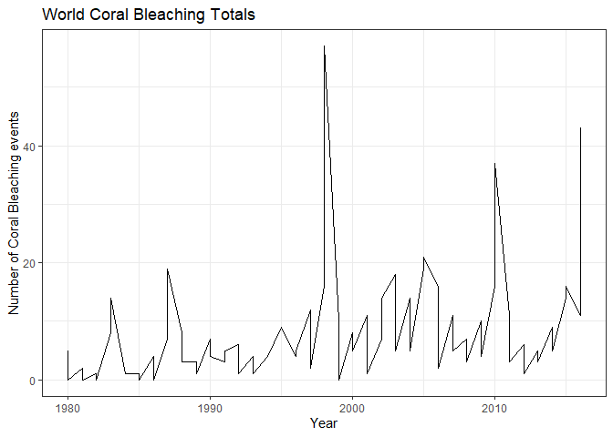
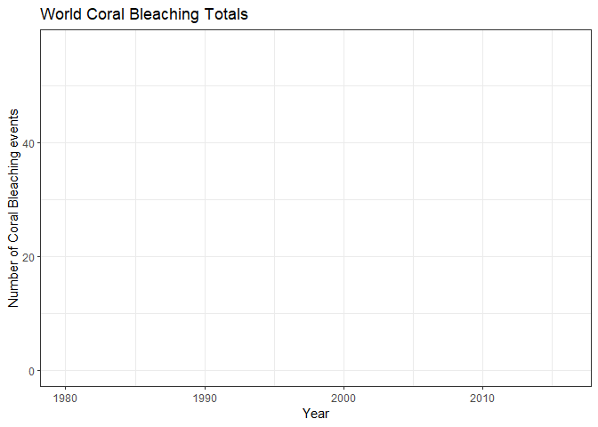

# Case Study 2 animated


```r
library(tidyverse)
```

```
## -- Attaching packages --------------------------------------- tidyverse 1.3.1 --
```

```
## v ggplot2 3.3.5     v purrr   0.3.4
## v tibble  3.1.8     v dplyr   1.0.7
## v tidyr   1.1.4     v stringr 1.4.0
## v readr   2.1.1     v forcats 0.5.1
```

```
## Warning: package 'tibble' was built under R version 4.1.3
```

```
## -- Conflicts ------------------------------------------ tidyverse_conflicts() --
## x dplyr::filter() masks stats::filter()
## x dplyr::lag()    masks stats::lag()
```

```r
library(gganimate)
```

```
## Warning: package 'gganimate' was built under R version 4.1.3
```

```r
library(gifski)
```

```
## Warning: package 'gifski' was built under R version 4.1.3
```

```r
urlfile="https://github.com/WJC-Data-Science/DTS350/raw/master/coral.csv"
mydata <- read_csv(url(urlfile))
```

```
## Rows: 370 Columns: 5
```

```
## -- Column specification --------------------------------------------------------
## Delimiter: ","
## chr (3): Entity, Code, Event
## dbl (2): Year, Value
## 
## i Use `spec()` to retrieve the full column specification for this data.
## i Specify the column types or set `show_col_types = FALSE` to quiet this message.
```

```r
head(mydata)
```

```
## # A tibble: 6 x 5
##   Entity      Code   Year Event                                      Value
##   <chr>       <chr> <dbl> <chr>                                      <dbl>
## 1 Australasia <NA>   1980 Moderate bleaching events (1-30% bleached)     3
## 2 Australasia <NA>   1980 Severe bleaching events (>30% bleached)        0
## 3 Australasia <NA>   1981 Moderate bleaching events (1-30% bleached)     1
## 4 Australasia <NA>   1981 Severe bleaching events (>30% bleached)        0
## 5 Australasia <NA>   1982 Moderate bleaching events (1-30% bleached)     0
## 6 Australasia <NA>   1982 Severe bleaching events (>30% bleached)        0
```


```r
animated <- mydata %>%
  filter(Entity == "World") %>%
  ggplot(mydata, mapping = aes(x = Year, y = Value)) +
  geom_line() +
  scale_color_viridis_d() +
  labs(x = "Year", y = "Number of Coral Bleaching events", title = "World Coral Bleaching Totals") +
  theme(legend.position = "top") +
  theme_bw()
animated
```

<!-- -->

```r
animated + transition_reveal(Year)
```

```
## geom_path: Each group consists of only one observation. Do you need to adjust
## the group aesthetic?
## geom_path: Each group consists of only one observation. Do you need to adjust
## the group aesthetic?
```

<!-- -->

```r
anim_save("animated.gif")
```

