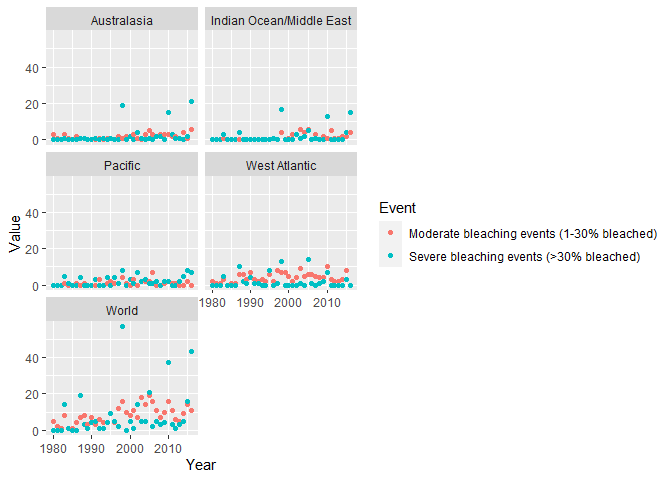
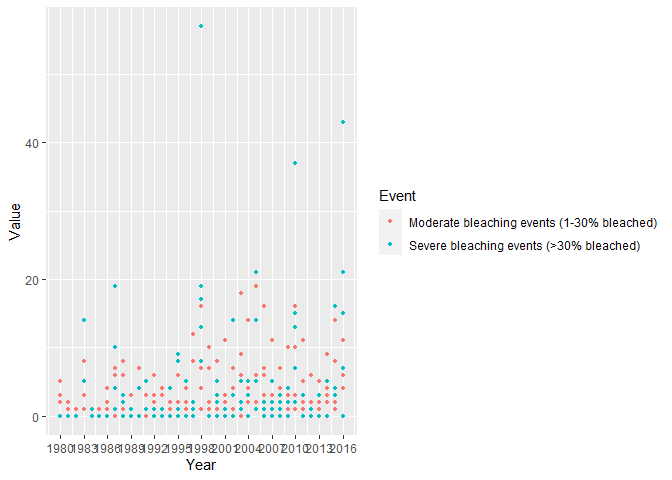
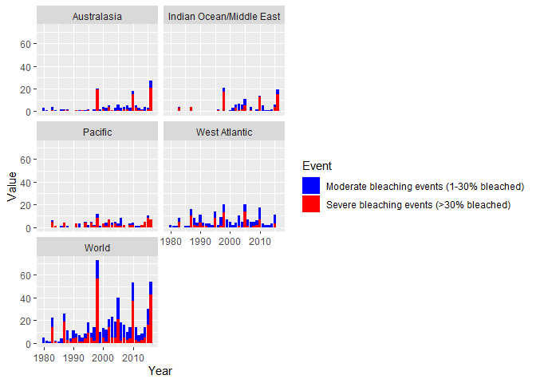

```r
head(mydata)
```

```
## # A tibble: 6 x 5
##   Entity      Code   Year Event                                      Value
##   <chr>       <chr> <dbl> <chr>                                      <dbl>
## 1 Australasia <NA>   1980 Moderate bleaching events (1-30% bleached)     3
## 2 Australasia <NA>   1980 Severe bleaching events (>30% bleached)        0
## 3 Australasia <NA>   1981 Moderate bleaching events (1-30% bleached)     1
## 4 Australasia <NA>   1981 Severe bleaching events (>30% bleached)        0
## 5 Australasia <NA>   1982 Moderate bleaching events (1-30% bleached)     0
## 6 Australasia <NA>   1982 Severe bleaching events (>30% bleached)        0
```

```r
tail(mydata)
```

```
## # A tibble: 6 x 5
##   Entity Code      Year Event                                      Value
##   <chr>  <chr>    <dbl> <chr>                                      <dbl>
## 1 World  OWID_WRL  2014 Moderate bleaching events (1-30% bleached)     9
## 2 World  OWID_WRL  2014 Severe bleaching events (>30% bleached)        5
## 3 World  OWID_WRL  2015 Moderate bleaching events (1-30% bleached)    14
## 4 World  OWID_WRL  2015 Severe bleaching events (>30% bleached)       16
## 5 World  OWID_WRL  2016 Moderate bleaching events (1-30% bleached)    11
## 6 World  OWID_WRL  2016 Severe bleaching events (>30% bleached)       43
```

```r
str(mydata)
```

```
## spec_tbl_df [370 x 5] (S3: spec_tbl_df/tbl_df/tbl/data.frame)
##  $ Entity: chr [1:370] "Australasia" "Australasia" "Australasia" "Australasia" ...
##  $ Code  : chr [1:370] NA NA NA NA ...
##  $ Year  : num [1:370] 1980 1980 1981 1981 1982 ...
##  $ Event : chr [1:370] "Moderate bleaching events (1-30% bleached)" "Severe bleaching events (>30% bleached)" "Moderate bleaching events (1-30% bleached)" "Severe bleaching events (>30% bleached)" ...
##  $ Value : num [1:370] 3 0 1 0 0 0 3 1 1 0 ...
##  - attr(*, "spec")=
##   .. cols(
##   ..   Entity = col_character(),
##   ..   Code = col_character(),
##   ..   Year = col_double(),
##   ..   Event = col_character(),
##   ..   Value = col_double()
##   .. )
##  - attr(*, "problems")=<externalptr>
```

```r
ggplot(mydata, mapping = aes(x = Year, y = Value)) +
  geom_point(aes(col = Event))+
  facet_wrap(~Entity, ncol = 2)+
  scale_fill_manual(values = c("Blue", "Red"))
```

<!-- -->

```r
ggplot(mydata, aes(x = Year, y = Value, color = Event))+
  geom_point(size = 1)+
  scale_x_continuous(breaks = seq(1980, 2016, by = 3))
```

<!-- -->


```r
ggplot()+
  geom_col(mydata, mapping = aes(x = Year, y = Value, fill = Event))+
  facet_wrap(~Entity, ncol = 2)+
  scale_fill_manual(values = c("Blue", "Red"))
```

<!-- -->

The data overall does not show that it is becoming more frequent, but this is undoubtedly because once the coral
is bleached it would not be included in another bleaching event. The data does show perhaps that bleaching events became more frequent up until 1998 in most areas of the world. After severe bleaching events the number of events were reduced.


```r
ggplot(mydata, mapping = aes(x = Year, y = Value)) +
  geom_point(aes(col = Event))+
  facet_wrap(~Entity, ncol = 2)+
  scale_fill_manual(values = c("Blue", "Red"))
```

<!-- -->
The scatterplot demonstrates that the number of coral bleaching events fell into higher ranges as time went on,
peaking in 1998 in most areas of the world and again in 2016. However, the peaks seem to show a decline in bleaching events. The scatterplot also emphasizes that certain parts of the world experience a higher number of bleaching events.

