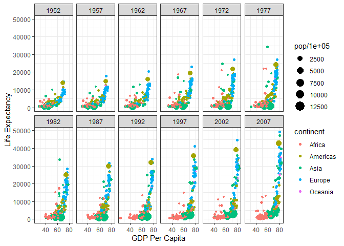
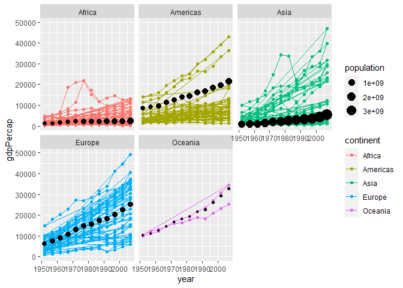

```r
library(tidyverse)
```

```
## -- Attaching packages --------------------------------------- tidyverse 1.3.1 --
```

```
## v ggplot2 3.3.5     v purrr   0.3.4
## v tibble  3.1.6     v dplyr   1.0.7
## v tidyr   1.1.4     v stringr 1.4.0
## v readr   2.1.1     v forcats 0.5.1
```

```
## -- Conflicts ------------------------------------------ tidyverse_conflicts() --
## x dplyr::filter() masks stats::filter()
## x dplyr::lag()    masks stats::lag()
```

```r
library(knitr)
library(downloader)
```

```
## Warning: package 'downloader' was built under R version 4.1.3
```

```r
library(gapminder)
```

```
## Warning: package 'gapminder' was built under R version 4.1.3
```

```r
?gapminder
```

```
## starting httpd help server ...
```

```
##  done
```


```r
without_kuwait <- filter(gapminder, country != "Kuwait")
```


```r
library(ggplot2)
ggplot(data = without_kuwait) +
  geom_point(mapping = aes(x = lifeExp, y = gdpPercap, size = pop/100000, color = continent)) +
  facet_wrap(~ year, nrow = 2) +
  scale_y_continuous(trans = "sqrt") +
  scale_y_continuous(name = "Life Expectancy") +
  scale_x_continuous(name = "GDP Per Capita") +
  theme_bw()
```

```
## Scale for 'y' is already present. Adding another scale for 'y', which will
## replace the existing scale.
```

<!-- -->


```r
head(without_kuwait)
```

```
## # A tibble: 6 x 6
##   country     continent  year lifeExp      pop gdpPercap
##   <fct>       <fct>     <int>   <dbl>    <int>     <dbl>
## 1 Afghanistan Asia       1952    28.8  8425333      779.
## 2 Afghanistan Asia       1957    30.3  9240934      821.
## 3 Afghanistan Asia       1962    32.0 10267083      853.
## 4 Afghanistan Asia       1967    34.0 11537966      836.
## 5 Afghanistan Asia       1972    36.1 13079460      740.
## 6 Afghanistan Asia       1977    38.4 14880372      786.
```

```r
means <- without_kuwait %>%
  group_by(continent, year) %>%
  summarize(wmean = weighted.mean(gdpPercap, pop, na.rm = TRUE), population = sum(pop, na.rm = TRUE))
```

```
## `summarise()` has grouped output by 'continent'. You can override using the `.groups` argument.
```

```r
means
```

```
## # A tibble: 60 x 4
## # Groups:   continent [5]
##    continent  year wmean population
##    <fct>     <int> <dbl>      <dbl>
##  1 Africa     1952 1311.  237640501
##  2 Africa     1957 1445.  264837738
##  3 Africa     1962 1541.  296516865
##  4 Africa     1967 1775.  335289489
##  5 Africa     1972 2063.  379879541
##  6 Africa     1977 2245.  433061021
##  7 Africa     1982 2295.  499348587
##  8 Africa     1987 2181.  574834110
##  9 Africa     1992 2072.  659081517
## 10 Africa     1997 2099.  743832984
## # ... with 50 more rows
```


```r
ggplot()+
  geom_point(without_kuwait, mapping = aes(x = year, y = gdpPercap, color = continent)) +
  geom_path(without_kuwait, mapping = aes(x = year, y = gdpPercap, color = continent)) +
  geom_point(means, mapping = aes(x = year, y = wmean, size = population))+
  facet_wrap(~ continent, nrow = 2) +
  scale_fill_discrete(name = 'population/100000')
```

<!-- -->

