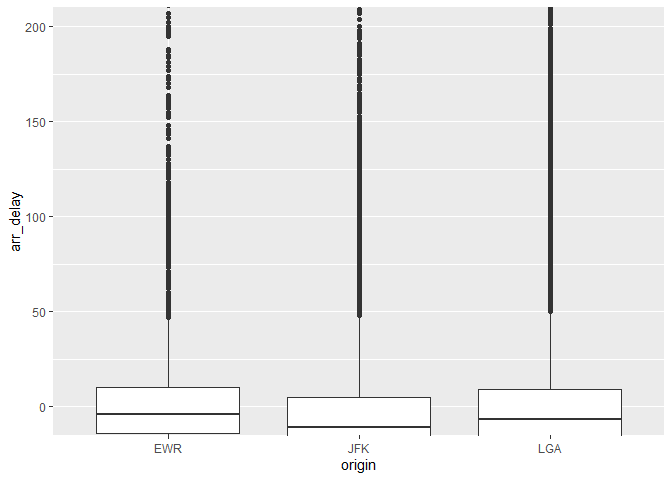
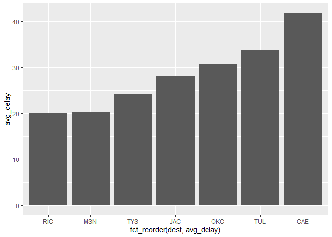

```r
library(tidyverse)
```

```
## -- Attaching packages --------------------------------------- tidyverse 1.3.1 --
```

```
## v ggplot2 3.3.5     v purrr   0.3.4
## v tibble  3.1.6     v dplyr   1.0.7
## v tidyr   1.1.4     v stringr 1.4.0
## v readr   2.1.1     v forcats 0.5.1
```

```
## -- Conflicts ------------------------------------------ tidyverse_conflicts() --
## x dplyr::filter() masks stats::filter()
## x dplyr::lag()    masks stats::lag()
```

```r
library(nycflights13)
```

```
## Warning: package 'nycflights13' was built under R version 4.1.3
```


```r
?flights
```

```
## starting httpd help server ... done
```

```r
DeltaAir <- filter(flights, carrier == "DL")
head(DeltaAir)
```

```
## # A tibble: 6 x 19
##    year month   day dep_time sched_dep_time dep_delay arr_time sched_arr_time
##   <int> <int> <int>    <int>          <int>     <dbl>    <int>          <int>
## 1  2013     1     1      554            600        -6      812            837
## 2  2013     1     1      602            610        -8      812            820
## 3  2013     1     1      606            610        -4      837            845
## 4  2013     1     1      615            615         0      833            842
## 5  2013     1     1      653            700        -7      936           1009
## 6  2013     1     1      655            655         0     1021           1030
## # ... with 11 more variables: arr_delay <dbl>, carrier <chr>, flight <int>,
## #   tailnum <chr>, origin <chr>, dest <chr>, air_time <dbl>, distance <dbl>,
## #   hour <dbl>, minute <dbl>, time_hour <dttm>
```

```r
locations <- DeltaAir %>%
  group_by(origin) %>%
  summarize(avg_arr_delay = mean(arr_delay, na.rm = TRUE))
locations
```

```
## # A tibble: 3 x 2
##   origin avg_arr_delay
##   <chr>          <dbl>
## 1 EWR             8.78
## 2 JFK            -2.38
## 3 LGA             3.93
```


```r
by_arr_delay <- group_by(DeltaAir, origin)
DeltaCount <- summarize(by_arr_delay,
            count = n(),
            )
DeltaCount
```

```
## # A tibble: 3 x 2
##   origin count
##   <chr>  <int>
## 1 EWR     4342
## 2 JFK    20701
## 3 LGA    23067
```
JFK will minimize your chances of arriving late. On average flights arrive about 2 minutes ahead of 
their scheduled time coming from JFK. flights leaving LGA will on average arrive about 4 minutes late to their destination. EWR comes in last, on average, with an arrival delay of 8 minutes. All flights in this data frame are Delta. By further analyzing the data, it can be seen that the number of flights originating from JFK and LGA differs by about 3 thousand flights. Thus one can perhaps claim that JFK will be the better airport for arriving at your destination on time. However, it is difficult to conclude when observing the number of flights that EWR will on average have more late arrivals because the number of flights is much fewer. So, it a particular route coming out of EWR has a lot of flights and is always very late it could skew the data and make it seem that EWR would be less likely to get you there on time. The graph shows that without looking at the outliers, there is not much variation between the three origin airports in relation to arrival delay. But, it does still show that JFK will be the better airport for arriving at your destination on time.


```r
plot1 <- ggplot() +
  geom_boxplot(data = DeltaAir, mapping = aes(x = origin, y = arr_delay, color = arr_delay)) +
  coord_cartesian(ylim = c(-5,200))
plot1
```

```
## Warning: Removed 452 rows containing non-finite values (stat_boxplot).
```

<!-- -->


```r
dest_avgs <- flights %>%
  group_by(dest) %>%
  summarize(avg_delay = mean(arr_delay, na.rm = TRUE))

dest_avgs
```

```
## # A tibble: 105 x 2
##    dest  avg_delay
##    <chr>     <dbl>
##  1 ABQ        4.38
##  2 ACK        4.85
##  3 ALB       14.4 
##  4 ANC       -2.5 
##  5 ATL       11.3 
##  6 AUS        6.02
##  7 AVL        8.00
##  8 BDL        7.05
##  9 BGR        8.03
## 10 BHM       16.9 
## # ... with 95 more rows
```

```r
worst <- dest_avgs %>%
  filter(avg_delay >= 20)

ggplot()+
  geom_col(data = worst, aes(x = fct_reorder(dest, avg_delay), y = avg_delay))
```

<!-- -->
This graph shows that the worst destination airport for arriving on time, on average, is CAE. With an average arrival delay of over 40 minutes. The graph is filtered to show only destinations with 20 minutes or more delay because of the large amount of destinations. 
