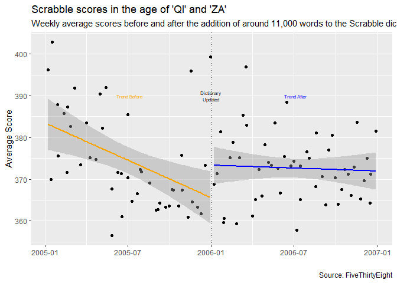

```r
library(tidyverse)
library(lubridate)
?iris
```


```r
mutate(iris, "label")
```

```
##     Sepal.Length Sepal.Width Petal.Length Petal.Width    Species "label"
## 1            5.1         3.5          1.4         0.2     setosa   label
## 2            4.9         3.0          1.4         0.2     setosa   label
## 3            4.7         3.2          1.3         0.2     setosa   label
## 4            4.6         3.1          1.5         0.2     setosa   label
## 5            5.0         3.6          1.4         0.2     setosa   label
## 6            5.4         3.9          1.7         0.4     setosa   label
## 7            4.6         3.4          1.4         0.3     setosa   label
## 8            5.0         3.4          1.5         0.2     setosa   label
## 9            4.4         2.9          1.4         0.2     setosa   label
## 10           4.9         3.1          1.5         0.1     setosa   label
## 11           5.4         3.7          1.5         0.2     setosa   label
## 12           4.8         3.4          1.6         0.2     setosa   label
## 13           4.8         3.0          1.4         0.1     setosa   label
## 14           4.3         3.0          1.1         0.1     setosa   label
## 15           5.8         4.0          1.2         0.2     setosa   label
## 16           5.7         4.4          1.5         0.4     setosa   label
## 17           5.4         3.9          1.3         0.4     setosa   label
## 18           5.1         3.5          1.4         0.3     setosa   label
## 19           5.7         3.8          1.7         0.3     setosa   label
## 20           5.1         3.8          1.5         0.3     setosa   label
## 21           5.4         3.4          1.7         0.2     setosa   label
## 22           5.1         3.7          1.5         0.4     setosa   label
## 23           4.6         3.6          1.0         0.2     setosa   label
## 24           5.1         3.3          1.7         0.5     setosa   label
## 25           4.8         3.4          1.9         0.2     setosa   label
## 26           5.0         3.0          1.6         0.2     setosa   label
## 27           5.0         3.4          1.6         0.4     setosa   label
## 28           5.2         3.5          1.5         0.2     setosa   label
## 29           5.2         3.4          1.4         0.2     setosa   label
## 30           4.7         3.2          1.6         0.2     setosa   label
## 31           4.8         3.1          1.6         0.2     setosa   label
## 32           5.4         3.4          1.5         0.4     setosa   label
## 33           5.2         4.1          1.5         0.1     setosa   label
## 34           5.5         4.2          1.4         0.2     setosa   label
## 35           4.9         3.1          1.5         0.2     setosa   label
## 36           5.0         3.2          1.2         0.2     setosa   label
## 37           5.5         3.5          1.3         0.2     setosa   label
## 38           4.9         3.6          1.4         0.1     setosa   label
## 39           4.4         3.0          1.3         0.2     setosa   label
## 40           5.1         3.4          1.5         0.2     setosa   label
## 41           5.0         3.5          1.3         0.3     setosa   label
## 42           4.5         2.3          1.3         0.3     setosa   label
## 43           4.4         3.2          1.3         0.2     setosa   label
## 44           5.0         3.5          1.6         0.6     setosa   label
## 45           5.1         3.8          1.9         0.4     setosa   label
## 46           4.8         3.0          1.4         0.3     setosa   label
## 47           5.1         3.8          1.6         0.2     setosa   label
## 48           4.6         3.2          1.4         0.2     setosa   label
## 49           5.3         3.7          1.5         0.2     setosa   label
## 50           5.0         3.3          1.4         0.2     setosa   label
## 51           7.0         3.2          4.7         1.4 versicolor   label
## 52           6.4         3.2          4.5         1.5 versicolor   label
## 53           6.9         3.1          4.9         1.5 versicolor   label
## 54           5.5         2.3          4.0         1.3 versicolor   label
## 55           6.5         2.8          4.6         1.5 versicolor   label
## 56           5.7         2.8          4.5         1.3 versicolor   label
## 57           6.3         3.3          4.7         1.6 versicolor   label
## 58           4.9         2.4          3.3         1.0 versicolor   label
## 59           6.6         2.9          4.6         1.3 versicolor   label
## 60           5.2         2.7          3.9         1.4 versicolor   label
## 61           5.0         2.0          3.5         1.0 versicolor   label
## 62           5.9         3.0          4.2         1.5 versicolor   label
## 63           6.0         2.2          4.0         1.0 versicolor   label
## 64           6.1         2.9          4.7         1.4 versicolor   label
## 65           5.6         2.9          3.6         1.3 versicolor   label
## 66           6.7         3.1          4.4         1.4 versicolor   label
## 67           5.6         3.0          4.5         1.5 versicolor   label
## 68           5.8         2.7          4.1         1.0 versicolor   label
## 69           6.2         2.2          4.5         1.5 versicolor   label
## 70           5.6         2.5          3.9         1.1 versicolor   label
## 71           5.9         3.2          4.8         1.8 versicolor   label
## 72           6.1         2.8          4.0         1.3 versicolor   label
## 73           6.3         2.5          4.9         1.5 versicolor   label
## 74           6.1         2.8          4.7         1.2 versicolor   label
## 75           6.4         2.9          4.3         1.3 versicolor   label
## 76           6.6         3.0          4.4         1.4 versicolor   label
## 77           6.8         2.8          4.8         1.4 versicolor   label
## 78           6.7         3.0          5.0         1.7 versicolor   label
## 79           6.0         2.9          4.5         1.5 versicolor   label
## 80           5.7         2.6          3.5         1.0 versicolor   label
## 81           5.5         2.4          3.8         1.1 versicolor   label
## 82           5.5         2.4          3.7         1.0 versicolor   label
## 83           5.8         2.7          3.9         1.2 versicolor   label
## 84           6.0         2.7          5.1         1.6 versicolor   label
## 85           5.4         3.0          4.5         1.5 versicolor   label
## 86           6.0         3.4          4.5         1.6 versicolor   label
## 87           6.7         3.1          4.7         1.5 versicolor   label
## 88           6.3         2.3          4.4         1.3 versicolor   label
## 89           5.6         3.0          4.1         1.3 versicolor   label
## 90           5.5         2.5          4.0         1.3 versicolor   label
## 91           5.5         2.6          4.4         1.2 versicolor   label
## 92           6.1         3.0          4.6         1.4 versicolor   label
## 93           5.8         2.6          4.0         1.2 versicolor   label
## 94           5.0         2.3          3.3         1.0 versicolor   label
## 95           5.6         2.7          4.2         1.3 versicolor   label
## 96           5.7         3.0          4.2         1.2 versicolor   label
## 97           5.7         2.9          4.2         1.3 versicolor   label
## 98           6.2         2.9          4.3         1.3 versicolor   label
## 99           5.1         2.5          3.0         1.1 versicolor   label
## 100          5.7         2.8          4.1         1.3 versicolor   label
## 101          6.3         3.3          6.0         2.5  virginica   label
## 102          5.8         2.7          5.1         1.9  virginica   label
## 103          7.1         3.0          5.9         2.1  virginica   label
## 104          6.3         2.9          5.6         1.8  virginica   label
## 105          6.5         3.0          5.8         2.2  virginica   label
## 106          7.6         3.0          6.6         2.1  virginica   label
## 107          4.9         2.5          4.5         1.7  virginica   label
## 108          7.3         2.9          6.3         1.8  virginica   label
## 109          6.7         2.5          5.8         1.8  virginica   label
## 110          7.2         3.6          6.1         2.5  virginica   label
## 111          6.5         3.2          5.1         2.0  virginica   label
## 112          6.4         2.7          5.3         1.9  virginica   label
## 113          6.8         3.0          5.5         2.1  virginica   label
## 114          5.7         2.5          5.0         2.0  virginica   label
## 115          5.8         2.8          5.1         2.4  virginica   label
## 116          6.4         3.2          5.3         2.3  virginica   label
## 117          6.5         3.0          5.5         1.8  virginica   label
## 118          7.7         3.8          6.7         2.2  virginica   label
## 119          7.7         2.6          6.9         2.3  virginica   label
## 120          6.0         2.2          5.0         1.5  virginica   label
## 121          6.9         3.2          5.7         2.3  virginica   label
## 122          5.6         2.8          4.9         2.0  virginica   label
## 123          7.7         2.8          6.7         2.0  virginica   label
## 124          6.3         2.7          4.9         1.8  virginica   label
## 125          6.7         3.3          5.7         2.1  virginica   label
## 126          7.2         3.2          6.0         1.8  virginica   label
## 127          6.2         2.8          4.8         1.8  virginica   label
## 128          6.1         3.0          4.9         1.8  virginica   label
## 129          6.4         2.8          5.6         2.1  virginica   label
## 130          7.2         3.0          5.8         1.6  virginica   label
## 131          7.4         2.8          6.1         1.9  virginica   label
## 132          7.9         3.8          6.4         2.0  virginica   label
## 133          6.4         2.8          5.6         2.2  virginica   label
## 134          6.3         2.8          5.1         1.5  virginica   label
## 135          6.1         2.6          5.6         1.4  virginica   label
## 136          7.7         3.0          6.1         2.3  virginica   label
## 137          6.3         3.4          5.6         2.4  virginica   label
## 138          6.4         3.1          5.5         1.8  virginica   label
## 139          6.0         3.0          4.8         1.8  virginica   label
## 140          6.9         3.1          5.4         2.1  virginica   label
## 141          6.7         3.1          5.6         2.4  virginica   label
## 142          6.9         3.1          5.1         2.3  virginica   label
## 143          5.8         2.7          5.1         1.9  virginica   label
## 144          6.8         3.2          5.9         2.3  virginica   label
## 145          6.7         3.3          5.7         2.5  virginica   label
## 146          6.7         3.0          5.2         2.3  virginica   label
## 147          6.3         2.5          5.0         1.9  virginica   label
## 148          6.5         3.0          5.2         2.0  virginica   label
## 149          6.2         3.4          5.4         2.3  virginica   label
## 150          5.9         3.0          5.1         1.8  virginica   label
```

```r
largest_width <- iris %>%
  group_by(Species) %>%
  filter(row_number(desc(Petal.Width)) == 1) %>%
  mutate(label  = "Largest Petal Width")
largest_width
```

```
## # A tibble: 3 x 6
## # Groups:   Species [3]
##   Sepal.Length Sepal.Width Petal.Length Petal.Width Species    label            
##          <dbl>       <dbl>        <dbl>       <dbl> <fct>      <chr>            
## 1          5           3.5          1.6         0.6 setosa     Largest Petal Wi~
## 2          5.9         3.2          4.8         1.8 versicolor Largest Petal Wi~
## 3          6.3         3.3          6           2.5 virginica  Largest Petal Wi~
```

```r
largest_length <- iris %>%
  group_by(Species) %>%
  filter(row_number(desc(Petal.Length)) == 1) %>%
  mutate(label = "Largest Petal Length")

ggplot(iris, mapping = aes(x = Sepal.Width, 
                                  y = Sepal.Length)) +
  geom_point(aes(color = Species, shape = Species)) +
  geom_text(aes(color = Species, label = label), data = largest_width, nudge_y = .2) +
  geom_text(aes(color = Species, label = label), data = largest_length, nudge_y = -.2)+
  geom_point(size = 3, shape = 1, color = "black", data = largest_width)+
  geom_point(size = 3, shape = 1, color = "black", data = largest_length)+
  labs(x = "Sepal Width (cm)",
       y = "Sepal Length (cm)",
       title = "Different Iris Species Have Different Sepal Sizes",
       subtitle = "The Largest Petal Sizes for Each Species Do Not Correspond to The Largest Sepal Sizes")
```

<!-- -->


```r
download.file("https://github.com/fivethirtyeight/data/raw/master/scrabble-games/scrabble_games.csv", "Scrabble")
ScrabbleData <- read_csv("Scrabble")
```

```r
ScrabbleAll <- ScrabbleData %>%
  select(date, winnerscore, loserscore) %>%
  pivot_longer(c("winnerscore","loserscore"), names_to = "win-loss", values_to = "score") %>%
  filter(score > 0) %>%
  mutate(year = year(date),
         week = week(date)
  )
```


```r
average_score <- ScrabbleAll %>%
  filter(year == 2005 | year == 2006) %>%
  group_by(year, week) %>%
  summarize(avgscore = mean(score), date = max(date))
```

```
## `summarise()` has grouped output by 'year'. You can override using the `.groups` argument.
```

```r
average_score
```

```
## # A tibble: 97 x 4
## # Groups:   year [2]
##     year  week avgscore date      
##    <dbl> <dbl>    <dbl> <date>    
##  1  2005     1     396. 2005-01-07
##  2  2005     2     370. 2005-01-14
##  3  2005     3     403. 2005-01-16
##  4  2005     4     388. 2005-01-28
##  5  2005     5     376. 2005-01-29
##  6  2005     6     386. 2005-02-11
##  7  2005     7     372. 2005-02-18
##  8  2005     8     387. 2005-02-19
##  9  2005     9     383. 2005-02-26
## 10  2005    10     392. 2005-03-06
## # ... with 87 more rows
```


```r
before_avg <- average_score %>%
  filter(year == 2005)

before_avg
```

```
## # A tibble: 46 x 4
## # Groups:   year [1]
##     year  week avgscore date      
##    <dbl> <dbl>    <dbl> <date>    
##  1  2005     1     396. 2005-01-07
##  2  2005     2     370. 2005-01-14
##  3  2005     3     403. 2005-01-16
##  4  2005     4     388. 2005-01-28
##  5  2005     5     376. 2005-01-29
##  6  2005     6     386. 2005-02-11
##  7  2005     7     372. 2005-02-18
##  8  2005     8     387. 2005-02-19
##  9  2005     9     383. 2005-02-26
## 10  2005    10     392. 2005-03-06
## # ... with 36 more rows
```

```r
after_avg <- average_score %>%
  filter(year == 2006)

after_avg
```

```
## # A tibble: 51 x 4
## # Groups:   year [1]
##     year  week avgscore date      
##    <dbl> <dbl>    <dbl> <date>    
##  1  2006     1     369. 2006-01-07
##  2  2006     2     371. 2006-01-14
##  3  2006     3     381. 2006-01-21
##  4  2006     4     360. 2006-01-28
##  5  2006     5     361. 2006-01-29
##  6  2006     6     375. 2006-02-11
##  7  2006     7     379. 2006-02-18
##  8  2006     8     359. 2006-02-25
##  9  2006     9     375. 2006-03-04
## 10  2006    10     385. 2006-03-11
## # ... with 41 more rows
```


```r
graph2 <- ggplot(data = average_score, mapping = aes(x = date, y = avgscore)) +
  geom_point() +
  geom_smooth(data = before_avg, method = "lm", color = "orange") +
  annotate("text", x = as.Date("2005-07-05"), y = 390, label = "Trend Before", size = 2, color = "orange") +
  geom_smooth(data = after_avg, method = "lm", color = "blue") +
  annotate("text", x = as.Date("2006-07-05"), y = 390, label = "Trend After", size = 2, color = "blue") +
  geom_vline(xintercept = as.Date("2006-01-01"), linetype = "dotted") +
  labs(x = "", y = "Average Score", title = "Scrabble scores in the age of 'QI' and 'ZA'", subtitle = "Weekly average scores before and after the addition of around 11,000 words to the Scrabble dictionary", caption = "Source: FiveThirtyEight") +
  annotate("text", x = as.Date("2006-01-01"), y = 390, label = "Dictionary\nUpdated", size = 2)
  
graph2
```

```
## `geom_smooth()` using formula 'y ~ x'
## `geom_smooth()` using formula 'y ~ x'
```

<!-- -->

