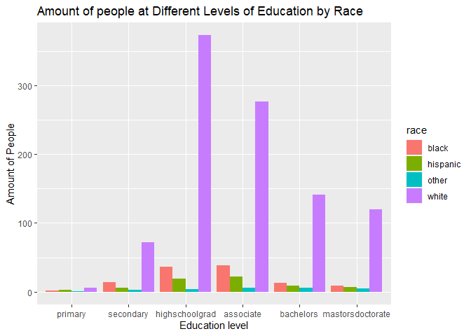
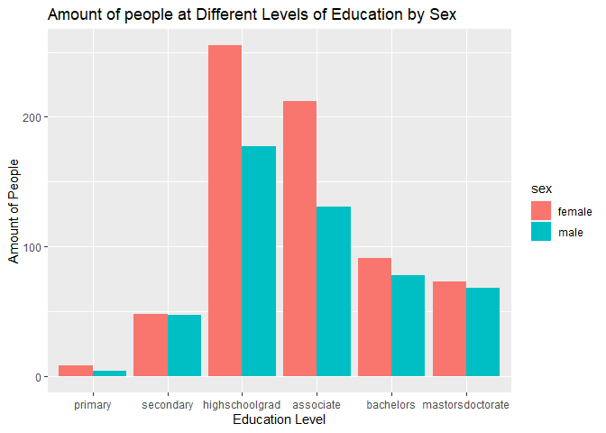
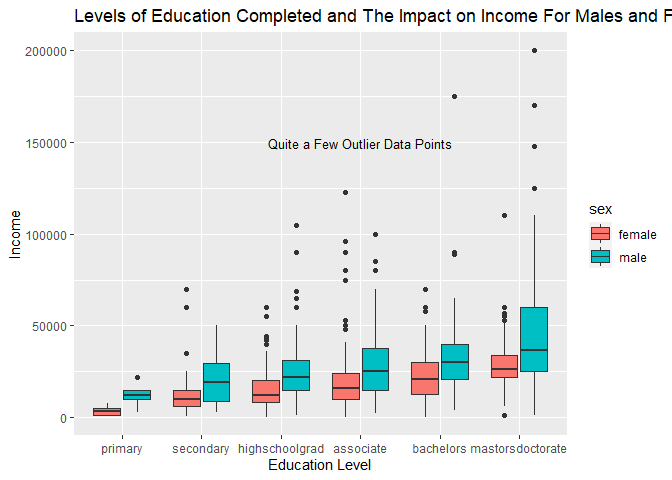

library(tidyverse)
?mpg
fct

```r
library(tidyverse)
```

```
## -- Attaching packages --------------------------------------- tidyverse 1.3.1 --
```

```
## v ggplot2 3.3.5     v purrr   0.3.4
## v tibble  3.1.6     v dplyr   1.0.7
## v tidyr   1.1.4     v stringr 1.4.0
## v readr   2.1.1     v forcats 0.5.1
```

```
## -- Conflicts ------------------------------------------ tidyverse_conflicts() --
## x dplyr::filter() masks stats::filter()
## x dplyr::lag()    masks stats::lag()
```

```r
download.file("https://raw.githubusercontent.com/hadley/r4ds/master/data/heights.csv", "HeightData")

height_data <- read_csv("HeightData")
```

```
## Rows: 1192 Columns: 6
```

```
## -- Column specification --------------------------------------------------------
## Delimiter: ","
## chr (2): sex, race
## dbl (4): earn, height, ed, age
```

```
## 
## i Use `spec()` to retrieve the full column specification for this data.
## i Specify the column types or set `show_col_types = FALSE` to quiet this message.
```

```r
head(height_data)
```

```
## # A tibble: 6 x 6
##    earn height sex       ed   age race 
##   <dbl>  <dbl> <chr>  <dbl> <dbl> <chr>
## 1 50000   74.4 male      16    45 white
## 2 60000   65.5 female    16    58 white
## 3 30000   63.6 female    16    29 white
## 4 50000   63.1 female    16    91 other
## 5 51000   63.4 female    17    39 white
## 6  9000   64.4 female    15    26 white
```

```r
HeightEd <- height_data %>%
  mutate(ed = fct_collapse(as.factor(ed),
                           primary = c("3","4","5","6"),
                           secondary = c("7","8","9","10","11"),
                           highschoolgrad = ("12"),
                           associate = c("13","14","15"),
                           bachelors = ("16"),
                           mastorsdoctorate = c("17","18")
                           ))
  
HeightEd                           
```

```
## # A tibble: 1,192 x 6
##     earn height sex    ed                 age race    
##    <dbl>  <dbl> <chr>  <fct>            <dbl> <chr>   
##  1 50000   74.4 male   bachelors           45 white   
##  2 60000   65.5 female bachelors           58 white   
##  3 30000   63.6 female bachelors           29 white   
##  4 50000   63.1 female bachelors           91 other   
##  5 51000   63.4 female mastorsdoctorate    39 white   
##  6  9000   64.4 female associate           26 white   
##  7 29000   61.7 female highschoolgrad      49 white   
##  8 32000   72.7 male   mastorsdoctorate    46 white   
##  9  2000   72.0 male   associate           21 hispanic
## 10 27000   72.2 male   highschoolgrad      26 white   
## # ... with 1,182 more rows
```

```r
library(ggplot2)
ggplot(data = HeightEd) +
  geom_bar(mapping = aes(x = ed, fill = race), position = "dodge") +
  labs(y = "Amount of People",
       x = "Education level",
       title = "Amount of people at Different Levels of Education by Race")
```

<!-- -->

```r
ggplot(data = HeightEd) +
  geom_bar(mapping = aes(x = ed, fill = sex), position = "dodge") +
  labs(y = "Amount of People",
       x = "Education Level",
       title = "Amount of people at Different Levels of Education by Sex")
```

<!-- -->


```r
min(HeightEd$age, na.rm = TRUE)
```

```
## [1] 18
```

```r
Earn_vs_Edu <- ggplot(data = HeightEd) +
  geom_boxplot(aes(x = ed, y = earn, fill = sex))+
  labs(x = "Education Level",
       y = "Income",
       title = "Levels of Education Completed and The Impact on Income For Males and Females") +
  annotate("text", x = "associate", y = 150000, label = "Quite a Few Outlier Data Points", size = 3.5)
               
Earn_vs_Edu
```

<!-- -->
I learned that in this data set, females make less money than males even when they have the same education level completed. It is also shows that there are quite a few outlier data points. I also discovered the boxplot is a good visualization tool when dealing with data that falls into ranges rather than as discrete data points. 
