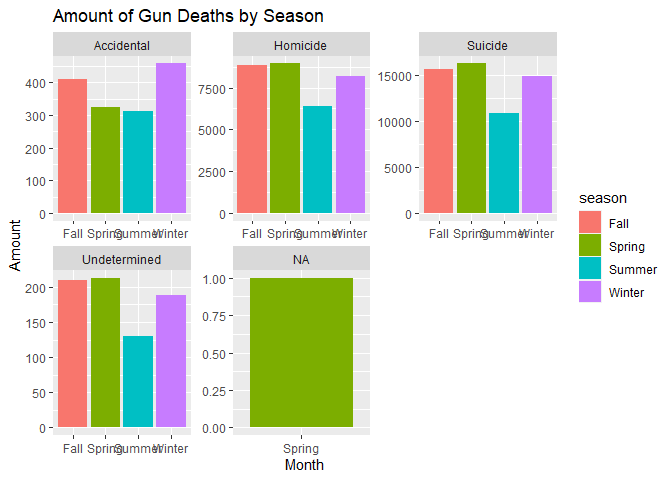
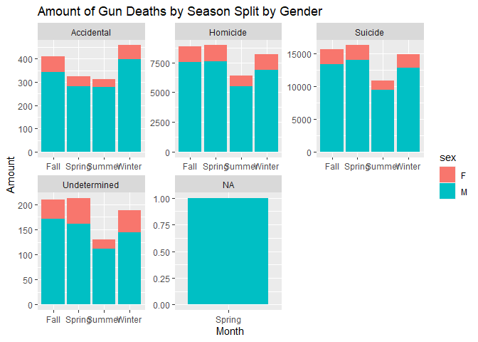

SUMMARY:
Gun deaths in the United States constitute a major cause for concern, affecting over 40,000 people annually. While all the deaths result from guns, the parts of the population most affected and the causes are various. The leading cause of death by guns is suicide, making up 2/3s of gun deaths annually. And more than85% of those deaths are male victims. Other categories of gun fatalities include women in domestic violence, mass shootings, and homicides. Given the differences in gun violence victims, it is difficult to suggest a single solution to attack the problem. 


```r
library(tidyverse)
```

```
## -- Attaching packages --------------------------------------- tidyverse 1.3.1 --
```

```
## v ggplot2 3.3.5     v purrr   0.3.4
## v tibble  3.1.6     v dplyr   1.0.7
## v tidyr   1.1.4     v stringr 1.4.0
## v readr   2.1.1     v forcats 0.5.1
```

```
## -- Conflicts ------------------------------------------ tidyverse_conflicts() --
## x dplyr::filter() masks stats::filter()
## x dplyr::lag()    masks stats::lag()
```

```r
download.file("https://raw.githubusercontent.com/fivethirtyeight/guns-data/master/full_data.csv", "GunDeaths")

GunDeaths <- read_csv("GunDeaths")
```

```
## New names:
## * `` -> ...1
```

```
## Rows: 100798 Columns: 11
```

```
## -- Column specification --------------------------------------------------------
## Delimiter: ","
## chr (6): month, intent, sex, race, place, education
## dbl (5): ...1, year, police, age, hispanic
```

```
## 
## i Use `spec()` to retrieve the full column specification for this data.
## i Specify the column types or set `show_col_types = FALSE` to quiet this message.
```

```r
head(GunDeaths)
```

```
## # A tibble: 6 x 11
##    ...1  year month intent  police sex     age race     hispanic place education
##   <dbl> <dbl> <chr> <chr>    <dbl> <chr> <dbl> <chr>       <dbl> <chr> <chr>    
## 1     1  2012 01    Suicide      0 M        34 Asian/P~      100 Home  BA+      
## 2     2  2012 01    Suicide      0 F        21 White         100 Stre~ Some col~
## 3     3  2012 01    Suicide      0 M        60 White         100 Othe~ BA+      
## 4     4  2012 02    Suicide      0 M        64 White         100 Home  BA+      
## 5     5  2012 02    Suicide      0 M        31 White         100 Othe~ HS/GED   
## 6     6  2012 02    Suicide      0 M        17 Native ~      100 Home  Less tha~
```

```r
age_grouping <- GunDeaths %>%
  filter(intent != " ", age != " ") %>%
  mutate(agegroup = case_when(
    age < 15 ~ "under 15",
    age < 35 ~ "15-34",
    age < 65 ~ "35-64",
    TRUE ~ "65+"
  ))
age_grouping
```

```
## # A tibble: 100,779 x 12
##     ...1  year month intent    police sex     age race  hispanic place education
##    <dbl> <dbl> <chr> <chr>      <dbl> <chr> <dbl> <chr>    <dbl> <chr> <chr>    
##  1     1  2012 01    Suicide        0 M        34 Asia~      100 Home  BA+      
##  2     2  2012 01    Suicide        0 F        21 White      100 Stre~ Some col~
##  3     3  2012 01    Suicide        0 M        60 White      100 Othe~ BA+      
##  4     4  2012 02    Suicide        0 M        64 White      100 Home  BA+      
##  5     5  2012 02    Suicide        0 M        31 White      100 Othe~ HS/GED   
##  6     6  2012 02    Suicide        0 M        17 Nati~      100 Home  Less tha~
##  7     7  2012 02    Undeterm~      0 M        48 White      100 Home  HS/GED   
##  8     8  2012 03    Suicide        0 M        41 Nati~      100 Home  HS/GED   
##  9     9  2012 02    Accident~      0 M        50 White      100 Othe~ Some col~
## 10    11  2012 02    Suicide        0 M        30 White      100 Home  Some col~
## # ... with 100,769 more rows, and 1 more variable: agegroup <chr>
```

```r
ggplot() +
  geom_bar(data = age_grouping, aes(x = agegroup, fill = sex)) +
  facet_wrap(~intent, scales = "free") +
  labs(
    x = "Age Group",
    y = "Amount",
    title = "Age Group and Sex and Their Affect on Gun Related Deaths"
  )
```

<!-- -->
This graph demonstrates that men are more subject to be victims of gun violence. At every age group and 
different intent men are far more likely to be killed by gun violence. Suicide and homicide are 
particularly striking because of the sheer amount of fatalities, with suicide as the 
most deadly form of gun violence for men.

```r
ggplot() +
  geom_density(data = GunDeaths, aes(x = age, fill = intent), alpha = .5, position = 'fill', adjust = 1.5) +
  facet_wrap(~sex) +
  labs(
    x = "Age",
    y = "Density",
    title = "Density of Gun Deaths by Gender"
  )
```

```
## Warning: Removed 18 rows containing non-finite values (stat_density).
```

```
## Warning: Groups with fewer than two data points have been dropped.
```

```
## Warning: Removed 1 rows containing missing values (position_stack).
```

<!-- -->
This graph shows gun deaths for different ages and the intent behind the death. It demonstrates that as male 
age increases so does suicide rate. For women, there seems to be a peak age in suicide right around 45 to about 75,
and it is less dense than the male suicide density. Which seems to be true with what we know about female suicide,
meaning typically women opt for pill overdose or other less violent means of death. 


```r
deathseasons <- GunDeaths %>%
  mutate(month = as.factor(month))

GunDeaths$month <- as.integer(GunDeaths$month)


seasons <- GunDeaths %>%
  mutate(season = 
            case_when(
            month >= 1 & month <= 2 ~ "Winter",
            month == 12 ~ "Winter",
            month >= 4 & month <= 6 ~ "Spring",
            month >= 5 & month <= 8 ~ "Summer",
            month >= 9 & month <= 11 ~ "Fall",
            ))
nonulls <- seasons %>%
  filter(season != "")

ggplot() +
  geom_bar(data = nonulls, aes(x = month, fill = season)) +
  facet_wrap(~intent, scales = "free") +
  labs(x = "Month",
       y = "Amount",
       title = "Amount of Gun Deaths by Season")
```

<!-- -->
The graphs reveal that there is not a significant difference in suicide gun fatalities when broken down by season.
So, we would need to tell the customer there is no real need to develop different approaches to strategies in gun
violence based on season. 


```r
ggplot() +
  geom_bar(data = nonulls, aes(x = month, fill = sex)) +
  facet_wrap(~intent, scales = "free") +
  labs(x = "Month",
       y = "Amount",
       title = "Amount of Gun Deaths by Season Split by Gender")
```

<!-- -->

Taking a closer look to examine how men and women are specifically affected in different seasons by suicide gun
violence, we can see there is still not a significant difference. However, we do still see a distinction. The
client should focus specifically on male gun related suicide prevention commercials throughout the year. 

