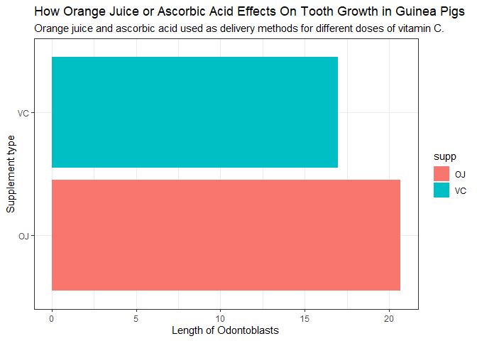
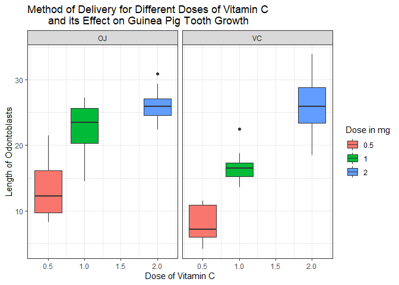
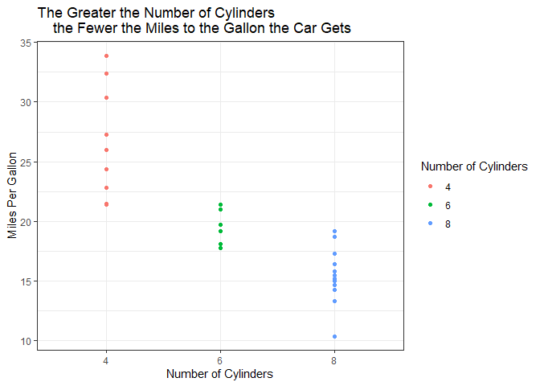
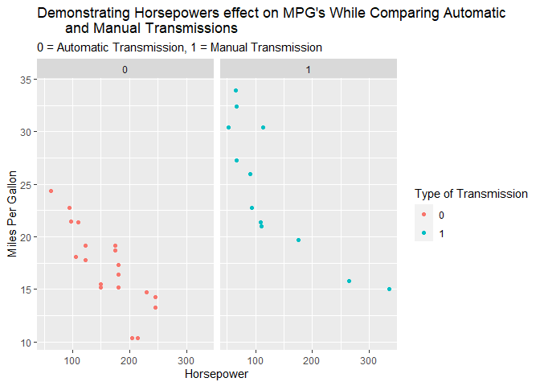

```r
library(tidyverse)
```

```
## -- Attaching packages --------------------------------------- tidyverse 1.3.1 --
```

```
## v ggplot2 3.3.5     v purrr   0.3.4
## v tibble  3.1.6     v dplyr   1.0.7
## v tidyr   1.1.4     v stringr 1.4.0
## v readr   2.1.1     v forcats 0.5.1
```

```
## -- Conflicts ------------------------------------------ tidyverse_conflicts() --
## x dplyr::filter() masks stats::filter()
## x dplyr::lag()    masks stats::lag()
```

```r
?ToothGrowth
```

```
## starting httpd help server ...
```

```
##  done
```

```r
head(ToothGrowth)
```

```
##    len supp dose
## 1  4.2   VC  0.5
## 2 11.5   VC  0.5
## 3  7.3   VC  0.5
## 4  5.8   VC  0.5
## 5  6.4   VC  0.5
## 6 10.0   VC  0.5
```


```r
avg_len <- ToothGrowth %>%
  group_by(supp) %>%
  summarize(avg_tooth_len = mean(len, na.rm = TRUE))
avg_len
```

```
## # A tibble: 2 x 2
##   supp  avg_tooth_len
##   <fct>         <dbl>
## 1 OJ             20.7
## 2 VC             17.0
```

```r
ggplot() +
  geom_col(data = avg_len, aes(x = supp, y = avg_tooth_len, fill = supp)) +
  coord_flip() +
  labs(
    x = "Supplement type",
    y = "Length of Odontoblasts",
    title = "How Orange Juice or Ascorbic Acid Effects On Tooth Growth in Guinea Pigs",
    subtitle = "Orange juice and ascorbic acid used as delivery methods for different doses of vitamin C."
  ) +
  theme_bw()
```

<!-- -->
This first graph simply shows how the two different methods of delivering a dose effect the average length of odontoblasts, without taking into account the different dose amounts. I chose geom_col because we are just comparing two different numbers that have been summarized. This graph demonstrates that the OJ supplement is more effective, on average, at aiding tooth growth in guinea pigs. 

```r
ggplot() +
  geom_boxplot(data = ToothGrowth, aes(x = dose, y = len, group = dose, fill = as.factor(dose))) +
  facet_wrap(~ supp) +
  labs(x = "Dose of Vitamin C",
       y = "Length of Odontoblasts",
       title = "Method of Delivery for Different Doses of Vitamin C 
       and its Effect on Guinea Pig Tooth Growth",
       fill = "Dose in mg") + 
  theme_bw()
```

<!-- -->

I used the boxplot because I had a parallel situation and I wanted to show, in parallel, the comparsion of the two different delivery methods. The graph demonstrates that OJ tends to be more effective for the .5 and 1 mg doses, which is easily seen in the comparison graphs. The 2 mg dose seemed to have similar effects on length of odontoblasts whether it was delivered in OJ or VC. 


```r
?mtcars
head(mtcars)
```

```
##                    mpg cyl disp  hp drat    wt  qsec vs am gear carb
## Mazda RX4         21.0   6  160 110 3.90 2.620 16.46  0  1    4    4
## Mazda RX4 Wag     21.0   6  160 110 3.90 2.875 17.02  0  1    4    4
## Datsun 710        22.8   4  108  93 3.85 2.320 18.61  1  1    4    1
## Hornet 4 Drive    21.4   6  258 110 3.08 3.215 19.44  1  0    3    1
## Hornet Sportabout 18.7   8  360 175 3.15 3.440 17.02  0  0    3    2
## Valiant           18.1   6  225 105 2.76 3.460 20.22  1  0    3    1
```


```r
ggplot() +
  geom_point(data = mtcars, aes(x = as.factor(cyl), y = mpg, color = as.factor(cyl))) +
  labs(x = "Number of Cylinders",
       y = "Miles Per Gallon",
       title = "The Greater the Number of Cylinders 
    the Fewer the Miles to the Gallon the Car Gets",
    color = "Number of Cylinders"
       )+
  theme_bw()
```

<!-- -->
I used a scatter plot because you are able to retain and show that different car models have varying miles per gallon for 4,6, and 8 cylinder engines, but that all car models showed decreasing miles per gallon with increasing cylinders in their engine.


```r
ggplot() +
  geom_point(data = mtcars, aes(x = hp, y = mpg, color = as.factor(am))) +
  facet_wrap(~ am) +
  labs(x = "Horsepower",
       y = "Miles Per Gallon",
       title = "Demonstrating Horsepowers effect on MPG's While Comparing Automatic
       and Manual Transmissions",
       subtitle = "0 = Automatic Transmission, 1 = Manual Transmission",
       color = "Type of Transmission")
```

<!-- -->

I used a scatter plot to get an idea and show what the slope would be if there was a line through the points. It demonstrates clearly that as horsepower increases, miles per gallon decreases. Strikingly, the use of a faceted graph shows that manual transmissions get better gas mileage than their counterparts automatic transmissions. This is interesting since there are almost no cars sold these days with manual transmission because it is much easier to drive an automatic. But we are apparently paying for more gas by driving automatic transmission cars.
