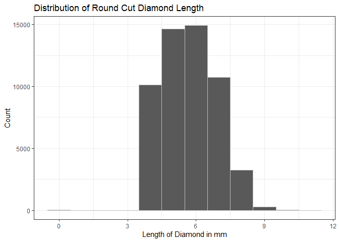
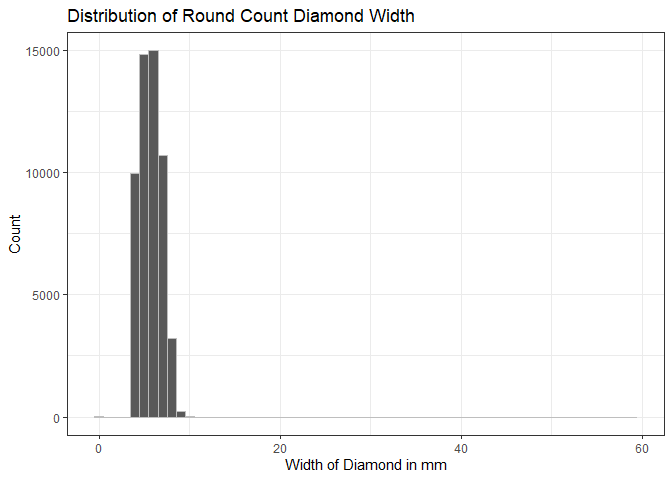
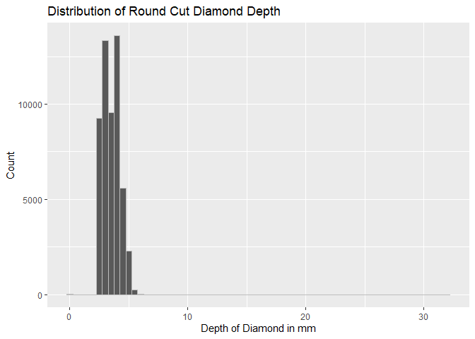
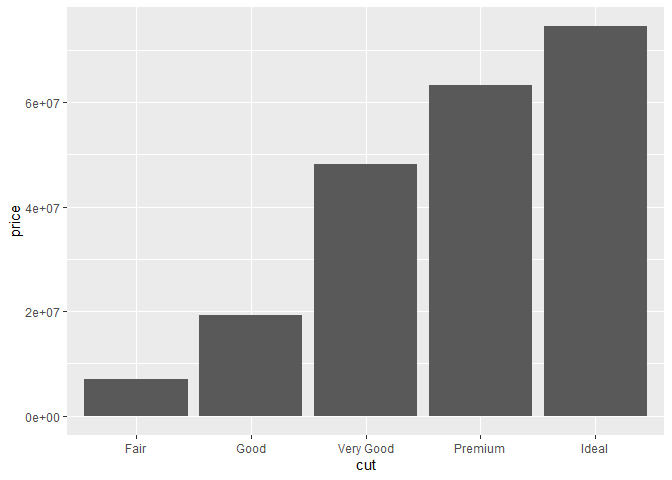
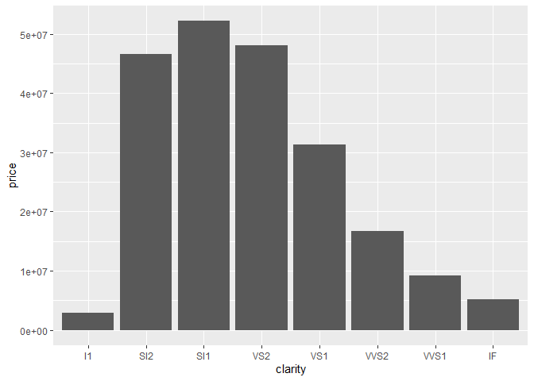
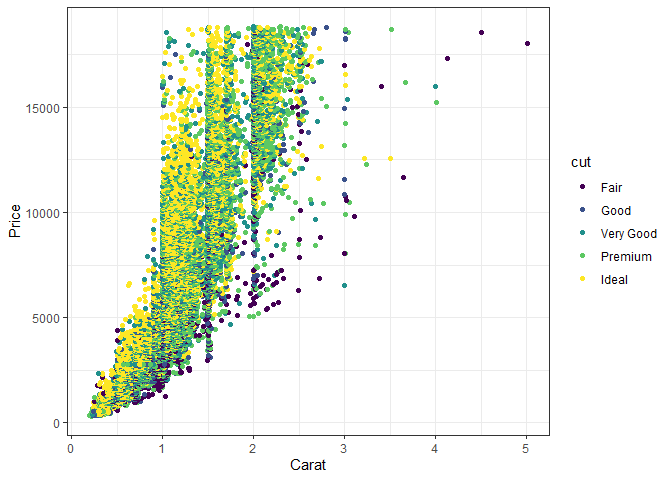
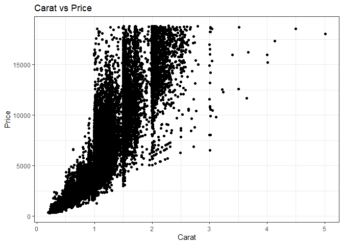

```r
library(tidyverse)
```

```
## -- Attaching packages --------------------------------------- tidyverse 1.3.1 --
```

```
## v ggplot2 3.3.5     v purrr   0.3.4
## v tibble  3.1.6     v dplyr   1.0.7
## v tidyr   1.1.4     v stringr 1.4.0
## v readr   2.1.1     v forcats 0.5.1
```

```
## -- Conflicts ------------------------------------------ tidyverse_conflicts() --
## x dplyr::filter() masks stats::filter()
## x dplyr::lag()    masks stats::lag()
```

```r
library(corrplot)
```

```
## Warning: package 'corrplot' was built under R version 4.1.3
```

```
## corrplot 0.92 loaded
```

```r
?diamonds
```

```
## starting httpd help server ...
```

```
##  done
```

```r
head(diamonds)
```

```
## # A tibble: 6 x 10
##   carat cut       color clarity depth table price     x     y     z
##   <dbl> <ord>     <ord> <ord>   <dbl> <dbl> <int> <dbl> <dbl> <dbl>
## 1  0.23 Ideal     E     SI2      61.5    55   326  3.95  3.98  2.43
## 2  0.21 Premium   E     SI1      59.8    61   326  3.89  3.84  2.31
## 3  0.23 Good      E     VS1      56.9    65   327  4.05  4.07  2.31
## 4  0.29 Premium   I     VS2      62.4    58   334  4.2   4.23  2.63
## 5  0.31 Good      J     SI2      63.3    58   335  4.34  4.35  2.75
## 6  0.24 Very Good J     VVS2     62.8    57   336  3.94  3.96  2.48
```


```r
ggplot(data = diamonds, aes(x = x)) +
  geom_histogram(binwidth = 1, color = "grey") +
  labs(
    x = "Length of Diamond in mm",
    y = "Count",
    title = "Distribution of Round Cut Diamond Length"
  ) +
  theme_bw()
```

<!-- -->

```r
ggplot(data = diamonds, aes(x = y)) +
  geom_histogram(binwidth = 1, color = "grey") +
  labs(
    x = "Width of Diamond in mm",
    y = "Count",
    title = "Distribution of Round Count Diamond Width"
  ) +
  theme_bw()
```

<!-- -->


```r
ggplot(data = diamonds, aes(x = z)) +
  geom_histogram(binwidth = .5, color = "grey") +
  labs(
    x = "Depth of Diamond in mm",
    y = "Count",
    title = "Distribution of Round Cut Diamond Depth"
    
  )
```

<!-- -->

```r
ggplot() +
  geom_col(data = diamonds, aes(x = cut, y = price))
```

<!-- -->


```r
ggplot() +
  geom_col(data = diamonds, aes(x = clarity, y = price))
```

<!-- -->
It is unusual that the best clarity is not the most expensive. This could be because clarity decreases with size.

```r
ggplot() +
  geom_jitter(data = diamonds, aes(x = carat, y = price))
```

<!-- -->


```r
ggplot() +
  geom_jitter(data = diamonds, aes(x = carat,  y = price, color = cut)) + 
  labs(x = "Carat",
       y = "Price",
       Title = "Carat vs Price with Different Quality Cuts") +
  theme_bw()
```

<!-- -->

The most important variable for predicting price is carat. This is not particularly obvious because it seems 
that the data set has price per carat rather than pure price. Since size plays the most important role, 
people will pay for size regardless of cut and clarity.


```r
ggplot() +
  geom_jitter(data = diamonds, aes(x = carat, y = price)) +
  labs(
    x = "Carat",
    y = "Price",
    title = "Carat vs Price") +
  theme_bw()
```

<!-- -->
The price distribution for small diamonds is more compressed. Meaning the top of the range is not as far from 
the bottom of the range. This does agree with my expectation, people won't pay as much for small diamonds
even with high clarity and perfect cut.

