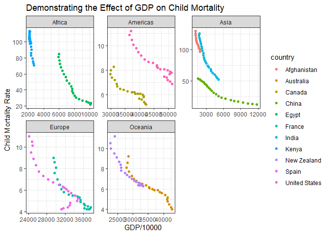

```r
droppedNA <- HealthCare %>%
  filter(country == ("United States") | country == ("Canada") | country == ("Egypt") | country == ("Kenya") | country == ("Afghanistan") | country == ("India") | country == ("China") | country == ("France") | country == ("Spain") | country == ("Australia") | country == ("New Zealand")) %>%
  drop_na(gdp, child_mort, year)

tail(droppedNA)
```

```
## # A tibble: 6 x 17
##    year country     continent health_exp_total health_exp_publ~ health_insurance
##   <dbl> <chr>       <chr>                <dbl>            <dbl> <lgl>           
## 1  2008 United Sta~ Americas             5873.            NA    NA              
## 2  2009 United Sta~ Americas             6045.            NA    NA              
## 3  2010 United Sta~ Americas             6228.             8.10 NA              
## 4  2011 United Sta~ Americas             6419.            NA    NA              
## 5  2012 United Sta~ Americas             6638.            NA    NA              
## 6  2013 United Sta~ Americas             6864.             8.05 NA              
## # ... with 11 more variables: nhs_exp <dbl>, health_exp_private <dbl>,
## #   health_insurance_govt <dbl>, health_insurance_private <dbl>,
## #   health_insurance_any <dbl>, health_exp_public_percent <dbl>,
## #   health_exp_oop_percent <dbl>, no_health_insurance <dbl>, gdp <dbl>,
## #   life_expectancy <dbl>, child_mort <dbl>
```


```r
ggplot() +
  geom_point(data = droppedNA, aes(x = gdp, y = child_mort, color = country)) +
  facet_wrap(~continent, scales = 'free') +
  labs(
    x = "GDP/10000",
    y = "Child Mortality Rate",
    title = "Demonstrating the Effect of GDP on Child Mortality"
  ) +
  theme_bw()
```

<!-- -->

This visualization demonstrates that as GDP increases child mortality decreases. The United States has the largest GDP of any of the countries displayed and yet our child mortality is higher than other comprable countries. For instance, France has a GDP that is 14,000 less than the U.S. and yet their child mortality rate is 3 less than the U.S. 
