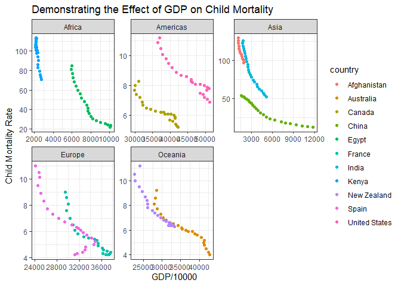

```r
library(tidyverse)
```

```
## -- Attaching packages --------------------------------------- tidyverse 1.3.1 --
```

```
## v ggplot2 3.3.5     v purrr   0.3.4
## v tibble  3.1.6     v dplyr   1.0.7
## v tidyr   1.1.4     v stringr 1.4.0
## v readr   2.1.1     v forcats 0.5.1
```

```
## -- Conflicts ------------------------------------------ tidyverse_conflicts() --
## x dplyr::filter() masks stats::filter()
## x dplyr::lag()    masks stats::lag()
```

```r
library(knitr)

download.file("https://raw.githubusercontent.com/martinerin/myrepo/master/financing_healthcare.csv", "HealthCareData")

HealthCare <- read_csv("HealthCareData")
```

```
## Warning: One or more parsing issues, see `problems()` for details
```

```
## Rows: 36873 Columns: 17
```

```
## -- Column specification --------------------------------------------------------
## Delimiter: ","
## chr  (2): country, continent
## dbl (14): year, health_exp_total, health_exp_public, nhs_exp, health_exp_pri...
## lgl  (1): health_insurance
```

```
## 
## i Use `spec()` to retrieve the full column specification for this data.
## i Specify the column types or set `show_col_types = FALSE` to quiet this message.
```

```r
head(HealthCare)
```

```
## # A tibble: 6 x 17
##    year country     continent health_exp_total health_exp_publ~ health_insurance
##   <dbl> <chr>       <chr>                <dbl>            <dbl> <lgl>           
## 1  2015 Abkhazia    <NA>                    NA               NA NA              
## 2  1800 Afghanistan Asia                    NA               NA NA              
## 3  1801 Afghanistan Asia                    NA               NA NA              
## 4  1802 Afghanistan Asia                    NA               NA NA              
## 5  1803 Afghanistan Asia                    NA               NA NA              
## 6  1804 Afghanistan Asia                    NA               NA NA              
## # ... with 11 more variables: nhs_exp <dbl>, health_exp_private <dbl>,
## #   health_insurance_govt <dbl>, health_insurance_private <dbl>,
## #   health_insurance_any <dbl>, health_exp_public_percent <dbl>,
## #   health_exp_oop_percent <dbl>, no_health_insurance <dbl>, gdp <dbl>,
## #   life_expectancy <dbl>, child_mort <dbl>
```


```r
droppedNA <- HealthCare %>%
  filter(country == ("United States") | country == ("Canada") | country == ("Egypt") | country == ("Kenya") | country == ("Afghanistan") | country == ("India") | country == ("China") | country == ("France") | country == ("Spain") | country == ("Australia") | country == ("New Zealand")) %>%
  drop_na(gdp, child_mort, year)

tail(droppedNA)
```

```
## # A tibble: 6 x 17
##    year country     continent health_exp_total health_exp_publ~ health_insurance
##   <dbl> <chr>       <chr>                <dbl>            <dbl> <lgl>           
## 1  2008 United Sta~ Americas             5873.            NA    NA              
## 2  2009 United Sta~ Americas             6045.            NA    NA              
## 3  2010 United Sta~ Americas             6228.             8.10 NA              
## 4  2011 United Sta~ Americas             6419.            NA    NA              
## 5  2012 United Sta~ Americas             6638.            NA    NA              
## 6  2013 United Sta~ Americas             6864.             8.05 NA              
## # ... with 11 more variables: nhs_exp <dbl>, health_exp_private <dbl>,
## #   health_insurance_govt <dbl>, health_insurance_private <dbl>,
## #   health_insurance_any <dbl>, health_exp_public_percent <dbl>,
## #   health_exp_oop_percent <dbl>, no_health_insurance <dbl>, gdp <dbl>,
## #   life_expectancy <dbl>, child_mort <dbl>
```


<!-- -->

This visualization demonstrates that as GDP increases child mortality decreases. The United States has the largest GDP of any of the countries displayed and yet our child mortality is higher than other comprable countries. For instance, France has a GDP that is 14,000 less than the U.S. and yet their child mortality rate is 3 less than the U.S. 
