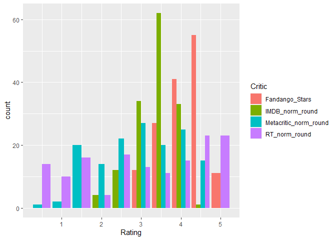

```r
library(tidyverse)
```

```
## -- Attaching packages --------------------------------------- tidyverse 1.3.1 --
```

```
## v ggplot2 3.3.5     v purrr   0.3.4
## v tibble  3.1.6     v dplyr   1.0.7
## v tidyr   1.1.4     v stringr 1.4.0
## v readr   2.1.1     v forcats 0.5.1
```

```
## -- Conflicts ------------------------------------------ tidyverse_conflicts() --
## x dplyr::filter() masks stats::filter()
## x dplyr::lag()    masks stats::lag()
```

```r
fandango <- tempfile()
download.file("https://github.com/fivethirtyeight/data/raw/master/fandango/fandango_score_comparison.csv", "fandango")

FandangoData <- read_csv("fandango")
```

```
## Rows: 146 Columns: 22
```

```
## -- Column specification --------------------------------------------------------
## Delimiter: ","
## chr  (1): FILM
## dbl (21): RottenTomatoes, RottenTomatoes_User, Metacritic, Metacritic_User, ...
```

```
## 
## i Use `spec()` to retrieve the full column specification for this data.
## i Specify the column types or set `show_col_types = FALSE` to quiet this message.
```


```r
head(FandangoData)
```

```
## # A tibble: 6 x 22
##   FILM          RottenTomatoes RottenTomatoes_~ Metacritic Metacritic_User  IMDB
##   <chr>                  <dbl>            <dbl>      <dbl>           <dbl> <dbl>
## 1 Avengers: Ag~             74               86         66             7.1   7.8
## 2 Cinderella (~             85               80         67             7.5   7.1
## 3 Ant-Man (201~             80               90         64             8.1   7.8
## 4 Do You Belie~             18               84         22             4.7   5.4
## 5 Hot Tub Time~             14               28         29             3.4   5.1
## 6 The Water Di~             63               62         50             6.8   7.2
## # ... with 16 more variables: Fandango_Stars <dbl>, Fandango_Ratingvalue <dbl>,
## #   RT_norm <dbl>, RT_user_norm <dbl>, Metacritic_norm <dbl>,
## #   Metacritic_user_nom <dbl>, IMDB_norm <dbl>, RT_norm_round <dbl>,
## #   RT_user_norm_round <dbl>, Metacritic_norm_round <dbl>,
## #   Metacritic_user_norm_round <dbl>, IMDB_norm_round <dbl>,
## #   Metacritic_user_vote_count <dbl>, IMDB_user_vote_count <dbl>,
## #   Fandango_votes <dbl>, Fandango_Difference <dbl>
```

```r
FandangoTidy <- FandangoData %>%
  select(FILM, Fandango_Stars, RT_norm_round, Metacritic_norm_round, IMDB_norm_round) %>%
  pivot_longer(2:5, names_to = "Critic", values_to = "Rating")

head(FandangoTidy, n = 20)
```

```
## # A tibble: 20 x 3
##    FILM                           Critic                Rating
##    <chr>                          <chr>                  <dbl>
##  1 Avengers: Age of Ultron (2015) Fandango_Stars           5  
##  2 Avengers: Age of Ultron (2015) RT_norm_round            3.5
##  3 Avengers: Age of Ultron (2015) Metacritic_norm_round    3.5
##  4 Avengers: Age of Ultron (2015) IMDB_norm_round          4  
##  5 Cinderella (2015)              Fandango_Stars           5  
##  6 Cinderella (2015)              RT_norm_round            4.5
##  7 Cinderella (2015)              Metacritic_norm_round    3.5
##  8 Cinderella (2015)              IMDB_norm_round          3.5
##  9 Ant-Man (2015)                 Fandango_Stars           5  
## 10 Ant-Man (2015)                 RT_norm_round            4  
## 11 Ant-Man (2015)                 Metacritic_norm_round    3  
## 12 Ant-Man (2015)                 IMDB_norm_round          4  
## 13 Do You Believe? (2015)         Fandango_Stars           5  
## 14 Do You Believe? (2015)         RT_norm_round            1  
## 15 Do You Believe? (2015)         Metacritic_norm_round    1  
## 16 Do You Believe? (2015)         IMDB_norm_round          2.5
## 17 Hot Tub Time Machine 2 (2015)  Fandango_Stars           3.5
## 18 Hot Tub Time Machine 2 (2015)  RT_norm_round            0.5
## 19 Hot Tub Time Machine 2 (2015)  Metacritic_norm_round    1.5
## 20 Hot Tub Time Machine 2 (2015)  IMDB_norm_round          2.5
```

```r
ggplot() +
  geom_bar(data = FandangoTidy, aes(x = Rating, fill = Critic), position = 'dodge')
```

<!-- -->

