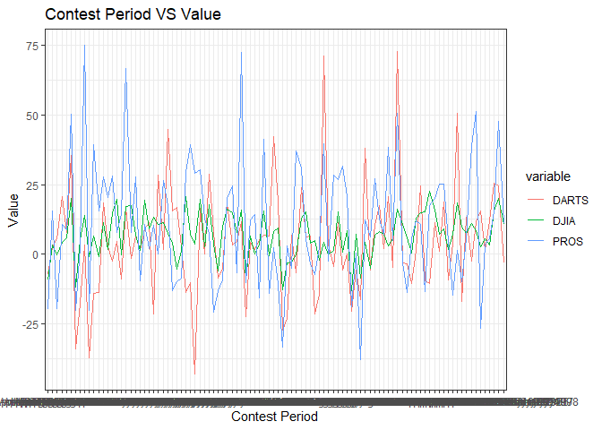

```r
library(tidyverse)
```

```
## -- Attaching packages --------------------------------------- tidyverse 1.3.1 --
```

```
## v ggplot2 3.3.5     v purrr   0.3.4
## v tibble  3.1.6     v dplyr   1.0.7
## v tidyr   1.1.4     v stringr 1.4.0
## v readr   2.1.1     v forcats 0.5.1
```

```
## -- Conflicts ------------------------------------------ tidyverse_conflicts() --
## x dplyr::filter() masks stats::filter()
## x dplyr::lag()    masks stats::lag()
```

```r
library(readr)
library(haven)
library(readxl)
library(downloader)
```

```
## Warning: package 'downloader' was built under R version 4.1.3
```


```r
dat1 <- tempfile()
download.file("https://github.com/WJC-Data-Science/DTS350/raw/master/Dart_Expert_Dow_6month_anova/Dart_Expert_Dow_6month_anova.csv", "dat1")
Dart1 <- read_csv("dat1")
```

```
## Rows: 300 Columns: 3
```

```
## -- Column specification --------------------------------------------------------
## Delimiter: ","
## chr (2): contest_period, variable
## dbl (1): value
```

```
## 
## i Use `spec()` to retrieve the full column specification for this data.
## i Specify the column types or set `show_col_types = FALSE` to quiet this message.
```

```r
dat2 <- tempfile()
download.file("https://github.com/WJC-Data-Science/DTS350/raw/master/Dart_Expert_Dow_6month_anova/Dart_Expert_Dow_6month_anova.RDS", "dat2", mode = "wb")
read_rds("dat2")
```

```
## # A tibble: 300 x 3
##    contest_period             variable value
##    <chr>                      <chr>    <dbl>
##  1 January-June1990           PROS      12.7
##  2 February-July1990          PROS      26.4
##  3 March-August1990           PROS       2.5
##  4 April-September1990        PROS     -20  
##  5 May-October1990            PROS     -37.8
##  6 June-November1990          PROS     -33.3
##  7 July-December1990          PROS     -10.2
##  8 August1990-January1991     PROS     -20.3
##  9 September1990-February1991 PROS      38.9
## 10 October1990-March1991      PROS      20.2
## # ... with 290 more rows
```

```r
Dart2 <- read_rds("dat2")

dat3 <- tempfile()
download.file("https://github.com/WJC-Data-Science/DTS350/raw/master/Dart_Expert_Dow_6month_anova/Dart_Expert_Dow_6month_anova.dta", dat3, mode = "wb")
read_dta(dat3)
```

```
## # A tibble: 300 x 3
##    contest_period             variable value
##    <chr>                      <chr>    <dbl>
##  1 January-June1990           PROS      12.7
##  2 February-July1990          PROS      26.4
##  3 March-August1990           PROS       2.5
##  4 April-September1990        PROS     -20  
##  5 May-October1990            PROS     -37.8
##  6 June-November1990          PROS     -33.3
##  7 July-December1990          PROS     -10.2
##  8 August1990-January1991     PROS     -20.3
##  9 September1990-February1991 PROS      38.9
## 10 October1990-March1991      PROS      20.2
## # ... with 290 more rows
```

```r
Dart3 <- read_dta(dat3)

dat4 <- tempfile()
download.file("https://github.com/WJC-Data-Science/DTS350/raw/master/Dart_Expert_Dow_6month_anova/Dart_Expert_Dow_6month_anova.sav", "dat4", mode = "wb")
read_sav("dat4")
```

```
## # A tibble: 300 x 3
##    contest_period             variable value
##    <chr>                      <chr>    <dbl>
##  1 January-June1990           PROS      12.7
##  2 February-July1990          PROS      26.4
##  3 March-August1990           PROS       2.5
##  4 April-September1990        PROS     -20  
##  5 May-October1990            PROS     -37.8
##  6 June-November1990          PROS     -33.3
##  7 July-December1990          PROS     -10.2
##  8 August1990-January1991     PROS     -20.3
##  9 September1990-February1991 PROS      38.9
## 10 October1990-March1991      PROS      20.2
## # ... with 290 more rows
```

```r
Dart4 <- read_sav("dat4")

dat5 <- tempfile()
download.file("https://github.com/WJC-Data-Science/DTS350/raw/master/Dart_Expert_Dow_6month_anova/Dart_Expert_Dow_6month_anova.xlsx", "dat5", mode = "wb")
read_xlsx("dat5")
```

```
## # A tibble: 300 x 3
##    contest_period             variable value
##    <chr>                      <chr>    <dbl>
##  1 January-June1990           PROS      12.7
##  2 February-July1990          PROS      26.4
##  3 March-August1990           PROS       2.5
##  4 April-September1990        PROS     -20  
##  5 May-October1990            PROS     -37.8
##  6 June-November1990          PROS     -33.3
##  7 July-December1990          PROS     -10.2
##  8 August1990-January1991     PROS     -20.3
##  9 September1990-February1991 PROS      38.9
## 10 October1990-March1991      PROS      20.2
## # ... with 290 more rows
```

```r
Dart5 <- read_xlsx("dat5")
```


```r
all_equal(Dart1, Dart2, Dart3, convert = TRUE)
```

```
## [1] TRUE
```

```r
all_equal(Dart1, Dart4, Dart5, convert = TRUE)
```

```
## [1] TRUE
```

```r
head(Dart1)
```

```
## # A tibble: 6 x 3
##   contest_period      variable value
##   <chr>               <chr>    <dbl>
## 1 January-June1990    PROS      12.7
## 2 February-July1990   PROS      26.4
## 3 March-August1990    PROS       2.5
## 4 April-September1990 PROS     -20  
## 5 May-October1990     PROS     -37.8
## 6 June-November1990   PROS     -33.3
```

```r
ggplot() +
  geom_boxplot(data = Dart1, aes(x = variable, y = value, fill = variable)) +
  labs(x = "Variable",
       y = "Value",
       title = "Variable vs Value Using Boxplot") +
  theme_bw()
```

<!-- -->
The boxplot shows that PROS has the highest return, but that it has the largest range, leaving open
the possibilty that you don't gain as much as is shown on the high end. The Dow Jones operates in a much narrower
range, with not as much potential on the upside, but also not as much risk on the downside.

```r
ggplot() +
  geom_jitter(data = Dart1, aes(x = variable, y = value, color = variable)) +
  labs(x = "Variable",
       y ="Value",
       title = "Varible vs Value Using Jitter") +
  theme_bw()
```

<!-- -->
The jitter plot shows essentially the same thing as the boxplot. The Dow Jones return is much more compressed 
compared to DARTS and PROS. The jitter plot also allows us to see that PROS and DARTS have similar spread in 
their range.


```r
ggplot() +
  geom_line(data = Dart1, aes(x = contest_period, y = value, group = variable, color = variable)) +
  labs(x = "Contest Period",
       y = "Value",
       title = "Contest Period VS Value") +
  theme_bw()
```

<!-- -->
The line plot shows us that there is more volatility in DARTS and PROS than in Dow Jones. 
Volatility makes it difficult to realize gains that are lasting, though it also creates opportunity in the 
short term.


```r
head(Dart1)
```

```
## # A tibble: 6 x 3
##   contest_period      variable value
##   <chr>               <chr>    <dbl>
## 1 January-June1990    PROS      12.7
## 2 February-July1990   PROS      26.4
## 3 March-August1990    PROS       2.5
## 4 April-September1990 PROS     -20  
## 5 May-October1990     PROS     -37.8
## 6 June-November1990   PROS     -33.3
```

```r
Dart1Tidy <- Dart1 %>%
   mutate(contest_period = str_replace_all(contest_period, '19', '_19'),
         contest_period = str_replace(contest_period, 'Febuary', 'February'),
         contest_period = str_replace(contest_period, 'Dec._1993', 'December_1993')) %>%
  separate(contest_period, into = c("month", "year_end"), sep = "-") %>%
  separate(year_end, into = c("month", "year"), sep = "_") %>%
  arrange(factor(month, levels = month.name))

head(Dart1Tidy)
```

```
## # A tibble: 6 x 4
##   variable month   year  value
##   <chr>    <chr>   <chr> <dbl>
## 1 PROS     January 1991  -20.3
## 2 PROS     January 1992   39.3
## 3 PROS     January 1993   15.6
## 4 PROS     January 1994   27.8
## 5 PROS     January 1995   20.4
## 6 PROS     January 1996   28.1
```

```r
view(Dart1Tidy)

#saving as RDS
saveRDS(Dart1Tidy, file = "Dart1Tidy.rds")
```


```r
ggplot(data = Dart1Tidy, aes(x = year, y = value, group = month)) +
  geom_point(aes(color = variable)) +
  geom_line(aes(color = variable)) +
  facet_wrap(~month, scales = "free") +
  labs(x = "Year",
       y = "Returns",
       title = "Returns By Month from 1990 through 1998") +
  theme_bw() +
  theme(axis.text.x = element_text(angle = 45))
```

<!-- -->
It looks like volatility is significant for PROS and DARTS, making it difficult to have a long term investment
strategy. 


```r
FinalTable <- Dart1 %>%
  filter(variable == "DJIA") %>%
  mutate(contest_period = str_replace_all(contest_period, "19", "_19"),
         contest_period = str_replace(contest_period, "Febuary", "February"),
         contest_period = str_replace(contest_period, "Dec._1993", "December_1993")) %>%
  separate(contest_period, into = c("Month", "Year_end"), sep = "-") %>%
  separate(Year_end, into = c("Month", "Year"), sep = "_") %>%
  pivot_wider(names_from = "Year", values_from = "value") %>%
  arrange(factor(Month, levels = month.name)) %>%
  select(-variable)
FinalTable
```

```
## # A tibble: 12 x 10
##    Month     `1990` `1991` `1992` `1993` `1994` `1995` `1996` `1997` `1998`
##    <chr>      <dbl>  <dbl>  <dbl>  <dbl>  <dbl>  <dbl>  <dbl>  <dbl>  <dbl>
##  1 January     NA     -0.8    6.5   -0.8   11.2    1.8   15     19.6   -0.3
##  2 February    NA     11      8.6    2.5    5.5    3.2   15.6   20.1   10.7
##  3 March       NA     15.8    7.2    9      1.6    7.3   18.4    9.6    7.6
##  4 April       NA     16.2   10.6    5.8    0.5   12.8   14.8   15.3   22.5
##  5 May         NA     17.3   17.6    6.7    1.3   19.5    9     13.3   10.6
##  6 June         2.5   17.7    3.6    7.7   -6.2   16     10.2   16.2   15  
##  7 July        11.5    7.6    4.2    3.7   -5.3   19.6    1.3   20.8    7.1
##  8 August      -2.3    4.4   -0.3    7.3    1.5   15.3    0.6    8.3  -13.1
##  9 September   -9.2    3.4   -0.1    5.2    4.4   14      5.8   20.2  -11.8
## 10 October     -8.5    4.4   -5      5.7    6.9    8.2    7.2    3     NA  
## 11 November   -12.8   -3.3   -2.8    4.9   -0.3   13.1   15.1    3.8   NA  
## 12 December    -9.3    6.6    0.2    8      3.6    9.3   15.5   -0.7   NA
```

