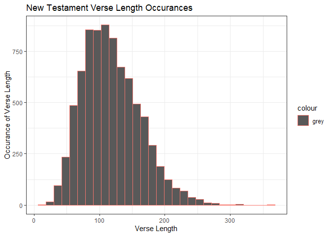

```r
library(tidyverse)
```

```
## -- Attaching packages --------------------------------------- tidyverse 1.3.1 --
```

```
## v ggplot2 3.3.5     v purrr   0.3.4
## v tibble  3.1.6     v dplyr   1.0.7
## v tidyr   1.1.4     v stringr 1.4.0
## v readr   2.1.1     v forcats 0.5.1
```

```
## -- Conflicts ------------------------------------------ tidyverse_conflicts() --
## x dplyr::filter() masks stats::filter()
## x dplyr::lag()    masks stats::lag()
```

```r
library(downloader)
```

```
## Warning: package 'downloader' was built under R version 4.1.3
```


```r
bible <- tempfile()
download.file("https://github.com/WJC-Data-Science/DTS350/raw/master/bible.csv", "bible", mode = "wb")
bible_data <- read_csv("bible")
```

```
## Rows: 31102 Columns: 17
```

```
## -- Column specification --------------------------------------------------------
## Delimiter: ","
## chr (9): volume_title, book_title, volume_long_title, book_long_title, volum...
## dbl (6): volume_id, book_id, chapter_id, verse_id, chapter_number, verse_number
## lgl (2): volume_subtitle, book_subtitle
```

```
## 
## i Use `spec()` to retrieve the full column specification for this data.
## i Specify the column types or set `show_col_types = FALSE` to quiet this message.
```

```r
head(bible_data)
```

```
## # A tibble: 6 x 17
##   volume_id book_id chapter_id verse_id volume_title book_title volume_long_tit~
##       <dbl>   <dbl>      <dbl>    <dbl> <chr>        <chr>      <chr>           
## 1         1       1          1        1 Old Testame~ Genesis    The Old Testame~
## 2         1       1          1        2 Old Testame~ Genesis    The Old Testame~
## 3         1       1          1        3 Old Testame~ Genesis    The Old Testame~
## 4         1       1          1        4 Old Testame~ Genesis    The Old Testame~
## 5         1       1          1        5 Old Testame~ Genesis    The Old Testame~
## 6         1       1          1        6 Old Testame~ Genesis    The Old Testame~
## # ... with 10 more variables: book_long_title <chr>, volume_subtitle <lgl>,
## #   book_subtitle <lgl>, volume_short_title <chr>, book_short_title <chr>,
## #   chapter_number <dbl>, verse_number <dbl>, scripture_text <chr>,
## #   verse_title <chr>, verse_short_title <chr>
```

```r
str(bible_data)
```

```
## spec_tbl_df [31,102 x 17] (S3: spec_tbl_df/tbl_df/tbl/data.frame)
##  $ volume_id         : num [1:31102] 1 1 1 1 1 1 1 1 1 1 ...
##  $ book_id           : num [1:31102] 1 1 1 1 1 1 1 1 1 1 ...
##  $ chapter_id        : num [1:31102] 1 1 1 1 1 1 1 1 1 1 ...
##  $ verse_id          : num [1:31102] 1 2 3 4 5 6 7 8 9 10 ...
##  $ volume_title      : chr [1:31102] "Old Testament" "Old Testament" "Old Testament" "Old Testament" ...
##  $ book_title        : chr [1:31102] "Genesis" "Genesis" "Genesis" "Genesis" ...
##  $ volume_long_title : chr [1:31102] "The Old Testament" "The Old Testament" "The Old Testament" "The Old Testament" ...
##  $ book_long_title   : chr [1:31102] "The First Book of Moses called Genesis" "The First Book of Moses called Genesis" "The First Book of Moses called Genesis" "The First Book of Moses called Genesis" ...
##  $ volume_subtitle   : logi [1:31102] NA NA NA NA NA NA ...
##  $ book_subtitle     : logi [1:31102] NA NA NA NA NA NA ...
##  $ volume_short_title: chr [1:31102] "OT" "OT" "OT" "OT" ...
##  $ book_short_title  : chr [1:31102] "Gen." "Gen." "Gen." "Gen." ...
##  $ chapter_number    : num [1:31102] 1 1 1 1 1 1 1 1 1 1 ...
##  $ verse_number      : num [1:31102] 1 2 3 4 5 6 7 8 9 10 ...
##  $ scripture_text    : chr [1:31102] "IN the beginning God created the heaven and the earth." "And the earth was without form, and void; and darkness was upon the face of the deep. And the Spirit of God mov"| __truncated__ "And God said, Let there be light: and there was light." "And God saw the light, that it was good: and God divided the light from the darkness." ...
##  $ verse_title       : chr [1:31102] "Genesis 1:1" "Genesis 1:2" "Genesis 1:3" "Genesis 1:4" ...
##  $ verse_short_title : chr [1:31102] "Gen. 1:1" "Gen. 1:2" "Gen. 1:3" "Gen. 1:4" ...
##  - attr(*, "spec")=
##   .. cols(
##   ..   volume_id = col_double(),
##   ..   book_id = col_double(),
##   ..   chapter_id = col_double(),
##   ..   verse_id = col_double(),
##   ..   volume_title = col_character(),
##   ..   book_title = col_character(),
##   ..   volume_long_title = col_character(),
##   ..   book_long_title = col_character(),
##   ..   volume_subtitle = col_logical(),
##   ..   book_subtitle = col_logical(),
##   ..   volume_short_title = col_character(),
##   ..   book_short_title = col_character(),
##   ..   chapter_number = col_double(),
##   ..   verse_number = col_double(),
##   ..   scripture_text = col_character(),
##   ..   verse_title = col_character(),
##   ..   verse_short_title = col_character()
##   .. )
##  - attr(*, "problems")=<externalptr>
```


filtering for new testament 

```r
NT <- bible_data %>%
  filter(volume_title == "New Testament") %>%
  select(scripture_text)
head(NT)
```

```
## # A tibble: 6 x 1
##   scripture_text                                                                
##   <chr>                                                                         
## 1 THE book of the generation of Jesus Christ, the son of David, the son of Abra~
## 2 Abraham begat Isaac; and Isaac begat Jacob; and Jacob begat Judas and his bre~
## 3 And Judas begat Phares and Zara of Thamar; and Phares begat Esrom; and Esrom ~
## 4 And Aram begat Aminadab; and Aminadab begat Naasson; and Naasson begat Salmon;
## 5 And Salmon begat Booz of Rachab; and Booz begat Obed of Ruth; and Obed begat ~
## 6 And Jesse begat David the king; and David the king begat Solomon of her that ~
```

filtering for old testament

```r
OT <- bible_data %>%
  filter(volume_title == "Old Testament") %>%
  select(scripture_text)
head(OT)
```

```
## # A tibble: 6 x 1
##   scripture_text                                                                
##   <chr>                                                                         
## 1 IN the beginning God created the heaven and the earth.                        
## 2 And the earth was without form, and void; and darkness was upon the face of t~
## 3 And God said, Let there be light: and there was light.                        
## 4 And God saw the light, that it was good: and God divided the light from the d~
## 5 And God called the light Day, and the darkness he called Night. And the eveni~
## 6 And God said, Let there be a firmament in the midst of the waters, and let it~
```


```r
verse_length <- function(df) {
  v_length <- vector("integer", 0)
  for (row in df) {
    v_length <- append(v_length, str_length(row))
  }
  
  v_length
}
```

verse length averages

```r
mean(verse_length(NT))
```

```
## [1] 118.3265
```

```r
mean(verse_length(OT))
```

```
## [1] 136.7845
```


getting LORD word occurance

```r
str_length(str_extract_all(NT, "(?i)lord"))
```

```
## Warning in stri_extract_all_regex(string, pattern, simplify = simplify, :
## argument is not an atomic vector; coercing
```

```
## Warning in stri_length(string): argument is not an atomic vector; coercing
```

```
## [1] 5900
```

```r
str_length(str_extract_all(OT, "(?i)lord"))
```

```
## Warning in stri_extract_all_regex(string, pattern, simplify = simplify, :
## argument is not an atomic vector; coercing

## Warning in stri_extract_all_regex(string, pattern, simplify = simplify, :
## argument is not an atomic vector; coercing
```

```
## [1] 58300
```


data viz

```r
verse_data <- as.data.frame(verse_length(NT))
head(verse_data)
```

```
##   verse_length(NT)
## 1               81
## 2               83
## 3               88
## 4               78
## 5               83
## 6              104
```

```r
ggplot(data = verse_data) +
  geom_histogram(aes(x = verse_length(NT), color = 'grey')) +
  labs(
    x = "Verse Length",
    y = "Occurance of Verse Length",
    title = 'New Testament Verse Length Occurances'
  ) +
  theme_bw()
```

```
## `stat_bin()` using `bins = 30`. Pick better value with `binwidth`.
```

<!-- -->

Answering the questions for the task, we see that average verse length in the OT vs NT are comparable,
with the OT having an average verse length of about 136 words vs the NT's average of 118 words in a verse.
Moving to question 2 we see a very significant difference in the use of the word 'lord' in the NT vs OT. 
The OT uses 'lord' 58,300 times and the NT only uses it 5,900 times. 'Lord' is seen over 52,000 more times
in the OT than in the NT. The graph demonstrates that in the NT verses are typically right around 100 to 120 words
in length. We can assume that the NT is shorter than the OT based off the answers to these three questions.
