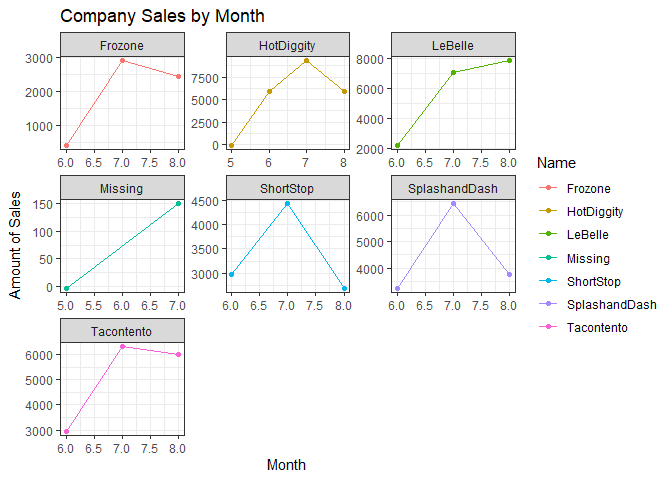
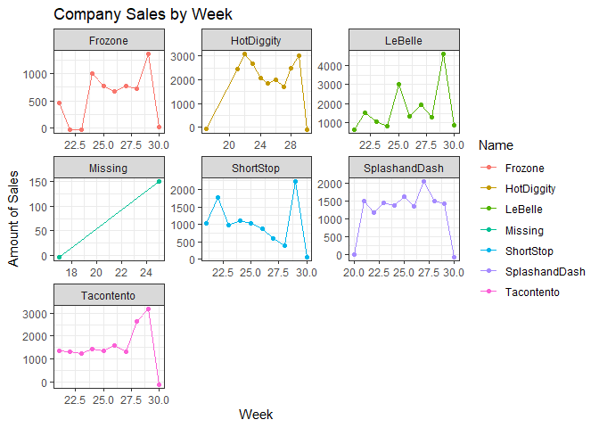
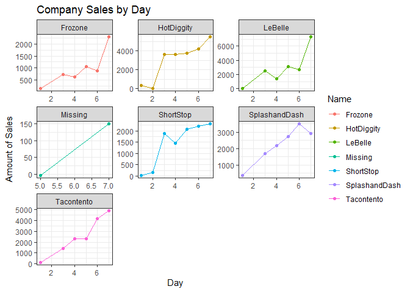
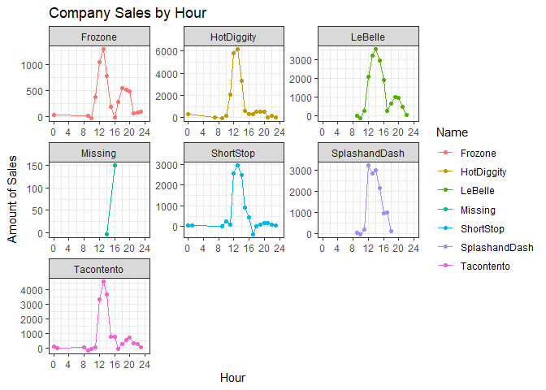

```r
library(tidyverse)
```

```
## -- Attaching packages --------------------------------------- tidyverse 1.3.1 --
```

```
## v ggplot2 3.3.5     v purrr   0.3.4
## v tibble  3.1.6     v dplyr   1.0.7
## v tidyr   1.1.4     v stringr 1.4.0
## v readr   2.1.1     v forcats 0.5.1
```

```
## -- Conflicts ------------------------------------------ tidyverse_conflicts() --
## x dplyr::filter() masks stats::filter()
## x dplyr::lag()    masks stats::lag()
```

```r
library(lubridate)
```

```
## 
## Attaching package: 'lubridate'
```

```
## The following objects are masked from 'package:base':
## 
##     date, intersect, setdiff, union
```

```r
library(downloader)
```

```
## Warning: package 'downloader' was built under R version 4.1.3
```

```r
business_data <- tempfile()
download("https://github.com/WJC-Data-Science/DTS350/raw/master/sales.csv", "business_data", mode = 'wb')
business_data <- read_csv("business_data")
```

```
## Rows: 15656 Columns: 4
```

```
## -- Column specification --------------------------------------------------------
## Delimiter: ","
## chr  (2): Name, Type
## dbl  (1): Amount
## dttm (1): Time
```

```
## 
## i Use `spec()` to retrieve the full column specification for this data.
## i Specify the column types or set `show_col_types = FALSE` to quiet this message.
```
creating the correct time aggregations

```r
revenue_data <- business_data %>%
  with_tz(tzone = "Us/Mountain") %>%
  mutate(hour = ceiling_date(Time, "hour"),
         day = ceiling_date(Time, "day"),
         week = ceiling_date(Time, "week"),
         month = ceiling_date(Time, "month"))

head(revenue_data)
```

```
## # A tibble: 6 x 8
##   Name  Type  Time                Amount hour                day                
##   <chr> <chr> <dttm>               <dbl> <dttm>              <dttm>             
## 1 Taco~ Food~ 2016-05-16 13:01:00    3   2016-05-16 14:00:00 2016-05-17 00:00:00
## 2 Taco~ Food~ 2016-05-16 13:01:00    1.5 2016-05-16 14:00:00 2016-05-17 00:00:00
## 3 Taco~ Food~ 2016-05-16 13:04:00    3   2016-05-16 14:00:00 2016-05-17 00:00:00
## 4 Taco~ Food~ 2016-05-16 13:04:00    3   2016-05-16 14:00:00 2016-05-17 00:00:00
## 5 Taco~ Food~ 2016-05-16 13:04:00    1.5 2016-05-16 14:00:00 2016-05-17 00:00:00
## 6 Taco~ Food~ 2016-05-16 13:04:00    1   2016-05-16 14:00:00 2016-05-17 00:00:00
## # ... with 2 more variables: week <dttm>, month <dttm>
```

Sales by month

```r
revenue_data %>%
  mutate(month = month(month)) %>%
  group_by(Name, month) %>%
  summarize(across(Amount,sum)) %>%
  ggplot(aes(x = month, y = Amount, color = Name)) +
  geom_point() +
  geom_line() +
  facet_wrap(~Name, scales = 'free') +
  labs(x = "Month",
       y = "Amount of Sales",
       title = "Company Sales by Month") +
  theme_bw()
```

```
## `summarise()` has grouped output by 'Name'. You can override using the `.groups` argument.
```

<!-- -->
company sales per week

```r
revenue_data %>%
  mutate(week = week(week)) %>%
  group_by(Name, week) %>%
  summarize(across(Amount,sum)) %>%
  ggplot(aes(x = week, y = Amount, color = Name)) +
  geom_point() +
  geom_line() +
  facet_wrap(~Name, scales = 'free') +
  labs(x = "Week",
       y = "Amount of Sales",
       title = "Company Sales by Week") +
  theme_bw()
```

```
## `summarise()` has grouped output by 'Name'. You can override using the `.groups` argument.
```

<!-- -->
company sales per day

```r
revenue_data %>%
  mutate(day = wday(day)) %>%
  group_by(Name, day) %>%
  summarize(across(Amount,sum)) %>%
  ggplot(aes(x = day, y = Amount, color = Name)) +
  geom_point() +
  geom_line() +
  facet_wrap(~Name, scales = 'free') +
  labs(x = "Day",
       y = "Amount of Sales",
       title = "Company Sales by Day") +
  theme_bw()
```

```
## `summarise()` has grouped output by 'Name'. You can override using the `.groups` argument.
```

<!-- -->

company sales by hour

```r
revenue_data %>%
  mutate(hour = hour(hour)) %>%
  group_by(Name, hour) %>%
  summarize(across(Amount,sum)) %>%
  ggplot(aes(x = hour, y = Amount, color = Name)) +
  geom_point() +
  geom_line() +
  facet_wrap(~Name, scales = 'free') +
  labs(x = "Hour",
       y = "Amount of Sales",
       title = "Company Sales by Hour") +
  scale_x_continuous(limits = c(0,24), breaks = seq(0,24,4)) +
  theme_bw()
```

```
## `summarise()` has grouped output by 'Name'. You can override using the `.groups` argument.
```

<!-- -->


```r
total_sales <- revenue_data %>%
  group_by(Name) %>%
  summarise(across(Amount, sum))
```


```r
total_sales %>%
  mutate(Name = as.factor(fct_reorder(Name, Amount))) %>%
  arrange(desc(Amount)) %>%
  ggplot(aes(x = Name, y = Amount, fill = Name)) +
    geom_col() +
    labs(x = 'Company', y = 'Total Sales', title = 'Total Sales by Company') +
    theme_bw() +
    theme(legend.position = 'none')
```

<!-- -->

