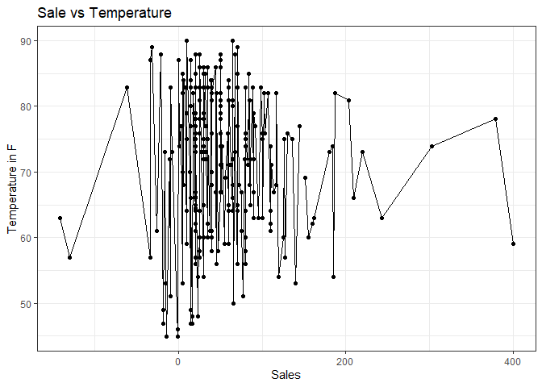

```r
library(tidyverse)
```

```
## -- Attaching packages --------------------------------------- tidyverse 1.3.1 --
```

```
## v ggplot2 3.3.5     v purrr   0.3.4
## v tibble  3.1.6     v dplyr   1.0.7
## v tidyr   1.1.4     v stringr 1.4.0
## v readr   2.1.1     v forcats 0.5.1
```

```
## -- Conflicts ------------------------------------------ tidyverse_conflicts() --
## x dplyr::filter() masks stats::filter()
## x dplyr::lag()    masks stats::lag()
```

```r
library(lubridate)
```

```
## 
## Attaching package: 'lubridate'
```

```
## The following objects are masked from 'package:base':
## 
##     date, intersect, setdiff, union
```

```r
library(downloader)
```

```
## Warning: package 'downloader' was built under R version 4.1.3
```


```r
carwash <- tempfile()
download.file('https://github.com/WJC-Data-Science/DTS350/raw/master/carwash.csv', 'carwash', mode = 'wb')
carwash_data <- read_csv('carwash')
```

```
## Rows: 533 Columns: 4
```

```
## -- Column specification --------------------------------------------------------
## Delimiter: ","
## chr  (2): name, type
## dbl  (1): amount
## dttm (1): time
```

```
## 
## i Use `spec()` to retrieve the full column specification for this data.
## i Specify the column types or set `show_col_types = FALSE` to quiet this message.
```

```r
head(carwash_data)
```

```
## # A tibble: 6 x 4
##   name          type     time                amount
##   <chr>         <chr>    <dttm>               <dbl>
## 1 SplashandDash Services 2016-05-13 20:27:00    1  
## 2 SplashandDash Services 2016-05-13 20:27:00    0  
## 3 SplashandDash Services 2016-05-16 19:31:00   23.6
## 4 SplashandDash Services 2016-05-16 17:09:00   18.9
## 5 SplashandDash Services 2016-05-16 17:47:00   23.6
## 6 SplashandDash Services 2016-05-16 17:50:00   23.6
```

```r
str(carwash_data)
```

```
## spec_tbl_df [533 x 4] (S3: spec_tbl_df/tbl_df/tbl/data.frame)
##  $ name  : chr [1:533] "SplashandDash" "SplashandDash" "SplashandDash" "SplashandDash" ...
##  $ type  : chr [1:533] "Services" "Services" "Services" "Services" ...
##  $ time  : POSIXct[1:533], format: "2016-05-13 20:27:00" "2016-05-13 20:27:00" ...
##  $ amount: num [1:533] 1 0 23.6 18.9 23.6 ...
##  - attr(*, "spec")=
##   .. cols(
##   ..   name = col_character(),
##   ..   type = col_character(),
##   ..   time = col_datetime(format = ""),
##   ..   amount = col_double()
##   .. )
##  - attr(*, "problems")=<externalptr>
```

changing the timezone

```r
tz_carwash <- carwash_data %>%
  with_tz(tzone = "Us/Mountain")
```

creating an hourly grouping

```r
carwash_hour <- tz_carwash %>%
  mutate(hour = ceiling_date(time, "hour"))
head(carwash_hour)
```

```
## # A tibble: 6 x 5
##   name          type     time                amount hour               
##   <chr>         <chr>    <dttm>               <dbl> <dttm>             
## 1 SplashandDash Services 2016-05-13 14:27:00    1   2016-05-13 15:00:00
## 2 SplashandDash Services 2016-05-13 14:27:00    0   2016-05-13 15:00:00
## 3 SplashandDash Services 2016-05-16 13:31:00   23.6 2016-05-16 14:00:00
## 4 SplashandDash Services 2016-05-16 11:09:00   18.9 2016-05-16 12:00:00
## 5 SplashandDash Services 2016-05-16 11:47:00   23.6 2016-05-16 12:00:00
## 6 SplashandDash Services 2016-05-16 11:50:00   23.6 2016-05-16 12:00:00
```

aggregate the point of sale data into hours sales totals

```r
hour_sales <- carwash_hour %>%
  group_by(hour) %>%
  summarize(across(amount, sum))
```

weather

```r
riemstuff <- tempfile()
download.file("https://github.com/WJC-Data-Science/DTS350/raw/master/Task15riem_data.csv", "riem", mode = 'wb')
riem_stuff <- read_csv("riem")
```

```
## Rows: 21190 Columns: 32
```

```
## -- Column specification --------------------------------------------------------
## Delimiter: ","
## chr   (6): station, skyc1, skyc2, skyc3, wxcodes, metar
## dbl  (18): lon, lat, tmpf, dwpf, relh, drct, sknt, p01i, alti, mslp, vsby, g...
## lgl   (6): skyc4, skyl4, ice_accretion_1hr, ice_accretion_3hr, ice_accretion...
## dttm  (2): valid, peak_wind_time
```

```
## 
## i Use `spec()` to retrieve the full column specification for this data.
## i Specify the column types or set `show_col_types = FALSE` to quiet this message.
```

```r
matching_temps <- riem_stuff %>%
  with_tz(tzone = "Us/Mountain") %>%
  filter(tmpf != "") %>%
  mutate(hour = ceiling_date(valid, "hour")) %>%
  select(hour, tmpf)
head(matching_temps)
```

```
## # A tibble: 6 x 2
##   hour                 tmpf
##   <dttm>              <dbl>
## 1 2016-05-11 19:00:00  55.0
## 2 2016-05-11 20:00:00  54.0
## 3 2016-05-11 21:00:00  50  
## 4 2016-05-11 22:00:00  48.0
## 5 2016-05-11 23:00:00  46.9
## 6 2016-05-12 00:00:00  48.0
```

combining databases

```r
left_join(hour_sales, matching_temps) %>%
  arrange(hour) %>%
  ggplot(aes(x = amount, y = tmpf)) +
  geom_point() +
  geom_line() +
  labs(x = 'Sales',
       y = 'Temperature in F',
       title = 'Sale vs Temperature') +
  theme_bw()
```

```
## Joining, by = "hour"
```

```
## Warning: Removed 7 rows containing missing values (geom_point).
```

<!-- -->

